# Widget of the Day 📱

A Flutter practice project focused on mastering essential and advanced widgets through hands-on UI building.

This project is built to strengthen core Flutter UI skills by implementing one widget at a time with simple, real-world UI patterns.

---

## 📖 About the Project

**Widget of the Day** is a learning-focused Flutter project where each widget is explored through practical UI examples.  
Instead of theory-heavy learning, this project focuses on *learning by building*.

The goal is to deeply understand Flutter's layout system, widget behavior, and UI composition by working with small, focused implementations.

🎯 Perfect for:
- Flutter beginners
- Developers revising core UI widgets
- Hands-on UI practice
- Interview preparation (Flutter fundamentals)

---

## 🧩 Widgets Covered

### 1. Container
- Basic layout building block
- Neumorphic UI design practice
- Styling, padding, margin usage

### 2. Expanded
- Flexible layout handling inside `Row` and `Column`
- Understanding space distribution in UI

### 3. Column & Row
- `mainAxisAlignment`
- `crossAxisAlignment`
- Core alignment concepts for Flutter layouts

### 4. ListView.builder
- Dynamic list rendering
- Efficient scrolling lists
- Instagram-style UI layout practice

### 5. ClipRRect
- Rounded corner implementation
- Smooth UI card styling
- Wrapping widgets for modern design feel

### 6. Image.asset
- Loading local assets
- `BoxFit.cover` for clean image scaling
- Card-based image UI design

### 7. GridView.builder
- Grid-based UI layout
- `crossAxisCount` for controlling columns
- Responsive multi-column layouts
- Useful for gallery, products, and dashboard UIs

### 8. GestureDetector
- Handling user interactions like taps, clicks, and gestures
- `onTap: () => { action }` usage
- Making UI elements interactive
- Keeping functional logic separated from UI for better code structure and maintainability

### 9. Bottom Navigation Bar
- Implemented using `StatefulWidget` for managing active tab state
- Used `BottomNavigationBarType.fixed` for consistent tab layout
- Managed multiple pages with indexed navigation
- Demonstrated clean multi-page app structure

### 10. AppBar
- Implemented `leading` widget for left-aligned actions (e.g. menu/back button)
- Used `actions` for right-aligned interactive icons/buttons
- Practiced proper AppBar structure for real-world app UI design

### 11. Drawer (Navigation Panel)
- Implemented `Drawer` for side navigation menu
- Wrapped Drawer content inside `ListView` for smooth scrolling support
- Used `DrawerHeader` for profile/branding section at the top
- Built menu items using `ListTile` for clean and structured navigation options

### 12. SliverAppBar (Advanced Scroll UI)
- Implemented `SliverAppBar` inside `CustomScrollView` for advanced scrolling behavior
- Used `expandedHeight` to create dynamic collapsing header effect
- Practiced `flexibleSpace` for building expandable and animated AppBar content

### 13. TabBar (Tabbed Navigation)
- Implemented tab-based navigation using `TabBar` and `TabBarView`
- Wrapped `Scaffold` with `DefaultTabController` to manage tab state
- Configured `length` to define the number of tabs

### 14. AnimatedContainer (Smooth UI Animations)
- Implemented `AnimatedContainer` for smooth property-based animations
- Used `GestureDetector` to trigger animations on user interaction (`onTap`)
- Controlled animation timing using `duration` (in seconds) for smooth transitions
- Animated UI changes such as size, color, alignment, and decoration

### 15. MediaQuery (Responsive UI Design)
- Used `MediaQuery` to build responsive Flutter layouts
- Accessed screen `height` and `width` for dynamic UI scaling
- Applied `aspect ratio` understanding for maintaining consistent UI proportions across devices
- Handled device `orientation` (portrait / landscape) for adaptive layouts

### 16. AlertDialog (User Interaction & Feedback)
- Implemented `AlertDialog` for showing important user messages and confirmations
- Structured dialog using `title`, `content`, and `actions`

### 17. Text & Styling
- Implemented `Text` widget with advanced styling options
- Used `TextStyle` to customize typography with `fontStyle`, `fontWeight`, etc.

### 18. RichText (Advanced Text Styling)
- Implemented `RichText` widget for displaying multiple text styles in a single line
- Used `TextSpan` to break text into styled segments

### 19. Timer (Countdown Logic)
- Implemented `Timer` functionality using `StatefulWidget`
- Managed recurring time updates using `Timer.periodic`

### 20. PageView (Vertical Scrolling UI)
- Implemented `PageView` for swipe-based screen navigation
- Set `scrollDirection: Axis.vertical` for vertical scrolling interaction

### 21. Stack (Layered UI Layout)
- Implemented `Stack` to place multiple widgets on top of each other
- Built layered UI components by controlling widget positioning and visual hierarchy

### 22. TextField (User Input Handling)
- Implemented `TextField` inside a `StatefulWidget` for dynamic user input
- Styled input field using `decoration` and added `suffixIcon`

### 23. AnimatedIcon (Animated UI Transitions)
- Implemented `AnimatedIcon` inside a `StatefulWidget` for interactive icon animations
- Used `SingleTickerProviderStateMixin` to provide vsync for smooth animations

### 24. Slider (Interactive Value Selection)
- Implemented `Slider` inside a `StatefulWidget` to manage dynamic values
- Updated UI instantly as the slider value changed

### 25. DatePicker (Date Selection)
- Implemented date selection using Flutter's `showDatePicker`
- Displayed selected date dynamically in the UI

### 26. TimePicker (Time Selection)
- Implemented time selection using Flutter's `showTimePicker`
- Used `TimeOfDay` to store and manage the selected time state

### 27. ListWheelScrollView (3D Wheel Scrolling)
- Implemented `ListWheelScrollView` with 3D wheel-like scrolling effect
- Applied `FixedExtentScrollPhysics` for snap-to-item scrolling behavior

### 28. LinearGradient (Gradient Background Design)
- Implemented `LinearGradient` inside a `Container` using `BoxDecoration`
- Applied `LinearGradient` to create smooth multi-color transitions

### 29. ElevatedButton & OutlinedButton (Button Styling)
- Implemented `ElevatedButton` and `OutlinedButton` for primary and secondary actions
- Customized using `styleFrom()` to control elevation, color, padding, and shape

### 30. FloatingActionButton (Primary Action Button)
- Implemented `FloatingActionButton` to represent the primary action in a screen
- Practiced using FAB as a quick-access action button

### 31. Navigator (Screen Navigation & Routing)
- Implemented named route navigation using Flutter's `Navigator` widget
- Used `Navigator.pushNamed()` and `Navigator.pop()` for multi-screen flow

### 32. Card (Material Design Card Layout)
- Implemented Flutter's `Card` widget with `RoundedRectangleBorder`
- Configured `elevation` for depth and shadow effects

### 33. Custom Clipper (Wave Shape & Custom UI Design)
- Implemented `ClipPath` with `CustomClipper<Path>` for custom-shaped UI
- Used `quadraticBezierTo` for smooth wave effects

### 34. RawMaterialButton (Low-Level Custom Button Design)
- Explored `RawMaterialButton` for highly customizable button design
- Applied color and highlight effects for interaction feedback

### 35. RotatedBox (90° Rotation)
- Explored `RotatedBox` to rotate widgets in fixed 90-degree increments
- Displayed images using `Image.network`

### 36. Transform (Widget Transformation)
- Implemented `Transform` widget for rotation, scaling, and translation
- Enhanced UI with dynamic visual effects

### 37. Positioned (Precise Widget Placement in Stack)
- Implemented `Positioned` inside a `Stack` for precise widget placement
- Used `top`, `bottom`, `left`, and `right` properties

### 38. IconButton (Interactive Icon-Based Actions)
- Implemented `IconButton` for tappable icon-based actions
- Customized using `color`, `size`, and `icon` properties

### 39. CustomPaint (Custom Drawing & Canvas Rendering)
- Explored `CustomPaint` with `CustomPainter` for custom UI graphics
- Used `Canvas` and `Paint` to control stroke, color, and drawing styles

### 40. ClipOval (Circular Image Clipping)
- Implemented `ClipOval` to display widgets in circular shape
- Applied `BoxFit.cover` for distortion-free image filling

### 41. ClipRRect (Rounded Corner Image Clipping)
- Used `borderRadius` to control and customize roundness of each corner
- Combined `BoxFit.cover` for proper image filling

### 42. ClipRect (Rectangular Clipping)
- Implemented `ClipRect` to clip child widgets within a rectangular boundary
- Compared with `ClipRRect` and `ClipOval`

### 43. ClipPath (Custom Shape Clipping)
- Implemented `ClipPath` with custom `CustomClipPath()` class
- Overrode `getClip(Size size)` to generate custom clipping paths

### 44. Radial & Sweep Gradient (Advanced Gradient Effects)
- Implemented `RadialGradient` and `SweepGradient` inside a `Container`
- Compared radial vs sweep gradients for visual differences

### 45. StatefulWidget (State Lifecycle Management)
- Implemented `StatefulWidget` with full lifecycle: `initState`, `didChangeDependencies`, `didUpdateWidget`, `deactivate`, `dispose`
- Utilized `setState(() {})` to update UI dynamically

### 46. Table (Structured Data Layout)
- Implemented `Table` widget with `TableRow` for structured data
- Applied `border` for cell separation and styling

### 47. DataTable (Interactive Tabular Data UI)
- Implemented `DataTable` with `columns` and `rows` for interactive data
- Built suitable for admin panels and dashboards

### 48. Placeholder (UI Skeleton & Layout Debugging)
- Implemented `Placeholder` for visualizing empty UI spaces during development
- Customized `fallbackHeight`, `color`, and `strokeWidth`

### 49. GestureDetector & InkWell (User Interaction Handling)
- Implemented `GestureDetector` for raw touch interactions
- Used `InkWell` to add Material Design ripple effects

### 50. Material (Surface, Elevation & Visual Styling)
- Implemented `Material` widget to define a material design surface
- Used to control `elevation`, shadow, and background color

### 51. Switches (Switch, Checkbox & Radio)
- Implemented `Switch`, `Checkbox`, and `Radio` widgets
- Used `ListTile` with toggle-based controls for settings-style UI

### 52. Dropdown & PopupMenu (Selection Menus)
- Implemented `DropdownButton` and `PopupMenuButton` for selectable menus
- Managed selected values dynamically using state updates

### 53. Hero Animation (Shared Element Page Transition)
- Implemented `Hero` widget for smooth shared-element transitions between screens
- Combined with `Image.network` for zoom and transition effects

### 54. AboutDialog (Application Information Dialog)
- Implemented `AboutDialog` with `showAboutDialog()`
- Displayed app name, version, and legal information

### 55. Stepper (Multi-Step Workflow UI)
- Implemented `Stepper` with `onStepContinue`, `onStepCancel`, and `onStepTapped`
- Managed step state using `int _currentStep = 0`

### 56. FittedBox (Responsive Scaling)
- Implemented `FittedBox` to scale and fit child widgets within available space
- Explored different fit modes for various layouts

### 57. showSearch (In-App Search Interface)
- Implemented `showSearch()` with a custom `SearchDelegate`
- Integrated with `AppBar` using an `IconButton`

### 58. Adaptive Widgets (Platform-Aware UI Components)
- Used `Slider.adaptive`, `SwitchListTile.adaptive`, and `Switch.adaptive`
- Render native-style components for both Android and iOS

### 59. Scrollbar (Scroll Feedback)
- Implemented `Scrollbar` for visual feedback on scrollable content
- Customized `thickness` for visual width control

### 60. ChoiceChip (Selectable Filter Chips UI)
- Implemented `ChoiceChip` with `label`, `avatar`, `selected`, and `onSelected`
- Managed selection state for dynamic UI updates

### 61. Wrap (Responsive Flow Layout)
- Implemented `Wrap` to create responsive layouts that automatically flow to next line
- Controlled `spacing` and `alignment` between items

### 62. ExpansionTile (Expandable List UI)
- Implemented `ExpansionTile` with `title` and `children`
- Used `ListTile` inside children for structured sub-items

### 63. RangeSlider (Dual Value Selection)
- Implemented `RangeSlider` with `divisions`, `labels`, and `onChanged`
- Built for filtering and range-based input scenarios

### 64. showModalBottomSheet (Bottom Sheet UI)
- Implemented `showModalBottomSheet` with `builder` callback
- Used `SizedBox` to control height and structure of content

### 65. AnimatedCrossFade (Smooth Widget Transition)
- Implemented `AnimatedCrossFade` with `firstChild`, `secondChild`, and `duration`
- Used Flutter's built-in implicit animation capabilities

### 66. Flexible (Responsive Space Distribution)
- Implemented `Flexible` with `flex` property for space distribution
- Built adaptive layouts preventing overflow

### 67. Spacer (Dynamic Empty Space Management)
- Implemented `Spacer` for flexible empty space between widgets
- Replaces fixed-size `SizedBox` with adaptive spacing

### 68. GridPaper (Grid Overlay & Layout Visualization)
- Implemented `GridPaper` for customizable grid overlay
- Used for layout guidance and grid-based design

### 69. InteractiveViewer (Zoom & Pan Interaction)
- Implemented `InteractiveViewer` with `maxScale` for zoom control
- Used `Image.network()` as child for image inspection

### 70. CheckboxListTile (Selectable List Item)
- Implemented `CheckboxListTile` with `title`, `subtitle`, and `value`
- Built settings-style interfaces for multi-select lists

### 71. SelectableText (Text Selection & Copy Support)
- Implemented `SelectableText` to allow users to select and copy text
- Enhanced accessibility with built-in text selection

### 72. AnimatedPadding (Smooth Layout Spacing Animation)
- Implemented `AnimatedPadding` with dynamic `EdgeInsets.all(padValue)`
- Configured `duration` for smooth padding transitions

### 73. RefreshIndicator (Pull-to-Refresh)
- Implemented `RefreshIndicator` with async `onRefresh` callback
- Customized `color` and `backgroundColor` for theme consistency

### 74. ImageFiltered (Blur Effects)
- Implemented `ImageFiltered` with `ImageFilter.blur`
- Configured `sigmaX` and `sigmaY` for blur intensity control

### 75. AspectRatio (Proportional Layout Control)
- Implemented `AspectRatio` with `aspectRatio: 3 / 2`
- Prevented distortion by preserving original proportions

### 76. ToggleButtons (Multi & Single Selection)
- Implemented `ToggleButtons` for single and multi selection modes
- Managed selection state using boolean lists

### 77. PhysicalModel (Elevation & Material Depth Effects)
- Implemented `PhysicalModel` with `elevation`, `shadowColor`, and `borderRadius`
- Simulates physical surfaces and elevation changes

### 78. Align (Precise Widget Positioning)
- Implemented `Align` to position child widgets within parent container
- Practiced positioning at center, top-left, bottom-right, etc.

### 79. SafeArea (System UI Protection)
- Implemented `SafeArea` to keep content within visible display region
- Prevented overlap with status bar and navigation areas

### 80. PageRouteBuilder (Custom Route Transitions)
- Implemented `PageRouteBuilder` with `ScaleTransition` and `CurvedAnimation`
- Built custom zoom-in/out page animations

### 81. Draggable (Drag & Drop Interaction)
- Implemented `Draggable` with `DragTarget` for drag-and-drop functionality
- Customized `feedback` widget for drag appearance

### 82. BackdropFilter (Glassmorphism & Blur Effects)
- Implemented `BackdropFilter` with `ImageFilter.blur` for background blurring
- Built glassmorphism UI with semi-transparent overlays

### 83. ReorderableListView (Drag-to-Reorder List)
- Implemented `ReorderableListView` with `itemBuilder` and `onReorder`
- Handled item rearrangement with underlying list state update

### 84. FadeTransition (Opacity-Based Animation)
- Implemented `FadeTransition` with `Animation<double>` for opacity control
- Integrated with animation controllers for lifecycle management

### 85. CircleAvatar (Profile Image & Circular UI)
- Implemented `CircleAvatar` with `radius` and `backgroundColor`
- Combined with `Stack` and `Positioned` for advanced profile layouts

### 86. Tooltip (Contextual Help & User Guidance)
- Implemented `Tooltip` with `waitDuration` and `verticalOffset` customization
- Added hints to icon-based UI elements

### 87. Visibility (Show & Hide UI Elements)
- Implemented `Visibility` with boolean state to toggle widget rendering
- Built toggle button for showing/hiding images with `ClipRRect`

### 88. IndexedStack (Maintain Multiple UI States)
- Implemented `IndexedStack` to manage multiple screens in a single layout
- Preserved state of all stacked widgets while showing one at a time

### 89. Navigator 2.0 (Declarative Navigation)
- Implemented Navigator 2.0 API using declarative page-based navigation
- Built custom navigation flow without push/pop methods

### 90. Null Aware Operators (Dart Null Safety)
- Learned `?.`, `??`, `??=`, and `...?` operators
- Built UI demo to visually understand each null-aware operator

### 91. Cascade Operator (..) in Dart
- Implemented Dart's Cascade Operator for chaining multiple operations
- Compared cascade vs traditional object initialization

### 92. Inherited Widget (State Sharing Between Screens)
- Used `InheritedWidget` to share state across multiple screens
- Accessed shared state using `StateInheritedWidget.of(context)`

### 93. FractionallySizedBox (Responsive UI Using Percentages)
- Used `widthFactor` and `heightFactor` to size widgets as percentages
- Demonstrated automatic scaling according to parent container size

### 94. ConstrainedBox (Controlling Widget Size)
- Used `BoxConstraints` to define min/max width and height limits
- Showed how Flutter adjusts widget size based on constraints

### 95. CupertinoSearchTextField (iOS Style Search Bar)
- Implemented `CupertinoSearchTextField` with `TextEditingController`
- Displayed real-time search input using `onChanged` callback

### 96. StatefulBuilder (Local State Management)
- Used `StatefulBuilder` to update only part of the UI without full rebuild
- Demonstrated difference between full and partial widget rebuild

### 97. LayoutBuilder (Responsive UI)
- Used `BoxConstraints` inside `LayoutBuilder` to detect available screen width
- Switched between mobile and desktop/tablet layouts at 600px breakpoint

### 98. OrientationBuilder (Responsive UI Based on Device Rotation)
- Built separate layouts for portrait (`ListView`) and landscape (`Row`) modes
- Demonstrated automatic UI adaptation on orientation change

### 99. Platform Detection (dart:io)
- Used `Platform.isAndroid`, `Platform.isIOS`, `Platform.isWindows`, etc.
- Displayed current platform dynamically in the Flutter UI

### 100. FutureBuilder (Handling Asynchronous Data)
- Implemented `FutureBuilder` for loading, success, and error UI states
- Used `CircularProgressIndicator` and `snapshot.hasError` handling

### 101. StreamBuilder (Handling Real-Time Data)
- Implemented `StreamBuilder` to listen to stream events and rebuild UI
- Used `initialData` for default value before first stream event

### 102. ChangeNotifier (Basic State Management)
- Created custom controller extending `ChangeNotifier` with `notifyListeners()`
- Implemented proper lifecycle management with `dispose()`

### 103. ValueNotifier & ValueListenableBuilder (Lightweight State)
- Used `ValueNotifier` with `ValueListenableBuilder` for reactive UI
- Updated only listening widgets without calling `setState`

### 104. InheritedNotifier (Reactive State + Animation)
- Used `InheritedNotifier` to share `AnimationController` across widget tree
- Built `SpinModel` for reusable animation state sharing

### 105. Listener Widget (Low-Level Pointer Event Handling)
- Used `Listener` for `PointerDownEvent`, `PointerMoveEvent`, `PointerUpEvent`
- Built real-time touch coordinate tracker with `Offset`

### 106. Builder Widget (Context Management)
- Used `Builder` to obtain new `BuildContext` deeper in the widget tree
- Solved common `ScaffoldMessenger.of(context)` context issues

### 107. PageView.builder (Swipeable Page Navigation)
- Built lazily-constructed pages with `PageController` and `onPageChanged`
- Implemented vertical scrolling with animated dot indicator

### 108. AnimatedBuilder (Efficient Animation Composition)
- Used `AnimatedBuilder` to rebuild only animated parts on each tick
- Leveraged `child` parameter optimization to avoid unnecessary rebuilds

### 109. SnackBar (Brief In-App Notifications)
- Used `ScaffoldMessenger.of(context).showSnackBar()` with `SnackBarBehavior.floating`
- Built reusable `_showSnackBar` helper with message, icon, color, and action

### 110. SizedBox (Every Use Case)
- Used `SizedBox` to create fixed width, height, and spacing between widgets.
- Demonstrated `SizedBox.expand()`, `SizedBox.shrink()`, and `SizedBox.fromSize()` with practical UI examples.
- Showed how different `SizedBox` constructors help build cleaner and more responsive Flutter layouts.

### 111. IntrinsicHeight & IntrinsicWidth
- Compared layouts with and without `IntrinsicHeight` to make `Row` children the same height.
- Demonstrated `IntrinsicWidth` to automatically match widget widths based on the largest child.
- Showed how these widgets solve common Flutter layout alignment issues.

### 112. OverflowBox (Overflow Beyond Parent Constraints)
- Compared layouts with and without `OverflowBox` using an interactive toggle.
- Demonstrated how `OverflowBox` allows a child to exceed its parent's size constraints while keeping the parent size unchanged.
- Visualized the relationship between parent and child constraints using a simple, beginner-friendly example.

### 113. UnconstrainedBox (Remove Parent Constraints)
- Compared layouts with and without `UnconstrainedBox` using an interactive toggle.
- Demonstrated how `UnconstrainedBox` lets a child use its natural size instead of following its parent's constraints.
- Explained Flutter's parent-to-child constraint system with a practical button layout example.

### 114. LimitedBox (Limit Size in Unconstrained Layouts)
- Compared layouts with and without `LimitedBox` using an interactive toggle.
- Demonstrated how `LimitedBox` applies maximum width and height only when its parent provides unconstrained space.
- Showed a practical use case by combining `LimitedBox` with `UnconstrainedBox` to better understand Flutter's layout constraints.

### 115. Baseline (Text Alignment)
- Compared layouts with and without `Baseline` alignment using an interactive toggle.
- Demonstrated how `CrossAxisAlignment.baseline` aligns widgets by their text baseline instead of centering them as a block.
- Showed a practical pricing-label example (mixed font sizes) to highlight why baseline alignment matters for polished UI.

### 116. Opacity (Widget Transparency)
- Added a switch to compare `Opacity` vs `AnimatedOpacity` side by side.
- Demonstrated that `Opacity` changes transparency instantly, while `AnimatedOpacity` animates the change smoothly over a duration.
- Explained why `AnimatedOpacity` is often the better choice for transparency transitions, without needing a manual AnimationController.

### 117. ColorFiltered (Color Matrix & Blend Filters)
- Compared unfiltered and filtered widgets using an interactive toggle.
- Used `ColorFilter.matrix()` to apply a grayscale effect across three real-world scenarios — a disabled form button, a loading image placeholder, and locked premium content — switchable via a scenario picker.
- Paired each scenario with a short "why" explanation showing the actual problem `ColorFiltered` solves (e.g., visual disabled states, loading indicators, freemium locks) without needing duplicate gray assets.
- Highlighted how `ColorFiltered` lets you recolor any widget on the fly, at runtime, without modifying the original asset.

### 118. ShaderMask (Gradient Masks & Shader Effects)
- Compared unmasked and masked widgets using an interactive toggle.
- Used `ShaderMask` with `LinearGradient` across two real-world scenarios — an animated shimmer sweep over premium/loading text, and a soft fade at the top/bottom edges of a scrollable list.
- Demonstrated two blend modes: `BlendMode.srcIn` to recolor text with a moving gradient, and `BlendMode.dstIn` to fade a widget's edges using gradient transparency.
- Paired each scenario with a short "why" explanation showing the real problem `ShaderMask` solves (loading/premium indicators, polished scroll edges) — all without external shimmer packages or extra image assets.

### 119. DecoratedBox (vs Container)
- Compared `DecoratedBox` and `Container` producing the exact same visual result, switchable via a toggle button.
- Rendered a live "under the hood" diagram showing that `Container` isn't one widget — it composes `Padding`, `Align`, `ConstrainedBox`, and `DecoratedBox` together, while `DecoratedBox` alone only paints the decoration.
- Explained why this matters: when you only need color/border/gradient/shadow (no padding, margin, or alignment), `DecoratedBox` skips the extra layers `Container` builds for you — useful for performance when rendering many items in a list.

### 120. FractionalTranslation (Fraction-Based Position Shift)
- Compared instant vs animated translation using a mode switch between `FractionalTranslation` and `AnimatedSlide`.
- Demonstrated how translating by a fraction (e.g. Offset(0.6, 0.0)) shifts a widget relative to its own size — making slide effects resolution-independent.
- Highlighted a key gotcha: `FractionalTranslation` moves the paint position only, not the layout space, so the child can overlap siblings.

### 121. CustomMultiChildLayout (Precise Named-Child Positioning)
- Compared a plain `Row` against `CustomMultiChildLayout` using an interactive toggle.
- Demonstrated how to name children with an ID (`LayoutId`) and place each one at an exact position using a `MultiChildLayoutDelegate`.
- Showed 3 boxes pinned to specific spots (top-left, top-right, bottom-center) — positions a `Row` or `Column` alone cannot achieve.

### 122. TextInputFormatter (Live Input Masking)
- Built a custom `PhoneNumberFormatter` that reformats raw digits into `(555) 123-4567` as the user types.
- Chained three formatters together — `digitsOnly` filter, a 10-digit length limit, and the custom formatter — showing how `inputFormatters` apply in order.
- Demonstrated `formatEditUpdate(oldValue, newValue)` and manual cursor placement — the diffing logic a plain `TextField` alone cannot do.

### 123. AutofillGroup (Password Manager & Keyboard Autofill)
- Built a realistic login form using `AutofillGroup` to link the email and password fields as one autofill unit.
- Used `autofillHints` (`AutofillHints.email`, `AutofillHints.password`) to enable OS-level keyboard suggestions and password manager prompts.
- Called `TextInput.finishAutofillContext()` on submit — the often-missed step that tells the OS to offer saving the entered credentials.
- Wrapped the form in `SingleChildScrollView` to prevent bottom overflow when the keyboard opens.

### 124. EditableText (The Raw Text-Input Primitive)
- Built a raw `EditableText` (manual FocusNode, cursor color, selection color) side by side with a regular `TextField`.
- Demonstrated that `TextField` is just `EditableText` wrapped with Material decoration (border, label, fill) and automatic focus handling.
- Reinforced a core "know your framework" interview point: understanding the primitive behind a high-level widget shows real depth in Flutter's text-input stack.

### 125. DefaultTextStyle (Inherited Text Styling)
- Compared plain `Text` widgets against ones wrapped in `DefaultTextStyle` using an interactive toggle.
- Demonstrated how child `Text` widgets automatically inherit a style set higher in the tree — and how any child can still override it individually.
- Connected the concept to Flutter's real internals, where widgets like `Card` and `AppBar` rely on the same inherited-style system.

### 126. SliverList & SliverGrid (Mixed Scroll Effects)
- Built a single `CustomScrollView` combining a `SliverAppBar`, a `SliverGrid` (categories), and a `SliverList` (items).
- Used `SliverToBoxAdapter` to drop in regular widgets (headers, info cards) between slivers.
- Demonstrated why this approach beats nesting a `GridView` inside a `ListView` — one shared scroll instead of two competing scrollables.

### 127. SliverPersistentHeader (Sticky, Shrinking Headers)
- Built a custom `SliverPersistentHeaderDelegate` for a profile header that shrinks and sticks to the top while scrolling.
- Used `shrinkOffset` to interpolate avatar size and name font size between expanded and collapsed states.
- Demonstrated `pinned: true`, the setting that keeps the header stuck at the top instead of scrolling away — the same pattern used on Instagram/Twitter profile pages.

### 128. SliverFillRemaining (Fill Leftover Viewport Space)
- Built a short 3-item `SliverList` that doesn't fill the screen, showing the common empty-space gap problem.
- Used `SliverFillRemaining(hasScrollBody: false)` to fill the leftover space with a styled empty-state card.
- Compared both states with a toggle — no `SliverFillRemaining` leaves a gap; with it, the layout looks intentional and complete.

### 129. NestedScrollView (Coordinated Outer & Inner Scrolling)
- Built a tabbed profile page: a scrollable header (profile info) + a pinned `TabBar`, with independent scrollable lists inside each tab.
- Used `NestedScrollView.headerSliverBuilder` for the outer scroll and `TabBarView` for the inner scroll — Flutter coordinates the handoff between them automatically.
- Used `SliverPersistentHeaderDelegate` to pin the `TabBar`, this time with equal min/max extent since a TabBar doesn't shrink.

### 130. ScrollController (Advanced)
- Displayed live scroll position as a percentage progress bar using `ScrollController.addListener()`.
- Added "Top" and "Bottom" buttons that jump to a position smoothly with `animateTo()`.
- Implemented reach-end detection (`pixels >= maxScrollExtent - threshold`) to simulate infinite-scroll pagination — loading more items automatically as the user nears the bottom, with no external packages.

### 131. NotificationListener (Scroll Events)
- Built a FAB that hides on scroll-down and reappears on scroll-up, driven entirely by `NotificationListener<ScrollNotification>` — no `ScrollController` attached.
- Used `UserScrollNotification.direction` to detect scroll direction, and displayed live notification types in a status panel.
- Explained why `onNotification` returns `false` — letting the event keep bubbling to any parent listener, instead of swallowing it.

### 132. Semantics (Screen Reader Support)
- Compared a custom `GestureDetector`-based favorite button with and without a `Semantics` wrapper.
- Added `label`, `hint`, `button: true`, and `toggled` state so screen readers can announce the widget correctly.
- Used `ExcludeSemantics` to prevent the underlying icon from producing redundant announcements — a subtlety that matters for real accessibility compliance.

### 133. ExcludeSemantics & MergeSemantics (Accessibility Tree Grouping)
- Demonstrated `ExcludeSemantics` hiding a purely decorative icon from screen readers, avoiding a wasted announcement.
- Demonstrated `MergeSemantics` combining an icon + label + trailing arrow into a single screen reader announcement instead of three separate stops.
- Compared both states with a toggle, showing exactly what a screen reader would announce differently.

### 134. FocusNode (Programmatic Keyboard Focus)
- Built a 3-field form where pressing "Next" on the keyboard jumps to the following field, and "Done" dismisses the keyboard.
- Added tap-outside-to-dismiss using `FocusScope.of(context).unfocus()`.
- Displayed a live "Focused field" indicator using `FocusNode` listeners, and added buttons to programmatically focus any field on demand.

### 135. Dismissible (Swipe-to-Delete / Archive)
- Built a Gmail-style inbox: swipe right to archive, swipe left to delete, each revealing a differently colored background.
- Used `confirmDismiss` to show a confirmation dialog before deleting (but not archiving), and `onDismissed` + a Snackbar "Undo" action to reverse the change.
- Highlighted why `Dismissible` requires a unique `key` per item — without it, Flutter can't correctly track which item was swiped as the list changes.

### 136. PopScope (Intercepting the Back Button/Gesture)
- Built a two-screen demo: an edit form guarded against accidental back navigation when it has unsaved changes.
- Used `canPop` to conditionally block automatic back navigation, and `onPopInvokedWithResult` to show a "Discard changes?" confirmation dialog when blocked.
- Noted `PopScope` is a mobile-only concern (Android back button/gesture, iOS swipe-back).

---

## 🗓️ Flutter Widget of the Day — 119 Widgets

A hands-on challenge covering essential Flutter widgets, from layout fundamentals to advanced animations.

<table>
  <thead>
    <tr>
      <th style="width:150px"><b>Day 01</b></th>
      <th style="width:150px"><b>Day 02</b></th>
      <th style="width:150px"><b>Day 03</b></th>
      <th style="width:150px"><b>Day 03</b></th>
      <th style="width:150px"><b>Day 04</b></th>
    </tr>
  </thead>
  <tbody>
    <tr>
      <td align="center" style="width:150px">
         
        <a href="lib/features/widgets_of_the_day/day_01_container/day01_container_widget.dart">
          <b>Container</b>
        </a> 
        Basic box
      </td>
      <td align="center" style="width:150px">
         
        <a href="lib/features/widgets_of_the_day/day_02_expanded/day02_expanded_widget.dart">
          <b>Expanded</b>
        </a> 
        Fill space
      </td>
      <td align="center" style="width:150px">
         
        <a href="lib/features/widgets_of_the_day/day_03_column%26row/day03_column_widget.dart">
          <b>Column</b>
        </a> 
        Vertical
      </td>
      <td align="center" style="width:150px">
         
        <a href="lib/features/widgets_of_the_day/day_03_column%26row/day03_row_widget.dart">
          <b>Row</b>
        </a> 
        Horizontal
      </td>
      <td align="center" style="width:150px">
         
        <a href="lib/features/widgets_of_the_day/day_04_listview/day04_listview_widget.dart">
          <b>ListView</b>
        </a> 
        Scroll list
      </td>
    </tr>
  </tbody>
</table>

<table>
  <thead>
    <tr>
      <th style="width:150px"><b>Day 05</b></th>
      <th style="width:150px"><b>Day 06</b></th>
      <th style="width:150px"><b>Day 07</b></th>
      <th style="width:150px"><b>Day 08</b></th>
      <th style="width:150px"><b>Day 09</b></th>
    </tr>
  </thead>
  <tbody>
    <tr>
      <td align="center" style="width:150px">
         
        <a href="lib/features/widgets_of_the_day/day_05_cliprrect/day05_cliprrect_widget.dart">
          <b>ClipRRect</b>
        </a> 
        Round clip
      </td>
      <td align="center" style="width:150px">
         
        <a href="lib/features/widgets_of_the_day/day_06_image.asset/day06_image.asset_widget.dart">
          <b>Image.asset</b>
        </a> 
        Assets
      </td>
      <td align="center" style="width:150px">
         
        <a href="lib/features/widgets_of_the_day/day_07_gridview/day07_gridview_widget.dart">
          <b>GridView</b>
        </a> 
        Grid scroll
      </td>
      <td align="center" style="width:150px">
        <a href="screenshots/day08_gesturedetector.gif">
          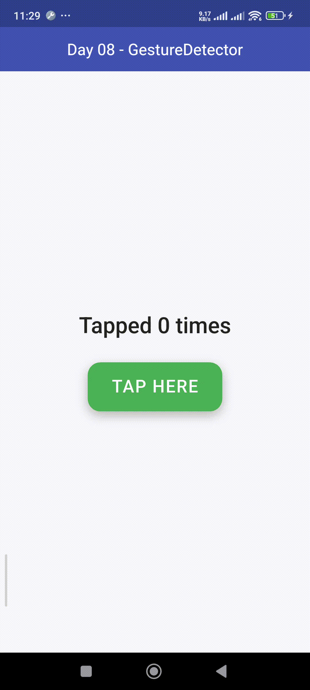
        </a> 
        <a href="lib/features/widgets_of_the_day/day_08_gesturedetector/day08_gesturedetector_widget.dart">
          <b>Gesture</b>
        </a> 
        Tap detection
      </td>
      <td align="center" style="width:150px">
        <a href="screenshots/day09_bottom_navbar.gif">
          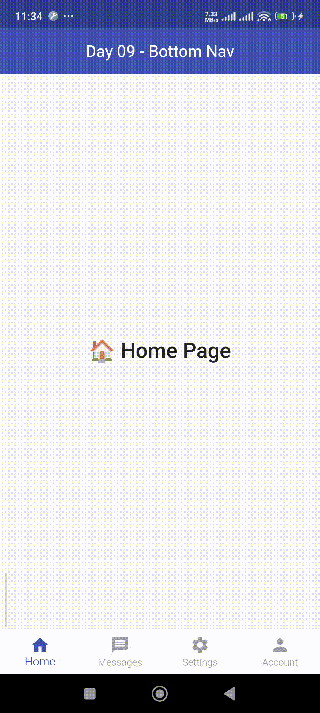
        </a> 
        <a href="lib/features/widgets_of_the_day/day_09_bottom_navbar/day09_bottom_navbar_widget.dart">
          <b>BottomNav</b>
        </a> 
        Nav bar
      </td>
    </tr>
  </tbody>
</table>

<table>
  <thead>
    <tr>
      <th style="width:150px"><b>Day 10</b></th>
      <th style="width:150px"><b>Day 11</b></th>
      <th style="width:150px"><b>Day 12</b></th>
      <th style="width:150px"><b>Day 13</b></th>
      <th style="width:150px"><b>Day 14</b></th>
    </tr>
  </thead>
  <tbody>
    <tr>
      <td align="center" style="width:150px">
         
        <a href="lib/features/widgets_of_the_day/day_10_appbar/day10_appbar_widget.dart">
          <b>AppBar</b>
        </a> 
        Top bar
      </td>
      <td align="center" style="width:150px">
        <a href="screenshots/day11_drawer.gif">
          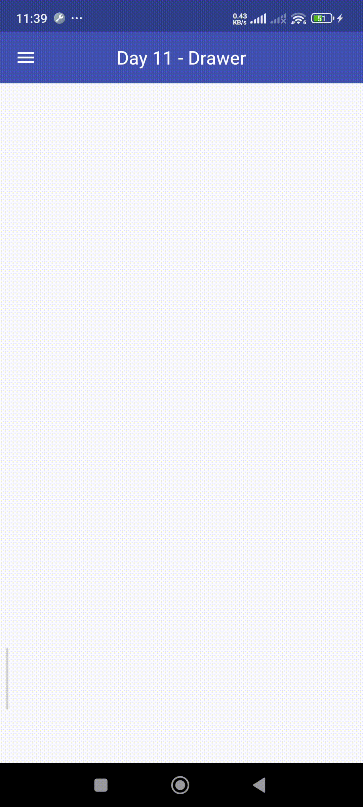
        </a> 
        <a href="lib/features/widgets_of_the_day/day_11_drawer/day11_drawer_widget.dart">
          <b>Drawer</b>
        </a> 
        Side menu
      </td>
      <td align="center" style="width:150px">
         
        <a href="lib/features/widgets_of_the_day/day_12_sliver_appbar/day12_sliver_appbar_widget.dart">
          <b>SliverAppBar</b>
        </a> 
        Collapsible
      </td>
      <td align="center" style="width:150px">
         
        <a href="lib/features/widgets_of_the_day/day_13_tabbar/day13_tabbar_widget.dart">
          <b>TabBar</b>
        </a> 
        Tabs
      </td>
      <td align="center" style="width:150px">
        <a href="screenshots/day14_animated_container.gif">
          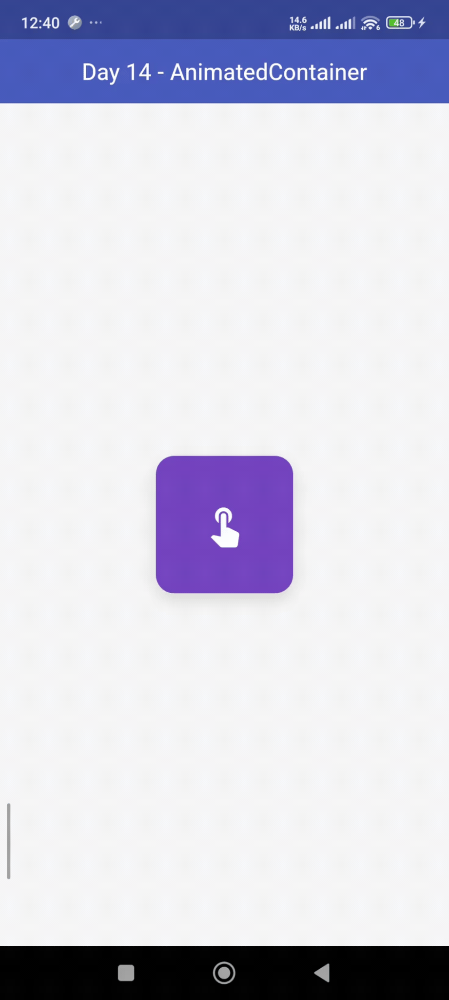
        </a> 
        <a href="lib/features/widgets_of_the_day/day_14_animated_container/day14_animated_container_widget.dart">
          <b>AnimCont</b>
        </a> 
        Implicit anim
      </td>
    </tr>
  </tbody>
</table>

<table>
  <thead>
    <tr>
      <th style="width:150px"><b>Day 15</b></th>
      <th style="width:150px"><b>Day 16</b></th>
      <th style="width:150px"><b>Day 17</b></th>
      <th style="width:150px"><b>Day 18</b></th>
      <th style="width:150px"><b>Day 19</b></th>
    </tr>
  </thead>
  <tbody>
    <tr>
      <td align="center" style="width:150px">
        <a href="screenshots/day15_media_query.gif">
          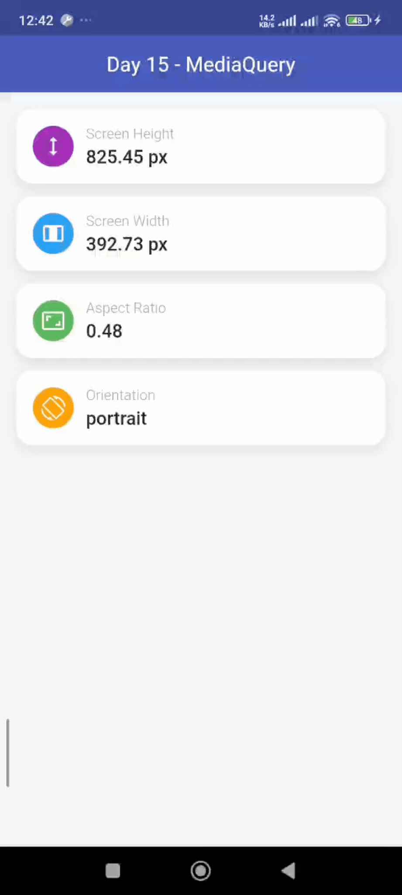
        </a> 
        <a href="lib/features/widgets_of_the_day/day_15_media_query/day15_media_query_widget.dart">
          <b>MediaQuery</b>
        </a> 
        Responsive
      </td>
      <td align="center" style="width:150px">
         
        <a href="lib/features/widgets_of_the_day/day_16_alert_dialog/day16_alert_dialog_widget.dart">
          <b>AlertDialog</b>
        </a> 
        Popup
      </td>
      <td align="center" style="width:150px">
         
        <a href="lib/features/widgets_of_the_day/day_17_text_and_textstyle/day17_text_style_widget.dart">
          <b>Text</b>
        </a> 
        Styling
      </td>
      <td align="center" style="width:150px">
         
        <a href="lib/features/widgets_of_the_day/day_18_rich_text/day18_rich_text_widget.dart">
          <b>RichText</b>
        </a> 
        Mixed styles
      </td>
      <td align="center" style="width:150px">
        <a href="screenshots/day19_timer.gif">
          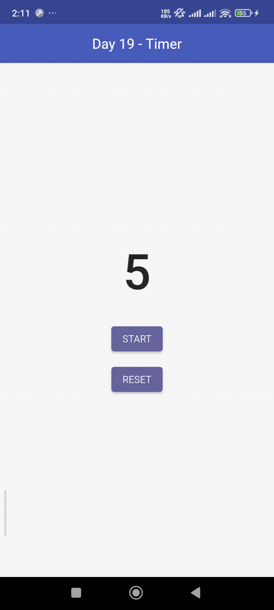
        </a> 
        <a href="lib/features/widgets_of_the_day/day_19_timer/day19_timer_widget.dart">
          <b>Timer</b>
        </a> 
        Async events
      </td>
    </tr>
  </tbody>
</table>

<table>
  <thead>
    <tr>
      <th style="width:150px"><b>Day 20</b></th>
      <th style="width:150px"><b>Day 21</b></th>
      <th style="width:150px"><b>Day 22</b></th>
      <th style="width:150px"><b>Day 23</b></th>
      <th style="width:150px"><b>Day 24</b></th>
    </tr>
  </thead>
  <tbody>
    <tr>
      <td align="center" style="width:150px">
        <a href="screenshots/day20_pageview.gif">
          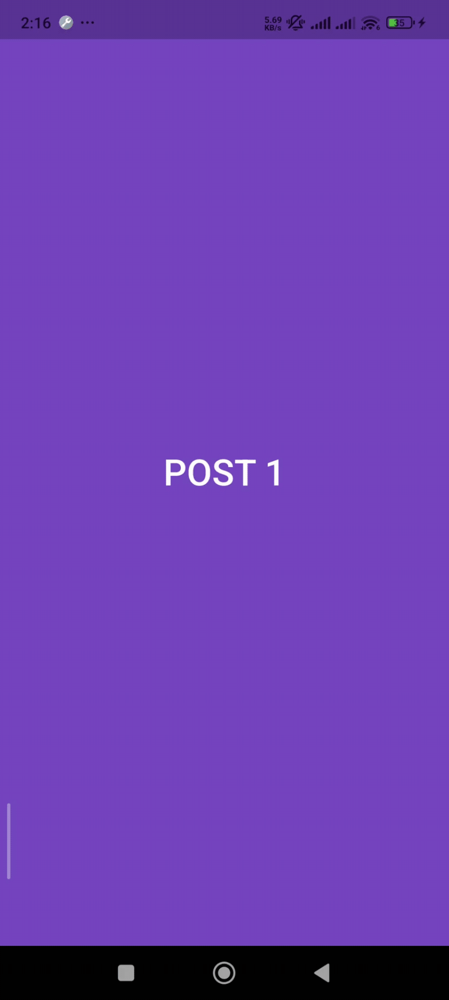
        </a> 
        <a href="lib/features/widgets_of_the_day/day_20_pageview/day20_pageview_widget.dart">
          <b>PageView</b>
        </a> 
        Swipe pages
      </td>
      <td align="center" style="width:150px">
         
        <a href="lib/features/widgets_of_the_day/day_21_stack/day21_stack_widget.dart">
          <b>Stack</b>
        </a> 
        Layers
      </td>
      <td align="center" style="width:150px">
        <a href="screenshots/day22_textfield.gif">
          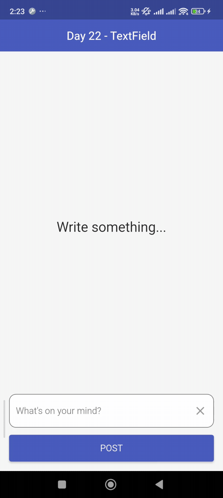
        </a> 
        <a href="lib/features/widgets_of_the_day/day_22_textfield/day22_textfield_widget.dart">
          <b>TextField</b>
        </a> 
        Input
      </td>
      <td align="center" style="width:150px">
        <a href="screenshots/day23_animated_icon.gif">
          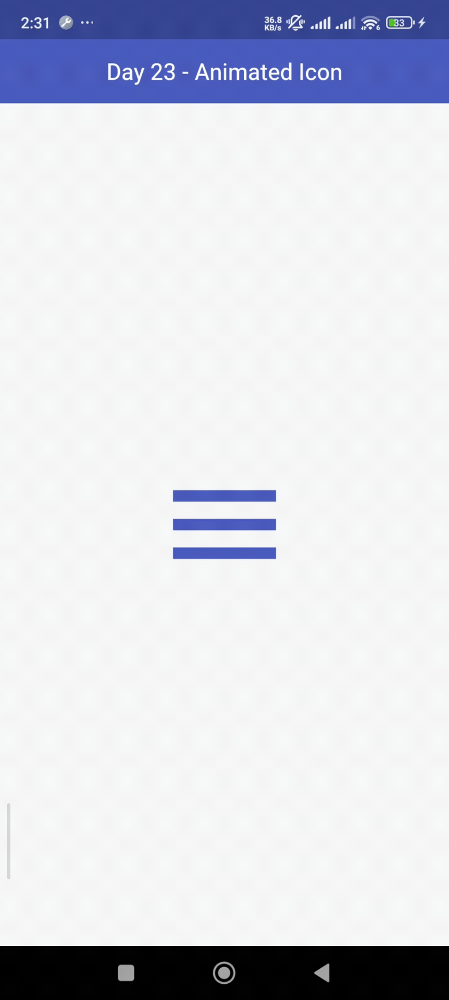
        </a> 
        <a href="lib/features/widgets_of_the_day/day_23_animated_icon/day23_animated_icon_widget.dart">
          <b>AnimIcon</b>
        </a> 
        Transition
      </td>
      <td align="center" style="width:150px">
        <a href="screenshots/day24_slider.gif">
          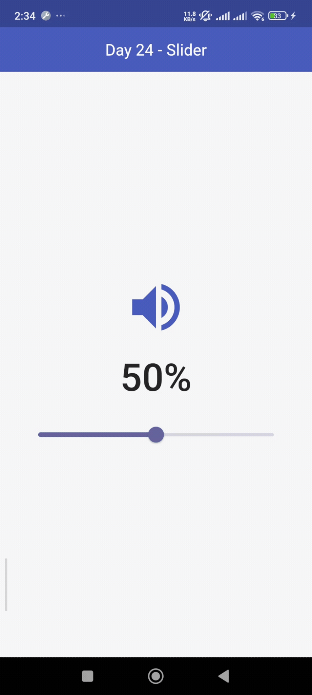
        </a> 
        <a href="lib/features/widgets_of_the_day/day_24_slider/day24_slider_widget.dart">
          <b>Slider</b>
        </a> 
        Selection
      </td>
    </tr>
  </tbody>
</table>

<table>
  <thead>
    <tr>
      <th style="width:150px"><b>Day 25</b></th>
      <th style="width:150px"><b>Day 26</b></th>
      <th style="width:150px"><b>Day 27</b></th>
      <th style="width:150px"><b>Day 28</b></th>
      <th style="width:150px"><b>Day 29</b></th>
    </tr>
  </thead>
  <tbody>
    <tr>
      <td align="center" style="width:150px">
        <a href="screenshots/day25_date_picker.gif">
          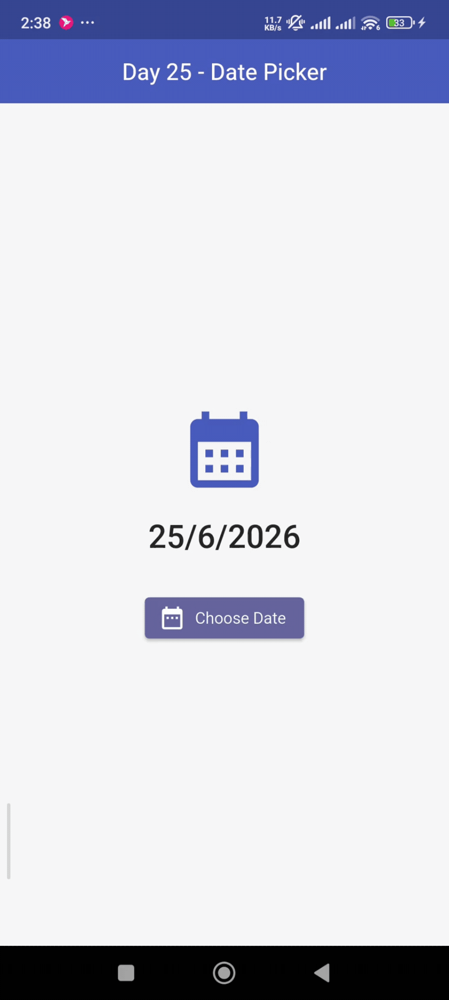
        </a> 
        <a href="lib/features/widgets_of_the_day/day_25_date_picker/day25_date_picker_widget.dart">
          <b>DatePicker</b>
        </a> 
        Calendar
      </td>
      <td align="center" style="width:150px">
        <a href="screenshots/day26_time_picker.gif">
          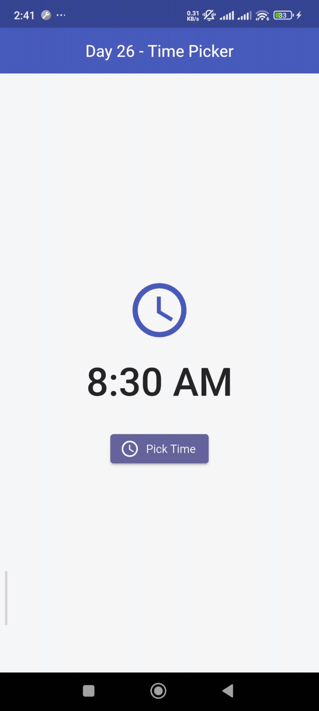
        </a> 
        <a href="lib/features/widgets_of_the_day/day_26_time_picker/day26_time_picker_widget.dart">
          <b>TimePicker</b>
        </a> 
        Clock
      </td>
      <td align="center" style="width:150px">
        <a href="screenshots/day27_listwheelscrollview.gif">
          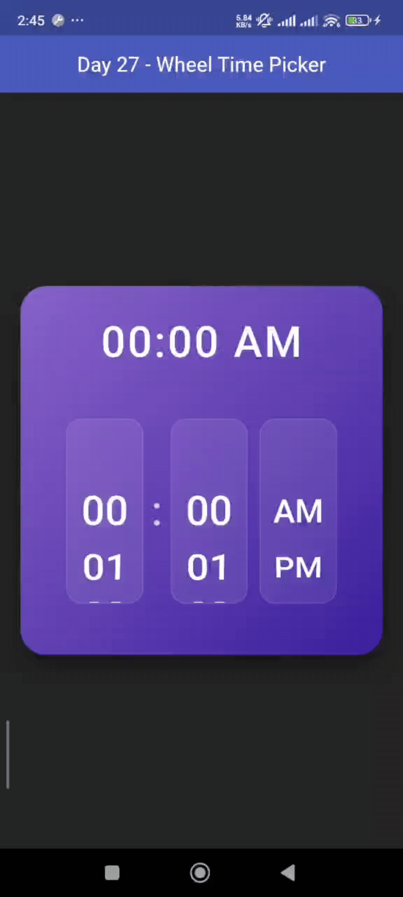
        </a> 
        <a href="lib/features/widgets_of_the_day/day_27_listwheelscrollview/day27_listwheelscrollview_widget.dart">
          <b>ListWheel</b>
        </a> 
        3D Scroll
      </td>
      <td align="center" style="width:150px">
         
        <a href="lib/features/widgets_of_the_day/day_28_lineargradient/day28_lineargradient_widget.dart">
          <b>Gradient</b>
        </a> 
        Colors
      </td>
      <td align="center" style="width:150px">
         
        <a href="lib/features/widgets_of_the_day/day_29_elevatedbutton_and_outlinedbutton/day29_elevatedbutton_and_outlinedbutton_widget.dart">
          <b>Buttons</b>
        </a> 
        Action
      </td>
    </tr>
  </tbody>
</table>

<table>
  <thead>
    <tr>
      <th style="width:150px"><b>Day 30</b></th>
      <th style="width:150px"><b>Day 31</b></th>
      <th style="width:150px"><b>Day 32</b></th>
      <th style="width:150px"><b>Day 33</b></th>
      <th style="width:150px"><b>Day 34</b></th>
    </tr>
  </thead>
  <tbody>
    <tr>
      <td align="center" style="width:150px">
         
        <a href="lib/features/widgets_of_the_day/day_30_floatingactionbutton/day30_floatingactionbutton_widget.dart">
          <b>FAB</b>
        </a> 
        Primary btn
      </td>
      <td align="center" style="width:150px">
        <a href="screenshots/day31_navigator.gif">
          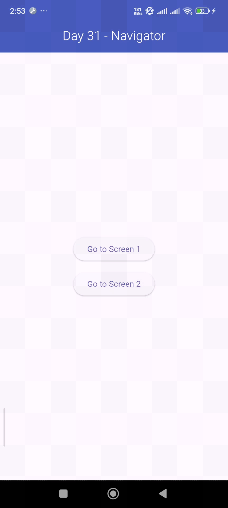
        </a> 
        <a href="lib/features/widgets_of_the_day/day_31_navigator/day31_navigator_widget.dart">
          <b>Navigator</b>
        </a> 
        Routes
      </td>
      <td align="center" style="width:150px">
         
        <a href="lib/features/widgets_of_the_day/day_32_card/day32_card_widget.dart">
          <b>Card</b>
        </a> 
        Container
      </td>
      <td align="center" style="width:150px">
         
        <a href="lib/features/widgets_of_the_day/day_33_clipper/day33_clipper_widget.dart">
          <b>Clipper</b>
        </a> 
        Shapes
      </td>
      <td align="center" style="width:150px">
        <a href="screenshots/day34_rawmaterialbutton.gif">
          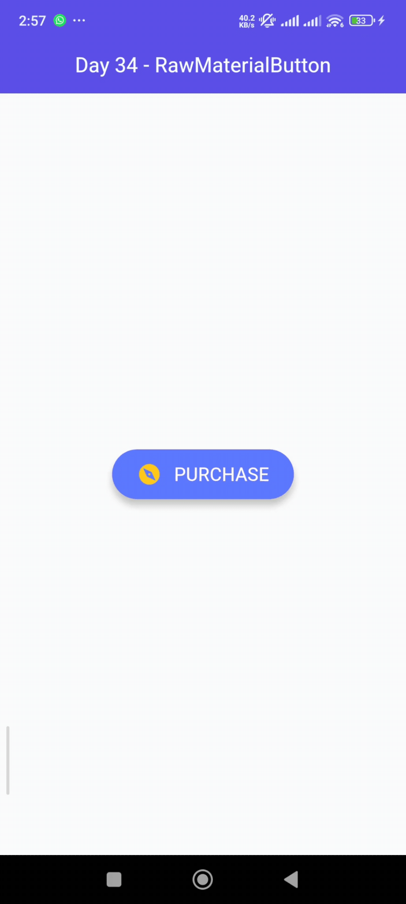
        </a> 
        <a href="lib/features/widgets_of_the_day/day_34_rawmaterialbutton/day34_rawmaterialbutton_widget.dart">
          <b>RawBtn</b>
        </a> 
        Custom
      </td>
    </tr>
  </tbody>
</table>

<table>
  <thead>
    <tr>
      <th style="width:150px"><b>Day 35</b></th>
      <th style="width:150px"><b>Day 36</b></th>
      <th style="width:150px"><b>Day 37</b></th>
      <th style="width:150px"><b>Day 38</b></th>
      <th style="width:150px"><b>Day 39</b></th>
    </tr>
  </thead>
  <tbody>
    <tr>
      <td align="center" style="width:150px">
         
        <a href="lib/features/widgets_of_the_day/day_35_rotatedbox/day35_rotatedbox_widget.dart">
          <b>RotatedBox</b>
        </a> 
        Rotation
      </td>
      <td align="center" style="width:150px">
         
        <a href="lib/features/widgets_of_the_day/day_36_transform/day36_transform_widget.dart">
          <b>Transform</b>
        </a> 
        Scale/Skew
      </td>
      <td align="center" style="width:150px">
         
        <a href="lib/features/widgets_of_the_day/day_37_positioned/day37_positioned_widget.dart">
          <b>Positioned</b>
        </a> 
        Absolute
      </td>
      <td align="center" style="width:150px">
         
        <a href="lib/features/widgets_of_the_day/day_38_iconbutton/day38_iconbutton_widget.dart">
          <b>IconButton</b>
        </a> 
        Icon action
      </td>
      <td align="center" style="width:150px">
         
        <a href="lib/features/widgets_of_the_day/day_39_custom_paint/day39_custom_paint_widget.dart">
          <b>CustomPaint</b>
        </a> 
        Canvas draw
      </td>
    </tr>
  </tbody>
</table>

<table>
  <thead>
    <tr>
      <th style="width:150px"><b>Day 40</b></th>
      <th style="width:150px"><b>Day 41</b></th>
      <th style="width:150px"><b>Day 42</b></th>
      <th style="width:150px"><b>Day 43</b></th>
      <th style="width:150px"><b>Day 44</b></th>
    </tr>
  </thead>
  <tbody>
    <tr>
      <td align="center" style="width:150px">
         
        <a href="lib/features/widgets_of_the_day/day_40_clipoval/day40_clipoval_widget.dart">
          <b>ClipOval</b>
        </a> 
        Circular clip
      </td>
      <td align="center" style="width:150px">
         
        <a href="lib/features/widgets_of_the_day/day_41_cliprrect/day41_cliprrect_widget.dart">
          <b>ClipRRect</b>
        </a> 
        Rounded clip
      </td>
      <td align="center" style="width:150px">
         
        <a href="lib/features/widgets_of_the_day/day_42_cliprect/day42_cliprect_widget.dart">
          <b>ClipRect</b>
        </a> 
        Rect clip
      </td>
      <td align="center" style="width:150px">
         
        <a href="lib/features/widgets_of_the_day/day_43_clippath/day43_clippath_widget.dart">
          <b>ClipPath</b>
        </a> 
        Custom shape
      </td>
      <td align="center" style="width:150px">
         
        <a href="lib/features/widgets_of_the_day/day_44_radial_and_sweep_gradient/day44_radial_and_sweep_gradient_widget.dart">
          <b>Grad Effects</b>
        </a> 
        Radial & Sweep
      </td>
    </tr>
  </tbody>
</table>

<table>
  <thead>
    <tr>
      <th style="width:150px"><b>Day 45</b></th>
      <th style="width:150px"><b>Day 46</b></th>
      <th style="width:150px"><b>Day 47</b></th>
      <th style="width:150px"><b>Day 48</b></th>
      <th style="width:150px"><b>Day 49</b></th>
    </tr>
  </thead>
  <tbody>
    <tr>
      <td align="center" style="width:150px">
        <a href="screenshots/day45_stateful_widget.gif">
          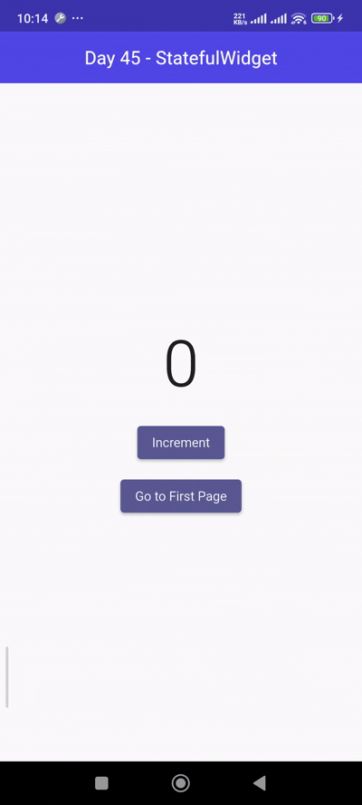
        </a> 
        <a href="lib/features/widgets_of_the_day/day_45_stateful/day45_stateful_widget.dart">
          <b>StatefulWidget</b>
        </a> 
        Lifecycle
      </td>
      <td align="center" style="width:150px">
         
        <a href="lib/features/widgets_of_the_day/day_46_table/day46_table_widget.dart">
          <b>Table</b>
        </a> 
        Grid layout
      </td>
      <td align="center" style="width:150px">
        <a href="screenshots/day47_data_table.gif">
          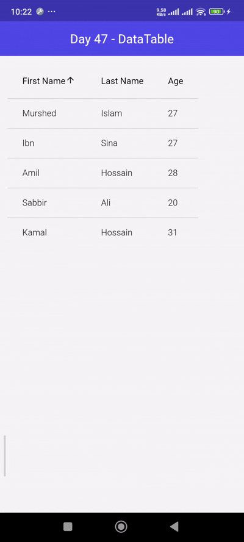
        </a> 
        <a href="lib/features/widgets_of_the_day/day_47_data_table/day47_data_table_widget.dart">
          <b>DataTable</b>
        </a> 
        Interactive
      </td>
      <td align="center" style="width:150px">
        <a href="screenshots/day48_placeholder.png">
          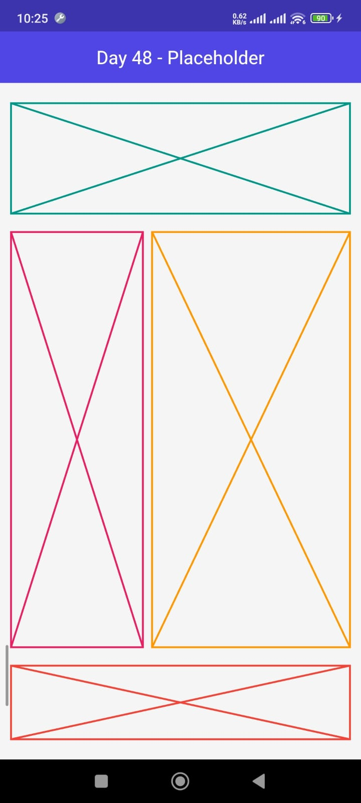
        </a> 
        <a href="lib/features/widgets_of_the_day/day_48_placeholder/day48_placeholder_widget.dart">
          <b>Placeholder</b>
        </a> 
        Debugging
      </td>
      <td align="center" style="width:150px">
        <a href="screenshots/day49_gesturedetector_and_inkwell.gif">
          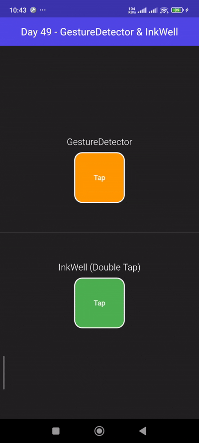
        </a> 
        <a href="lib/features/widgets_of_the_day/day_49_gesturedetector_and_inkwell/day49_gesturedetector_and_inkwell_widget.dart">
          <b>Gesture&Ink</b>
        </a> 
        Interactions
      </td>
    </tr>
  </tbody>
</table>

<table>
  <thead>
    <tr>
      <th style="width:150px"><b>Day 50</b></th>
      <th style="width:150px"><b>Day 51</b></th>
      <th style="width:150px"><b>Day 52</b></th>
      <th style="width:150px"><b>Day 53</b></th>
      <th style="width:150px"><b>Day 54</b></th>
    </tr>
  </thead>
  <tbody>
    <tr>
      <td align="center" style="width:150px">
        <a href="screenshots/day50_material_widget.png">
          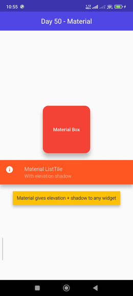
        </a> 
        <a href="lib/features/widgets_of_the_day/day_50_material/day50_material_widget.dart">
          <b>Material</b>
        </a> 
        Surface/Depth
      </td>
      <td align="center" style="width:150px">
        <a href="screenshots/day51_switches.gif">
          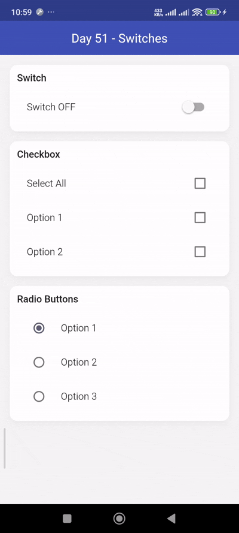
        </a> 
        <a href="lib/features/widgets_of_the_day/day_51_switches/day51_switches_widget.dart">
          <b>Switches</b>
        </a> 
        Toggle UI
      </td>
      <td align="center" style="width:150px">
        <a href="screenshots/day52_dropdown_and_popupmenu.gif">
          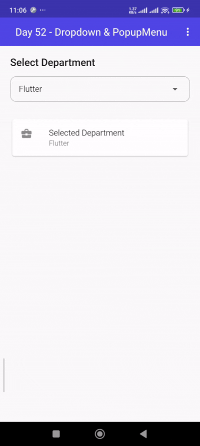
        </a> 
        <a href="lib/features/widgets_of_the_day/day_52_dropdown_and_popupmenu/day52_dropdown_and_popupmenu_widget.dart">
          <b>Menus</b>
        </a> 
        Selection
      </td>
      <td align="center" style="width:150px">
        <a href="screenshots/day53_hero_animation.gif">
          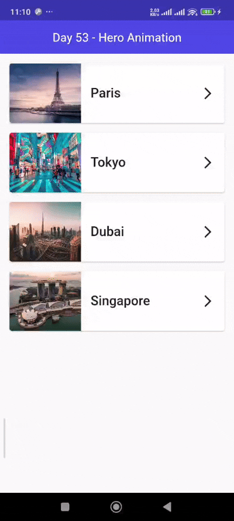
        </a> 
        <a href="lib/features/widgets_of_the_day/day_53_hero_animation/day53_hero_animation_widget.dart">
          <b>Hero</b>
        </a> 
        Transitions
      </td>
      <td align="center" style="width:150px">
         
        <a href="lib/features/widgets_of_the_day/day_54_about_dialog/day54_about_dialog_widget.dart">
          <b>AboutDialog</b>
        </a> 
        App Info
      </td>
    </tr>
  </tbody>
</table>

<table>
  <thead>
    <tr>
      <th style="width:150px"><b>Day 55</b></th>
      <th style="width:150px"><b>Day 56</b></th>
      <th style="width:150px"><b>Day 57</b></th>
      <th style="width:150px"><b>Day 58</b></th>
      <th style="width:150px"><b>Day 59</b></th>
    </tr>
  </thead>
  <tbody>
    <tr>
      <td align="center" style="width:150px">
         
        <a href="lib/features/widgets_of_the_day/day_55_stepper/day55_stepper_widget.dart">
          <b>Stepper</b>
        </a> 
        Workflows
      </td>
      <td align="center" style="width:150px">
        <a href="screenshots/day56_fitted_box.png">
          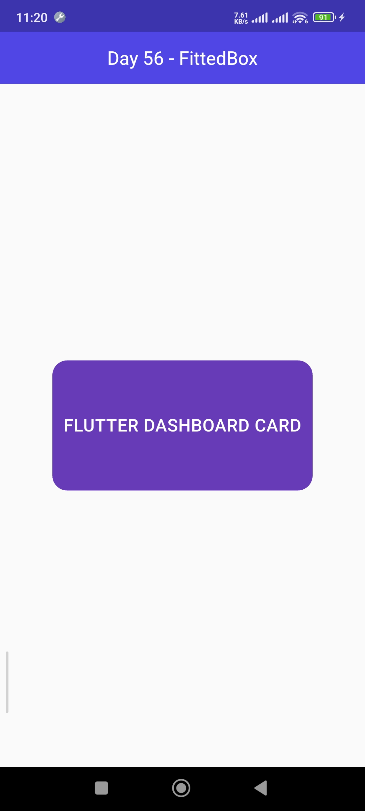
        </a> 
        <a href="lib/features/widgets_of_the_day/day_56_fitted_box/day56_fitted_box_widget.dart">
          <b>FittedBox</b>
        </a> 
        Scaling
      </td>
      <td align="center" style="width:150px">
        <a href="screenshots/day57_show_search.gif">
          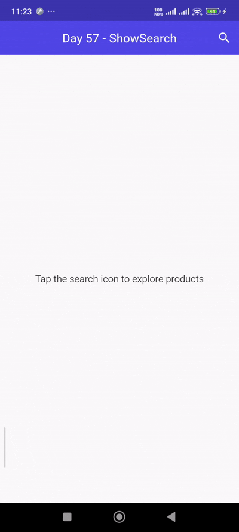
        </a> 
        <a href="lib/features/widgets_of_the_day/day_57_show_search/day57_show_search_widget.dart">
          <b>Search</b>
        </a> 
        In-app search
      </td>
      <td align="center" style="width:150px">
        <a href="screenshots/day58_adaptive.gif">
          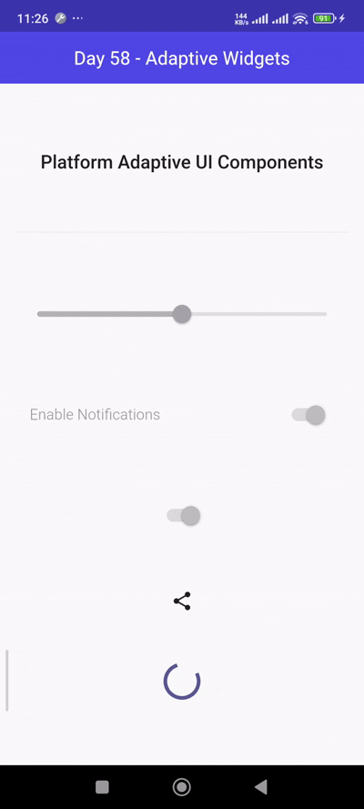
        </a> 
        <a href="lib/features/widgets_of_the_day/day_58_adaptive/day58_adaptive_widget.dart">
          <b>Adaptive</b>
        </a> 
        Platform
      </td>
      <td align="center" style="width:150px">
        <a href="screenshots/day59_scrollbar.gif">
          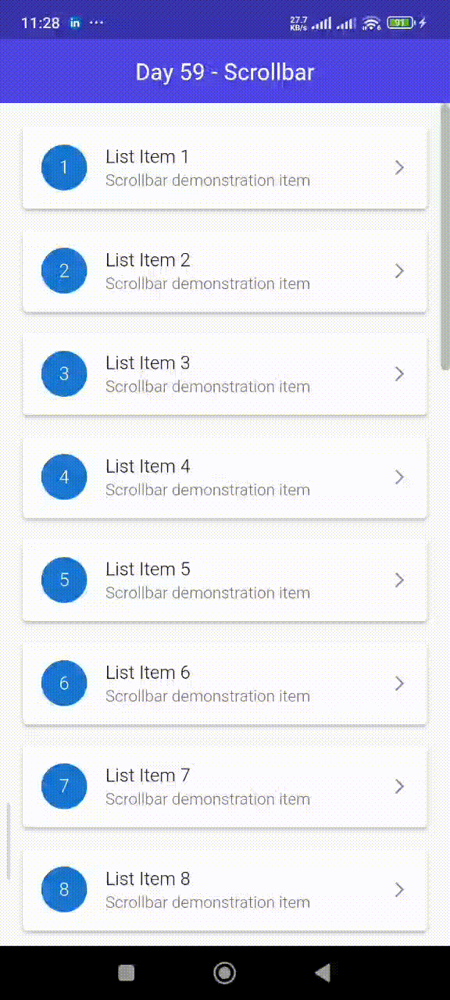
        </a> 
        <a href="lib/features/widgets_of_the_day/day_59_scrollbar/day59_scrollbar_widget.dart">
          <b>Scrollbar</b>
        </a> 
        Feedback
      </td>
    </tr>
  </tbody>
</table>

<table>
  <thead>
    <tr>
      <th style="width:150px"><b>Day 60</b></th>
      <th style="width:150px"><b>Day 61</b></th>
      <th style="width:150px"><b>Day 62</b></th>
      <th style="width:150px"><b>Day 63</b></th>
      <th style="width:150px"><b>Day 64</b></th>
    </tr>
  </thead>
  <tbody>
    <tr>
      <td align="center" style="width:150px">
        <a href="screenshots/day60_choice_chip.gif">
          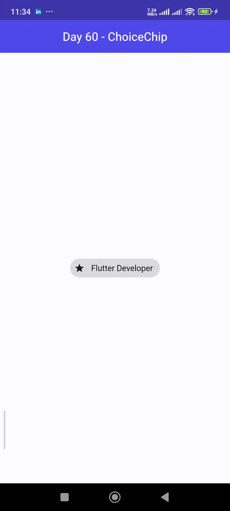
        </a> 
        <a href="lib/features/widgets_of_the_day/day_60_choice_chip/day60_choice_chip_widget.dart">
          <b>ChoiceChip</b>
        </a> 
        Filters
      </td>
      <td align="center" style="width:150px">
        <a href="screenshots/day61_wrap.png">
          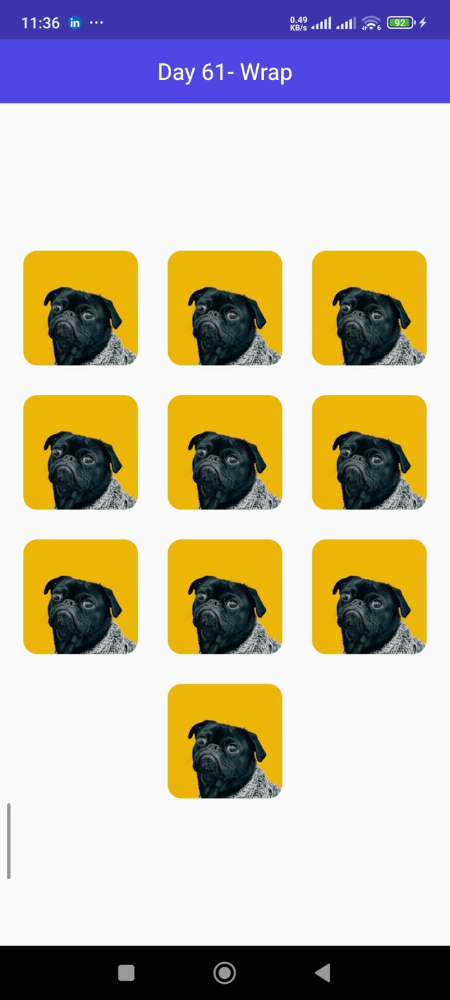
        </a> 
        <a href="lib/features/widgets_of_the_day/day_61_wrap/day61_wrap_widget.dart">
          <b>Wrap</b>
        </a> 
        Flow layout
      </td>
      <td align="center" style="width:150px">
        <a href="screenshots/day62_expansion_tile.gif">
          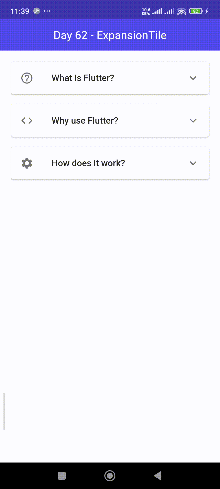
        </a> 
        <a href="lib/features/widgets_of_the_day/day_62_expansion_tile/day62_expansion_tile_widget.dart">
          <b>ExpansionTile</b>
        </a> 
        Expandable
      </td>
      <td align="center" style="width:150px">
        <a href="screenshots/day63_range_slider.gif">
          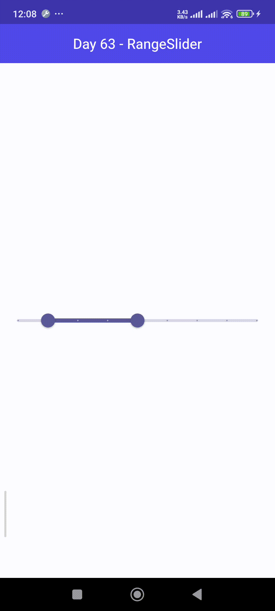
        </a> 
        <a href="lib/features/widgets_of_the_day/day_63_range_slider/day63_range_slider_widget.dart">
          <b>RangeSlider</b>
        </a> 
        Value range
      </td>
      <td align="center" style="width:150px">
        <a href="screenshots/day64_show_modalbootmsheet.gif">
          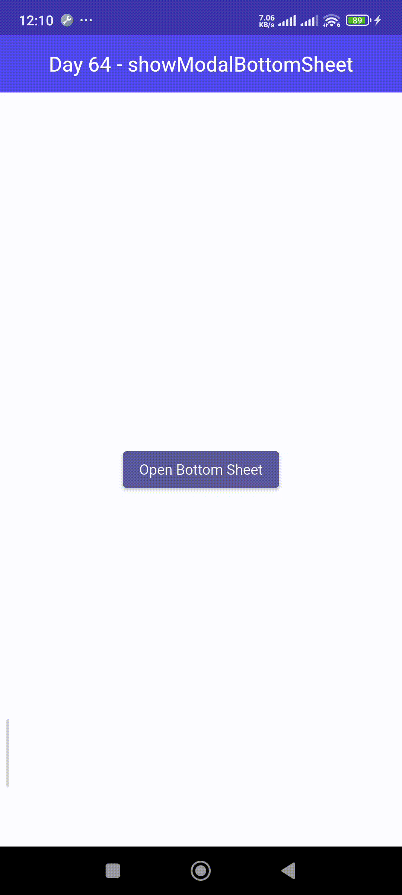
        </a> 
        <a href="lib/features/widgets_of_the_day/day_64_show_modalbottomsheet/day64_show_modalbootmsheet_widget.dart">
          <b>BottomSheet</b>
        </a> 
        Modal UI
      </td>
    </tr>
  </tbody>
</table>

<table>
  <thead>
    <tr>
      <th style="width:150px"><b>Day 65</b></th>
      <th style="width:150px"><b>Day 66</b></th>
      <th style="width:150px"><b>Day 67</b></th>
      <th style="width:150px"><b>Day 68</b></th>
      <th style="width:150px"><b>Day 69</b></th>
    </tr>
  </thead>
  <tbody>
    <tr>
      <td align="center" style="width:150px">
        <a href="screenshots/day65_animated_cross_fade.gif">
          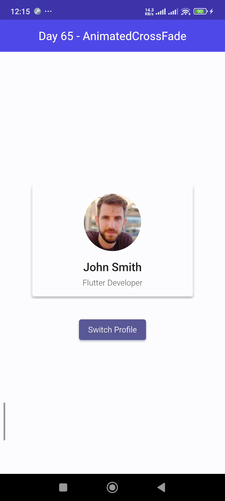
        </a> 
        <a href="lib/features/widgets_of_the_day/day_65_animated_cross_fade/day65_animated_cross_fade_widget.dart">
          <b>CrossFade</b>
        </a> 
        Transitions
      </td>
      <td align="center" style="width:150px">
        <a href="screenshots/day66_flexible.png">
          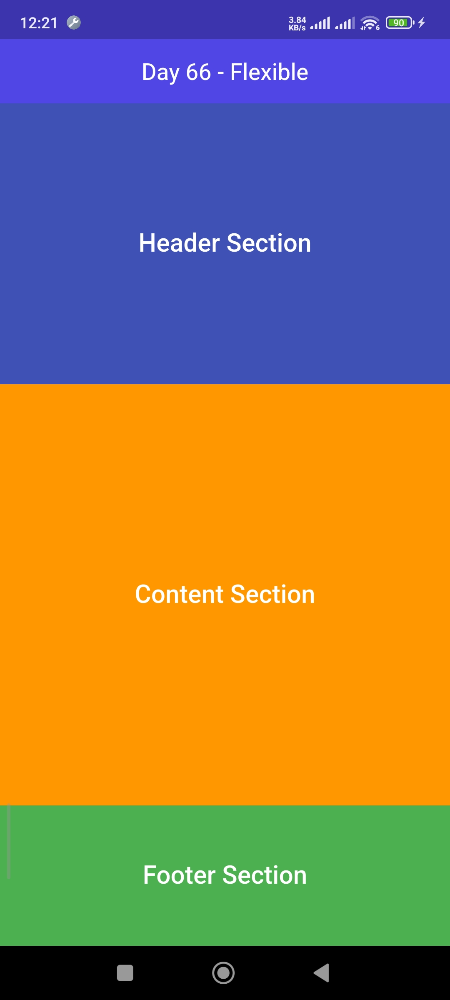
        </a> 
        <a href="lib/features/widgets_of_the_day/day_66_flexible/day66_flexible_widget.dart">
          <b>Flexible</b>
        </a> 
        Flex layout
      </td>
      <td align="center" style="width:150px">
        <a href="screenshots/day67_spacer.png">
          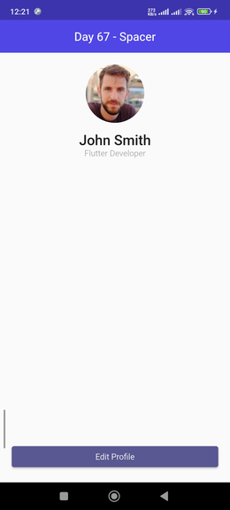
        </a> 
        <a href="lib/features/widgets_of_the_day/day_67_spacer/day67_spacer_widget.dart">
          <b>Spacer</b>
        </a> 
        Spacing
      </td>
      <td align="center" style="width:150px">
        <a href="screenshots/day68_gridpaper.png">
          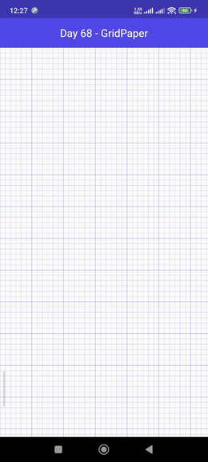
        </a> 
        <a href="lib/features/widgets_of_the_day/day_68_gridpaper/day68_gridpaper_widget.dart">
          <b>GridPaper</b>
        </a> 
        Visualization
      </td>
      <td align="center" style="width:150px">
         
        <a href="lib/features/widgets_of_the_day/day_69_interactive_viewer/day69_interactive_viewer_widget.dart">
          <b>InterViewer</b>
        </a> 
        Zoom/Pan
      </td>
    </tr>
  </tbody>
</table>

<table>
  <thead>
    <tr>
      <th style="width:150px"><b>Day 70</b></th>
      <th style="width:150px"><b>Day 71</b></th>
      <th style="width:150px"><b>Day 72</b></th>
      <th style="width:150px"><b>Day 73</b></th>
      <th style="width:150px"><b>Day 74</b></th>
    </tr>
  </thead>
  <tbody>
    <tr>
      <td align="center" style="width:150px">
        <a href="screenshots/day70_checkbox_listtile.gif">
          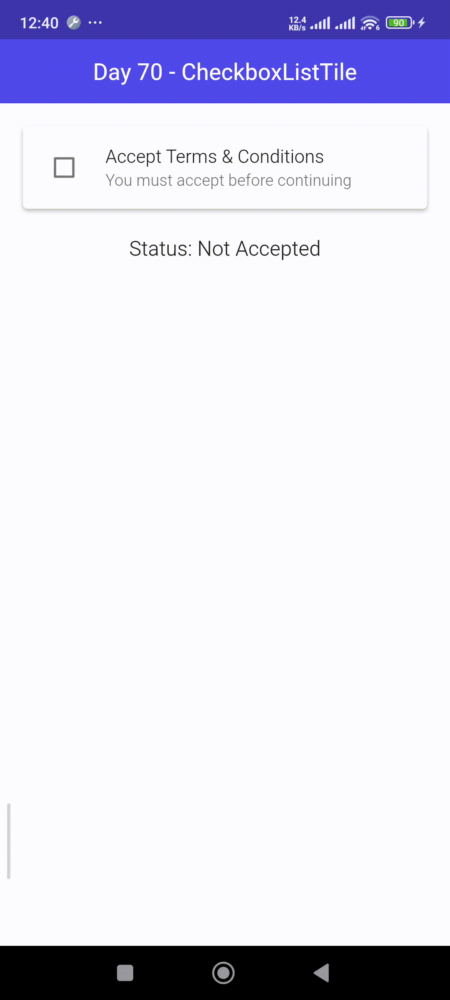
        </a> 
        <a href="lib/features/widgets_of_the_day/day_70_checkbox_listtile/day70_checkbox_listtile_widget.dart">
          <b>CheckboxTile</b>
        </a> 
        Selection
      </td>
      <td align="center" style="width:150px">
        <a href="screenshots/day71_selectable_text.gif">
          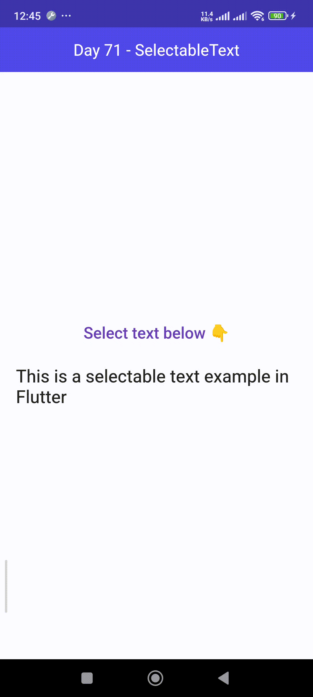
        </a> 
        <a href="lib/features/widgets_of_the_day/day_71_selectable_text/day71_selectable_text_widget.dart">
          <b>SelectText</b>
        </a> 
        Copy/Paste
      </td>
      <td align="center" style="width:150px">
         
        <a href="lib/features/widgets_of_the_day/day_72_animated_padding/day72_animated_padding_widget.dart">
          <b>AnimPadding</b>
        </a> 
        Spacing anim
      </td>
      <td align="center" style="width:150px">
        <a href="screenshots/day73_refresh_indicator.gif">
          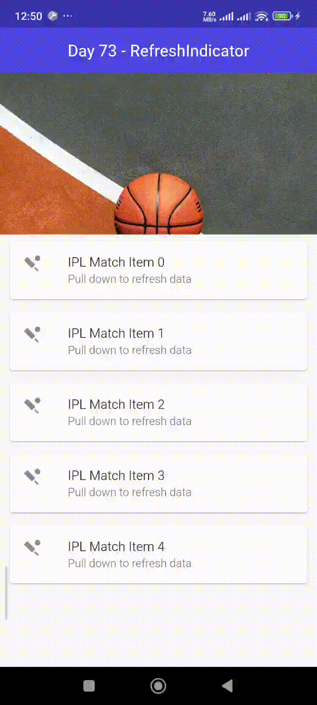
        </a> 
        <a href="lib/features/widgets_of_the_day/day_73_refresh_indicator/day73_refresh_indicator_widget.dart">
          <b>Refresh</b>
        </a> 
        Pull-to-refresh
      </td>
      <td align="center" style="width:150px">
        <a href="screenshots/day74_image_filtered.png">
          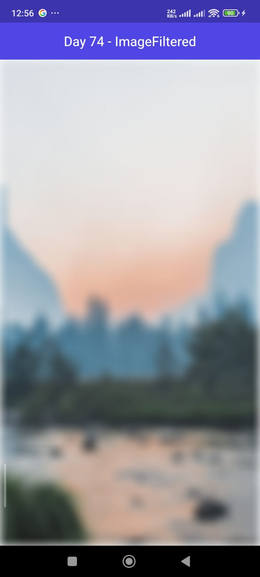
        </a> 
        <a href="lib/features/widgets_of_the_day/day_74_image_filtered/day74_image_filtered_widget.dart">
          <b>ImageFilter</b>
        </a> 
        Blur effects
      </td>
    </tr>
  </tbody>
</table>

<table>
  <thead>
    <tr>
      <th style="width:150px"><b>Day 75</b></th>
      <th style="width:150px"><b>Day 76</b></th>
      <th style="width:150px"><b>Day 77</b></th>
      <th style="width:150px"><b>Day 78</b></th>
      <th style="width:150px"><b>Day 79</b></th>
    </tr>
  </thead>
  <tbody>
    <tr>
      <td align="center" style="width:150px">
         
        <a href="lib/features/widgets_of_the_day/day_75_aspect_ratio/day75_aspect_ratio_widget.dart">
          <b>AspectRatio</b>
        </a> 
        Proportions
      </td>
      <td align="center" style="width:150px">
        <a href="screenshots/day76_toggle_button.gif">
          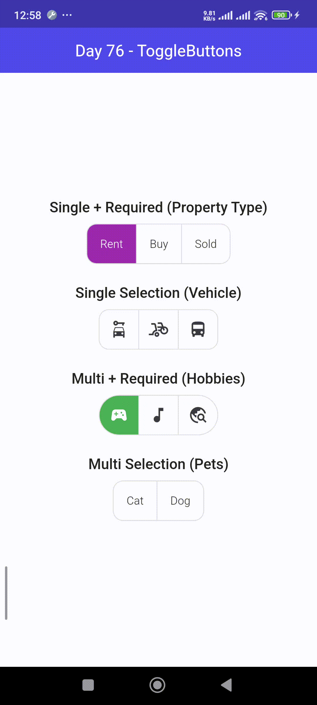
        </a> 
        <a href="lib/features/widgets_of_the_day/day_76_toggle_button/day76_toggle_button_widget.dart">
          <b>ToggleBtns</b>
        </a> 
        Selection
      </td>
      <td align="center" style="width:150px">
        <a href="screenshots/day77_physical_model.png">
          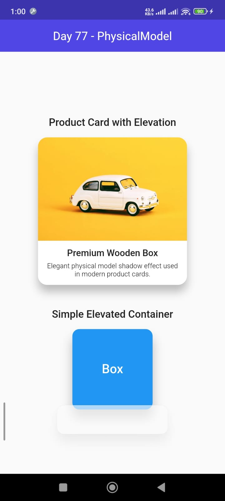
        </a> 
        <a href="lib/features/widgets_of_the_day/day_77_physical_model/day77_physical_model_widget.dart">
          <b>PhysicalModel</b>
        </a> 
        Elevation
      </td>
      <td align="center" style="width:150px">
        <a href="screenshots/day78_align.png">
          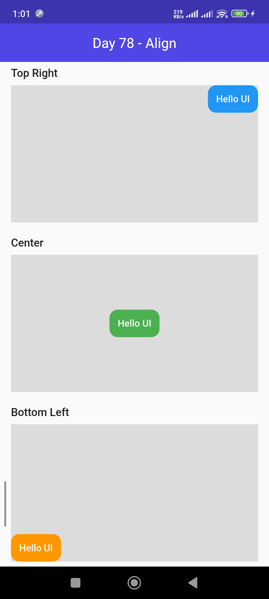
        </a> 
        <a href="lib/features/widgets_of_the_day/day_78_align/day78_align_widget.dart">
          <b>Align</b>
        </a> 
        Positioning
      </td>
      <td align="center" style="width:150px">
        <a href="screenshots/day79_safearea.png">
          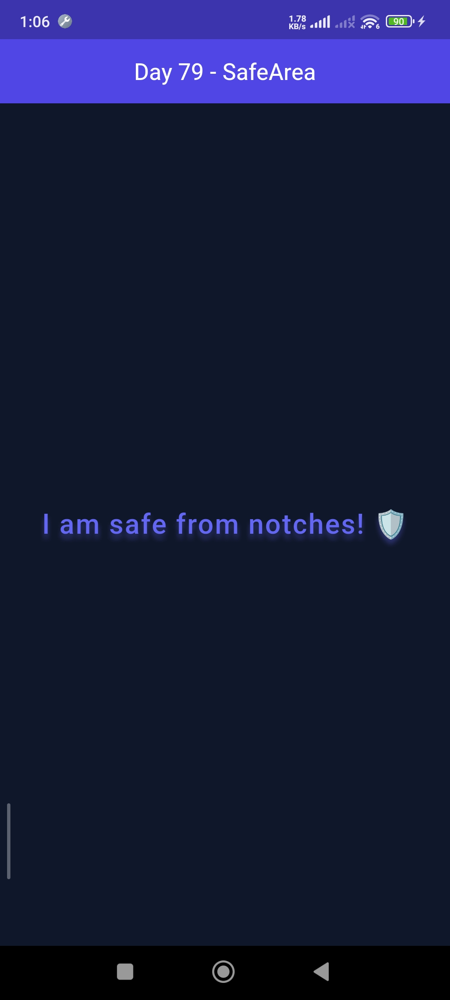
        </a> 
        <a href="lib/features/widgets_of_the_day/day_79_safearea/day79_safearea_widget.dart">
          <b>SafeArea</b>
        </a> 
        Notch support
      </td>
    </tr>
  </tbody>
</table>

<table>
  <thead>
    <tr>
      <th style="width:150px"><b>Day 80</b></th>
      <th style="width:150px"><b>Day 81</b></th>
      <th style="width:150px"><b>Day 82</b></th>
      <th style="width:150px"><b>Day 83</b></th>
      <th style="width:150px"><b>Day 84</b></th>
    </tr>
  </thead>
  <tbody>
    <tr>
      <td align="center" style="width:150px">
        <a href="screenshots/day80_pageroute_builder.gif">
          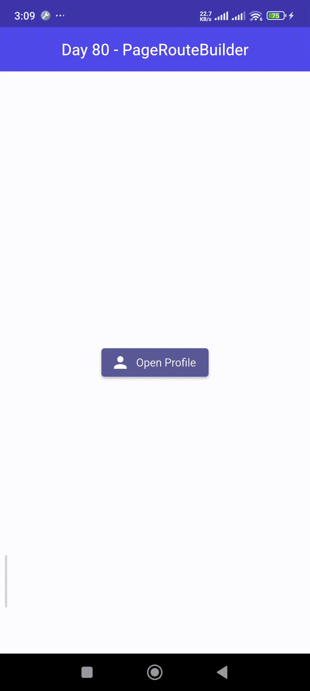
        </a> 
        <a href="lib/features/widgets_of_the_day/day_80_pageroute_builder/day80_pageroute_builder_widget.dart">
          <b>RouteAnim</b>
        </a> 
        Custom nav
      </td>
      <td align="center" style="width:150px">
        <a href="screenshots/day81_draggable.gif">
          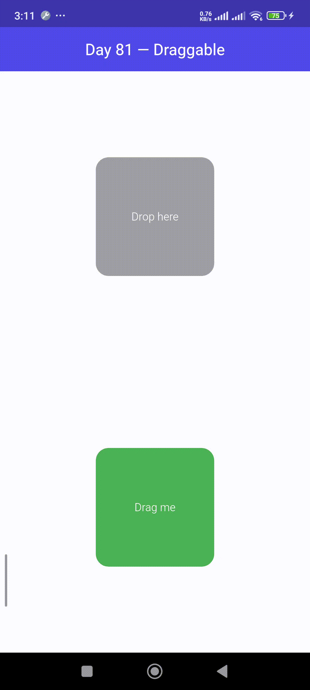
        </a> 
        <a href="lib/features/widgets_of_the_day/day_81_draggable/day81_draggable_widget.dart">
          <b>Draggable</b>
        </a> 
        Drag & Drop
      </td>
      <td align="center" style="width:150px">
        <a href="screenshots/day82_backdrop_filter.png">
          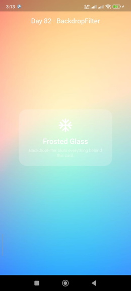
        </a> 
        <a href="lib/features/widgets_of_the_day/day_82_backdrop_filter/day82_backdrop_filter_widget.dart">
          <b>Backdrop</b>
        </a> 
        Frosted glass
      </td>
      <td align="center" style="width:150px">
        <a href="screenshots/day83_reorderable_list_view.gif">
          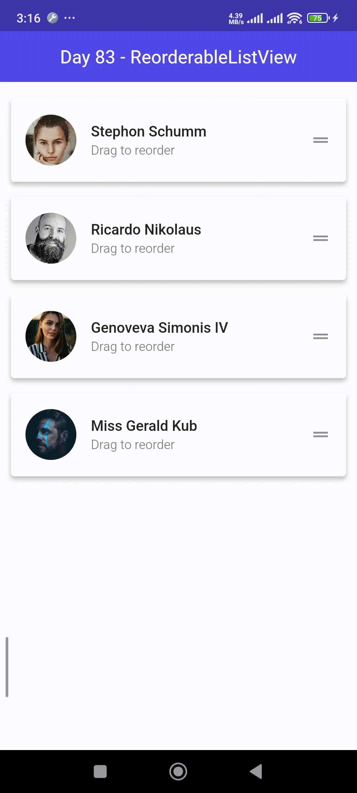
        </a> 
        <a href="lib/features/widgets_of_the_day/day_83_reorderable_list_view/day83_reorderable_list_view_widget.dart">
          <b>ReorderList</b>
        </a> 
        Drag reorder
      </td>
      <td align="center" style="width:150px">
        <a href="screenshots/day84_fade_transition.gif">
          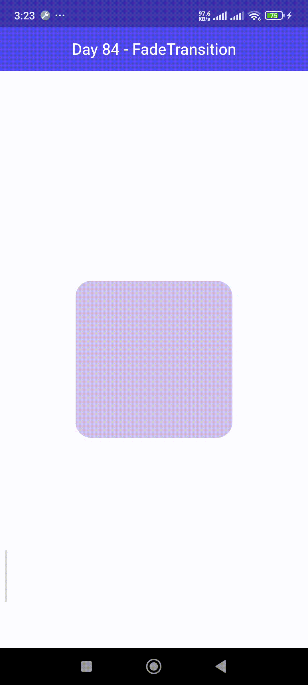
        </a> 
        <a href="lib/features/widgets_of_the_day/day_84_fade_transition/day84_fade_transition_widget.dart">
          <b>FadeAnim</b>
        </a> 
        Opacity anim
      </td>
    </tr>
  </tbody>
</table>

<table>
  <thead>
    <tr>
      <th style="width:150px"><b>Day 85</b></th>
      <th style="width:150px"><b>Day 86</b></th>
      <th style="width:150px"><b>Day 87</b></th>
      <th style="width:150px"><b>Day 88</b></th>
      <th style="width:150px"><b>Day 89</b></th>
    </tr>
  </thead>
  <tbody>
    <tr>
      <td align="center" style="width:150px">
        <a href="screenshots/day85_circle_avatar.png">
          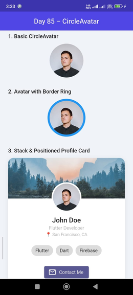
        </a> 
        <a href="lib/features/widgets_of_the_day/day_85_circle_avatar/day85_circle_avatar_widget.dart">
          <b>CircleAvatar</b>
        </a> 
        Profile img
      </td>
      <td align="center" style="width:150px">
        <a href="screenshots/day86_tooltip.gif">
          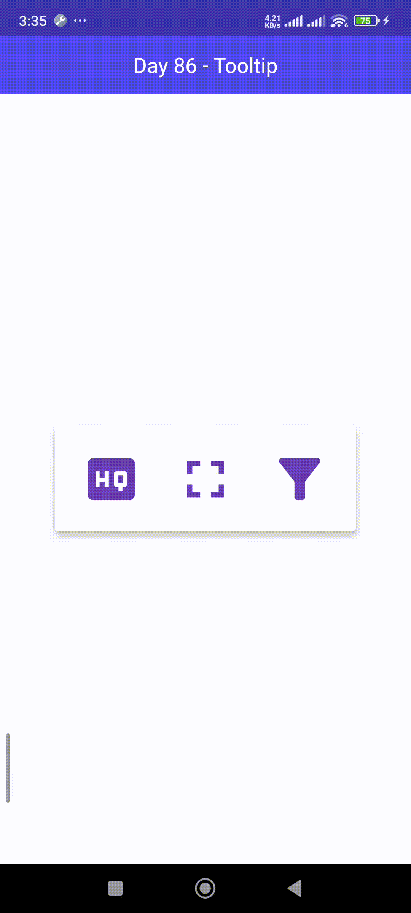
        </a> 
        <a href="lib/features/widgets_of_the_day/day_86_tooltip/day86_tooltip_widget.dart">
          <b>Tooltip</b>
        </a> 
        Hints
      </td>
      <td align="center" style="width:150px">
        <a href="screenshots/day87_visibility.gif">
          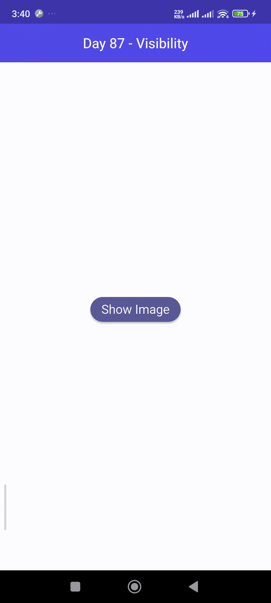
        </a> 
        <a href="lib/features/widgets_of_the_day/day_87_visibility/day87_visibility_widget.dart">
          <b>Visibility</b>
        </a> 
        Show/Hide
      </td>
      <td align="center" style="width:150px">
        <a href="screenshots/day88_indexed_stack.gif">
          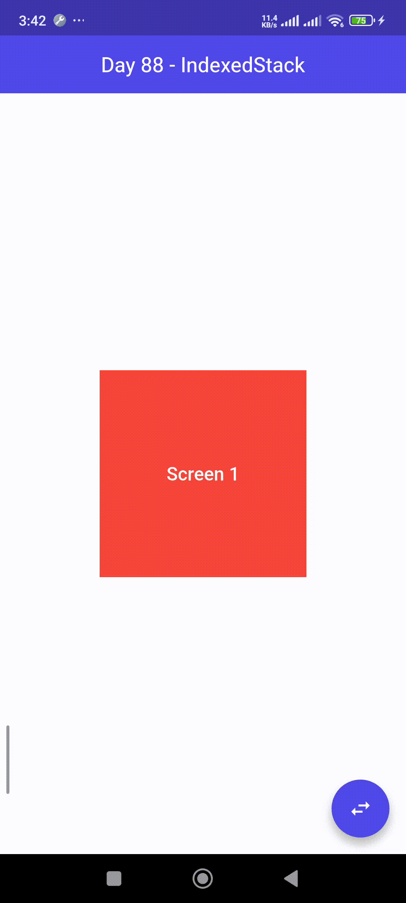
        </a> 
        <a href="lib/features/widgets_of_the_day/day_88_indexed_stack/day88_indexed_stack_widget.dart">
          <b>IndexedStack</b>
        </a> 
        Multi-state
      </td>
      <td align="center" style="width:150px">
        <a href="screenshots/day89_navigator_2.0.gif">
          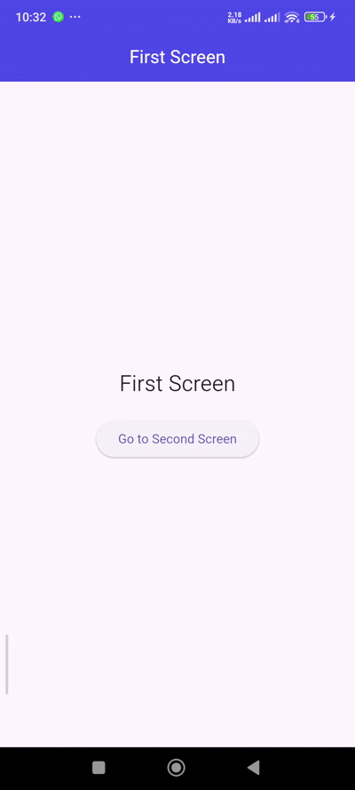
        </a> 
        <a href="lib/features/widgets_of_the_day/day_89_navigator_2.0/day89_navigator_2.0_widget.dart">
          <b>Nav 2.0</b>
        </a> 
        Declarative
      </td>
    </tr>
  </tbody>
</table>

<table>
  <thead>
    <tr>
      <th style="width:150px"><b>Day 90</b></th>
      <th style="width:150px"><b>Day 91</b></th>
      <th style="width:150px"><b>Day 92</b></th>
      <th style="width:150px"><b>Day 93</b></th>
      <th style="width:150px"><b>Day 94</b></th>
    </tr>
  </thead>
  <tbody>
    <tr>
      <td align="center" style="width:150px">
        <a href="screenshots/day90_null_aware_operators.png">
          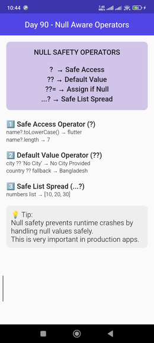
        </a> 
        <a href="lib/features/widgets_of_the_day/day_90_null_aware_operators/day90_null_aware_operators_widget.dart">
          <b>NullSafety</b>
        </a> 
        Operators
      </td>
      <td align="center" style="width:150px">
         
        <a href="lib/features/widgets_of_the_day/day_91_cascade_operator/day91_cascade_operator_widget.dart">
          <b>Cascade</b>
        </a> 
        Chaining
      </td>
      <td align="center" style="width:150px">
        <a href="screenshots/day92_inherited.gif">
          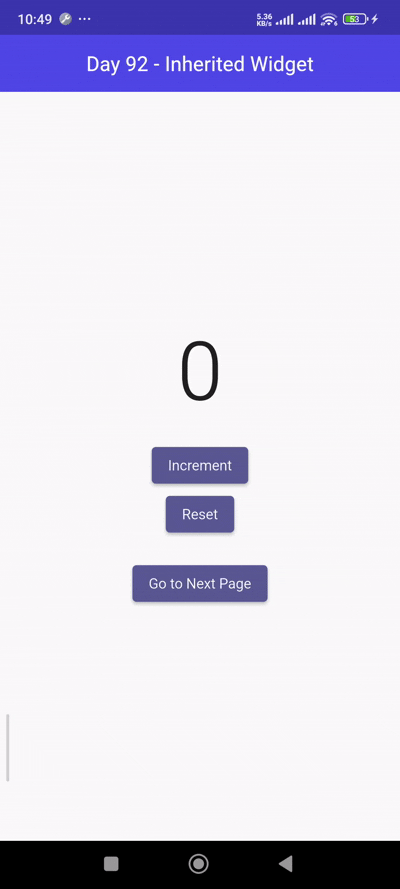
        </a> 
        <a href="lib/features/widgets_of_the_day/day_92_inherited_widget/day92_inherited_widget.dart">
          <b>Inherited</b>
        </a> 
        State sharing
      </td>
      <td align="center" style="width:150px">
        <a href="screenshots/day93_fractional_sizedbox.png">
          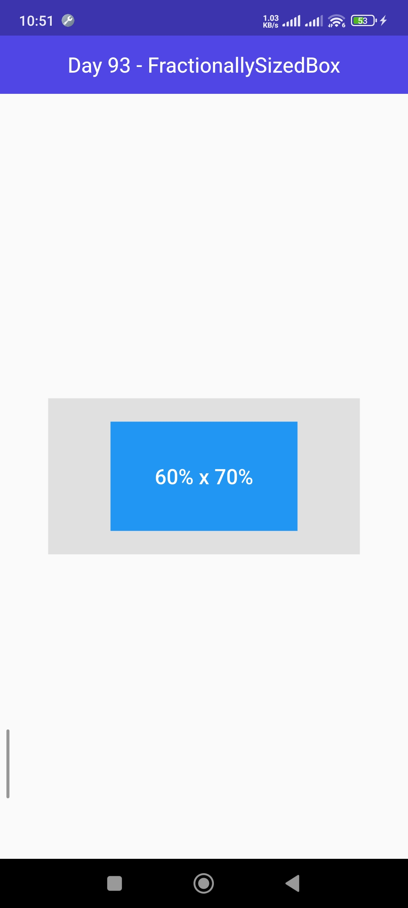
        </a> 
        <a href="lib/features/widgets_of_the_day/day_93_fractional_sizedbox/day93_fractional_sizedbox_widget.dart">
          <b>FracSizedBox</b>
        </a> 
        Percentages
      </td>
      <td align="center" style="width:150px">
        <a href="screenshots/day94_constrained_box.png">
          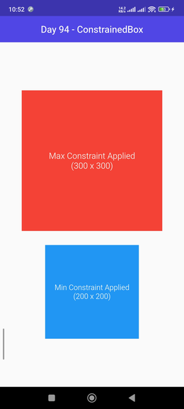
        </a> 
        <a href="lib/features/widgets_of_the_day/day_94_constrained_box/day94_constrained_box_widget.dart">
          <b>Constrained</b>
        </a> 
        Limits
      </td>
    </tr>
  </tbody>
</table>

<table>
  <thead>
    <tr>
      <th style="width:150px"><b>Day 95</b></th>
      <th style="width:150px"><b>Day 96</b></th>
      <th style="width:150px"><b>Day 97</b></th>
      <th style="width:150px"><b>Day 98</b></th>
      <th style="width:150px"><b>Day 99</b></th>
    </tr>
  </thead>
  <tbody>
    <tr>
      <td align="center" style="width:150px">
         
        <a href="lib/features/widgets_of_the_day/day_95_cupertino_search_textfield/day95_cupertino_search_textfield_widget.dart">
          <b>CupertinoSrch</b>
        </a> 
        iOS style
      </td>
      <td align="center" style="width:150px">
        <a href="screenshots/day96_stateful_builder.gif">
          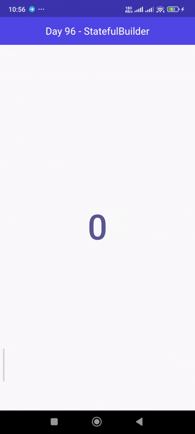
        </a> 
        <a href="lib/features/widgets_of_the_day/day_96_stateful_builder/day96_stateful_builder_widget.dart">
          <b>StatefulBldr</b>
        </a> 
        Local state
      </td>
      <td align="center" style="width:150px">
        <a href="screenshots/day97_layout_builder.gif">
          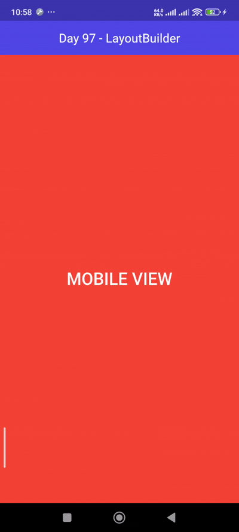
        </a> 
        <a href="lib/features/widgets_of_the_day/day_97_layout_builder/day97_layout_builder_widget.dart">
          <b>LayoutBuilder</b>
        </a> 
        Responsive
      </td>
      <td align="center" style="width:150px">
        <a href="screenshots/day98_orientation_builder.gif">
          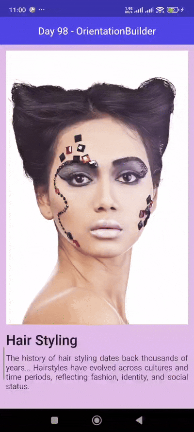
        </a> 
        <a href="lib/features/widgets_of_the_day/day_98_orientation_builder/day98_orientation_builder_widget.dart">
          <b>OrientBuilder</b>
        </a> 
        Rotation
      </td>
      <td align="center" style="width:150px">
        <a href="screenshots/day99_platform_detect.png">
          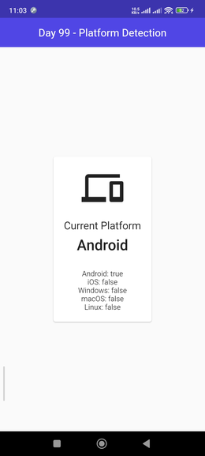
        </a> 
        <a href="lib/features/widgets_of_the_day/day_99_platform_detect/day99_platform_detect_widget.dart">
          <b>Platform</b>
        </a> 
        OS detection
      </td>
    </tr>
  </tbody>
</table>

<table>
  <thead>
    <tr>
      <th style="width:150px"><b>Day 100</b></th>
      <th style="width:150px"><b>Day 101</b></th>
      <th style="width:150px"><b>Day 102</b></th>
      <th style="width:150px"><b>Day 103</b></th>
      <th style="width:150px"><b>Day 104</b></th>
    </tr>
  </thead>
  <tbody>
    <tr>
      <td align="center" style="width:150px">
        <a href="screenshots/day100_future_builder.gif">
          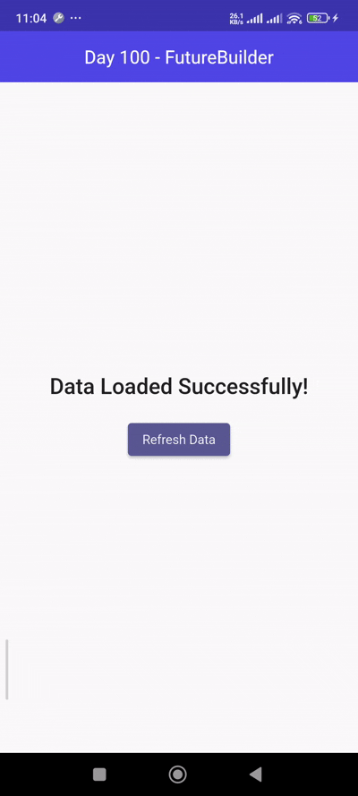
        </a> 
        <a href="lib/features/widgets_of_the_day/day_100_future_builder/day100_future_builder_widget.dart">
          <b>FutureBuilder</b>
        </a> 
        Async data
      </td>
      <td align="center" style="width:150px">
        <a href="screenshots/day101_stream_builder.gif">
          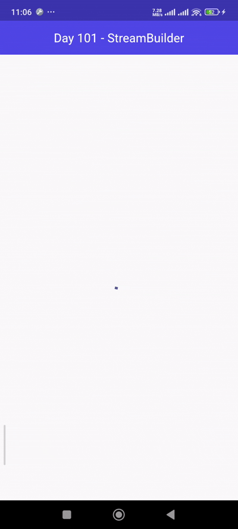
        </a> 
        <a href="lib/features/widgets_of_the_day/day_101_stream_builder/day101_stream_builder_widget.dart">
          <b>StreamBuilder</b>
        </a> 
        Real-time
      </td>
      <td align="center" style="width:150px">
        <a href="screenshots/day102_change_notifier.gif">
          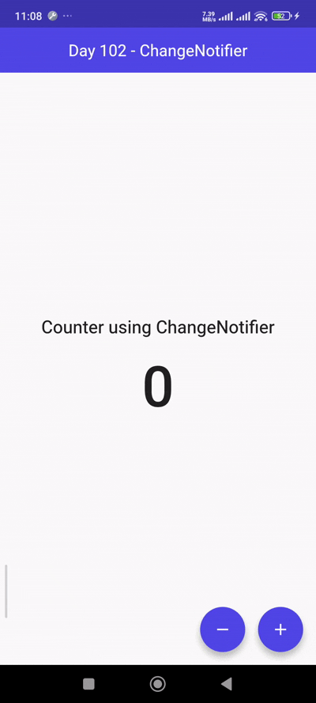
        </a> 
        <a href="lib/features/widgets_of_the_day/day_102_change_notifier/day102_change_notifier_widget.dart">
          <b>ChangeNotifier</b>
        </a> 
        State mgmt
      </td>
      <td align="center" style="width:150px">
        <a href="screenshots/day103_value_notifier.gif">
          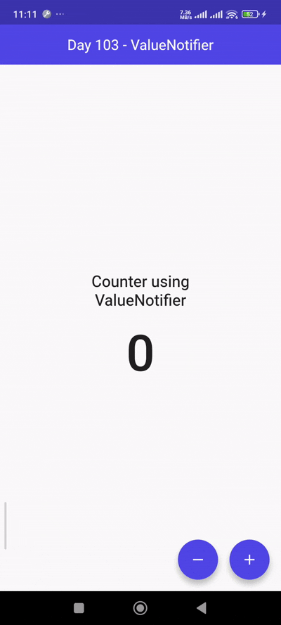
        </a> 
        <a href="lib/features/widgets_of_the_day/day_103_value_notifier/day103_value_notifier_widget.dart">
          <b>ValueNotifier</b>
        </a> 
        Reactive
      </td>
      <td align="center" style="width:150px">
        <a href="screenshots/day104_inherited_notifier.gif">
          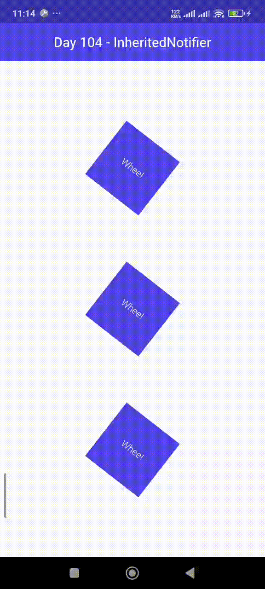
        </a> 
        <a href="lib/features/widgets_of_the_day/day_104_inherited_notifier/day104_inherited_notifier_widget.dart">
          <b>InheritNotify</b>
        </a> 
        Reactive
      </td>
    </tr>
  </tbody>
</table>

<table>
  <thead>
    <tr>
      <th style="width:150px"><b>Day 105</b></th>
      <th style="width:150px"><b>Day 106</b></th>
      <th style="width:150px"><b>Day 107</b></th>
      <th style="width:150px"><b>Day 108</b></th>
      <th style="width:150px"><b>Day 109</b></th>
    </tr>
  </thead>
  <tbody>
    <tr>
      <td align="center" style="width:150px">
        <a href="screenshots/day105_listener.gif">
          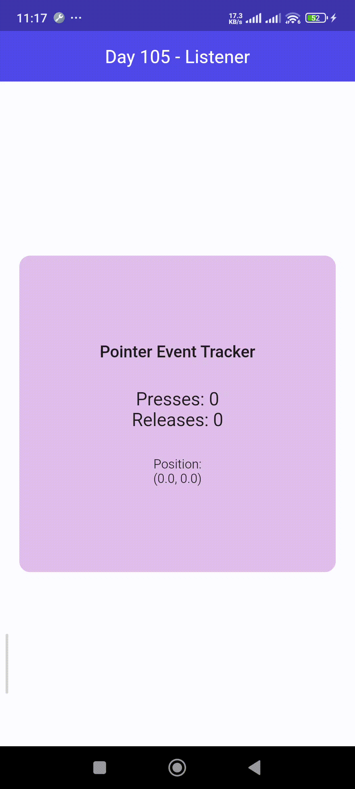
        </a> 
        <a href="lib/features/widgets_of_the_day/day_105_listener/day105_listener_widget.dart">
          <b>Listener</b>
        </a> 
        Pointer
      </td>
      <td align="center" style="width:150px">
        <a href="screenshots/day106_builder.gif">
          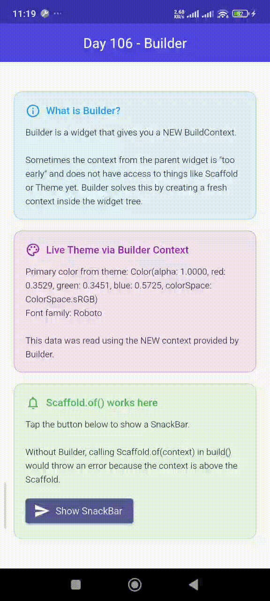
        </a> 
        <a href="lib/features/widgets_of_the_day/day106_builder/day106_builder_widget.dart">
          <b>Builder</b>
        </a> 
        Context
      </td>
      <td align="center" style="width:150px">
        <a href="screenshots/day107_page_view_builder.gif">
          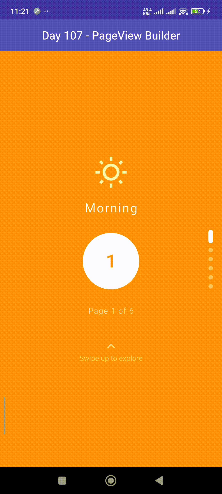
        </a> 
        <a href="lib/features/widgets_of_the_day/day_107_page_view_builder/day107_page_view_builder_widget.dart">
          <b>PageView.bldr</b>
        </a> 
        Lazy pages
      </td>
      <td align="center" style="width:150px">
        <a href="screenshots/day108_animated_builder.gif">
          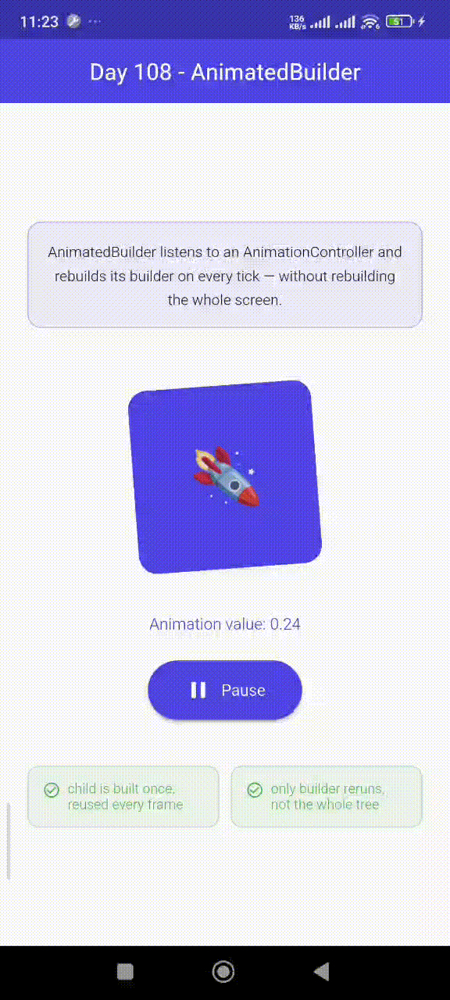
        </a> 
        <a href="lib/features/widgets_of_the_day/day_108_animated_builder/day108_animated_builder_widget.dart">
          <b>AnimBuilder</b>
        </a> 
        Optimized
      </td>
      <td align="center" style="width:150px">
        <a href="screenshots/day109_snackbar.gif">
          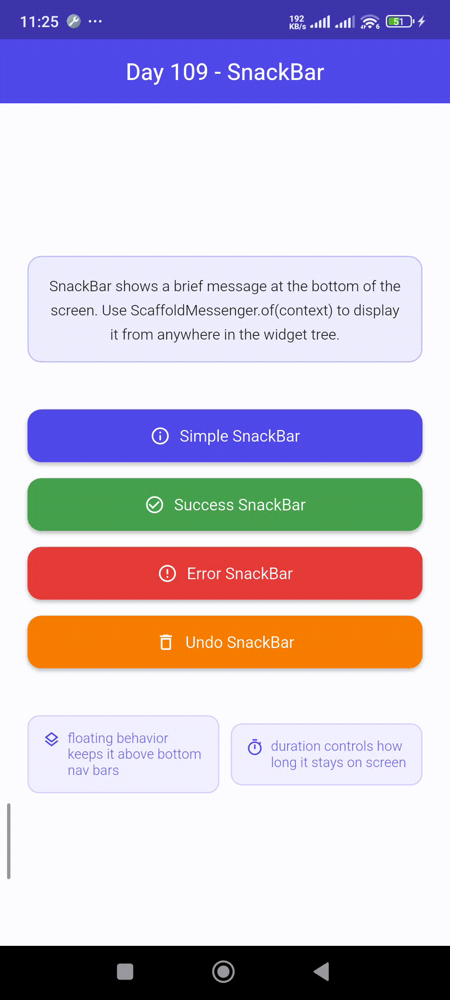
        </a> 
        <a href="lib/features/widgets_of_the_day/day_109_snackbar/day109_snackbar_widget.dart">
          <b>SnackBar</b>
        </a> 
        Alerts
      </td>
    </tr>
  </tbody>
</table>

<table>
  <thead>
    <tr>
      <th style="width:150px"><b>Day 110</b></th>
      <th style="width:150px"><b>Day 111</b></th>
      <th style="width:150px"><b>Day 112</b></th>
      <th style="width:150px"><b>Day 113</b></th>
      <th style="width:150px"><b>Day 114</b></th>
    </tr>
  </thead>
  <tbody>
    <tr>
      <td align="center" style="width:150px">
        <a href="screenshots/day110_sizedbox.gif">
          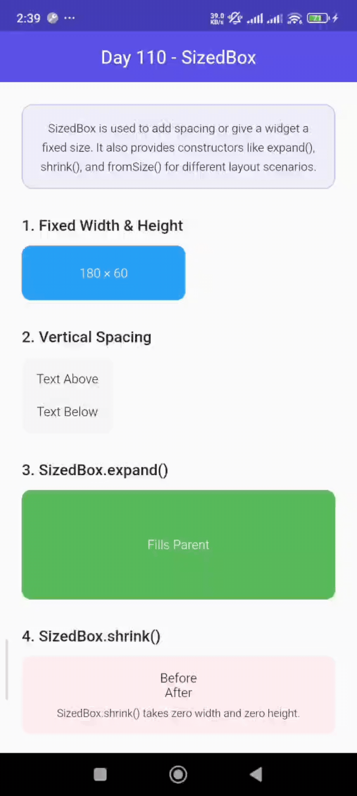
        </a> 
        <a href="lib/features/widgets_of_the_day/day_110_sizedbox/day110_sizedbox_widget.dart">
          <b>SizedBox</b>
        </a> 
        Fixed size
      </td>
      <td align="center" style="width:150px">
        <a href="screenshots/day111_intrinsicheight_and_intrinsicwidth.gif">
          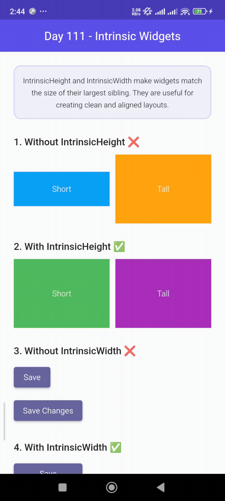
        </a> 
        <a href="lib/features/widgets_of_the_day/day_111_intrinsicheight_and_intrinsicwidth/day111_intrinsicheight_and_intrinsicwidth_widget.dart">
          <b>Intrinsic</b>
        </a> 
        Natural size
      </td>
      <td align="center" style="width:150px">
        <a href="screenshots/day112_overflowbox.gif">
          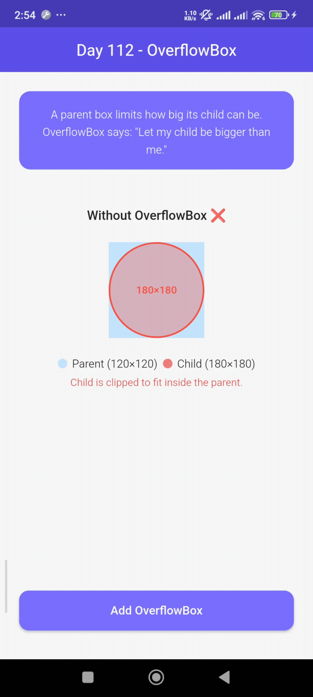
        </a> 
        <a href="lib/features/widgets_of_the_day/day_112_overflowbox/day112_overflowbox_widget.dart">
          <b>OverflowBox</b>
        </a> 
        Overflow
      </td>
      <td align="center" style="width:150px">
        <a href="screenshots/day113_unconstrained_box.gif">
          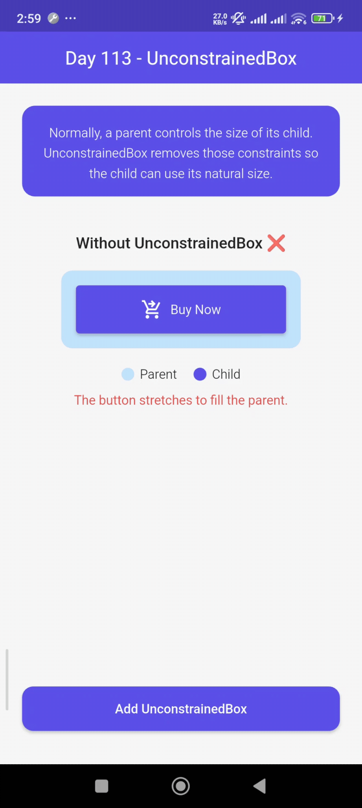
        </a> 
        <a href="lib/features/widgets_of_the_day/day_113_unconstrained_box/day113_unconstrained_box_widget.dart">
          <b>Unconstrained</b>
        </a> 
        No limits
      </td>
      <td align="center" style="width:150px">
        <a href="screenshots/day114_limited_box.gif">
          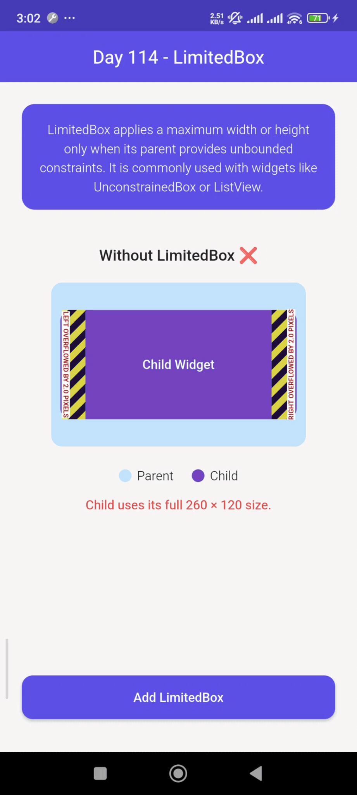
        </a> 
        <a href="lib/features/widgets_of_the_day/day_114_limited_box/day114_limited_box_widget.dart">
          <b>LimitedBox</b>
        </a> 
        Max limits
      </td>
    </tr>
  </tbody>
</table>

<table>
  <thead>
    <tr>
      <th style="width:150px"><b>Day 115</b></th>
      <th style="width:150px"><b>Day 116</b></th>
      <th style="width:150px"><b>Day 117</b></th>
      <th style="width:150px"><b>Day 118</b></th>
      <th style="width:150px"><b>Day 119</b></th>
    </tr>
  </thead>
  <tbody>
    <tr>
      <td align="center" style="width:150px">
        <a href="screenshots/day115_baseline.gif">
          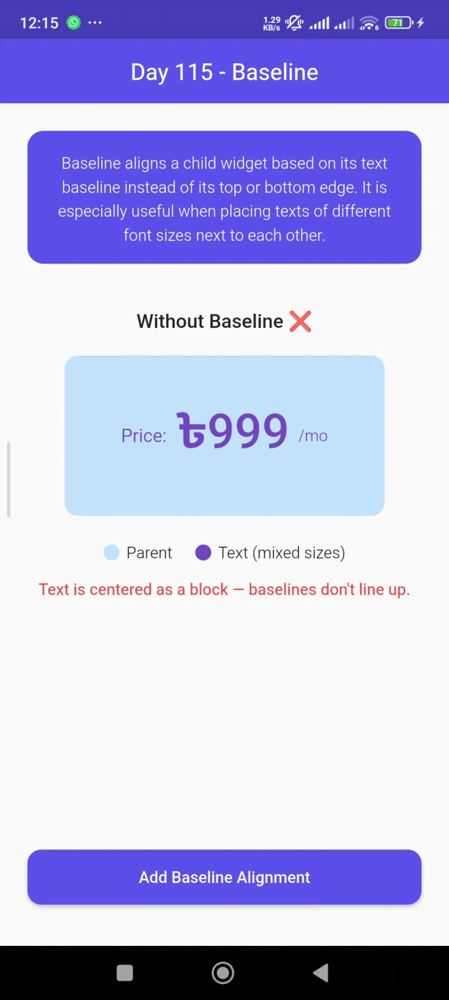
        </a> 
        <a href="lib/features/widgets_of_the_day/day_115_baseline/day115_baseline_widget.dart">
          <b>Baseline</b>
        </a> 
        Text align
      </td>
      <td align="center" style="width:150px">
        <a href="screenshots/day116_opacity.gif">
          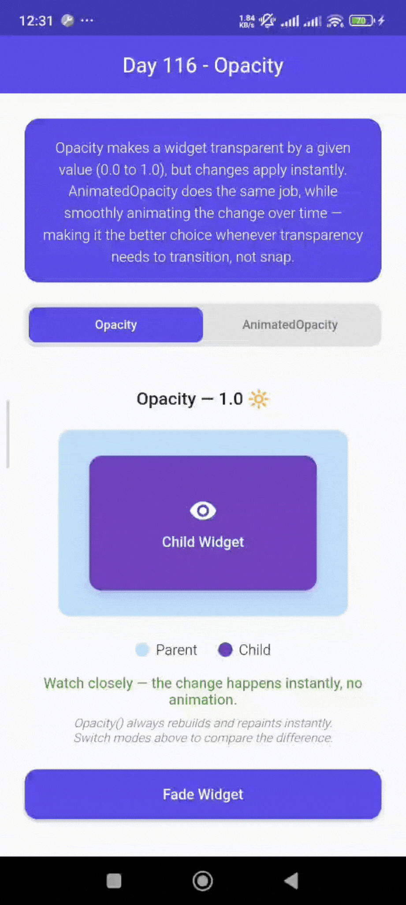
        </a> 
        <a href="lib/features/widgets_of_the_day/day_116_opacity/day116_opacity_widget.dart">
          <b>Opacity</b>
        </a> 
        Transparency
      </td>
      <td align="center" style="width:150px">
        <a href="screenshots/day117_color_filtered.gif">
          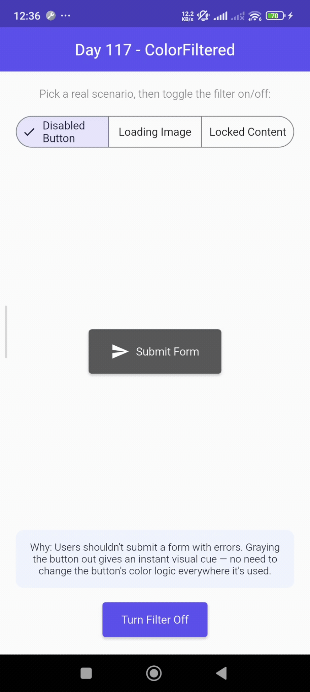
        </a> 
        <a href="lib/features/widgets_of_the_day/day_117_color_filtered/day117_color_filtered_widget.dart">
          <b>ColorFiltered</b>
        </a> 
        Color effects
      </td>
      <td align="center" style="width:150px">
        <a href="screenshots/day118_shadder_mask.gif">
          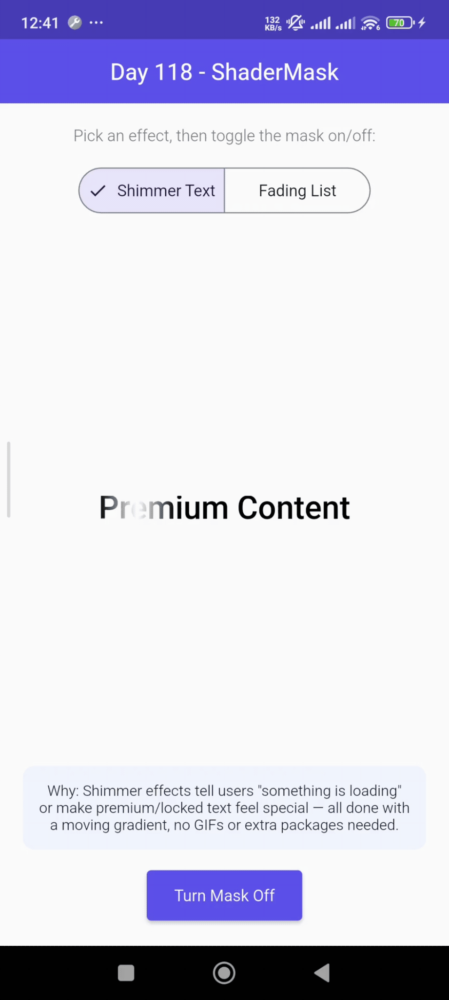
        </a> 
        <a href="lib/features/widgets_of_the_day/day_118_shadder_mask/day118_shadder_mask_widget.dart">
          <b>ShaderMask</b>
        </a> 
        Gradient mask
      </td>
      <td align="center" style="width:150px">
        <a href="screenshots/day119_decorated_box.gif">
          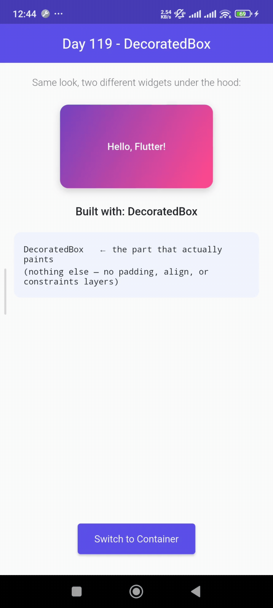
        </a> 
        <a href="lib/features/widgets_of_the_day/day_119_decorated_box/day119_decorated_box_widget.dart">
          <b>DecoratedBox</b>
        </a> 
        Box styling
      </td>
    </tr>
  </tbody>
</table>

---

  📁 Each widget links directly to its source file &nbsp;·&nbsp; Built with ❤️ using Flutter

## 🚀 Goal

To build strong and practical Flutter UI fundamentals by practicing one widget at a time and understanding how real UI layouts are structured in production apps.

---

## 🛠️ Tech Stack

- Flutter
- Dart

---

## 📌 Note

This project is purely for learning and practice purposes.  
Each widget is implemented separately to ensure clarity, focus, and better understanding.

---

## ⭐ Future Improvements

- Add animations for each widget
- Convert widgets into reusable components
- Build mini real-world screens using learned widgets
- Add dark mode UI versions
- Improve UI consistency across all examples