<div align="center">

# 📱 Widget of the Day

### A hands-on Flutter practice project — one widget, mastered every day

Building strong Flutter UI fundamentals by implementing **152+ widgets** through small, focused, real-world examples.

[](https://flutter.dev)
[](https://dart.dev)
[](#-widget-gallery)
[](LICENSE)

<sub>📁 Every widget links directly to its source file &nbsp;·&nbsp; 🖼️ Screenshots optimized with WebP &nbsp;·&nbsp; 🎯 Beginner-friendly, one concept at a time</sub>

</div>

---

## 📖 About the Project

**Widget of the Day** is a learning-focused Flutter project where every widget is explored through a small, practical UI example — instead of theory-heavy learning, this project is built entirely around *learning by building*.

The goal is to deeply understand Flutter's layout system, widget behavior, and UI composition, one focused implementation at a time.

**🎯 This project is a great fit for:**

| Audience | Why it helps |
|---|---|
| 🌱 Flutter beginners | See every core widget used in a real, minimal UI — no theory overload |
| 🔁 Developers revising fundamentals | Quickly jump to any widget's source and refresh how it works |
| 🛠️ Hands-on learners | Copy, run, and tweak each example directly |
| 💼 Interview preparation | Covers the exact widgets that come up in Flutter fundamentals interviews |

---

## 🧭 Table of Contents

- [About the Project](#-about-the-project)
- [Widget Gallery](#-widget-gallery-153-widgets)
- [Widget Reference (Full Notes)](#-widget-reference--what-each-day-covers)
- [Tech Stack](#-tech-stack)
- [Getting Started](#-getting-started)
- [Project Structure](#-project-structure)
- [Future Improvements](#-future-improvements)
- [Contributing](#-contributing)
- [Note](#-note)

---

## 🚀 Goal

To build strong and practical Flutter UI fundamentals by practicing **one widget at a time**, and to understand how real UI layouts are structured in production apps — from simple `Container`s all the way to slivers, custom painters, and platform-adaptive widgets.

---

## 🗓️ Widget Gallery (153+ Widgets)

A visual, professional gallery covering the entire Flutter widget catalog. Each card links straight to its source file, so you can go from screenshot to code in one click.

> 💡 **Tip:** Tables below are fixed-width and wrap long widget names automatically, so every column stays evenly sized no matter how long a widget's name is.

<table width="100%" style="table-layout:fixed; border-collapse:separate; border-spacing:8px;">
  <thead><tr>
    <th align="center" style="width:20%; font-size:11px; color:#0969da; border-bottom:2px solid #0969da; padding:4px; text-align:center; white-space:nowrap;">Day 001</th>
    <th align="center" style="width:20%; font-size:11px; color:#0969da; border-bottom:2px solid #0969da; padding:4px; text-align:center; white-space:nowrap;">Day 002</th>
    <th align="center" style="width:20%; font-size:11px; color:#0969da; border-bottom:2px solid #0969da; padding:4px; text-align:center; white-space:nowrap;">Day 003</th>
    <th align="center" style="width:20%; font-size:11px; color:#0969da; border-bottom:2px solid #0969da; padding:4px; text-align:center; white-space:nowrap;">Day 003</th>
    <th align="center" style="width:20%; font-size:11px; color:#0969da; border-bottom:2px solid #0969da; padding:4px; text-align:center; white-space:nowrap;">Day 004</th>
  </tr></thead>
  <tbody><tr>
    <td align="center" valign="top" style="width:20%; padding:6px; text-align:center; vertical-align:top; word-break:break-word; overflow-wrap:break-word;">
      <a href="screenshots/day01_container.webp">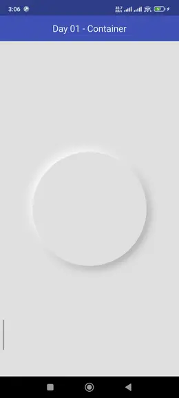</a><br/>
      <a href="lib/features/widgets_of_the_day/day_01_container/day01_container_widget.dart"><b style="font-size:13px; display:inline-block; max-width:120px; word-break:break-word;">Container</b></a><br/>
      <sub style="font-size:11px; color:#57606a;">Day 001 &middot; Basic box</sub>
    </td>
    <td align="center" valign="top" style="width:20%; padding:6px; text-align:center; vertical-align:top; word-break:break-word; overflow-wrap:break-word;">
      <a href="screenshots/day02_expanded.webp">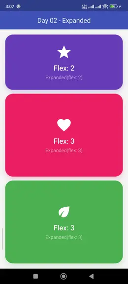</a><br/>
      <a href="lib/features/widgets_of_the_day/day_02_expanded/day02_expanded_widget.dart"><b style="font-size:13px; display:inline-block; max-width:120px; word-break:break-word;">Expanded</b></a><br/>
      <sub style="font-size:11px; color:#57606a;">Day 002 &middot; Fill space</sub>
    </td>
    <td align="center" valign="top" style="width:20%; padding:6px; text-align:center; vertical-align:top; word-break:break-word; overflow-wrap:break-word;">
      <a href="screenshots/day03_column.webp">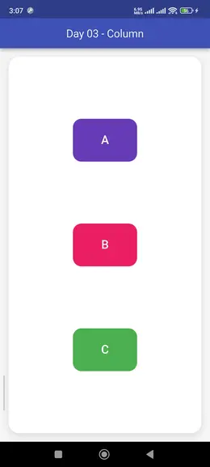</a><br/>
      <a href="lib/features/widgets_of_the_day/day_03_column%26row/day03_column_widget.dart"><b style="font-size:13px; display:inline-block; max-width:120px; word-break:break-word;">Column</b></a><br/>
      <sub style="font-size:11px; color:#57606a;">Day 003 &middot; Vertical</sub>
    </td>
    <td align="center" valign="top" style="width:20%; padding:6px; text-align:center; vertical-align:top; word-break:break-word; overflow-wrap:break-word;">
      <a href="screenshots/day03_row.webp">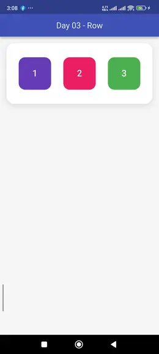</a><br/>
      <a href="lib/features/widgets_of_the_day/day_03_column%26row/day03_row_widget.dart"><b style="font-size:13px; display:inline-block; max-width:120px; word-break:break-word;">Row</b></a><br/>
      <sub style="font-size:11px; color:#57606a;">Day 003 &middot; Horizontal</sub>
    </td>
    <td align="center" valign="top" style="width:20%; padding:6px; text-align:center; vertical-align:top; word-break:break-word; overflow-wrap:break-word;">
      <a href="screenshots/day04_listview.webp">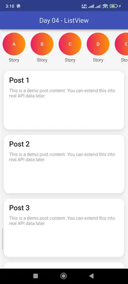</a><br/>
      <a href="lib/features/widgets_of_the_day/day_04_listview/day04_listview_widget.dart"><b style="font-size:13px; display:inline-block; max-width:120px; word-break:break-word;">ListView</b></a><br/>
      <sub style="font-size:11px; color:#57606a;">Day 004 &middot; Scroll list</sub>
    </td>
  </tr></tbody>
</table>

<table width="100%" style="table-layout:fixed; border-collapse:separate; border-spacing:8px;">
  <thead><tr>
    <th align="center" style="width:20%; font-size:11px; color:#0969da; border-bottom:2px solid #0969da; padding:4px; text-align:center; white-space:nowrap;">Day 005</th>
    <th align="center" style="width:20%; font-size:11px; color:#0969da; border-bottom:2px solid #0969da; padding:4px; text-align:center; white-space:nowrap;">Day 006</th>
    <th align="center" style="width:20%; font-size:11px; color:#0969da; border-bottom:2px solid #0969da; padding:4px; text-align:center; white-space:nowrap;">Day 007</th>
    <th align="center" style="width:20%; font-size:11px; color:#0969da; border-bottom:2px solid #0969da; padding:4px; text-align:center; white-space:nowrap;">Day 008</th>
    <th align="center" style="width:20%; font-size:11px; color:#0969da; border-bottom:2px solid #0969da; padding:4px; text-align:center; white-space:nowrap;">Day 009</th>
  </tr></thead>
  <tbody><tr>
    <td align="center" valign="top" style="width:20%; padding:6px; text-align:center; vertical-align:top; word-break:break-word; overflow-wrap:break-word;">
      <a href="screenshots/day05_cliprrect.webp">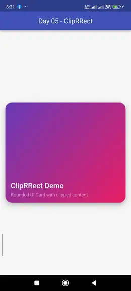</a><br/>
      <a href="lib/features/widgets_of_the_day/day_05_cliprrect/day05_cliprrect_widget.dart"><b style="font-size:13px; display:inline-block; max-width:120px; word-break:break-word;">ClipRRect</b></a><br/>
      <sub style="font-size:11px; color:#57606a;">Day 005 &middot; Round clip</sub>
    </td>
    <td align="center" valign="top" style="width:20%; padding:6px; text-align:center; vertical-align:top; word-break:break-word; overflow-wrap:break-word;">
      <a href="screenshots/day06_image.asset.webp">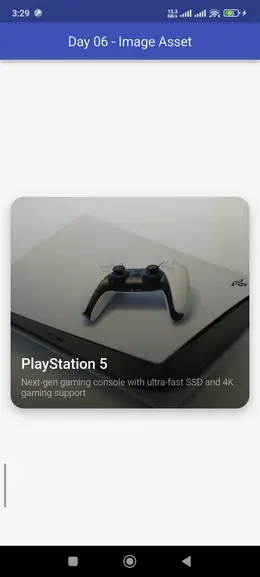</a><br/>
      <a href="lib/features/widgets_of_the_day/day_06_image.asset/day06_image.asset_widget.dart"><b style="font-size:13px; display:inline-block; max-width:120px; word-break:break-word;">Image.asset</b></a><br/>
      <sub style="font-size:11px; color:#57606a;">Day 006 &middot; Assets</sub>
    </td>
    <td align="center" valign="top" style="width:20%; padding:6px; text-align:center; vertical-align:top; word-break:break-word; overflow-wrap:break-word;">
      <a href="screenshots/day07_gridview.webp">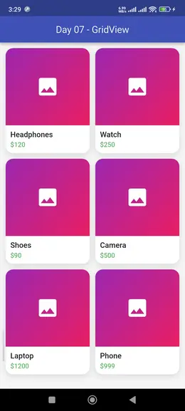</a><br/>
      <a href="lib/features/widgets_of_the_day/day_07_gridview/day07_gridview_widget.dart"><b style="font-size:13px; display:inline-block; max-width:120px; word-break:break-word;">GridView</b></a><br/>
      <sub style="font-size:11px; color:#57606a;">Day 007 &middot; Grid scroll</sub>
    </td>
    <td align="center" valign="top" style="width:20%; padding:6px; text-align:center; vertical-align:top; word-break:break-word; overflow-wrap:break-word;">
      <a href="screenshots/day08_gesturedetector.webp"></a><br/>
      <a href="lib/features/widgets_of_the_day/day_08_gesturedetector/day08_gesturedetector_widget.dart"><b style="font-size:13px; display:inline-block; max-width:120px; word-break:break-word;">Gesture</b></a><br/>
      <sub style="font-size:11px; color:#57606a;">Day 008 &middot; Tap detection</sub>
    </td>
    <td align="center" valign="top" style="width:20%; padding:6px; text-align:center; vertical-align:top; word-break:break-word; overflow-wrap:break-word;">
      <a href="screenshots/day09_bottom_navbar.webp"></a><br/>
      <a href="lib/features/widgets_of_the_day/day_09_bottom_navbar/day09_bottom_navbar_widget.dart"><b style="font-size:13px; display:inline-block; max-width:120px; word-break:break-word;">BottomNav</b></a><br/>
      <sub style="font-size:11px; color:#57606a;">Day 009 &middot; Nav bar</sub>
    </td>
  </tr></tbody>
</table>

<table width="100%" style="table-layout:fixed; border-collapse:separate; border-spacing:8px;">
  <thead><tr>
    <th align="center" style="width:20%; font-size:11px; color:#0969da; border-bottom:2px solid #0969da; padding:4px; text-align:center; white-space:nowrap;">Day 010</th>
    <th align="center" style="width:20%; font-size:11px; color:#0969da; border-bottom:2px solid #0969da; padding:4px; text-align:center; white-space:nowrap;">Day 011</th>
    <th align="center" style="width:20%; font-size:11px; color:#0969da; border-bottom:2px solid #0969da; padding:4px; text-align:center; white-space:nowrap;">Day 012</th>
    <th align="center" style="width:20%; font-size:11px; color:#0969da; border-bottom:2px solid #0969da; padding:4px; text-align:center; white-space:nowrap;">Day 013</th>
    <th align="center" style="width:20%; font-size:11px; color:#0969da; border-bottom:2px solid #0969da; padding:4px; text-align:center; white-space:nowrap;">Day 014</th>
  </tr></thead>
  <tbody><tr>
    <td align="center" valign="top" style="width:20%; padding:6px; text-align:center; vertical-align:top; word-break:break-word; overflow-wrap:break-word;">
      <a href="screenshots/day10_appbar.webp"></a><br/>
      <a href="lib/features/widgets_of_the_day/day_10_appbar/day10_appbar_widget.dart"><b style="font-size:13px; display:inline-block; max-width:120px; word-break:break-word;">AppBar</b></a><br/>
      <sub style="font-size:11px; color:#57606a;">Day 010 &middot; Top bar</sub>
    </td>
    <td align="center" valign="top" style="width:20%; padding:6px; text-align:center; vertical-align:top; word-break:break-word; overflow-wrap:break-word;">
      <a href="screenshots/day11_drawer.webp"></a><br/>
      <a href="lib/features/widgets_of_the_day/day_11_drawer/day11_drawer_widget.dart"><b style="font-size:13px; display:inline-block; max-width:120px; word-break:break-word;">Drawer</b></a><br/>
      <sub style="font-size:11px; color:#57606a;">Day 011 &middot; Side menu</sub>
    </td>
    <td align="center" valign="top" style="width:20%; padding:6px; text-align:center; vertical-align:top; word-break:break-word; overflow-wrap:break-word;">
      <a href="screenshots/day12_sliver_appbar.webp">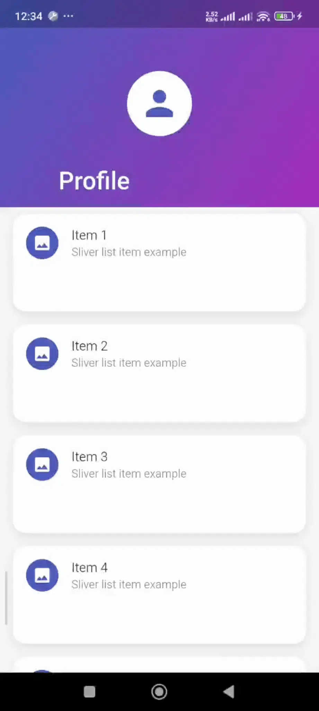</a><br/>
      <a href="lib/features/widgets_of_the_day/day_12_sliver_appbar/day12_sliver_appbar_widget.dart"><b style="font-size:13px; display:inline-block; max-width:120px; word-break:break-word;">SliverAppBar</b></a><br/>
      <sub style="font-size:11px; color:#57606a;">Day 012 &middot; Collapsible</sub>
    </td>
    <td align="center" valign="top" style="width:20%; padding:6px; text-align:center; vertical-align:top; word-break:break-word; overflow-wrap:break-word;">
      <a href="screenshots/day13_tabbar.webp">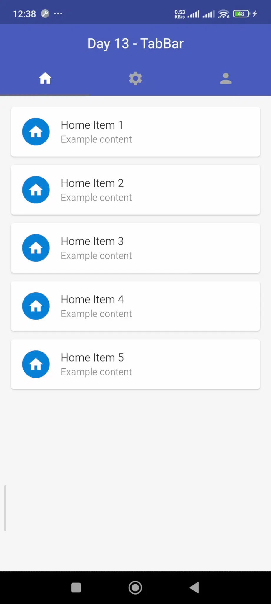</a><br/>
      <a href="lib/features/widgets_of_the_day/day_13_tabbar/day13_tabbar_widget.dart"><b style="font-size:13px; display:inline-block; max-width:120px; word-break:break-word;">TabBar</b></a><br/>
      <sub style="font-size:11px; color:#57606a;">Day 013 &middot; Tabs</sub>
    </td>
    <td align="center" valign="top" style="width:20%; padding:6px; text-align:center; vertical-align:top; word-break:break-word; overflow-wrap:break-word;">
      <a href="screenshots/day14_animated_container.webp">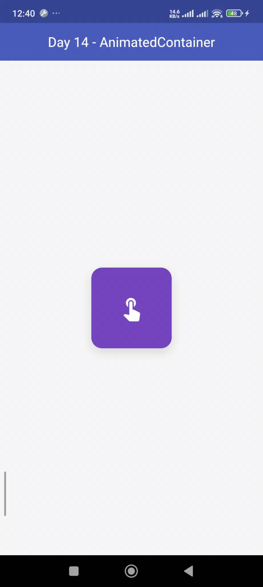</a><br/>
      <a href="lib/features/widgets_of_the_day/day_14_animated_container/day14_animated_container_widget.dart"><b style="font-size:13px; display:inline-block; max-width:120px; word-break:break-word;">AnimCont</b></a><br/>
      <sub style="font-size:11px; color:#57606a;">Day 014 &middot; Implicit anim</sub>
    </td>
  </tr></tbody>
</table>

<table width="100%" style="table-layout:fixed; border-collapse:separate; border-spacing:8px;">
  <thead><tr>
    <th align="center" style="width:20%; font-size:11px; color:#0969da; border-bottom:2px solid #0969da; padding:4px; text-align:center; white-space:nowrap;">Day 015</th>
    <th align="center" style="width:20%; font-size:11px; color:#0969da; border-bottom:2px solid #0969da; padding:4px; text-align:center; white-space:nowrap;">Day 016</th>
    <th align="center" style="width:20%; font-size:11px; color:#0969da; border-bottom:2px solid #0969da; padding:4px; text-align:center; white-space:nowrap;">Day 017</th>
    <th align="center" style="width:20%; font-size:11px; color:#0969da; border-bottom:2px solid #0969da; padding:4px; text-align:center; white-space:nowrap;">Day 018</th>
    <th align="center" style="width:20%; font-size:11px; color:#0969da; border-bottom:2px solid #0969da; padding:4px; text-align:center; white-space:nowrap;">Day 019</th>
  </tr></thead>
  <tbody><tr>
    <td align="center" valign="top" style="width:20%; padding:6px; text-align:center; vertical-align:top; word-break:break-word; overflow-wrap:break-word;">
      <a href="screenshots/day15_media_query.webp">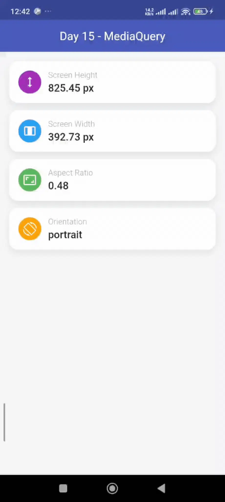</a><br/>
      <a href="lib/features/widgets_of_the_day/day_15_media_query/day15_media_query_widget.dart"><b style="font-size:13px; display:inline-block; max-width:120px; word-break:break-word;">MediaQuery</b></a><br/>
      <sub style="font-size:11px; color:#57606a;">Day 015 &middot; Responsive</sub>
    </td>
    <td align="center" valign="top" style="width:20%; padding:6px; text-align:center; vertical-align:top; word-break:break-word; overflow-wrap:break-word;">
      <a href="screenshots/day16_alert_dialog.webp">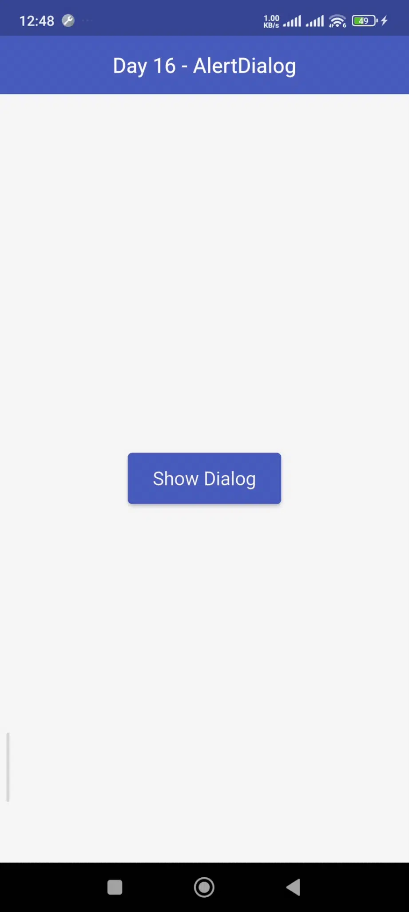</a><br/>
      <a href="lib/features/widgets_of_the_day/day_16_alert_dialog/day16_alert_dialog_widget.dart"><b style="font-size:13px; display:inline-block; max-width:120px; word-break:break-word;">AlertDialog</b></a><br/>
      <sub style="font-size:11px; color:#57606a;">Day 016 &middot; Popup</sub>
    </td>
    <td align="center" valign="top" style="width:20%; padding:6px; text-align:center; vertical-align:top; word-break:break-word; overflow-wrap:break-word;">
      <a href="screenshots/day17_text_and_textstyle.webp">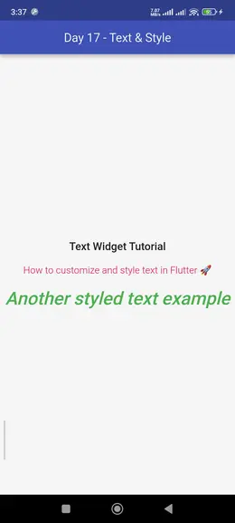</a><br/>
      <a href="lib/features/widgets_of_the_day/day_17_text_and_textstyle/day17_text_style_widget.dart"><b style="font-size:13px; display:inline-block; max-width:120px; word-break:break-word;">Text</b></a><br/>
      <sub style="font-size:11px; color:#57606a;">Day 017 &middot; Styling</sub>
    </td>
    <td align="center" valign="top" style="width:20%; padding:6px; text-align:center; vertical-align:top; word-break:break-word; overflow-wrap:break-word;">
      <a href="screenshots/day18_rich_text.webp"></a><br/>
      <a href="lib/features/widgets_of_the_day/day_18_rich_text/day18_rich_text_widget.dart"><b style="font-size:13px; display:inline-block; max-width:120px; word-break:break-word;">RichText</b></a><br/>
      <sub style="font-size:11px; color:#57606a;">Day 018 &middot; Mixed styles</sub>
    </td>
    <td align="center" valign="top" style="width:20%; padding:6px; text-align:center; vertical-align:top; word-break:break-word; overflow-wrap:break-word;">
      <a href="screenshots/day19_timer.webp">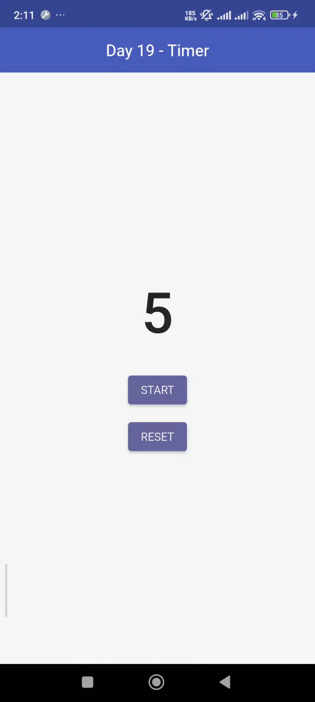</a><br/>
      <a href="lib/features/widgets_of_the_day/day_19_timer/day19_timer_widget.dart"><b style="font-size:13px; display:inline-block; max-width:120px; word-break:break-word;">Timer</b></a><br/>
      <sub style="font-size:11px; color:#57606a;">Day 019 &middot; Async events</sub>
    </td>
  </tr></tbody>
</table>

<table width="100%" style="table-layout:fixed; border-collapse:separate; border-spacing:8px;">
  <thead><tr>
    <th align="center" style="width:20%; font-size:11px; color:#0969da; border-bottom:2px solid #0969da; padding:4px; text-align:center; white-space:nowrap;">Day 020</th>
    <th align="center" style="width:20%; font-size:11px; color:#0969da; border-bottom:2px solid #0969da; padding:4px; text-align:center; white-space:nowrap;">Day 021</th>
    <th align="center" style="width:20%; font-size:11px; color:#0969da; border-bottom:2px solid #0969da; padding:4px; text-align:center; white-space:nowrap;">Day 022</th>
    <th align="center" style="width:20%; font-size:11px; color:#0969da; border-bottom:2px solid #0969da; padding:4px; text-align:center; white-space:nowrap;">Day 023</th>
    <th align="center" style="width:20%; font-size:11px; color:#0969da; border-bottom:2px solid #0969da; padding:4px; text-align:center; white-space:nowrap;">Day 024</th>
  </tr></thead>
  <tbody><tr>
    <td align="center" valign="top" style="width:20%; padding:6px; text-align:center; vertical-align:top; word-break:break-word; overflow-wrap:break-word;">
      <a href="screenshots/day20_pageview.webp">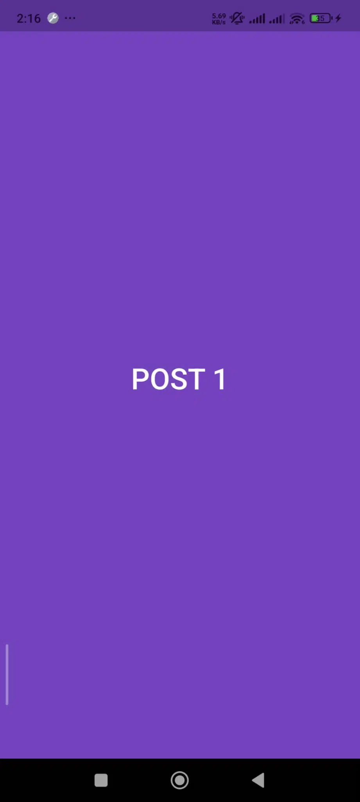</a><br/>
      <a href="lib/features/widgets_of_the_day/day_20_pageview/day20_pageview_widget.dart"><b style="font-size:13px; display:inline-block; max-width:120px; word-break:break-word;">PageView</b></a><br/>
      <sub style="font-size:11px; color:#57606a;">Day 020 &middot; Swipe pages</sub>
    </td>
    <td align="center" valign="top" style="width:20%; padding:6px; text-align:center; vertical-align:top; word-break:break-word; overflow-wrap:break-word;">
      <a href="screenshots/day21_stack.webp"></a><br/>
      <a href="lib/features/widgets_of_the_day/day_21_stack/day21_stack_widget.dart"><b style="font-size:13px; display:inline-block; max-width:120px; word-break:break-word;">Stack</b></a><br/>
      <sub style="font-size:11px; color:#57606a;">Day 021 &middot; Layers</sub>
    </td>
    <td align="center" valign="top" style="width:20%; padding:6px; text-align:center; vertical-align:top; word-break:break-word; overflow-wrap:break-word;">
      <a href="screenshots/day22_textfield.webp"></a><br/>
      <a href="lib/features/widgets_of_the_day/day_22_textfield/day22_textfield_widget.dart"><b style="font-size:13px; display:inline-block; max-width:120px; word-break:break-word;">TextField</b></a><br/>
      <sub style="font-size:11px; color:#57606a;">Day 022 &middot; Input</sub>
    </td>
    <td align="center" valign="top" style="width:20%; padding:6px; text-align:center; vertical-align:top; word-break:break-word; overflow-wrap:break-word;">
      <a href="screenshots/day23_animated_icon.webp">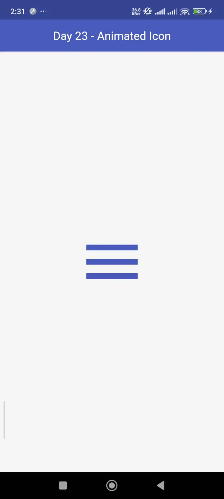</a><br/>
      <a href="lib/features/widgets_of_the_day/day_23_animated_icon/day23_animated_icon_widget.dart"><b style="font-size:13px; display:inline-block; max-width:120px; word-break:break-word;">AnimIcon</b></a><br/>
      <sub style="font-size:11px; color:#57606a;">Day 023 &middot; Transition</sub>
    </td>
    <td align="center" valign="top" style="width:20%; padding:6px; text-align:center; vertical-align:top; word-break:break-word; overflow-wrap:break-word;">
      <a href="screenshots/day24_slider.webp">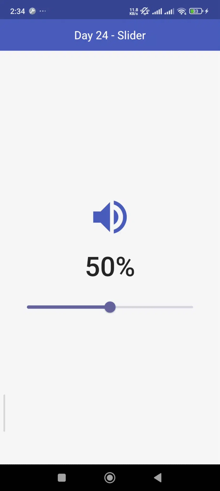</a><br/>
      <a href="lib/features/widgets_of_the_day/day_24_slider/day24_slider_widget.dart"><b style="font-size:13px; display:inline-block; max-width:120px; word-break:break-word;">Slider</b></a><br/>
      <sub style="font-size:11px; color:#57606a;">Day 024 &middot; Selection</sub>
    </td>
  </tr></tbody>
</table>

<table width="100%" style="table-layout:fixed; border-collapse:separate; border-spacing:8px;">
  <thead><tr>
    <th align="center" style="width:20%; font-size:11px; color:#0969da; border-bottom:2px solid #0969da; padding:4px; text-align:center; white-space:nowrap;">Day 025</th>
    <th align="center" style="width:20%; font-size:11px; color:#0969da; border-bottom:2px solid #0969da; padding:4px; text-align:center; white-space:nowrap;">Day 026</th>
    <th align="center" style="width:20%; font-size:11px; color:#0969da; border-bottom:2px solid #0969da; padding:4px; text-align:center; white-space:nowrap;">Day 027</th>
    <th align="center" style="width:20%; font-size:11px; color:#0969da; border-bottom:2px solid #0969da; padding:4px; text-align:center; white-space:nowrap;">Day 028</th>
    <th align="center" style="width:20%; font-size:11px; color:#0969da; border-bottom:2px solid #0969da; padding:4px; text-align:center; white-space:nowrap;">Day 029</th>
  </tr></thead>
  <tbody><tr>
    <td align="center" valign="top" style="width:20%; padding:6px; text-align:center; vertical-align:top; word-break:break-word; overflow-wrap:break-word;">
      <a href="screenshots/day25_date_picker.webp">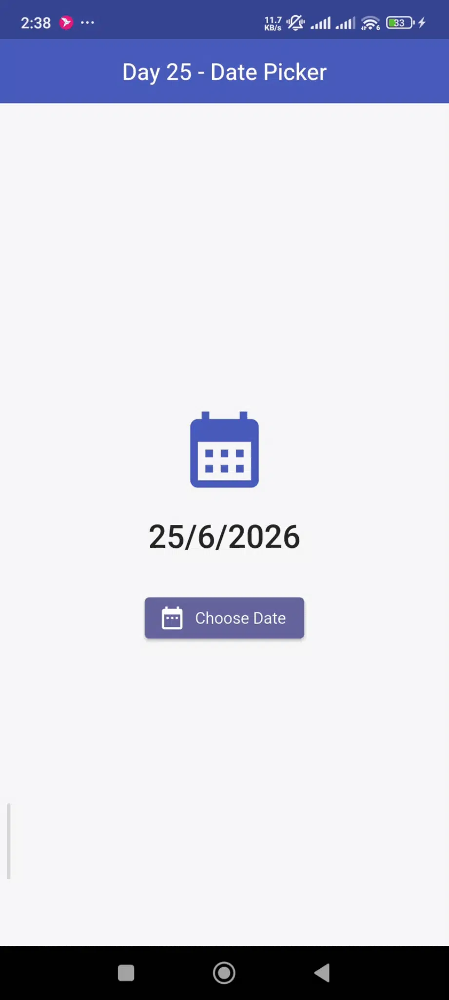</a><br/>
      <a href="lib/features/widgets_of_the_day/day_25_date_picker/day25_date_picker_widget.dart"><b style="font-size:13px; display:inline-block; max-width:120px; word-break:break-word;">DatePicker</b></a><br/>
      <sub style="font-size:11px; color:#57606a;">Day 025 &middot; Calendar</sub>
    </td>
    <td align="center" valign="top" style="width:20%; padding:6px; text-align:center; vertical-align:top; word-break:break-word; overflow-wrap:break-word;">
      <a href="screenshots/day26_time_picker.webp">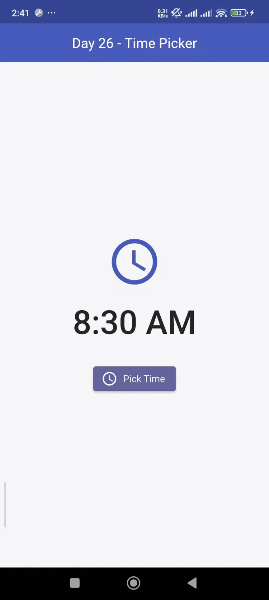</a><br/>
      <a href="lib/features/widgets_of_the_day/day_26_time_picker/day26_time_picker_widget.dart"><b style="font-size:13px; display:inline-block; max-width:120px; word-break:break-word;">TimePicker</b></a><br/>
      <sub style="font-size:11px; color:#57606a;">Day 026 &middot; Clock</sub>
    </td>
    <td align="center" valign="top" style="width:20%; padding:6px; text-align:center; vertical-align:top; word-break:break-word; overflow-wrap:break-word;">
      <a href="screenshots/day27_listwheelscrollview.webp">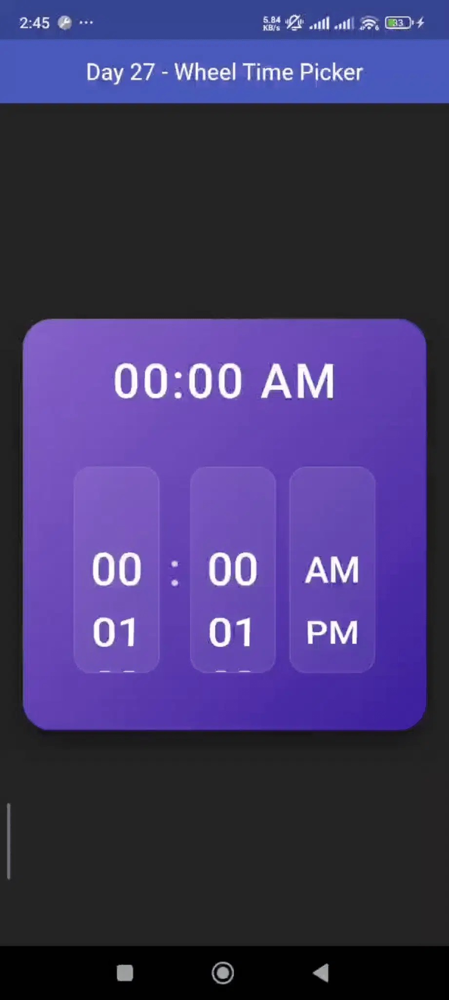</a><br/>
      <a href="lib/features/widgets_of_the_day/day_27_listwheelscrollview/day27_listwheelscrollview_widget.dart"><b style="font-size:13px; display:inline-block; max-width:120px; word-break:break-word;">ListWheel</b></a><br/>
      <sub style="font-size:11px; color:#57606a;">Day 027 &middot; 3D Scroll</sub>
    </td>
    <td align="center" valign="top" style="width:20%; padding:6px; text-align:center; vertical-align:top; word-break:break-word; overflow-wrap:break-word;">
      <a href="screenshots/day28_lineargradient.webp">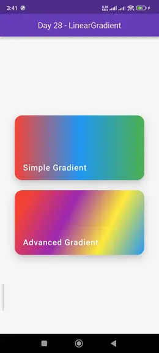</a><br/>
      <a href="lib/features/widgets_of_the_day/day_28_lineargradient/day28_lineargradient_widget.dart"><b style="font-size:13px; display:inline-block; max-width:120px; word-break:break-word;">Gradient</b></a><br/>
      <sub style="font-size:11px; color:#57606a;">Day 028 &middot; Colors</sub>
    </td>
    <td align="center" valign="top" style="width:20%; padding:6px; text-align:center; vertical-align:top; word-break:break-word; overflow-wrap:break-word;">
      <a href="screenshots/day29_elevatedbutton_and_outlinedbutton.webp">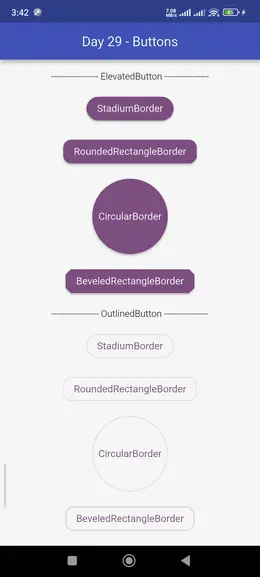</a><br/>
      <a href="lib/features/widgets_of_the_day/day_29_elevatedbutton_and_outlinedbutton/day29_elevatedbutton_and_outlinedbutton_widget.dart"><b style="font-size:13px; display:inline-block; max-width:120px; word-break:break-word;">Buttons</b></a><br/>
      <sub style="font-size:11px; color:#57606a;">Day 029 &middot; Action</sub>
    </td>
  </tr></tbody>
</table>

<table width="100%" style="table-layout:fixed; border-collapse:separate; border-spacing:8px;">
  <thead><tr>
    <th align="center" style="width:20%; font-size:11px; color:#0969da; border-bottom:2px solid #0969da; padding:4px; text-align:center; white-space:nowrap;">Day 030</th>
    <th align="center" style="width:20%; font-size:11px; color:#0969da; border-bottom:2px solid #0969da; padding:4px; text-align:center; white-space:nowrap;">Day 031</th>
    <th align="center" style="width:20%; font-size:11px; color:#0969da; border-bottom:2px solid #0969da; padding:4px; text-align:center; white-space:nowrap;">Day 032</th>
    <th align="center" style="width:20%; font-size:11px; color:#0969da; border-bottom:2px solid #0969da; padding:4px; text-align:center; white-space:nowrap;">Day 033</th>
    <th align="center" style="width:20%; font-size:11px; color:#0969da; border-bottom:2px solid #0969da; padding:4px; text-align:center; white-space:nowrap;">Day 034</th>
  </tr></thead>
  <tbody><tr>
    <td align="center" valign="top" style="width:20%; padding:6px; text-align:center; vertical-align:top; word-break:break-word; overflow-wrap:break-word;">
      <a href="screenshots/day30_floatingactionbutton.webp">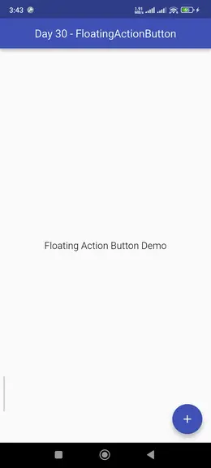</a><br/>
      <a href="lib/features/widgets_of_the_day/day_30_floatingactionbutton/day30_floatingactionbutton_widget.dart"><b style="font-size:13px; display:inline-block; max-width:120px; word-break:break-word;">FAB</b></a><br/>
      <sub style="font-size:11px; color:#57606a;">Day 030 &middot; Primary btn</sub>
    </td>
    <td align="center" valign="top" style="width:20%; padding:6px; text-align:center; vertical-align:top; word-break:break-word; overflow-wrap:break-word;">
      <a href="screenshots/day31_navigator.webp">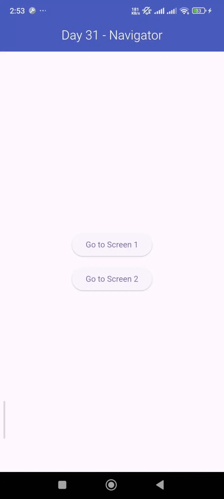</a><br/>
      <a href="lib/features/widgets_of_the_day/day_31_navigator/day31_navigator_widget.dart"><b style="font-size:13px; display:inline-block; max-width:120px; word-break:break-word;">Navigator</b></a><br/>
      <sub style="font-size:11px; color:#57606a;">Day 031 &middot; Routes</sub>
    </td>
    <td align="center" valign="top" style="width:20%; padding:6px; text-align:center; vertical-align:top; word-break:break-word; overflow-wrap:break-word;">
      <a href="screenshots/day32_card.webp">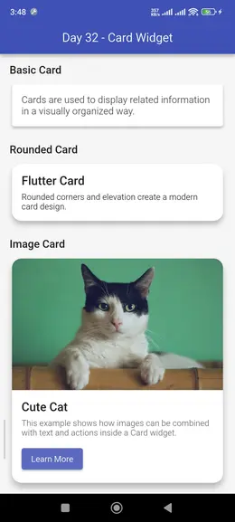</a><br/>
      <a href="lib/features/widgets_of_the_day/day_32_card/day32_card_widget.dart"><b style="font-size:13px; display:inline-block; max-width:120px; word-break:break-word;">Card</b></a><br/>
      <sub style="font-size:11px; color:#57606a;">Day 032 &middot; Container</sub>
    </td>
    <td align="center" valign="top" style="width:20%; padding:6px; text-align:center; vertical-align:top; word-break:break-word; overflow-wrap:break-word;">
      <a href="screenshots/day33_clipper.webp">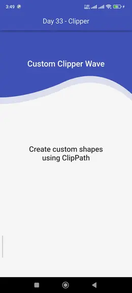</a><br/>
      <a href="lib/features/widgets_of_the_day/day_33_clipper/day33_clipper_widget.dart"><b style="font-size:13px; display:inline-block; max-width:120px; word-break:break-word;">Clipper</b></a><br/>
      <sub style="font-size:11px; color:#57606a;">Day 033 &middot; Shapes</sub>
    </td>
    <td align="center" valign="top" style="width:20%; padding:6px; text-align:center; vertical-align:top; word-break:break-word; overflow-wrap:break-word;">
      <a href="screenshots/day34_rawmaterialbutton.webp">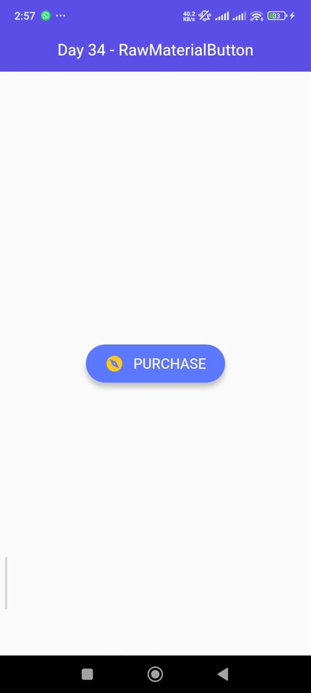</a><br/>
      <a href="lib/features/widgets_of_the_day/day_34_rawmaterialbutton/day34_rawmaterialbutton_widget.dart"><b style="font-size:13px; display:inline-block; max-width:120px; word-break:break-word;">RawBtn</b></a><br/>
      <sub style="font-size:11px; color:#57606a;">Day 034 &middot; Custom</sub>
    </td>
  </tr></tbody>
</table>

<table width="100%" style="table-layout:fixed; border-collapse:separate; border-spacing:8px;">
  <thead><tr>
    <th align="center" style="width:20%; font-size:11px; color:#0969da; border-bottom:2px solid #0969da; padding:4px; text-align:center; white-space:nowrap;">Day 035</th>
    <th align="center" style="width:20%; font-size:11px; color:#0969da; border-bottom:2px solid #0969da; padding:4px; text-align:center; white-space:nowrap;">Day 036</th>
    <th align="center" style="width:20%; font-size:11px; color:#0969da; border-bottom:2px solid #0969da; padding:4px; text-align:center; white-space:nowrap;">Day 037</th>
    <th align="center" style="width:20%; font-size:11px; color:#0969da; border-bottom:2px solid #0969da; padding:4px; text-align:center; white-space:nowrap;">Day 038</th>
    <th align="center" style="width:20%; font-size:11px; color:#0969da; border-bottom:2px solid #0969da; padding:4px; text-align:center; white-space:nowrap;">Day 039</th>
  </tr></thead>
  <tbody><tr>
    <td align="center" valign="top" style="width:20%; padding:6px; text-align:center; vertical-align:top; word-break:break-word; overflow-wrap:break-word;">
      <a href="screenshots/day35_rotatedbox.webp">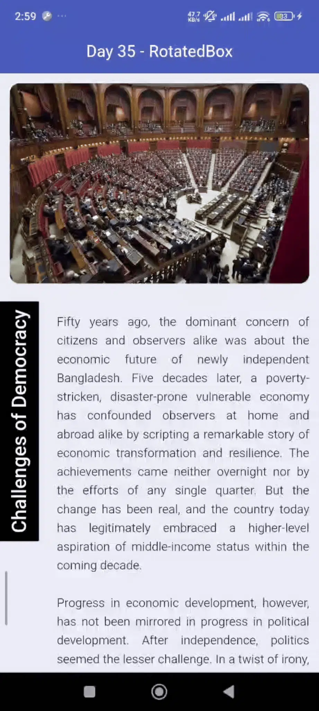</a><br/>
      <a href="lib/features/widgets_of_the_day/day_35_rotatedbox/day35_rotatedbox_widget.dart"><b style="font-size:13px; display:inline-block; max-width:120px; word-break:break-word;">RotatedBox</b></a><br/>
      <sub style="font-size:11px; color:#57606a;">Day 035 &middot; Rotation</sub>
    </td>
    <td align="center" valign="top" style="width:20%; padding:6px; text-align:center; vertical-align:top; word-break:break-word; overflow-wrap:break-word;">
      <a href="screenshots/day36_transform.webp">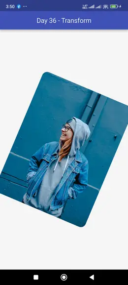</a><br/>
      <a href="lib/features/widgets_of_the_day/day_36_transform/day36_transform_widget.dart"><b style="font-size:13px; display:inline-block; max-width:120px; word-break:break-word;">Transform</b></a><br/>
      <sub style="font-size:11px; color:#57606a;">Day 036 &middot; Scale/Skew</sub>
    </td>
    <td align="center" valign="top" style="width:20%; padding:6px; text-align:center; vertical-align:top; word-break:break-word; overflow-wrap:break-word;">
      <a href="screenshots/day37_positioned.webp"></a><br/>
      <a href="lib/features/widgets_of_the_day/day_37_positioned/day37_positioned_widget.dart"><b style="font-size:13px; display:inline-block; max-width:120px; word-break:break-word;">Positioned</b></a><br/>
      <sub style="font-size:11px; color:#57606a;">Day 037 &middot; Absolute</sub>
    </td>
    <td align="center" valign="top" style="width:20%; padding:6px; text-align:center; vertical-align:top; word-break:break-word; overflow-wrap:break-word;">
      <a href="screenshots/day38_iconbutton.webp">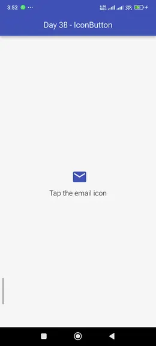</a><br/>
      <a href="lib/features/widgets_of_the_day/day_38_iconbutton/day38_iconbutton_widget.dart"><b style="font-size:13px; display:inline-block; max-width:120px; word-break:break-word;">IconButton</b></a><br/>
      <sub style="font-size:11px; color:#57606a;">Day 038 &middot; Icon action</sub>
    </td>
    <td align="center" valign="top" style="width:20%; padding:6px; text-align:center; vertical-align:top; word-break:break-word; overflow-wrap:break-word;">
      <a href="screenshots/day39_custom_paint.webp"></a><br/>
      <a href="lib/features/widgets_of_the_day/day_39_custom_paint/day39_custom_paint_widget.dart"><b style="font-size:13px; display:inline-block; max-width:120px; word-break:break-word;">CustomPaint</b></a><br/>
      <sub style="font-size:11px; color:#57606a;">Day 039 &middot; Canvas draw</sub>
    </td>
  </tr></tbody>
</table>

<table width="100%" style="table-layout:fixed; border-collapse:separate; border-spacing:8px;">
  <thead><tr>
    <th align="center" style="width:20%; font-size:11px; color:#0969da; border-bottom:2px solid #0969da; padding:4px; text-align:center; white-space:nowrap;">Day 040</th>
    <th align="center" style="width:20%; font-size:11px; color:#0969da; border-bottom:2px solid #0969da; padding:4px; text-align:center; white-space:nowrap;">Day 041</th>
    <th align="center" style="width:20%; font-size:11px; color:#0969da; border-bottom:2px solid #0969da; padding:4px; text-align:center; white-space:nowrap;">Day 042</th>
    <th align="center" style="width:20%; font-size:11px; color:#0969da; border-bottom:2px solid #0969da; padding:4px; text-align:center; white-space:nowrap;">Day 043</th>
    <th align="center" style="width:20%; font-size:11px; color:#0969da; border-bottom:2px solid #0969da; padding:4px; text-align:center; white-space:nowrap;">Day 044</th>
  </tr></thead>
  <tbody><tr>
    <td align="center" valign="top" style="width:20%; padding:6px; text-align:center; vertical-align:top; word-break:break-word; overflow-wrap:break-word;">
      <a href="screenshots/day40_clipoval.webp"></a><br/>
      <a href="lib/features/widgets_of_the_day/day_40_clipoval/day40_clipoval_widget.dart"><b style="font-size:13px; display:inline-block; max-width:120px; word-break:break-word;">ClipOval</b></a><br/>
      <sub style="font-size:11px; color:#57606a;">Day 040 &middot; Circular clip</sub>
    </td>
    <td align="center" valign="top" style="width:20%; padding:6px; text-align:center; vertical-align:top; word-break:break-word; overflow-wrap:break-word;">
      <a href="screenshots/day41_cliprrect.webp"></a><br/>
      <a href="lib/features/widgets_of_the_day/day_41_cliprrect/day41_cliprrect_widget.dart"><b style="font-size:13px; display:inline-block; max-width:120px; word-break:break-word;">ClipRRect</b></a><br/>
      <sub style="font-size:11px; color:#57606a;">Day 041 &middot; Rounded clip</sub>
    </td>
    <td align="center" valign="top" style="width:20%; padding:6px; text-align:center; vertical-align:top; word-break:break-word; overflow-wrap:break-word;">
      <a href="screenshots/day42_cliprect.webp">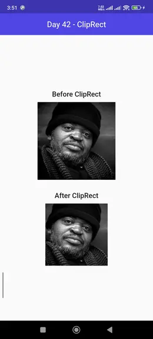</a><br/>
      <a href="lib/features/widgets_of_the_day/day_42_cliprect/day42_cliprect_widget.dart"><b style="font-size:13px; display:inline-block; max-width:120px; word-break:break-word;">ClipRect</b></a><br/>
      <sub style="font-size:11px; color:#57606a;">Day 042 &middot; Rect clip</sub>
    </td>
    <td align="center" valign="top" style="width:20%; padding:6px; text-align:center; vertical-align:top; word-break:break-word; overflow-wrap:break-word;">
      <a href="screenshots/day43_clippath.webp">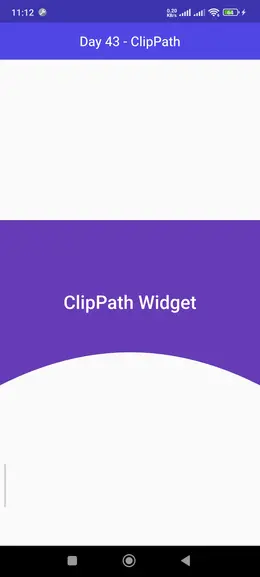</a><br/>
      <a href="lib/features/widgets_of_the_day/day_43_clippath/day43_clippath_widget.dart"><b style="font-size:13px; display:inline-block; max-width:120px; word-break:break-word;">ClipPath</b></a><br/>
      <sub style="font-size:11px; color:#57606a;">Day 043 &middot; Custom shape</sub>
    </td>
    <td align="center" valign="top" style="width:20%; padding:6px; text-align:center; vertical-align:top; word-break:break-word; overflow-wrap:break-word;">
      <a href="screenshots/day44_radial_and_sweep_gradient.webp"></a><br/>
      <a href="lib/features/widgets_of_the_day/day_44_radial_and_sweep_gradient/day44_radial_and_sweep_gradient_widget.dart"><b style="font-size:13px; display:inline-block; max-width:120px; word-break:break-word;">Grad Effects</b></a><br/>
      <sub style="font-size:11px; color:#57606a;">Day 044 &middot; Radial &amp; Sweep</sub>
    </td>
  </tr></tbody>
</table>

<table width="100%" style="table-layout:fixed; border-collapse:separate; border-spacing:8px;">
  <thead><tr>
    <th align="center" style="width:20%; font-size:11px; color:#0969da; border-bottom:2px solid #0969da; padding:4px; text-align:center; white-space:nowrap;">Day 045</th>
    <th align="center" style="width:20%; font-size:11px; color:#0969da; border-bottom:2px solid #0969da; padding:4px; text-align:center; white-space:nowrap;">Day 046</th>
    <th align="center" style="width:20%; font-size:11px; color:#0969da; border-bottom:2px solid #0969da; padding:4px; text-align:center; white-space:nowrap;">Day 047</th>
    <th align="center" style="width:20%; font-size:11px; color:#0969da; border-bottom:2px solid #0969da; padding:4px; text-align:center; white-space:nowrap;">Day 048</th>
    <th align="center" style="width:20%; font-size:11px; color:#0969da; border-bottom:2px solid #0969da; padding:4px; text-align:center; white-space:nowrap;">Day 049</th>
  </tr></thead>
  <tbody><tr>
    <td align="center" valign="top" style="width:20%; padding:6px; text-align:center; vertical-align:top; word-break:break-word; overflow-wrap:break-word;">
      <a href="screenshots/day45_stateful_widget.webp"></a><br/>
      <a href="lib/features/widgets_of_the_day/day_45_stateful/day45_stateful_widget.dart"><b style="font-size:13px; display:inline-block; max-width:120px; word-break:break-word;">StatefulWidget</b></a><br/>
      <sub style="font-size:11px; color:#57606a;">Day 045 &middot; Lifecycle</sub>
    </td>
    <td align="center" valign="top" style="width:20%; padding:6px; text-align:center; vertical-align:top; word-break:break-word; overflow-wrap:break-word;">
      <a href="screenshots/day46_table.webp">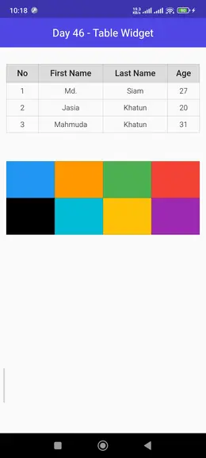</a><br/>
      <a href="lib/features/widgets_of_the_day/day_46_table/day46_table_widget.dart"><b style="font-size:13px; display:inline-block; max-width:120px; word-break:break-word;">Table</b></a><br/>
      <sub style="font-size:11px; color:#57606a;">Day 046 &middot; Grid layout</sub>
    </td>
    <td align="center" valign="top" style="width:20%; padding:6px; text-align:center; vertical-align:top; word-break:break-word; overflow-wrap:break-word;">
      <a href="screenshots/day47_data_table.webp">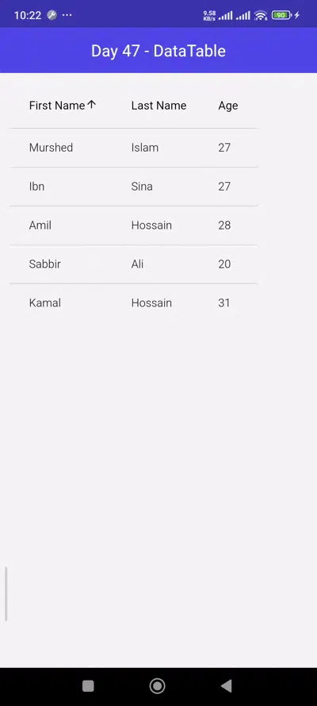</a><br/>
      <a href="lib/features/widgets_of_the_day/day_47_data_table/day47_data_table_widget.dart"><b style="font-size:13px; display:inline-block; max-width:120px; word-break:break-word;">DataTable</b></a><br/>
      <sub style="font-size:11px; color:#57606a;">Day 047 &middot; Interactive</sub>
    </td>
    <td align="center" valign="top" style="width:20%; padding:6px; text-align:center; vertical-align:top; word-break:break-word; overflow-wrap:break-word;">
      <a href="screenshots/day48_placeholder.webp">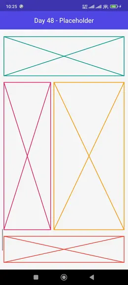</a><br/>
      <a href="lib/features/widgets_of_the_day/day_48_placeholder/day48_placeholder_widget.dart"><b style="font-size:13px; display:inline-block; max-width:120px; word-break:break-word;">Placeholder</b></a><br/>
      <sub style="font-size:11px; color:#57606a;">Day 048 &middot; Debugging</sub>
    </td>
    <td align="center" valign="top" style="width:20%; padding:6px; text-align:center; vertical-align:top; word-break:break-word; overflow-wrap:break-word;">
      <a href="screenshots/day49_gesturedetector_and_inkwell.webp"></a><br/>
      <a href="lib/features/widgets_of_the_day/day_49_gesturedetector_and_inkwell/day49_gesturedetector_and_inkwell_widget.dart"><b style="font-size:13px; display:inline-block; max-width:120px; word-break:break-word;">Gesture&amp;Ink</b></a><br/>
      <sub style="font-size:11px; color:#57606a;">Day 049 &middot; Interactions</sub>
    </td>
  </tr></tbody>
</table>

<table width="100%" style="table-layout:fixed; border-collapse:separate; border-spacing:8px;">
  <thead><tr>
    <th align="center" style="width:20%; font-size:11px; color:#0969da; border-bottom:2px solid #0969da; padding:4px; text-align:center; white-space:nowrap;">Day 050</th>
    <th align="center" style="width:20%; font-size:11px; color:#0969da; border-bottom:2px solid #0969da; padding:4px; text-align:center; white-space:nowrap;">Day 051</th>
    <th align="center" style="width:20%; font-size:11px; color:#0969da; border-bottom:2px solid #0969da; padding:4px; text-align:center; white-space:nowrap;">Day 052</th>
    <th align="center" style="width:20%; font-size:11px; color:#0969da; border-bottom:2px solid #0969da; padding:4px; text-align:center; white-space:nowrap;">Day 053</th>
    <th align="center" style="width:20%; font-size:11px; color:#0969da; border-bottom:2px solid #0969da; padding:4px; text-align:center; white-space:nowrap;">Day 054</th>
  </tr></thead>
  <tbody><tr>
    <td align="center" valign="top" style="width:20%; padding:6px; text-align:center; vertical-align:top; word-break:break-word; overflow-wrap:break-word;">
      <a href="screenshots/day50_material_widget.webp">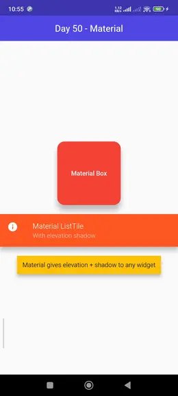</a><br/>
      <a href="lib/features/widgets_of_the_day/day_50_material/day50_material_widget.dart"><b style="font-size:13px; display:inline-block; max-width:120px; word-break:break-word;">Material</b></a><br/>
      <sub style="font-size:11px; color:#57606a;">Day 050 &middot; Surface/Depth</sub>
    </td>
    <td align="center" valign="top" style="width:20%; padding:6px; text-align:center; vertical-align:top; word-break:break-word; overflow-wrap:break-word;">
      <a href="screenshots/day51_switches.webp">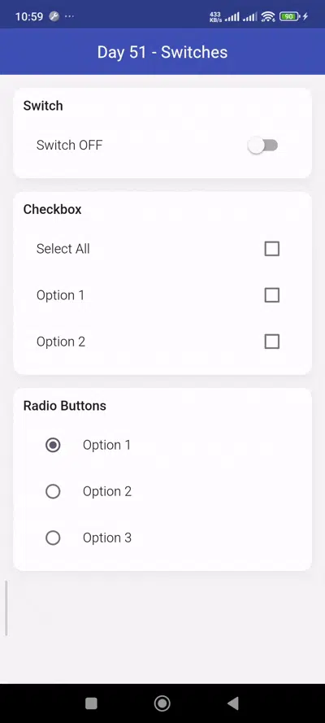</a><br/>
      <a href="lib/features/widgets_of_the_day/day_51_switches/day51_switches_widget.dart"><b style="font-size:13px; display:inline-block; max-width:120px; word-break:break-word;">Switches</b></a><br/>
      <sub style="font-size:11px; color:#57606a;">Day 051 &middot; Toggle UI</sub>
    </td>
    <td align="center" valign="top" style="width:20%; padding:6px; text-align:center; vertical-align:top; word-break:break-word; overflow-wrap:break-word;">
      <a href="screenshots/day52_dropdown_and_popupmenu.webp"></a><br/>
      <a href="lib/features/widgets_of_the_day/day_52_dropdown_and_popupmenu/day52_dropdown_and_popupmenu_widget.dart"><b style="font-size:13px; display:inline-block; max-width:120px; word-break:break-word;">Menus</b></a><br/>
      <sub style="font-size:11px; color:#57606a;">Day 052 &middot; Selection</sub>
    </td>
    <td align="center" valign="top" style="width:20%; padding:6px; text-align:center; vertical-align:top; word-break:break-word; overflow-wrap:break-word;">
      <a href="screenshots/day53_hero_animation.webp"></a><br/>
      <a href="lib/features/widgets_of_the_day/day_53_hero_animation/day53_hero_animation_widget.dart"><b style="font-size:13px; display:inline-block; max-width:120px; word-break:break-word;">Hero</b></a><br/>
      <sub style="font-size:11px; color:#57606a;">Day 053 &middot; Transitions</sub>
    </td>
    <td align="center" valign="top" style="width:20%; padding:6px; text-align:center; vertical-align:top; word-break:break-word; overflow-wrap:break-word;">
      <a href="screenshots/day54_about_dialog.webp"></a><br/>
      <a href="lib/features/widgets_of_the_day/day_54_about_dialog/day54_about_dialog_widget.dart"><b style="font-size:13px; display:inline-block; max-width:120px; word-break:break-word;">AboutDialog</b></a><br/>
      <sub style="font-size:11px; color:#57606a;">Day 054 &middot; App Info</sub>
    </td>
  </tr></tbody>
</table>

<table width="100%" style="table-layout:fixed; border-collapse:separate; border-spacing:8px;">
  <thead><tr>
    <th align="center" style="width:20%; font-size:11px; color:#0969da; border-bottom:2px solid #0969da; padding:4px; text-align:center; white-space:nowrap;">Day 055</th>
    <th align="center" style="width:20%; font-size:11px; color:#0969da; border-bottom:2px solid #0969da; padding:4px; text-align:center; white-space:nowrap;">Day 056</th>
    <th align="center" style="width:20%; font-size:11px; color:#0969da; border-bottom:2px solid #0969da; padding:4px; text-align:center; white-space:nowrap;">Day 057</th>
    <th align="center" style="width:20%; font-size:11px; color:#0969da; border-bottom:2px solid #0969da; padding:4px; text-align:center; white-space:nowrap;">Day 058</th>
    <th align="center" style="width:20%; font-size:11px; color:#0969da; border-bottom:2px solid #0969da; padding:4px; text-align:center; white-space:nowrap;">Day 059</th>
  </tr></thead>
  <tbody><tr>
    <td align="center" valign="top" style="width:20%; padding:6px; text-align:center; vertical-align:top; word-break:break-word; overflow-wrap:break-word;">
      <a href="screenshots/day55_stepper.webp"></a><br/>
      <a href="lib/features/widgets_of_the_day/day_55_stepper/day55_stepper_widget.dart"><b style="font-size:13px; display:inline-block; max-width:120px; word-break:break-word;">Stepper</b></a><br/>
      <sub style="font-size:11px; color:#57606a;">Day 055 &middot; Workflows</sub>
    </td>
    <td align="center" valign="top" style="width:20%; padding:6px; text-align:center; vertical-align:top; word-break:break-word; overflow-wrap:break-word;">
      <a href="screenshots/day56_fitted_box.webp">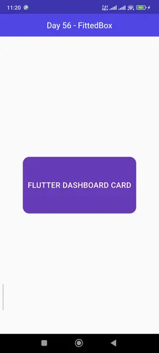</a><br/>
      <a href="lib/features/widgets_of_the_day/day_56_fitted_box/day56_fitted_box_widget.dart"><b style="font-size:13px; display:inline-block; max-width:120px; word-break:break-word;">FittedBox</b></a><br/>
      <sub style="font-size:11px; color:#57606a;">Day 056 &middot; Scaling</sub>
    </td>
    <td align="center" valign="top" style="width:20%; padding:6px; text-align:center; vertical-align:top; word-break:break-word; overflow-wrap:break-word;">
      <a href="screenshots/day57_show_search.webp"></a><br/>
      <a href="lib/features/widgets_of_the_day/day_57_show_search/day57_show_search_widget.dart"><b style="font-size:13px; display:inline-block; max-width:120px; word-break:break-word;">Search</b></a><br/>
      <sub style="font-size:11px; color:#57606a;">Day 057 &middot; In-app search</sub>
    </td>
    <td align="center" valign="top" style="width:20%; padding:6px; text-align:center; vertical-align:top; word-break:break-word; overflow-wrap:break-word;">
      <a href="screenshots/day58_adaptive.webp">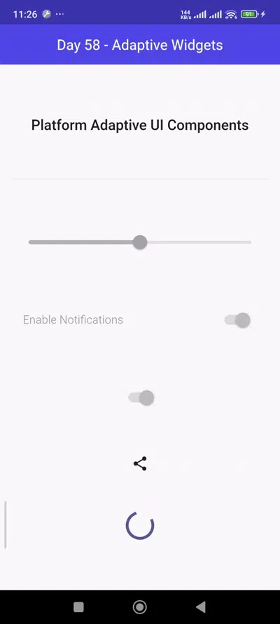</a><br/>
      <a href="lib/features/widgets_of_the_day/day_58_adaptive/day58_adaptive_widget.dart"><b style="font-size:13px; display:inline-block; max-width:120px; word-break:break-word;">Adaptive</b></a><br/>
      <sub style="font-size:11px; color:#57606a;">Day 058 &middot; Platform</sub>
    </td>
    <td align="center" valign="top" style="width:20%; padding:6px; text-align:center; vertical-align:top; word-break:break-word; overflow-wrap:break-word;">
      <a href="screenshots/day59_scrollbar.webp"></a><br/>
      <a href="lib/features/widgets_of_the_day/day_59_scrollbar/day59_scrollbar_widget.dart"><b style="font-size:13px; display:inline-block; max-width:120px; word-break:break-word;">Scrollbar</b></a><br/>
      <sub style="font-size:11px; color:#57606a;">Day 059 &middot; Feedback</sub>
    </td>
  </tr></tbody>
</table>

<table width="100%" style="table-layout:fixed; border-collapse:separate; border-spacing:8px;">
  <thead><tr>
    <th align="center" style="width:20%; font-size:11px; color:#0969da; border-bottom:2px solid #0969da; padding:4px; text-align:center; white-space:nowrap;">Day 060</th>
    <th align="center" style="width:20%; font-size:11px; color:#0969da; border-bottom:2px solid #0969da; padding:4px; text-align:center; white-space:nowrap;">Day 061</th>
    <th align="center" style="width:20%; font-size:11px; color:#0969da; border-bottom:2px solid #0969da; padding:4px; text-align:center; white-space:nowrap;">Day 062</th>
    <th align="center" style="width:20%; font-size:11px; color:#0969da; border-bottom:2px solid #0969da; padding:4px; text-align:center; white-space:nowrap;">Day 063</th>
    <th align="center" style="width:20%; font-size:11px; color:#0969da; border-bottom:2px solid #0969da; padding:4px; text-align:center; white-space:nowrap;">Day 064</th>
  </tr></thead>
  <tbody><tr>
    <td align="center" valign="top" style="width:20%; padding:6px; text-align:center; vertical-align:top; word-break:break-word; overflow-wrap:break-word;">
      <a href="screenshots/day60_choice_chip.webp">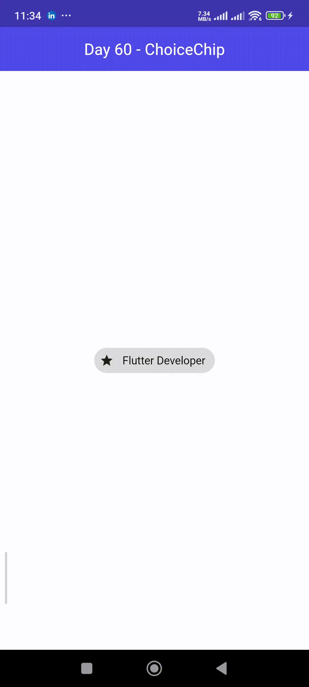</a><br/>
      <a href="lib/features/widgets_of_the_day/day_60_choice_chip/day60_choice_chip_widget.dart"><b style="font-size:13px; display:inline-block; max-width:120px; word-break:break-word;">ChoiceChip</b></a><br/>
      <sub style="font-size:11px; color:#57606a;">Day 060 &middot; Filters</sub>
    </td>
    <td align="center" valign="top" style="width:20%; padding:6px; text-align:center; vertical-align:top; word-break:break-word; overflow-wrap:break-word;">
      <a href="screenshots/day61_wrap.webp">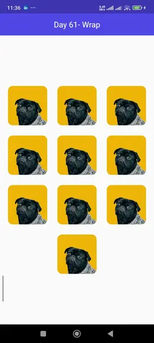</a><br/>
      <a href="lib/features/widgets_of_the_day/day_61_wrap/day61_wrap_widget.dart"><b style="font-size:13px; display:inline-block; max-width:120px; word-break:break-word;">Wrap</b></a><br/>
      <sub style="font-size:11px; color:#57606a;">Day 061 &middot; Flow layout</sub>
    </td>
    <td align="center" valign="top" style="width:20%; padding:6px; text-align:center; vertical-align:top; word-break:break-word; overflow-wrap:break-word;">
      <a href="screenshots/day62_expansion_tile.webp">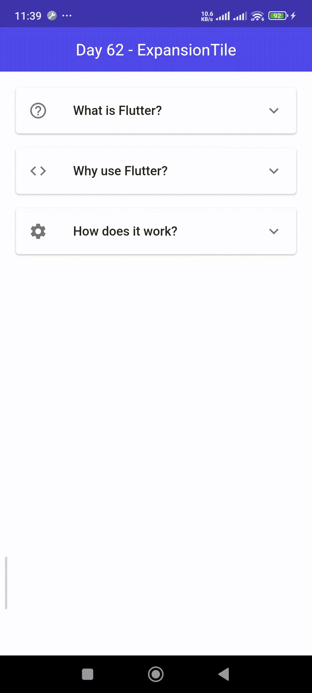</a><br/>
      <a href="lib/features/widgets_of_the_day/day_62_expansion_tile/day62_expansion_tile_widget.dart"><b style="font-size:13px; display:inline-block; max-width:120px; word-break:break-word;">ExpansionTile</b></a><br/>
      <sub style="font-size:11px; color:#57606a;">Day 062 &middot; Expandable</sub>
    </td>
    <td align="center" valign="top" style="width:20%; padding:6px; text-align:center; vertical-align:top; word-break:break-word; overflow-wrap:break-word;">
      <a href="screenshots/day63_range_slider.webp">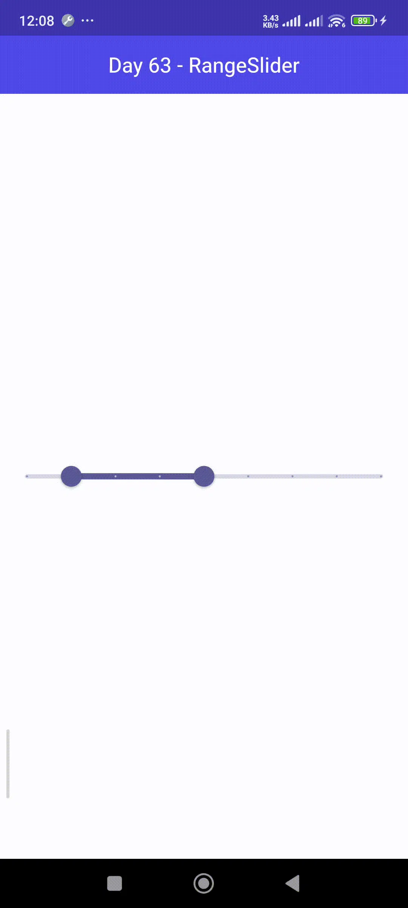</a><br/>
      <a href="lib/features/widgets_of_the_day/day_63_range_slider/day63_range_slider_widget.dart"><b style="font-size:13px; display:inline-block; max-width:120px; word-break:break-word;">RangeSlider</b></a><br/>
      <sub style="font-size:11px; color:#57606a;">Day 063 &middot; Value range</sub>
    </td>
    <td align="center" valign="top" style="width:20%; padding:6px; text-align:center; vertical-align:top; word-break:break-word; overflow-wrap:break-word;">
      <a href="screenshots/day64_show_modalbootmsheet.webp">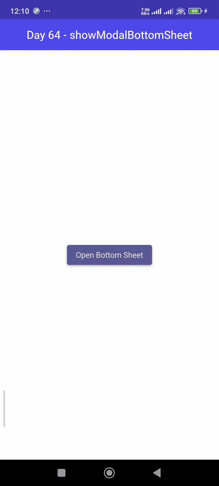</a><br/>
      <a href="lib/features/widgets_of_the_day/day_64_show_modalbottomsheet/day64_show_modalbootmsheet_widget.dart"><b style="font-size:13px; display:inline-block; max-width:120px; word-break:break-word;">BottomSheet</b></a><br/>
      <sub style="font-size:11px; color:#57606a;">Day 064 &middot; Modal UI</sub>
    </td>
  </tr></tbody>
</table>

<table width="100%" style="table-layout:fixed; border-collapse:separate; border-spacing:8px;">
  <thead><tr>
    <th align="center" style="width:20%; font-size:11px; color:#0969da; border-bottom:2px solid #0969da; padding:4px; text-align:center; white-space:nowrap;">Day 065</th>
    <th align="center" style="width:20%; font-size:11px; color:#0969da; border-bottom:2px solid #0969da; padding:4px; text-align:center; white-space:nowrap;">Day 066</th>
    <th align="center" style="width:20%; font-size:11px; color:#0969da; border-bottom:2px solid #0969da; padding:4px; text-align:center; white-space:nowrap;">Day 067</th>
    <th align="center" style="width:20%; font-size:11px; color:#0969da; border-bottom:2px solid #0969da; padding:4px; text-align:center; white-space:nowrap;">Day 068</th>
    <th align="center" style="width:20%; font-size:11px; color:#0969da; border-bottom:2px solid #0969da; padding:4px; text-align:center; white-space:nowrap;">Day 069</th>
  </tr></thead>
  <tbody><tr>
    <td align="center" valign="top" style="width:20%; padding:6px; text-align:center; vertical-align:top; word-break:break-word; overflow-wrap:break-word;">
      <a href="screenshots/day65_animated_cross_fade.webp">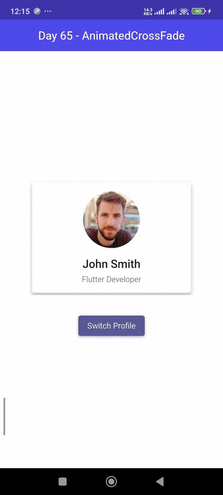</a><br/>
      <a href="lib/features/widgets_of_the_day/day_65_animated_cross_fade/day65_animated_cross_fade_widget.dart"><b style="font-size:13px; display:inline-block; max-width:120px; word-break:break-word;">CrossFade</b></a><br/>
      <sub style="font-size:11px; color:#57606a;">Day 065 &middot; Transitions</sub>
    </td>
    <td align="center" valign="top" style="width:20%; padding:6px; text-align:center; vertical-align:top; word-break:break-word; overflow-wrap:break-word;">
      <a href="screenshots/day66_flexible.webp">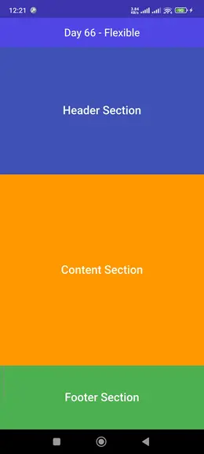</a><br/>
      <a href="lib/features/widgets_of_the_day/day_66_flexible/day66_flexible_widget.dart"><b style="font-size:13px; display:inline-block; max-width:120px; word-break:break-word;">Flexible</b></a><br/>
      <sub style="font-size:11px; color:#57606a;">Day 066 &middot; Flex layout</sub>
    </td>
    <td align="center" valign="top" style="width:20%; padding:6px; text-align:center; vertical-align:top; word-break:break-word; overflow-wrap:break-word;">
      <a href="screenshots/day67_spacer.webp">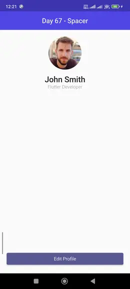</a><br/>
      <a href="lib/features/widgets_of_the_day/day_67_spacer/day67_spacer_widget.dart"><b style="font-size:13px; display:inline-block; max-width:120px; word-break:break-word;">Spacer</b></a><br/>
      <sub style="font-size:11px; color:#57606a;">Day 067 &middot; Spacing</sub>
    </td>
    <td align="center" valign="top" style="width:20%; padding:6px; text-align:center; vertical-align:top; word-break:break-word; overflow-wrap:break-word;">
      <a href="screenshots/day68_gridpaper.webp">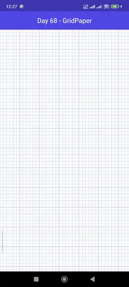</a><br/>
      <a href="lib/features/widgets_of_the_day/day_68_gridpaper/day68_gridpaper_widget.dart"><b style="font-size:13px; display:inline-block; max-width:120px; word-break:break-word;">GridPaper</b></a><br/>
      <sub style="font-size:11px; color:#57606a;">Day 068 &middot; Visualization</sub>
    </td>
    <td align="center" valign="top" style="width:20%; padding:6px; text-align:center; vertical-align:top; word-break:break-word; overflow-wrap:break-word;">
      <a href="screenshots/day69_interactive_viewer.webp"></a><br/>
      <a href="lib/features/widgets_of_the_day/day_69_interactive_viewer/day69_interactive_viewer_widget.dart"><b style="font-size:13px; display:inline-block; max-width:120px; word-break:break-word;">InterViewer</b></a><br/>
      <sub style="font-size:11px; color:#57606a;">Day 069 &middot; Zoom/Pan</sub>
    </td>
  </tr></tbody>
</table>

<table width="100%" style="table-layout:fixed; border-collapse:separate; border-spacing:8px;">
  <thead><tr>
    <th align="center" style="width:20%; font-size:11px; color:#0969da; border-bottom:2px solid #0969da; padding:4px; text-align:center; white-space:nowrap;">Day 070</th>
    <th align="center" style="width:20%; font-size:11px; color:#0969da; border-bottom:2px solid #0969da; padding:4px; text-align:center; white-space:nowrap;">Day 071</th>
    <th align="center" style="width:20%; font-size:11px; color:#0969da; border-bottom:2px solid #0969da; padding:4px; text-align:center; white-space:nowrap;">Day 072</th>
    <th align="center" style="width:20%; font-size:11px; color:#0969da; border-bottom:2px solid #0969da; padding:4px; text-align:center; white-space:nowrap;">Day 073</th>
    <th align="center" style="width:20%; font-size:11px; color:#0969da; border-bottom:2px solid #0969da; padding:4px; text-align:center; white-space:nowrap;">Day 074</th>
  </tr></thead>
  <tbody><tr>
    <td align="center" valign="top" style="width:20%; padding:6px; text-align:center; vertical-align:top; word-break:break-word; overflow-wrap:break-word;">
      <a href="screenshots/day70_checkbox_listtile.webp">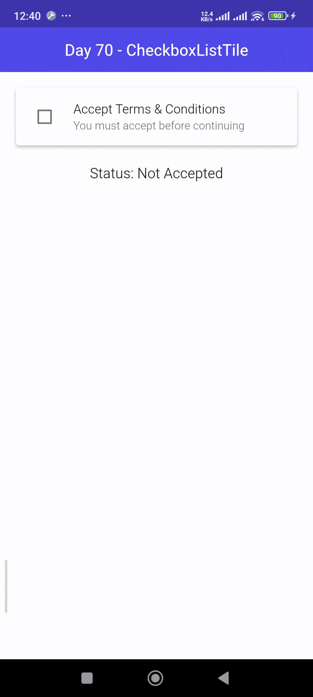</a><br/>
      <a href="lib/features/widgets_of_the_day/day_70_checkbox_listtile/day70_checkbox_listtile_widget.dart"><b style="font-size:13px; display:inline-block; max-width:120px; word-break:break-word;">CheckboxTile</b></a><br/>
      <sub style="font-size:11px; color:#57606a;">Day 070 &middot; Selection</sub>
    </td>
    <td align="center" valign="top" style="width:20%; padding:6px; text-align:center; vertical-align:top; word-break:break-word; overflow-wrap:break-word;">
      <a href="screenshots/day71_selectable_text.webp">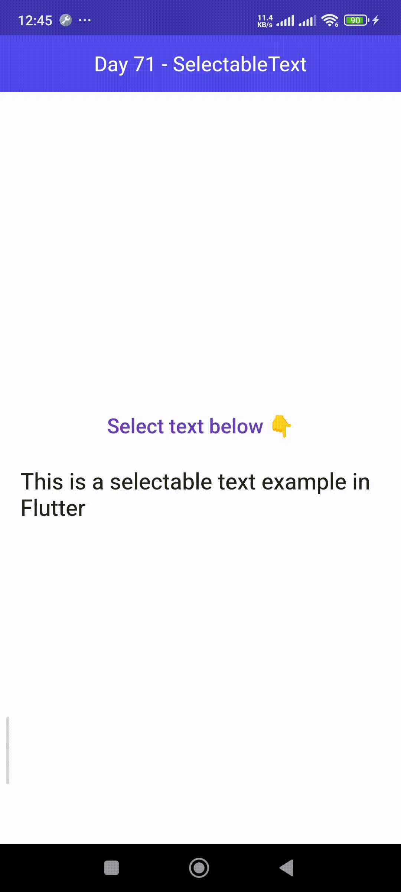</a><br/>
      <a href="lib/features/widgets_of_the_day/day_71_selectable_text/day71_selectable_text_widget.dart"><b style="font-size:13px; display:inline-block; max-width:120px; word-break:break-word;">SelectText</b></a><br/>
      <sub style="font-size:11px; color:#57606a;">Day 071 &middot; Copy/Paste</sub>
    </td>
    <td align="center" valign="top" style="width:20%; padding:6px; text-align:center; vertical-align:top; word-break:break-word; overflow-wrap:break-word;">
      <a href="screenshots/day72_animated_padding.webp"></a><br/>
      <a href="lib/features/widgets_of_the_day/day_72_animated_padding/day72_animated_padding_widget.dart"><b style="font-size:13px; display:inline-block; max-width:120px; word-break:break-word;">AnimPadding</b></a><br/>
      <sub style="font-size:11px; color:#57606a;">Day 072 &middot; Spacing anim</sub>
    </td>
    <td align="center" valign="top" style="width:20%; padding:6px; text-align:center; vertical-align:top; word-break:break-word; overflow-wrap:break-word;">
      <a href="screenshots/day73_refresh_indicator.webp">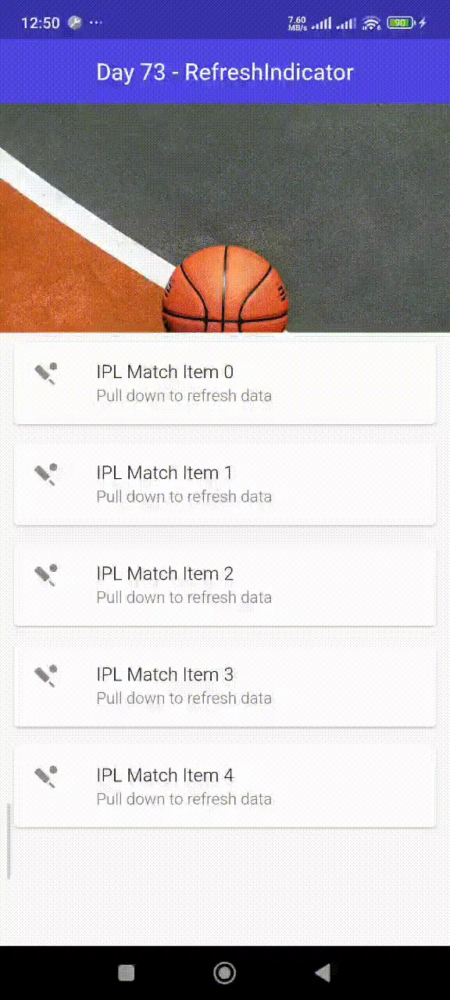</a><br/>
      <a href="lib/features/widgets_of_the_day/day_73_refresh_indicator/day73_refresh_indicator_widget.dart"><b style="font-size:13px; display:inline-block; max-width:120px; word-break:break-word;">Refresh</b></a><br/>
      <sub style="font-size:11px; color:#57606a;">Day 073 &middot; Pull-to-refresh</sub>
    </td>
    <td align="center" valign="top" style="width:20%; padding:6px; text-align:center; vertical-align:top; word-break:break-word; overflow-wrap:break-word;">
      <a href="screenshots/day74_image_filtered.webp"></a><br/>
      <a href="lib/features/widgets_of_the_day/day_74_image_filtered/day74_image_filtered_widget.dart"><b style="font-size:13px; display:inline-block; max-width:120px; word-break:break-word;">ImageFilter</b></a><br/>
      <sub style="font-size:11px; color:#57606a;">Day 074 &middot; Blur effects</sub>
    </td>
  </tr></tbody>
</table>

<table width="100%" style="table-layout:fixed; border-collapse:separate; border-spacing:8px;">
  <thead><tr>
    <th align="center" style="width:20%; font-size:11px; color:#0969da; border-bottom:2px solid #0969da; padding:4px; text-align:center; white-space:nowrap;">Day 075</th>
    <th align="center" style="width:20%; font-size:11px; color:#0969da; border-bottom:2px solid #0969da; padding:4px; text-align:center; white-space:nowrap;">Day 076</th>
    <th align="center" style="width:20%; font-size:11px; color:#0969da; border-bottom:2px solid #0969da; padding:4px; text-align:center; white-space:nowrap;">Day 077</th>
    <th align="center" style="width:20%; font-size:11px; color:#0969da; border-bottom:2px solid #0969da; padding:4px; text-align:center; white-space:nowrap;">Day 078</th>
    <th align="center" style="width:20%; font-size:11px; color:#0969da; border-bottom:2px solid #0969da; padding:4px; text-align:center; white-space:nowrap;">Day 079</th>
  </tr></thead>
  <tbody><tr>
    <td align="center" valign="top" style="width:20%; padding:6px; text-align:center; vertical-align:top; word-break:break-word; overflow-wrap:break-word;">
      <a href="screenshots/day75_aspect_ratio.webp">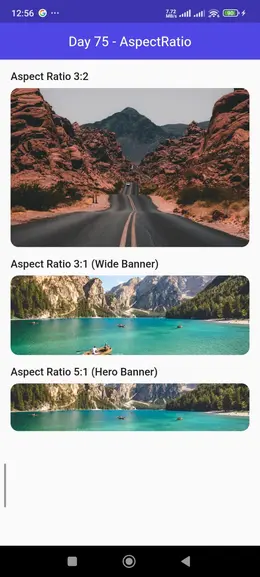</a><br/>
      <a href="lib/features/widgets_of_the_day/day_75_aspect_ratio/day75_aspect_ratio_widget.dart"><b style="font-size:13px; display:inline-block; max-width:120px; word-break:break-word;">AspectRatio</b></a><br/>
      <sub style="font-size:11px; color:#57606a;">Day 075 &middot; Proportions</sub>
    </td>
    <td align="center" valign="top" style="width:20%; padding:6px; text-align:center; vertical-align:top; word-break:break-word; overflow-wrap:break-word;">
      <a href="screenshots/day76_toggle_button.webp">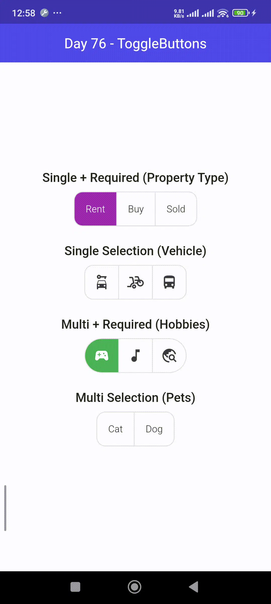</a><br/>
      <a href="lib/features/widgets_of_the_day/day_76_toggle_button/day76_toggle_button_widget.dart"><b style="font-size:13px; display:inline-block; max-width:120px; word-break:break-word;">ToggleBtns</b></a><br/>
      <sub style="font-size:11px; color:#57606a;">Day 076 &middot; Selection</sub>
    </td>
    <td align="center" valign="top" style="width:20%; padding:6px; text-align:center; vertical-align:top; word-break:break-word; overflow-wrap:break-word;">
      <a href="screenshots/day77_physical_model.webp">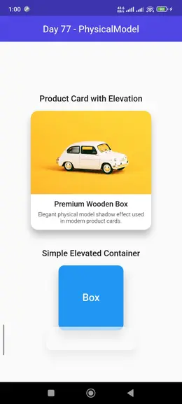</a><br/>
      <a href="lib/features/widgets_of_the_day/day_77_physical_model/day77_physical_model_widget.dart"><b style="font-size:13px; display:inline-block; max-width:120px; word-break:break-word;">PhysicalModel</b></a><br/>
      <sub style="font-size:11px; color:#57606a;">Day 077 &middot; Elevation</sub>
    </td>
    <td align="center" valign="top" style="width:20%; padding:6px; text-align:center; vertical-align:top; word-break:break-word; overflow-wrap:break-word;">
      <a href="screenshots/day78_align.webp"></a><br/>
      <a href="lib/features/widgets_of_the_day/day_78_align/day78_align_widget.dart"><b style="font-size:13px; display:inline-block; max-width:120px; word-break:break-word;">Align</b></a><br/>
      <sub style="font-size:11px; color:#57606a;">Day 078 &middot; Positioning</sub>
    </td>
    <td align="center" valign="top" style="width:20%; padding:6px; text-align:center; vertical-align:top; word-break:break-word; overflow-wrap:break-word;">
      <a href="screenshots/day79_safearea.webp"></a><br/>
      <a href="lib/features/widgets_of_the_day/day_79_safearea/day79_safearea_widget.dart"><b style="font-size:13px; display:inline-block; max-width:120px; word-break:break-word;">SafeArea</b></a><br/>
      <sub style="font-size:11px; color:#57606a;">Day 079 &middot; Notch support</sub>
    </td>
  </tr></tbody>
</table>

<table width="100%" style="table-layout:fixed; border-collapse:separate; border-spacing:8px;">
  <thead><tr>
    <th align="center" style="width:20%; font-size:11px; color:#0969da; border-bottom:2px solid #0969da; padding:4px; text-align:center; white-space:nowrap;">Day 080</th>
    <th align="center" style="width:20%; font-size:11px; color:#0969da; border-bottom:2px solid #0969da; padding:4px; text-align:center; white-space:nowrap;">Day 081</th>
    <th align="center" style="width:20%; font-size:11px; color:#0969da; border-bottom:2px solid #0969da; padding:4px; text-align:center; white-space:nowrap;">Day 082</th>
    <th align="center" style="width:20%; font-size:11px; color:#0969da; border-bottom:2px solid #0969da; padding:4px; text-align:center; white-space:nowrap;">Day 083</th>
    <th align="center" style="width:20%; font-size:11px; color:#0969da; border-bottom:2px solid #0969da; padding:4px; text-align:center; white-space:nowrap;">Day 084</th>
  </tr></thead>
  <tbody><tr>
    <td align="center" valign="top" style="width:20%; padding:6px; text-align:center; vertical-align:top; word-break:break-word; overflow-wrap:break-word;">
      <a href="screenshots/day80_pageroute_builder.webp">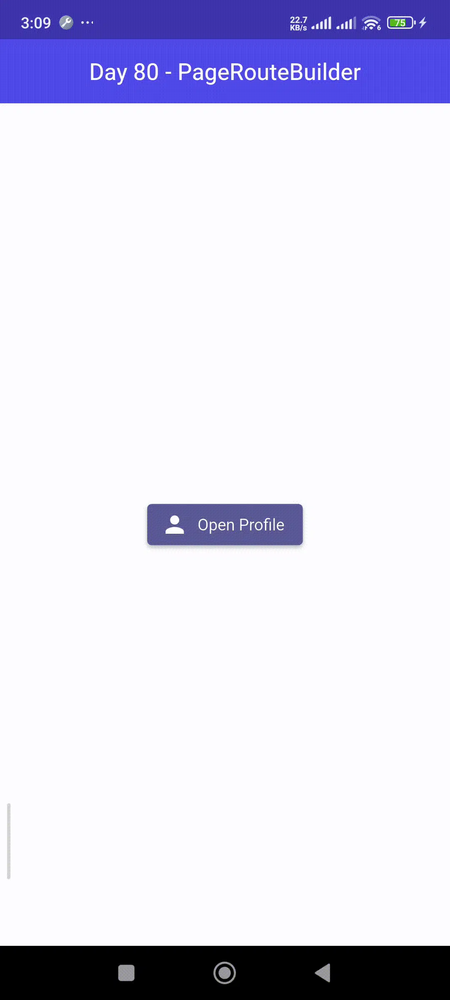</a><br/>
      <a href="lib/features/widgets_of_the_day/day_80_pageroute_builder/day80_pageroute_builder_widget.dart"><b style="font-size:13px; display:inline-block; max-width:120px; word-break:break-word;">RouteAnim</b></a><br/>
      <sub style="font-size:11px; color:#57606a;">Day 080 &middot; Custom nav</sub>
    </td>
    <td align="center" valign="top" style="width:20%; padding:6px; text-align:center; vertical-align:top; word-break:break-word; overflow-wrap:break-word;">
      <a href="screenshots/day81_draggable.webp">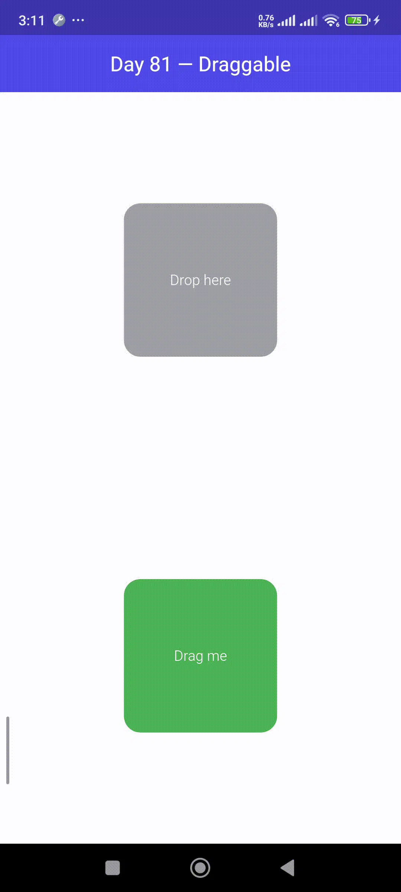</a><br/>
      <a href="lib/features/widgets_of_the_day/day_81_draggable/day81_draggable_widget.dart"><b style="font-size:13px; display:inline-block; max-width:120px; word-break:break-word;">Draggable</b></a><br/>
      <sub style="font-size:11px; color:#57606a;">Day 081 &middot; Drag &amp; Drop</sub>
    </td>
    <td align="center" valign="top" style="width:20%; padding:6px; text-align:center; vertical-align:top; word-break:break-word; overflow-wrap:break-word;">
      <a href="screenshots/day82_backdrop_filter.webp">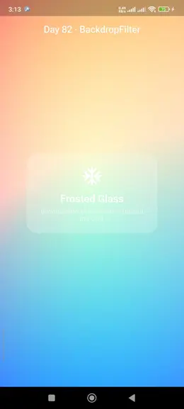</a><br/>
      <a href="lib/features/widgets_of_the_day/day_82_backdrop_filter/day82_backdrop_filter_widget.dart"><b style="font-size:13px; display:inline-block; max-width:120px; word-break:break-word;">Backdrop</b></a><br/>
      <sub style="font-size:11px; color:#57606a;">Day 082 &middot; Frosted glass</sub>
    </td>
    <td align="center" valign="top" style="width:20%; padding:6px; text-align:center; vertical-align:top; word-break:break-word; overflow-wrap:break-word;">
      <a href="screenshots/day83_reorderable_list_view.webp"></a><br/>
      <a href="lib/features/widgets_of_the_day/day_83_reorderable_list_view/day83_reorderable_list_view_widget.dart"><b style="font-size:13px; display:inline-block; max-width:120px; word-break:break-word;">ReorderList</b></a><br/>
      <sub style="font-size:11px; color:#57606a;">Day 083 &middot; Drag reorder</sub>
    </td>
    <td align="center" valign="top" style="width:20%; padding:6px; text-align:center; vertical-align:top; word-break:break-word; overflow-wrap:break-word;">
      <a href="screenshots/day84_fade_transition.webp">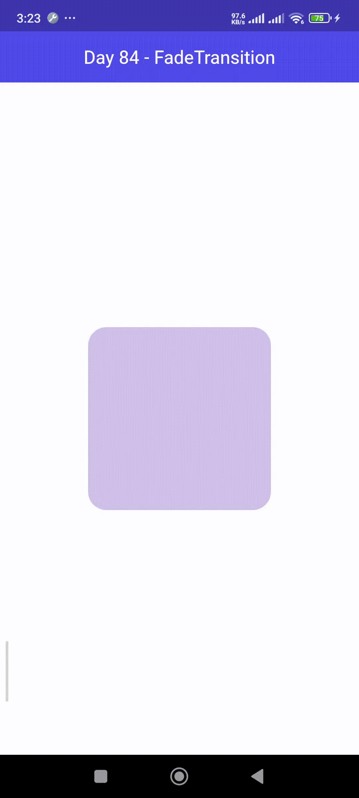</a><br/>
      <a href="lib/features/widgets_of_the_day/day_84_fade_transition/day84_fade_transition_widget.dart"><b style="font-size:13px; display:inline-block; max-width:120px; word-break:break-word;">FadeAnim</b></a><br/>
      <sub style="font-size:11px; color:#57606a;">Day 084 &middot; Opacity anim</sub>
    </td>
  </tr></tbody>
</table>

<table width="100%" style="table-layout:fixed; border-collapse:separate; border-spacing:8px;">
  <thead><tr>
    <th align="center" style="width:20%; font-size:11px; color:#0969da; border-bottom:2px solid #0969da; padding:4px; text-align:center; white-space:nowrap;">Day 085</th>
    <th align="center" style="width:20%; font-size:11px; color:#0969da; border-bottom:2px solid #0969da; padding:4px; text-align:center; white-space:nowrap;">Day 086</th>
    <th align="center" style="width:20%; font-size:11px; color:#0969da; border-bottom:2px solid #0969da; padding:4px; text-align:center; white-space:nowrap;">Day 087</th>
    <th align="center" style="width:20%; font-size:11px; color:#0969da; border-bottom:2px solid #0969da; padding:4px; text-align:center; white-space:nowrap;">Day 088</th>
    <th align="center" style="width:20%; font-size:11px; color:#0969da; border-bottom:2px solid #0969da; padding:4px; text-align:center; white-space:nowrap;">Day 089</th>
  </tr></thead>
  <tbody><tr>
    <td align="center" valign="top" style="width:20%; padding:6px; text-align:center; vertical-align:top; word-break:break-word; overflow-wrap:break-word;">
      <a href="screenshots/day85_circle_avatar.webp">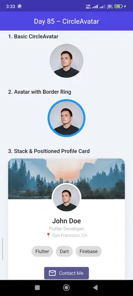</a><br/>
      <a href="lib/features/widgets_of_the_day/day_85_circle_avatar/day85_circle_avatar_widget.dart"><b style="font-size:13px; display:inline-block; max-width:120px; word-break:break-word;">CircleAvatar</b></a><br/>
      <sub style="font-size:11px; color:#57606a;">Day 085 &middot; Profile img</sub>
    </td>
    <td align="center" valign="top" style="width:20%; padding:6px; text-align:center; vertical-align:top; word-break:break-word; overflow-wrap:break-word;">
      <a href="screenshots/day86_tooltip.webp">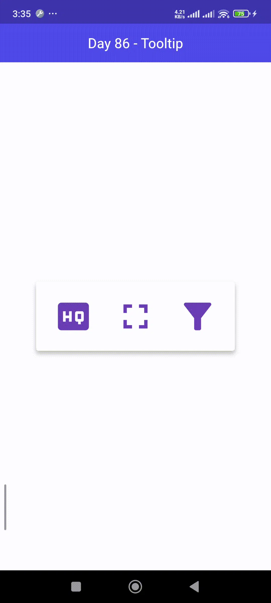</a><br/>
      <a href="lib/features/widgets_of_the_day/day_86_tooltip/day86_tooltip_widget.dart"><b style="font-size:13px; display:inline-block; max-width:120px; word-break:break-word;">Tooltip</b></a><br/>
      <sub style="font-size:11px; color:#57606a;">Day 086 &middot; Hints</sub>
    </td>
    <td align="center" valign="top" style="width:20%; padding:6px; text-align:center; vertical-align:top; word-break:break-word; overflow-wrap:break-word;">
      <a href="screenshots/day87_visibility.webp">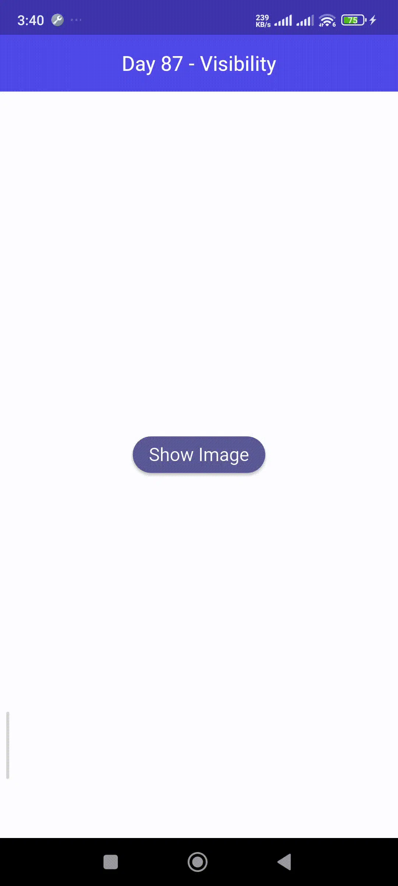</a><br/>
      <a href="lib/features/widgets_of_the_day/day_87_visibility/day87_visibility_widget.dart"><b style="font-size:13px; display:inline-block; max-width:120px; word-break:break-word;">Visibility</b></a><br/>
      <sub style="font-size:11px; color:#57606a;">Day 087 &middot; Show/Hide</sub>
    </td>
    <td align="center" valign="top" style="width:20%; padding:6px; text-align:center; vertical-align:top; word-break:break-word; overflow-wrap:break-word;">
      <a href="screenshots/day88_indexed_stack.webp">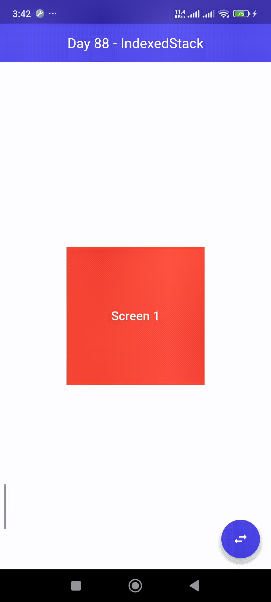</a><br/>
      <a href="lib/features/widgets_of_the_day/day_88_indexed_stack/day88_indexed_stack_widget.dart"><b style="font-size:13px; display:inline-block; max-width:120px; word-break:break-word;">IndexedStack</b></a><br/>
      <sub style="font-size:11px; color:#57606a;">Day 088 &middot; Multi-state</sub>
    </td>
    <td align="center" valign="top" style="width:20%; padding:6px; text-align:center; vertical-align:top; word-break:break-word; overflow-wrap:break-word;">
      <a href="screenshots/day89_navigator_2.0.webp">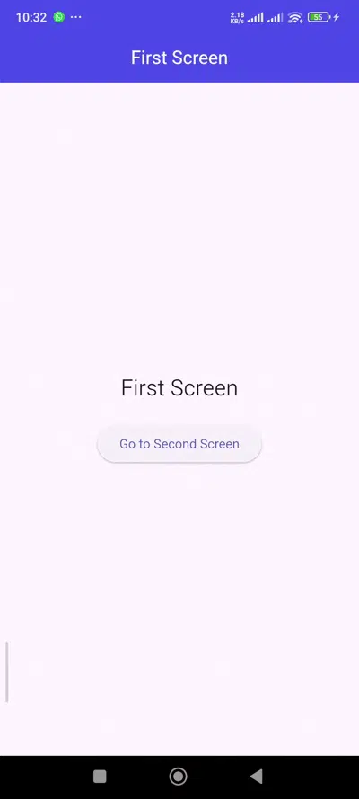</a><br/>
      <a href="lib/features/widgets_of_the_day/day_89_navigator_2.0/day89_navigator_2.0_widget.dart"><b style="font-size:13px; display:inline-block; max-width:120px; word-break:break-word;">Nav 2.0</b></a><br/>
      <sub style="font-size:11px; color:#57606a;">Day 089 &middot; Declarative</sub>
    </td>
  </tr></tbody>
</table>

<table width="100%" style="table-layout:fixed; border-collapse:separate; border-spacing:8px;">
  <thead><tr>
    <th align="center" style="width:20%; font-size:11px; color:#0969da; border-bottom:2px solid #0969da; padding:4px; text-align:center; white-space:nowrap;">Day 090</th>
    <th align="center" style="width:20%; font-size:11px; color:#0969da; border-bottom:2px solid #0969da; padding:4px; text-align:center; white-space:nowrap;">Day 091</th>
    <th align="center" style="width:20%; font-size:11px; color:#0969da; border-bottom:2px solid #0969da; padding:4px; text-align:center; white-space:nowrap;">Day 092</th>
    <th align="center" style="width:20%; font-size:11px; color:#0969da; border-bottom:2px solid #0969da; padding:4px; text-align:center; white-space:nowrap;">Day 093</th>
    <th align="center" style="width:20%; font-size:11px; color:#0969da; border-bottom:2px solid #0969da; padding:4px; text-align:center; white-space:nowrap;">Day 094</th>
  </tr></thead>
  <tbody><tr>
    <td align="center" valign="top" style="width:20%; padding:6px; text-align:center; vertical-align:top; word-break:break-word; overflow-wrap:break-word;">
      <a href="screenshots/day90_null_aware_operators.webp">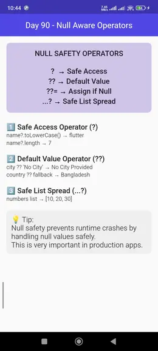</a><br/>
      <a href="lib/features/widgets_of_the_day/day_90_null_aware_operators/day90_null_aware_operators_widget.dart"><b style="font-size:13px; display:inline-block; max-width:120px; word-break:break-word;">NullSafety</b></a><br/>
      <sub style="font-size:11px; color:#57606a;">Day 090 &middot; Operators</sub>
    </td>
    <td align="center" valign="top" style="width:20%; padding:6px; text-align:center; vertical-align:top; word-break:break-word; overflow-wrap:break-word;">
      <a href="screenshots/day91_cascade_operator.webp">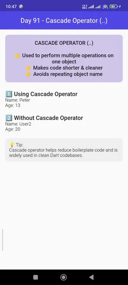</a><br/>
      <a href="lib/features/widgets_of_the_day/day_91_cascade_operator/day91_cascade_operator_widget.dart"><b style="font-size:13px; display:inline-block; max-width:120px; word-break:break-word;">Cascade</b></a><br/>
      <sub style="font-size:11px; color:#57606a;">Day 091 &middot; Chaining</sub>
    </td>
    <td align="center" valign="top" style="width:20%; padding:6px; text-align:center; vertical-align:top; word-break:break-word; overflow-wrap:break-word;">
      <a href="screenshots/day92_inherited.webp">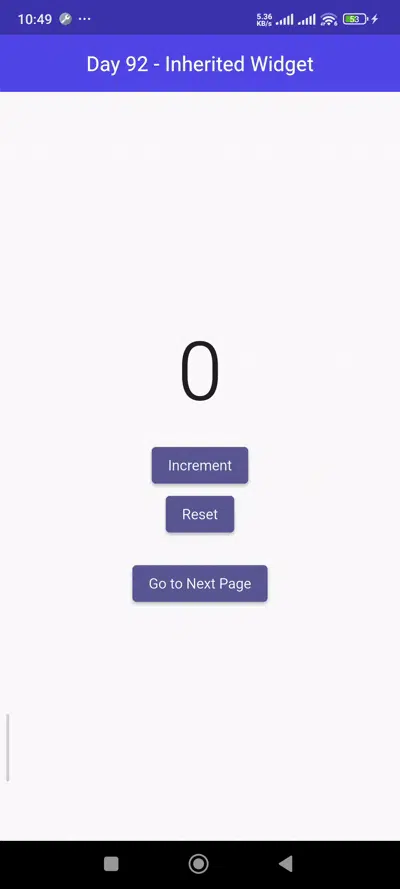</a><br/>
      <a href="lib/features/widgets_of_the_day/day_92_inherited_widget/day92_inherited_widget.dart"><b style="font-size:13px; display:inline-block; max-width:120px; word-break:break-word;">Inherited</b></a><br/>
      <sub style="font-size:11px; color:#57606a;">Day 092 &middot; State sharing</sub>
    </td>
    <td align="center" valign="top" style="width:20%; padding:6px; text-align:center; vertical-align:top; word-break:break-word; overflow-wrap:break-word;">
      <a href="screenshots/day93_fractional_sizedbox.webp">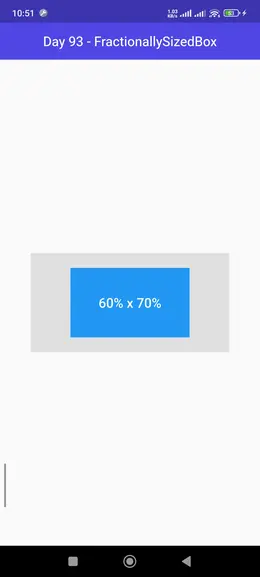</a><br/>
      <a href="lib/features/widgets_of_the_day/day_93_fractional_sizedbox/day93_fractional_sizedbox_widget.dart"><b style="font-size:13px; display:inline-block; max-width:120px; word-break:break-word;">FracSizedBox</b></a><br/>
      <sub style="font-size:11px; color:#57606a;">Day 093 &middot; Percentages</sub>
    </td>
    <td align="center" valign="top" style="width:20%; padding:6px; text-align:center; vertical-align:top; word-break:break-word; overflow-wrap:break-word;">
      <a href="screenshots/day94_constrained_box.webp">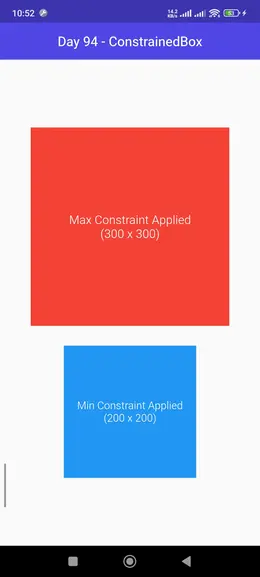</a><br/>
      <a href="lib/features/widgets_of_the_day/day_94_constrained_box/day94_constrained_box_widget.dart"><b style="font-size:13px; display:inline-block; max-width:120px; word-break:break-word;">Constrained</b></a><br/>
      <sub style="font-size:11px; color:#57606a;">Day 094 &middot; Limits</sub>
    </td>
  </tr></tbody>
</table>

<table width="100%" style="table-layout:fixed; border-collapse:separate; border-spacing:8px;">
  <thead><tr>
    <th align="center" style="width:20%; font-size:11px; color:#0969da; border-bottom:2px solid #0969da; padding:4px; text-align:center; white-space:nowrap;">Day 095</th>
    <th align="center" style="width:20%; font-size:11px; color:#0969da; border-bottom:2px solid #0969da; padding:4px; text-align:center; white-space:nowrap;">Day 096</th>
    <th align="center" style="width:20%; font-size:11px; color:#0969da; border-bottom:2px solid #0969da; padding:4px; text-align:center; white-space:nowrap;">Day 097</th>
    <th align="center" style="width:20%; font-size:11px; color:#0969da; border-bottom:2px solid #0969da; padding:4px; text-align:center; white-space:nowrap;">Day 098</th>
    <th align="center" style="width:20%; font-size:11px; color:#0969da; border-bottom:2px solid #0969da; padding:4px; text-align:center; white-space:nowrap;">Day 099</th>
  </tr></thead>
  <tbody><tr>
    <td align="center" valign="top" style="width:20%; padding:6px; text-align:center; vertical-align:top; word-break:break-word; overflow-wrap:break-word;">
      <a href="screenshots/day95_cupertino_search_textfield.webp"></a><br/>
      <a href="lib/features/widgets_of_the_day/day_95_cupertino_search_textfield/day95_cupertino_search_textfield_widget.dart"><b style="font-size:13px; display:inline-block; max-width:120px; word-break:break-word;">CupertinoSrch</b></a><br/>
      <sub style="font-size:11px; color:#57606a;">Day 095 &middot; iOS style</sub>
    </td>
    <td align="center" valign="top" style="width:20%; padding:6px; text-align:center; vertical-align:top; word-break:break-word; overflow-wrap:break-word;">
      <a href="screenshots/day96_stateful_builder.webp">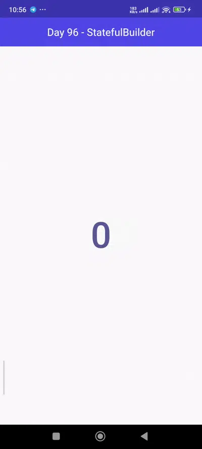</a><br/>
      <a href="lib/features/widgets_of_the_day/day_96_stateful_builder/day96_stateful_builder_widget.dart"><b style="font-size:13px; display:inline-block; max-width:120px; word-break:break-word;">StatefulBldr</b></a><br/>
      <sub style="font-size:11px; color:#57606a;">Day 096 &middot; Local state</sub>
    </td>
    <td align="center" valign="top" style="width:20%; padding:6px; text-align:center; vertical-align:top; word-break:break-word; overflow-wrap:break-word;">
      <a href="screenshots/day97_layout_builder.webp">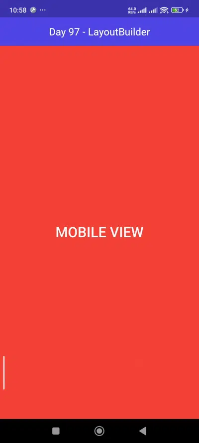</a><br/>
      <a href="lib/features/widgets_of_the_day/day_97_layout_builder/day97_layout_builder_widget.dart"><b style="font-size:13px; display:inline-block; max-width:120px; word-break:break-word;">LayoutBuilder</b></a><br/>
      <sub style="font-size:11px; color:#57606a;">Day 097 &middot; Responsive</sub>
    </td>
    <td align="center" valign="top" style="width:20%; padding:6px; text-align:center; vertical-align:top; word-break:break-word; overflow-wrap:break-word;">
      <a href="screenshots/day98_orientation_builder.webp"></a><br/>
      <a href="lib/features/widgets_of_the_day/day_98_orientation_builder/day98_orientation_builder_widget.dart"><b style="font-size:13px; display:inline-block; max-width:120px; word-break:break-word;">OrientBuilder</b></a><br/>
      <sub style="font-size:11px; color:#57606a;">Day 098 &middot; Rotation</sub>
    </td>
    <td align="center" valign="top" style="width:20%; padding:6px; text-align:center; vertical-align:top; word-break:break-word; overflow-wrap:break-word;">
      <a href="screenshots/day99_platform_detect.webp">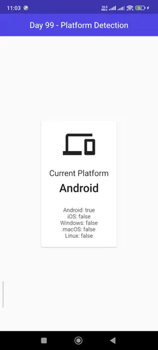</a><br/>
      <a href="lib/features/widgets_of_the_day/day_99_platform_detect/day99_platform_detect_widget.dart"><b style="font-size:13px; display:inline-block; max-width:120px; word-break:break-word;">Platform</b></a><br/>
      <sub style="font-size:11px; color:#57606a;">Day 099 &middot; OS detection</sub>
    </td>
  </tr></tbody>
</table>

<table width="100%" style="table-layout:fixed; border-collapse:separate; border-spacing:8px;">
  <thead><tr>
    <th align="center" style="width:20%; font-size:11px; color:#0969da; border-bottom:2px solid #0969da; padding:4px; text-align:center; white-space:nowrap;">Day 100</th>
    <th align="center" style="width:20%; font-size:11px; color:#0969da; border-bottom:2px solid #0969da; padding:4px; text-align:center; white-space:nowrap;">Day 101</th>
    <th align="center" style="width:20%; font-size:11px; color:#0969da; border-bottom:2px solid #0969da; padding:4px; text-align:center; white-space:nowrap;">Day 102</th>
    <th align="center" style="width:20%; font-size:11px; color:#0969da; border-bottom:2px solid #0969da; padding:4px; text-align:center; white-space:nowrap;">Day 103</th>
    <th align="center" style="width:20%; font-size:11px; color:#0969da; border-bottom:2px solid #0969da; padding:4px; text-align:center; white-space:nowrap;">Day 104</th>
  </tr></thead>
  <tbody><tr>
    <td align="center" valign="top" style="width:20%; padding:6px; text-align:center; vertical-align:top; word-break:break-word; overflow-wrap:break-word;">
      <a href="screenshots/day100_future_builder.webp">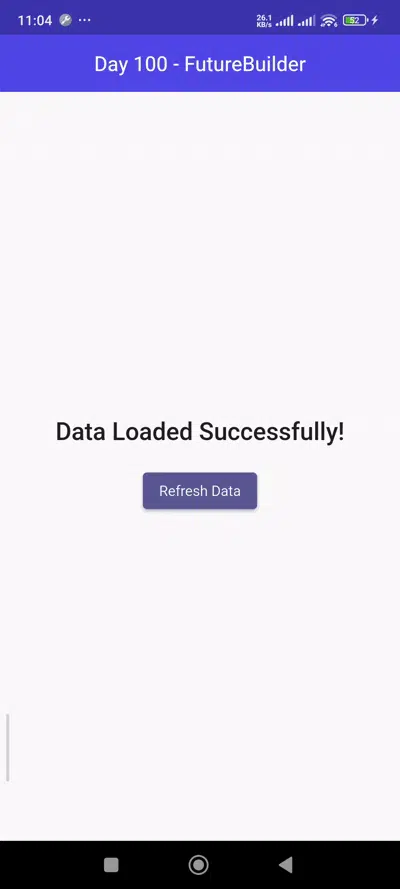</a><br/>
      <a href="lib/features/widgets_of_the_day/day_100_future_builder/day100_future_builder_widget.dart"><b style="font-size:13px; display:inline-block; max-width:120px; word-break:break-word;">FutureBuilder</b></a><br/>
      <sub style="font-size:11px; color:#57606a;">Day 100 &middot; Async data</sub>
    </td>
    <td align="center" valign="top" style="width:20%; padding:6px; text-align:center; vertical-align:top; word-break:break-word; overflow-wrap:break-word;">
      <a href="screenshots/day101_stream_builder.webp"></a><br/>
      <a href="lib/features/widgets_of_the_day/day_101_stream_builder/day101_stream_builder_widget.dart"><b style="font-size:13px; display:inline-block; max-width:120px; word-break:break-word;">StreamBuilder</b></a><br/>
      <sub style="font-size:11px; color:#57606a;">Day 101 &middot; Real-time</sub>
    </td>
    <td align="center" valign="top" style="width:20%; padding:6px; text-align:center; vertical-align:top; word-break:break-word; overflow-wrap:break-word;">
      <a href="screenshots/day102_change_notifier.webp">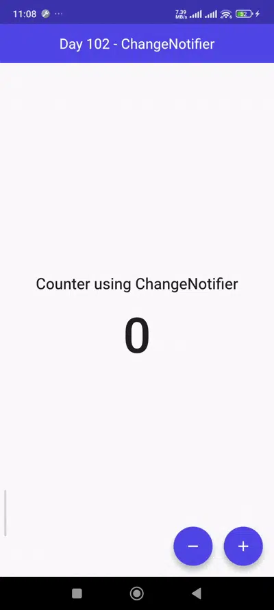</a><br/>
      <a href="lib/features/widgets_of_the_day/day_102_change_notifier/day102_change_notifier_widget.dart"><b style="font-size:13px; display:inline-block; max-width:120px; word-break:break-word;">ChangeNotifier</b></a><br/>
      <sub style="font-size:11px; color:#57606a;">Day 102 &middot; State mgmt</sub>
    </td>
    <td align="center" valign="top" style="width:20%; padding:6px; text-align:center; vertical-align:top; word-break:break-word; overflow-wrap:break-word;">
      <a href="screenshots/day103_value_notifier.webp">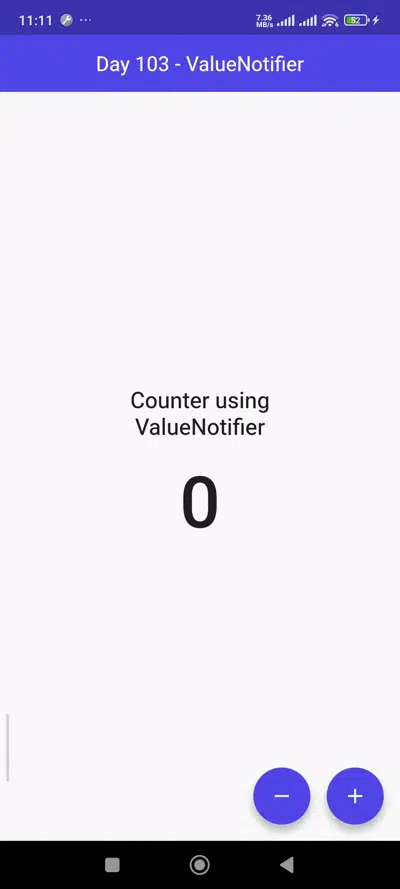</a><br/>
      <a href="lib/features/widgets_of_the_day/day_103_value_notifier/day103_value_notifier_widget.dart"><b style="font-size:13px; display:inline-block; max-width:120px; word-break:break-word;">ValueNotifier</b></a><br/>
      <sub style="font-size:11px; color:#57606a;">Day 103 &middot; Reactive</sub>
    </td>
    <td align="center" valign="top" style="width:20%; padding:6px; text-align:center; vertical-align:top; word-break:break-word; overflow-wrap:break-word;">
      <a href="screenshots/day104_inherited_notifier.webp">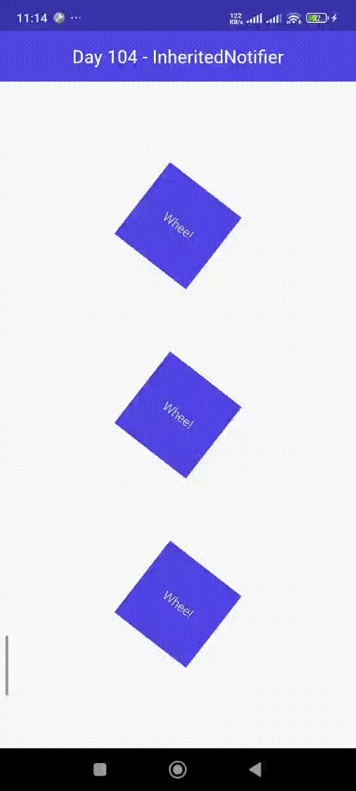</a><br/>
      <a href="lib/features/widgets_of_the_day/day_104_inherited_notifier/day104_inherited_notifier_widget.dart"><b style="font-size:13px; display:inline-block; max-width:120px; word-break:break-word;">InheritNotify</b></a><br/>
      <sub style="font-size:11px; color:#57606a;">Day 104 &middot; Reactive</sub>
    </td>
  </tr></tbody>
</table>

<table width="100%" style="table-layout:fixed; border-collapse:separate; border-spacing:8px;">
  <thead><tr>
    <th align="center" style="width:20%; font-size:11px; color:#0969da; border-bottom:2px solid #0969da; padding:4px; text-align:center; white-space:nowrap;">Day 105</th>
    <th align="center" style="width:20%; font-size:11px; color:#0969da; border-bottom:2px solid #0969da; padding:4px; text-align:center; white-space:nowrap;">Day 106</th>
    <th align="center" style="width:20%; font-size:11px; color:#0969da; border-bottom:2px solid #0969da; padding:4px; text-align:center; white-space:nowrap;">Day 107</th>
    <th align="center" style="width:20%; font-size:11px; color:#0969da; border-bottom:2px solid #0969da; padding:4px; text-align:center; white-space:nowrap;">Day 108</th>
    <th align="center" style="width:20%; font-size:11px; color:#0969da; border-bottom:2px solid #0969da; padding:4px; text-align:center; white-space:nowrap;">Day 109</th>
  </tr></thead>
  <tbody><tr>
    <td align="center" valign="top" style="width:20%; padding:6px; text-align:center; vertical-align:top; word-break:break-word; overflow-wrap:break-word;">
      <a href="screenshots/day105_listener.webp"></a><br/>
      <a href="lib/features/widgets_of_the_day/day_105_listener/day105_listener_widget.dart"><b style="font-size:13px; display:inline-block; max-width:120px; word-break:break-word;">Listener</b></a><br/>
      <sub style="font-size:11px; color:#57606a;">Day 105 &middot; Pointer</sub>
    </td>
    <td align="center" valign="top" style="width:20%; padding:6px; text-align:center; vertical-align:top; word-break:break-word; overflow-wrap:break-word;">
      <a href="screenshots/day106_builder.webp"></a><br/>
      <a href="lib/features/widgets_of_the_day/day_106_builder/day106_builder_widget.dart"><b style="font-size:13px; display:inline-block; max-width:120px; word-break:break-word;">Builder</b></a><br/>
      <sub style="font-size:11px; color:#57606a;">Day 106 &middot; Context</sub>
    </td>
    <td align="center" valign="top" style="width:20%; padding:6px; text-align:center; vertical-align:top; word-break:break-word; overflow-wrap:break-word;">
      <a href="screenshots/day107_page_view_builder.webp"></a><br/>
      <a href="lib/features/widgets_of_the_day/day_107_page_view_builder/day107_page_view_builder_widget.dart"><b style="font-size:13px; display:inline-block; max-width:120px; word-break:break-word;">PageView.bldr</b></a><br/>
      <sub style="font-size:11px; color:#57606a;">Day 107 &middot; Lazy pages</sub>
    </td>
    <td align="center" valign="top" style="width:20%; padding:6px; text-align:center; vertical-align:top; word-break:break-word; overflow-wrap:break-word;">
      <a href="screenshots/day108_animated_builder.webp">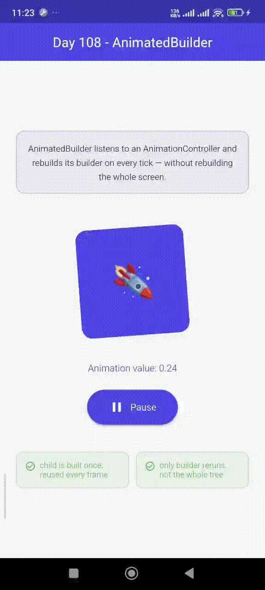</a><br/>
      <a href="lib/features/widgets_of_the_day/day_108_animated_builder/day108_animated_builder_widget.dart"><b style="font-size:13px; display:inline-block; max-width:120px; word-break:break-word;">AnimBuilder</b></a><br/>
      <sub style="font-size:11px; color:#57606a;">Day 108 &middot; Optimized</sub>
    </td>
    <td align="center" valign="top" style="width:20%; padding:6px; text-align:center; vertical-align:top; word-break:break-word; overflow-wrap:break-word;">
      <a href="screenshots/day109_snackbar.webp"></a><br/>
      <a href="lib/features/widgets_of_the_day/day_109_snackbar/day109_snackbar_widget.dart"><b style="font-size:13px; display:inline-block; max-width:120px; word-break:break-word;">SnackBar</b></a><br/>
      <sub style="font-size:11px; color:#57606a;">Day 109 &middot; Alerts</sub>
    </td>
  </tr></tbody>
</table>

<table width="100%" style="table-layout:fixed; border-collapse:separate; border-spacing:8px;">
  <thead><tr>
    <th align="center" style="width:20%; font-size:11px; color:#0969da; border-bottom:2px solid #0969da; padding:4px; text-align:center; white-space:nowrap;">Day 110</th>
    <th align="center" style="width:20%; font-size:11px; color:#0969da; border-bottom:2px solid #0969da; padding:4px; text-align:center; white-space:nowrap;">Day 111</th>
    <th align="center" style="width:20%; font-size:11px; color:#0969da; border-bottom:2px solid #0969da; padding:4px; text-align:center; white-space:nowrap;">Day 112</th>
    <th align="center" style="width:20%; font-size:11px; color:#0969da; border-bottom:2px solid #0969da; padding:4px; text-align:center; white-space:nowrap;">Day 113</th>
    <th align="center" style="width:20%; font-size:11px; color:#0969da; border-bottom:2px solid #0969da; padding:4px; text-align:center; white-space:nowrap;">Day 114</th>
  </tr></thead>
  <tbody><tr>
    <td align="center" valign="top" style="width:20%; padding:6px; text-align:center; vertical-align:top; word-break:break-word; overflow-wrap:break-word;">
      <a href="screenshots/day110_sizedbox.webp">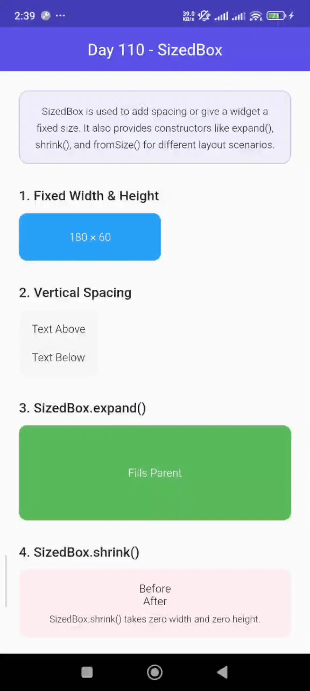</a><br/>
      <a href="lib/features/widgets_of_the_day/day_110_sizedbox/day110_sizedbox_widget.dart"><b style="font-size:13px; display:inline-block; max-width:120px; word-break:break-word;">SizedBox</b></a><br/>
      <sub style="font-size:11px; color:#57606a;">Day 110 &middot; Fixed size</sub>
    </td>
    <td align="center" valign="top" style="width:20%; padding:6px; text-align:center; vertical-align:top; word-break:break-word; overflow-wrap:break-word;">
      <a href="screenshots/day111_intrinsicheight_and_intrinsicwidth.webp">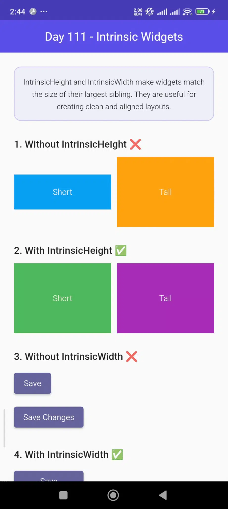</a><br/>
      <a href="lib/features/widgets_of_the_day/day_111_intrinsicheight_and_intrinsicwidth/day111_intrinsicheight_and_intrinsicwidth_widget.dart"><b style="font-size:13px; display:inline-block; max-width:120px; word-break:break-word;">Intrinsic</b></a><br/>
      <sub style="font-size:11px; color:#57606a;">Day 111 &middot; Natural size</sub>
    </td>
    <td align="center" valign="top" style="width:20%; padding:6px; text-align:center; vertical-align:top; word-break:break-word; overflow-wrap:break-word;">
      <a href="screenshots/day112_overflowbox.webp">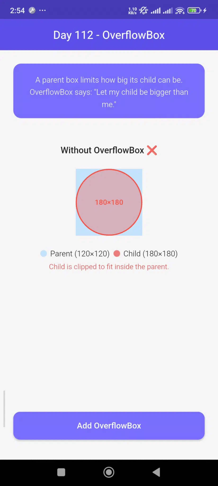</a><br/>
      <a href="lib/features/widgets_of_the_day/day_112_overflowbox/day112_overflowbox_widget.dart"><b style="font-size:13px; display:inline-block; max-width:120px; word-break:break-word;">OverflowBox</b></a><br/>
      <sub style="font-size:11px; color:#57606a;">Day 112 &middot; Overflow</sub>
    </td>
    <td align="center" valign="top" style="width:20%; padding:6px; text-align:center; vertical-align:top; word-break:break-word; overflow-wrap:break-word;">
      <a href="screenshots/day113_unconstrained_box.webp">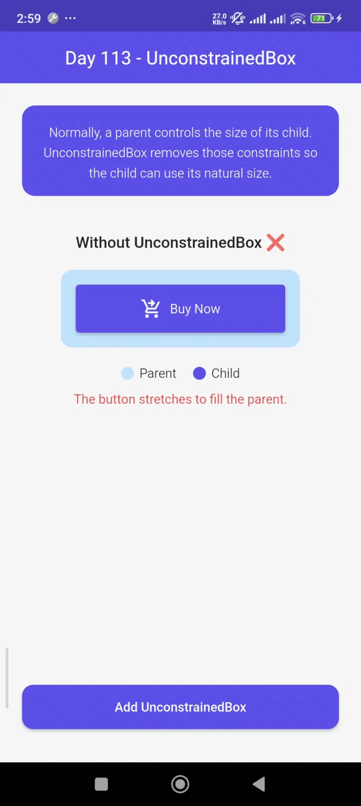</a><br/>
      <a href="lib/features/widgets_of_the_day/day_113_unconstrained_box/day113_unconstrained_box_widget.dart"><b style="font-size:13px; display:inline-block; max-width:120px; word-break:break-word;">Unconstrained</b></a><br/>
      <sub style="font-size:11px; color:#57606a;">Day 113 &middot; No limits</sub>
    </td>
    <td align="center" valign="top" style="width:20%; padding:6px; text-align:center; vertical-align:top; word-break:break-word; overflow-wrap:break-word;">
      <a href="screenshots/day114_limited_box.webp">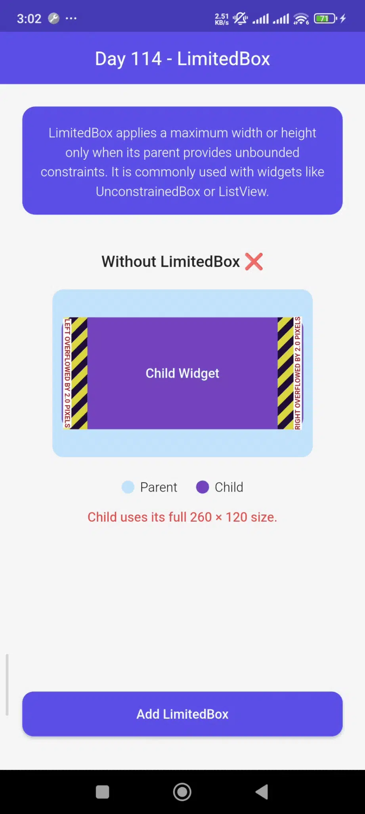</a><br/>
      <a href="lib/features/widgets_of_the_day/day_114_limited_box/day114_limited_box_widget.dart"><b style="font-size:13px; display:inline-block; max-width:120px; word-break:break-word;">LimitedBox</b></a><br/>
      <sub style="font-size:11px; color:#57606a;">Day 114 &middot; Max limits</sub>
    </td>
  </tr></tbody>
</table>

<table width="100%" style="table-layout:fixed; border-collapse:separate; border-spacing:8px;">
  <thead><tr>
    <th align="center" style="width:20%; font-size:11px; color:#0969da; border-bottom:2px solid #0969da; padding:4px; text-align:center; white-space:nowrap;">Day 115</th>
    <th align="center" style="width:20%; font-size:11px; color:#0969da; border-bottom:2px solid #0969da; padding:4px; text-align:center; white-space:nowrap;">Day 116</th>
    <th align="center" style="width:20%; font-size:11px; color:#0969da; border-bottom:2px solid #0969da; padding:4px; text-align:center; white-space:nowrap;">Day 117</th>
    <th align="center" style="width:20%; font-size:11px; color:#0969da; border-bottom:2px solid #0969da; padding:4px; text-align:center; white-space:nowrap;">Day 118</th>
    <th align="center" style="width:20%; font-size:11px; color:#0969da; border-bottom:2px solid #0969da; padding:4px; text-align:center; white-space:nowrap;">Day 119</th>
  </tr></thead>
  <tbody><tr>
    <td align="center" valign="top" style="width:20%; padding:6px; text-align:center; vertical-align:top; word-break:break-word; overflow-wrap:break-word;">
      <a href="screenshots/day115_baseline.webp">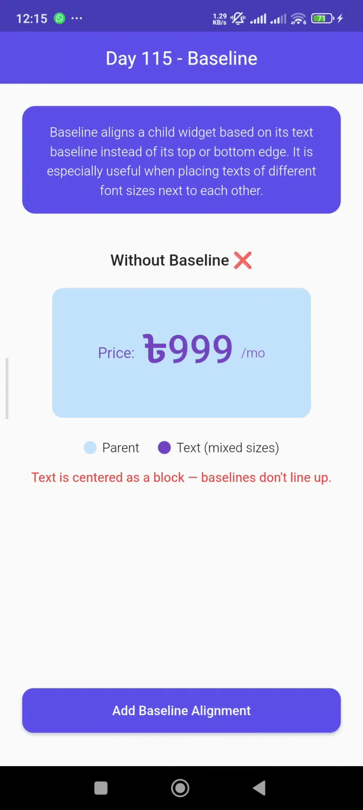</a><br/>
      <a href="lib/features/widgets_of_the_day/day_115_baseline/day115_baseline_widget.dart"><b style="font-size:13px; display:inline-block; max-width:120px; word-break:break-word;">Baseline</b></a><br/>
      <sub style="font-size:11px; color:#57606a;">Day 115 &middot; Text align</sub>
    </td>
    <td align="center" valign="top" style="width:20%; padding:6px; text-align:center; vertical-align:top; word-break:break-word; overflow-wrap:break-word;">
      <a href="screenshots/day116_opacity.webp"></a><br/>
      <a href="lib/features/widgets_of_the_day/day_116_opacity/day116_opacity_widget.dart"><b style="font-size:13px; display:inline-block; max-width:120px; word-break:break-word;">Opacity</b></a><br/>
      <sub style="font-size:11px; color:#57606a;">Day 116 &middot; Transparency</sub>
    </td>
    <td align="center" valign="top" style="width:20%; padding:6px; text-align:center; vertical-align:top; word-break:break-word; overflow-wrap:break-word;">
      <a href="screenshots/day117_color_filtered.webp">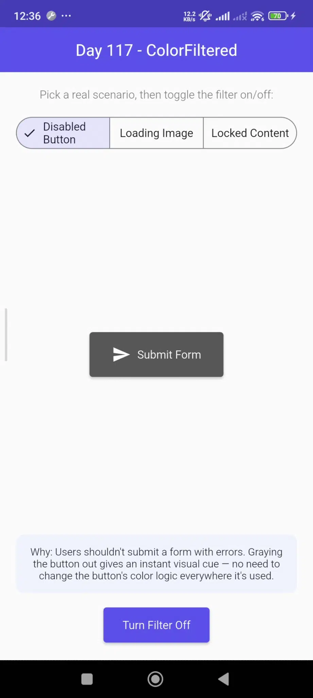</a><br/>
      <a href="lib/features/widgets_of_the_day/day_117_color_filtered/day117_color_filtered_widget.dart"><b style="font-size:13px; display:inline-block; max-width:120px; word-break:break-word;">ColorFiltered</b></a><br/>
      <sub style="font-size:11px; color:#57606a;">Day 117 &middot; Color effects</sub>
    </td>
    <td align="center" valign="top" style="width:20%; padding:6px; text-align:center; vertical-align:top; word-break:break-word; overflow-wrap:break-word;">
      <a href="screenshots/day118_shadder_mask.webp">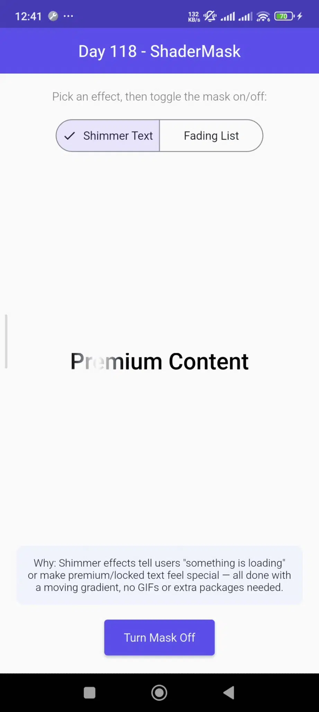</a><br/>
      <a href="lib/features/widgets_of_the_day/day_118_shadder_mask/day118_shadder_mask_widget.dart"><b style="font-size:13px; display:inline-block; max-width:120px; word-break:break-word;">ShaderMask</b></a><br/>
      <sub style="font-size:11px; color:#57606a;">Day 118 &middot; Gradient mask</sub>
    </td>
    <td align="center" valign="top" style="width:20%; padding:6px; text-align:center; vertical-align:top; word-break:break-word; overflow-wrap:break-word;">
      <a href="screenshots/day119_decorated_box.webp">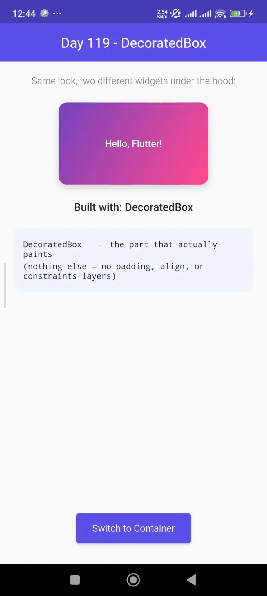</a><br/>
      <a href="lib/features/widgets_of_the_day/day_119_decorated_box/day119_decorated_box_widget.dart"><b style="font-size:13px; display:inline-block; max-width:120px; word-break:break-word;">DecoratedBox</b></a><br/>
      <sub style="font-size:11px; color:#57606a;">Day 119 &middot; Box styling</sub>
    </td>
  </tr></tbody>
</table>

<table width="100%" style="table-layout:fixed; border-collapse:separate; border-spacing:8px;">
  <thead><tr>
    <th align="center" style="width:20%; font-size:11px; color:#0969da; border-bottom:2px solid #0969da; padding:4px; text-align:center; white-space:nowrap;">Day 120</th>
    <th align="center" style="width:20%; font-size:11px; color:#0969da; border-bottom:2px solid #0969da; padding:4px; text-align:center; white-space:nowrap;">Day 121</th>
    <th align="center" style="width:20%; font-size:11px; color:#0969da; border-bottom:2px solid #0969da; padding:4px; text-align:center; white-space:nowrap;">Day 122</th>
    <th align="center" style="width:20%; font-size:11px; color:#0969da; border-bottom:2px solid #0969da; padding:4px; text-align:center; white-space:nowrap;">Day 123</th>
    <th align="center" style="width:20%; font-size:11px; color:#0969da; border-bottom:2px solid #0969da; padding:4px; text-align:center; white-space:nowrap;">Day 124</th>
  </tr></thead>
  <tbody><tr>
    <td align="center" valign="top" style="width:20%; padding:6px; text-align:center; vertical-align:top; word-break:break-word; overflow-wrap:break-word;">
      <a href="screenshots/day120_fractional_translation.webp">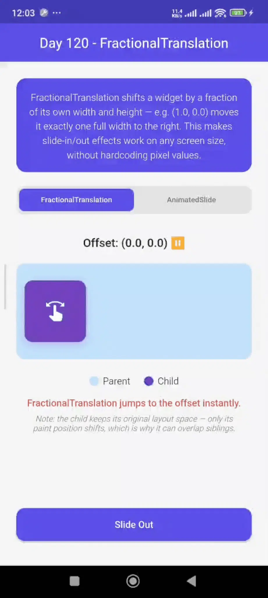</a><br/>
      <a href="lib/features/widgets_of_the_day/day_120_fractional_translation/day120_fractional_translation_widget.dart"><b style="font-size:13px; display:inline-block; max-width:120px; word-break:break-word;">FractionalTrans</b></a><br/>
      <sub style="font-size:11px; color:#57606a;">Day 120 &middot; Relative offset</sub>
    </td>
    <td align="center" valign="top" style="width:20%; padding:6px; text-align:center; vertical-align:top; word-break:break-word; overflow-wrap:break-word;">
      <a href="screenshots/day121_custom_multi_child_layout.webp">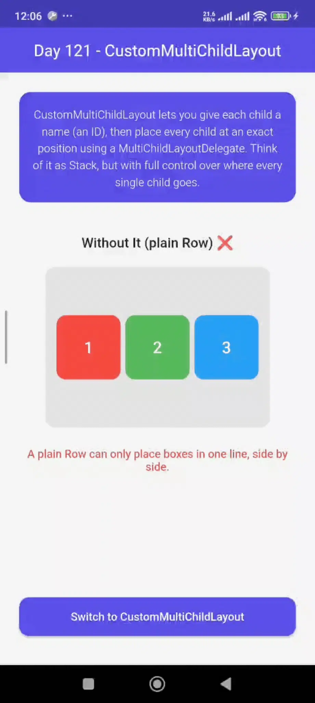</a><br/>
      <a href="lib/features/widgets_of_the_day/day_121_custom_multi_child_layout/day121_custom_multi_child_layout_widget.dart"><b style="font-size:13px; display:inline-block; max-width:120px; word-break:break-word;">MultiChildLayout</b></a><br/>
      <sub style="font-size:11px; color:#57606a;">Day 121 &middot; Custom layout</sub>
    </td>
    <td align="center" valign="top" style="width:20%; padding:6px; text-align:center; vertical-align:top; word-break:break-word; overflow-wrap:break-word;">
      <a href="screenshots/day122_text_input_formatter.webp">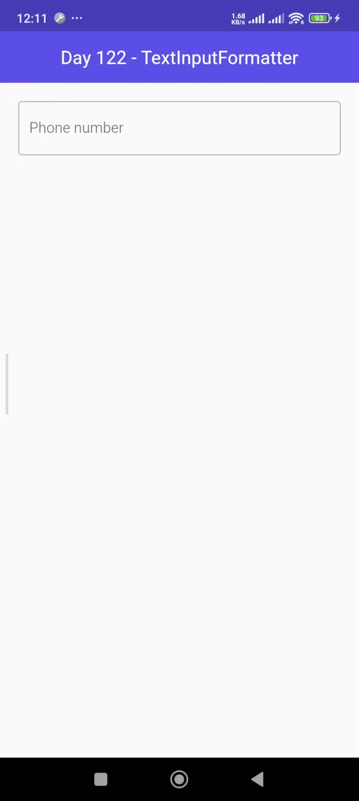</a><br/>
      <a href="lib/features/widgets_of_the_day/day_122_text_input_formatter/day122_text_input_formatter_widget.dart"><b style="font-size:13px; display:inline-block; max-width:120px; word-break:break-word;">InputFormatter</b></a><br/>
      <sub style="font-size:11px; color:#57606a;">Day 122 &middot; Input formatting</sub>
    </td>
    <td align="center" valign="top" style="width:20%; padding:6px; text-align:center; vertical-align:top; word-break:break-word; overflow-wrap:break-word;">
      <a href="screenshots/day123_auto_fill_group.webp">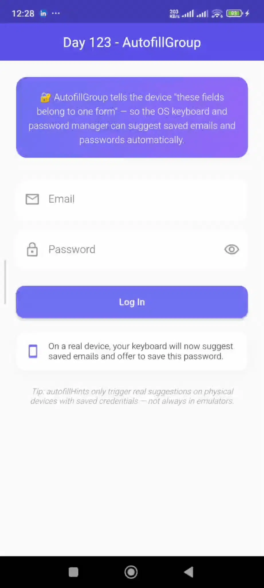</a><br/>
      <a href="lib/features/widgets_of_the_day/day_123_auto_fill_group/day123_auto_fill_group_widget.dart"><b style="font-size:13px; display:inline-block; max-width:120px; word-break:break-word;">AutofillGroup</b></a><br/>
      <sub style="font-size:11px; color:#57606a;">Day 123 &middot; Grouped autofill</sub>
    </td>
    <td align="center" valign="top" style="width:20%; padding:6px; text-align:center; vertical-align:top; word-break:break-word; overflow-wrap:break-word;">
      <a href="screenshots/day124_editable_text.webp">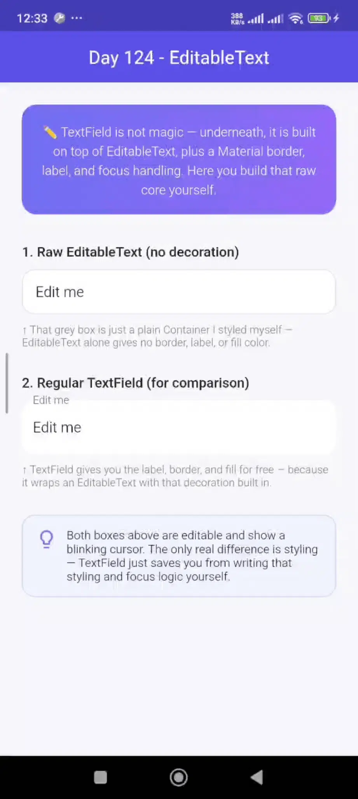</a><br/>
      <a href="lib/features/widgets_of_the_day/day_124_editable_text/day124_editable_text_widget.dart"><b style="font-size:13px; display:inline-block; max-width:120px; word-break:break-word;">EditableText</b></a><br/>
      <sub style="font-size:11px; color:#57606a;">Day 124 &middot; Raw text editing</sub>
    </td>
  </tr></tbody>
</table>

<table width="100%" style="table-layout:fixed; border-collapse:separate; border-spacing:8px;">
  <thead><tr>
    <th align="center" style="width:20%; font-size:11px; color:#0969da; border-bottom:2px solid #0969da; padding:4px; text-align:center; white-space:nowrap;">Day 125</th>
    <th align="center" style="width:20%; font-size:11px; color:#0969da; border-bottom:2px solid #0969da; padding:4px; text-align:center; white-space:nowrap;">Day 126</th>
    <th align="center" style="width:20%; font-size:11px; color:#0969da; border-bottom:2px solid #0969da; padding:4px; text-align:center; white-space:nowrap;">Day 127</th>
    <th align="center" style="width:20%; font-size:11px; color:#0969da; border-bottom:2px solid #0969da; padding:4px; text-align:center; white-space:nowrap;">Day 128</th>
    <th align="center" style="width:20%; font-size:11px; color:#0969da; border-bottom:2px solid #0969da; padding:4px; text-align:center; white-space:nowrap;">Day 129</th>
  </tr></thead>
  <tbody><tr>
    <td align="center" valign="top" style="width:20%; padding:6px; text-align:center; vertical-align:top; word-break:break-word; overflow-wrap:break-word;">
      <a href="screenshots/day125_default_text_style.webp">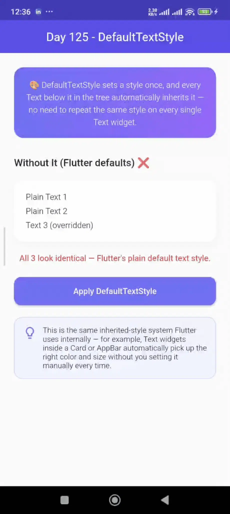</a><br/>
      <a href="lib/features/widgets_of_the_day/day_125_default_text_style/day125_default_text_style_widget.dart"><b style="font-size:13px; display:inline-block; max-width:120px; word-break:break-word;">DefaultTextStyle</b></a><br/>
      <sub style="font-size:11px; color:#57606a;">Day 125 &middot; Inherited style</sub>
    </td>
    <td align="center" valign="top" style="width:20%; padding:6px; text-align:center; vertical-align:top; word-break:break-word; overflow-wrap:break-word;">
      <a href="screenshots/day126_sliverlist_and_slivergrid.webp">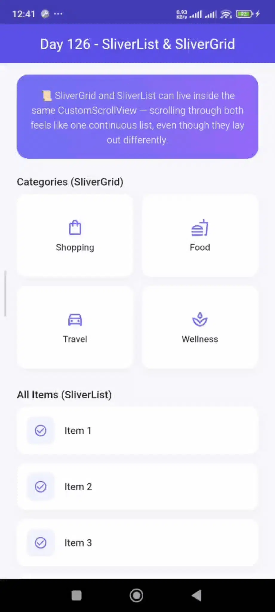</a><br/>
      <a href="lib/features/widgets_of_the_day/day_126_sliverlist_and_slivergrid/day126_sliverlist_and_slivergrid_widget.dart"><b style="font-size:13px; display:inline-block; max-width:120px; word-break:break-word;">Sliver List/Grid</b></a><br/>
      <sub style="font-size:11px; color:#57606a;">Day 126 &middot; Sliver collections</sub>
    </td>
    <td align="center" valign="top" style="width:20%; padding:6px; text-align:center; vertical-align:top; word-break:break-word; overflow-wrap:break-word;">
      <a href="screenshots/day127_sliver_persistent_header.webp">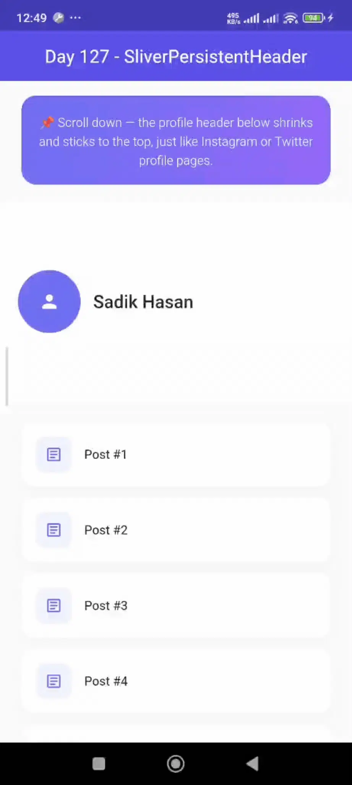</a><br/>
      <a href="lib/features/widgets_of_the_day/day_127_sliver_persistent_header/day127_sliver_persistent_header_widget.dart"><b style="font-size:13px; display:inline-block; max-width:120px; word-break:break-word;">SliverPersHeader</b></a><br/>
      <sub style="font-size:11px; color:#57606a;">Day 127 &middot; Pinned header</sub>
    </td>
    <td align="center" valign="top" style="width:20%; padding:6px; text-align:center; vertical-align:top; word-break:break-word; overflow-wrap:break-word;">
      <a href="screenshots/day128_sliver_fill_remaining.webp">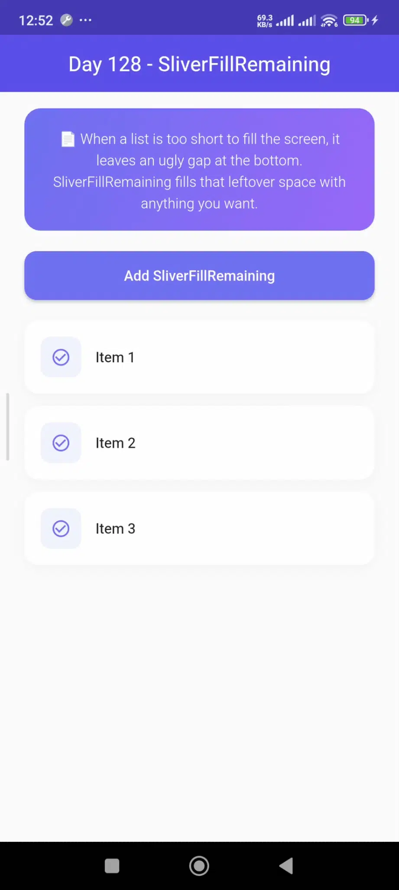</a><br/>
      <a href="lib/features/widgets_of_the_day/day_128_sliver_fill_remaining/day128_sliver_fill_remaining_widget.dart"><b style="font-size:13px; display:inline-block; max-width:120px; word-break:break-word;">SliverFillRem</b></a><br/>
      <sub style="font-size:11px; color:#57606a;">Day 128 &middot; Fill space</sub>
    </td>
    <td align="center" valign="top" style="width:20%; padding:6px; text-align:center; vertical-align:top; word-break:break-word; overflow-wrap:break-word;">
      <a href="screenshots/day129_nested_scroll_view.webp">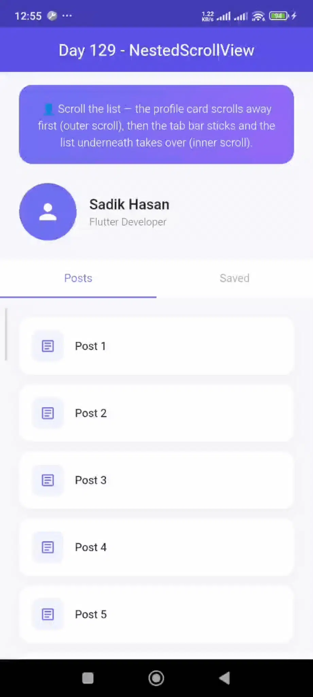</a><br/>
      <a href="lib/features/widgets_of_the_day/day_129_nested_scroll_view/day129_nested_scroll_view_widget.dart"><b style="font-size:13px; display:inline-block; max-width:120px; word-break:break-word;">NestedScrollView</b></a><br/>
      <sub style="font-size:11px; color:#57606a;">Day 129 &middot; Nested scroll</sub>
    </td>
  </tr></tbody>
</table>

<table width="100%" style="table-layout:fixed; border-collapse:separate; border-spacing:8px;">
  <thead><tr>
    <th align="center" style="width:20%; font-size:11px; color:#0969da; border-bottom:2px solid #0969da; padding:4px; text-align:center; white-space:nowrap;">Day 130</th>
    <th align="center" style="width:20%; font-size:11px; color:#0969da; border-bottom:2px solid #0969da; padding:4px; text-align:center; white-space:nowrap;">Day 131</th>
    <th align="center" style="width:20%; font-size:11px; color:#0969da; border-bottom:2px solid #0969da; padding:4px; text-align:center; white-space:nowrap;">Day 132</th>
    <th align="center" style="width:20%; font-size:11px; color:#0969da; border-bottom:2px solid #0969da; padding:4px; text-align:center; white-space:nowrap;">Day 133</th>
    <th align="center" style="width:20%; font-size:11px; color:#0969da; border-bottom:2px solid #0969da; padding:4px; text-align:center; white-space:nowrap;">Day 134</th>
  </tr></thead>
  <tbody><tr>
    <td align="center" valign="top" style="width:20%; padding:6px; text-align:center; vertical-align:top; word-break:break-word; overflow-wrap:break-word;">
      <a href="screenshots/day130_scroll_controller.webp">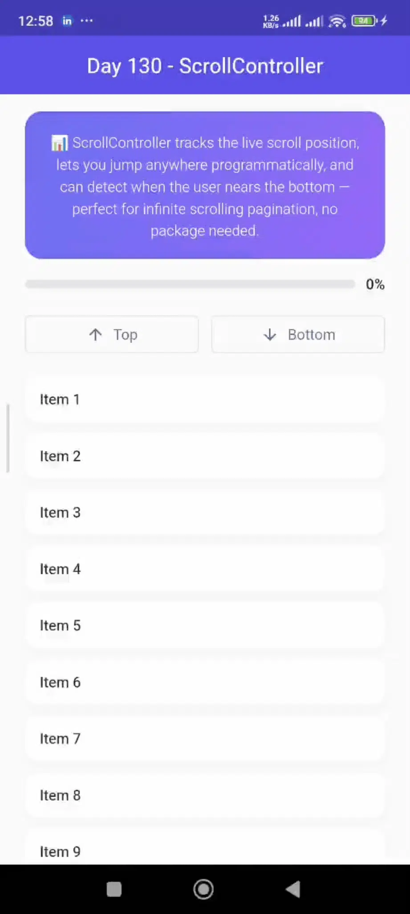</a><br/>
      <a href="lib/features/widgets_of_the_day/day_130_scroll_controller/day130_scroll_controller_widget.dart"><b style="font-size:13px; display:inline-block; max-width:120px; word-break:break-word;">ScrollController</b></a><br/>
      <sub style="font-size:11px; color:#57606a;">Day 130 &middot; Scroll control</sub>
    </td>
    <td align="center" valign="top" style="width:20%; padding:6px; text-align:center; vertical-align:top; word-break:break-word; overflow-wrap:break-word;">
      <a href="screenshots/day131_notification_listener.webp">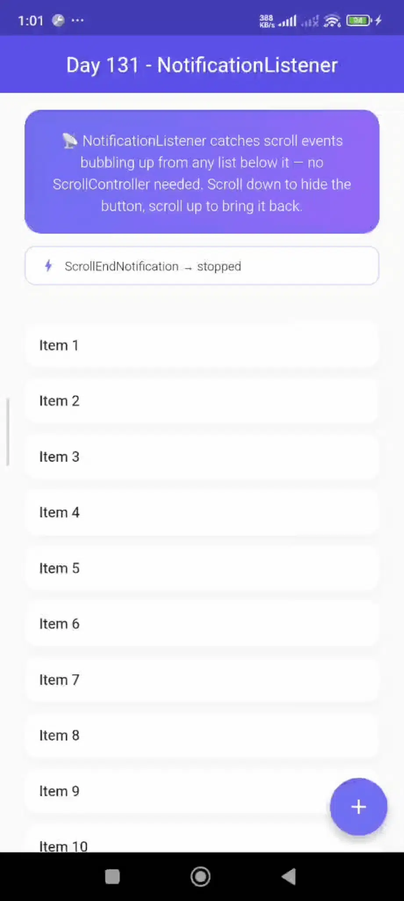</a><br/>
      <a href="lib/features/widgets_of_the_day/day_131_notification_listener/day131_notification_listener_widget.dart"><b style="font-size:13px; display:inline-block; max-width:120px; word-break:break-word;">NotifyListener</b></a><br/>
      <sub style="font-size:11px; color:#57606a;">Day 131 &middot; Bubbling events</sub>
    </td>
    <td align="center" valign="top" style="width:20%; padding:6px; text-align:center; vertical-align:top; word-break:break-word; overflow-wrap:break-word;">
      <a href="screenshots/day132_semantics.webp">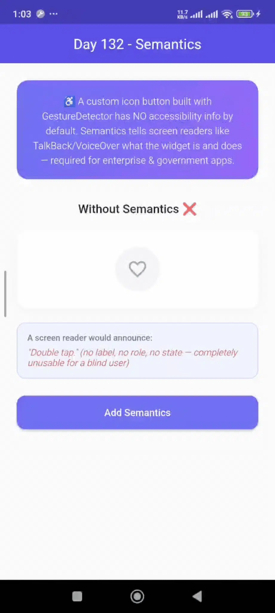</a><br/>
      <a href="lib/features/widgets_of_the_day/day_132_semantics/day132_semantics_widget.dart"><b style="font-size:13px; display:inline-block; max-width:120px; word-break:break-word;">Semantics</b></a><br/>
      <sub style="font-size:11px; color:#57606a;">Day 132 &middot; Accessibility</sub>
    </td>
    <td align="center" valign="top" style="width:20%; padding:6px; text-align:center; vertical-align:top; word-break:break-word; overflow-wrap:break-word;">
      <a href="screenshots/day133_exclude_and_merge_semantics.webp">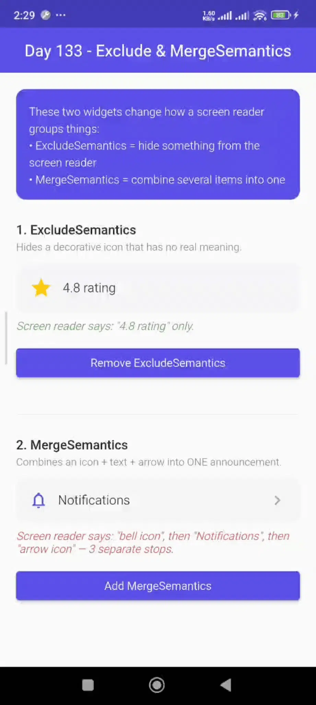</a><br/>
      <a href="lib/features/widgets_of_the_day/day_133_exclude_and_merge_semantics/day133_exclude_and_merge_semantics_widget.dart"><b style="font-size:13px; display:inline-block; max-width:120px; word-break:break-word;">ExcludeSemantics</b></a><br/>
      <sub style="font-size:11px; color:#57606a;">Day 133 &middot; Semantics group</sub>
    </td>
    <td align="center" valign="top" style="width:20%; padding:6px; text-align:center; vertical-align:top; word-break:break-word; overflow-wrap:break-word;">
      <a href="screenshots/day134_focus_node.webp">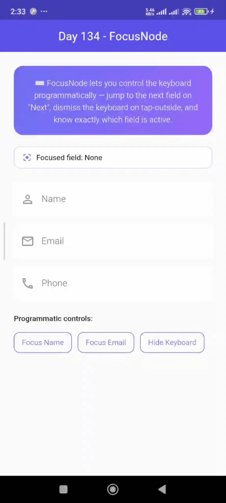</a><br/>
      <a href="lib/features/widgets_of_the_day/day_134_focus_node/day134_focus_node_widget.dart"><b style="font-size:13px; display:inline-block; max-width:120px; word-break:break-word;">FocusNode</b></a><br/>
      <sub style="font-size:11px; color:#57606a;">Day 134 &middot; Focus tracking</sub>
    </td>
  </tr></tbody>
</table>

<table width="100%" style="table-layout:fixed; border-collapse:separate; border-spacing:8px;">
  <thead><tr>
    <th align="center" style="width:20%; font-size:11px; color:#0969da; border-bottom:2px solid #0969da; padding:4px; text-align:center; white-space:nowrap;">Day 135</th>
    <th align="center" style="width:20%; font-size:11px; color:#0969da; border-bottom:2px solid #0969da; padding:4px; text-align:center; white-space:nowrap;">Day 136</th>
    <th align="center" style="width:20%; font-size:11px; color:#0969da; border-bottom:2px solid #0969da; padding:4px; text-align:center; white-space:nowrap;">Day 137</th>
    <th align="center" style="width:20%; font-size:11px; color:#0969da; border-bottom:2px solid #0969da; padding:4px; text-align:center; white-space:nowrap;">Day 138</th>
    <th align="center" style="width:20%; font-size:11px; color:#0969da; border-bottom:2px solid #0969da; padding:4px; text-align:center; white-space:nowrap;">Day 139</th>
  </tr></thead>
  <tbody><tr>
    <td align="center" valign="top" style="width:20%; padding:6px; text-align:center; vertical-align:top; word-break:break-word; overflow-wrap:break-word;">
      <a href="screenshots/day135_dismissible.webp">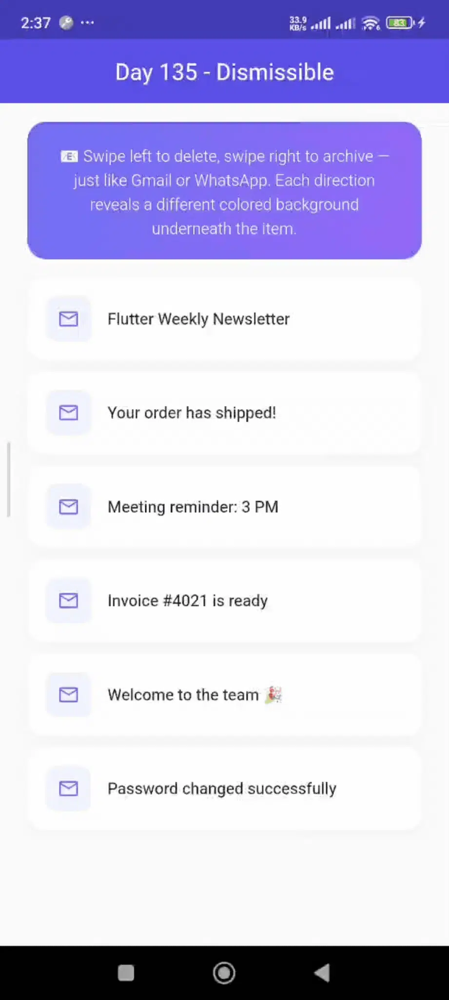</a><br/>
      <a href="lib/features/widgets_of_the_day/day_135_dismissible/day135_dismissible_widget.dart"><b style="font-size:13px; display:inline-block; max-width:120px; word-break:break-word;">Dismissible</b></a><br/>
      <sub style="font-size:11px; color:#57606a;">Day 135 &middot; Swipe dismiss</sub>
    </td>
    <td align="center" valign="top" style="width:20%; padding:6px; text-align:center; vertical-align:top; word-break:break-word; overflow-wrap:break-word;">
      <a href="screenshots/day136_pop_scope.webp">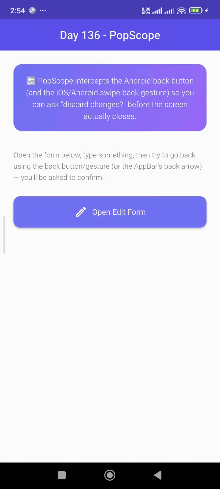</a><br/>
      <a href="lib/features/widgets_of_the_day/day_136_pop_scope/day136_pop_scope_widget.dart"><b style="font-size:13px; display:inline-block; max-width:120px; word-break:break-word;">PopScope</b></a><br/>
      <sub style="font-size:11px; color:#57606a;">Day 136 &middot; Back handling</sub>
    </td>
    <td align="center" valign="top" style="width:20%; padding:6px; text-align:center; vertical-align:top; word-break:break-word; overflow-wrap:break-word;">
      <a href="screenshots/day137_draggable_scrollable_sheet.webp">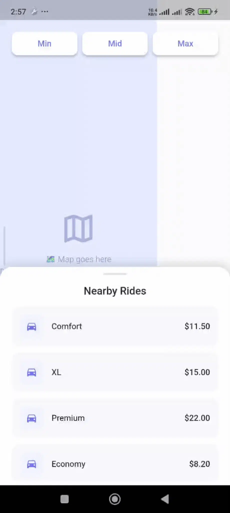</a><br/>
      <a href="lib/features/widgets_of_the_day/day_137_draggable_scrollable_sheet/day137_draggable_scrollable_sheet_widget.dart"><b style="font-size:13px; display:inline-block; max-width:120px; word-break:break-word;">DragSheet</b></a><br/>
      <sub style="font-size:11px; color:#57606a;">Day 137 &middot; Snapping sheet</sub>
    </td>
    <td align="center" valign="top" style="width:20%; padding:6px; text-align:center; vertical-align:top; word-break:break-word; overflow-wrap:break-word;">
      <a href="screenshots/day138_raw_gesture_detector.webp">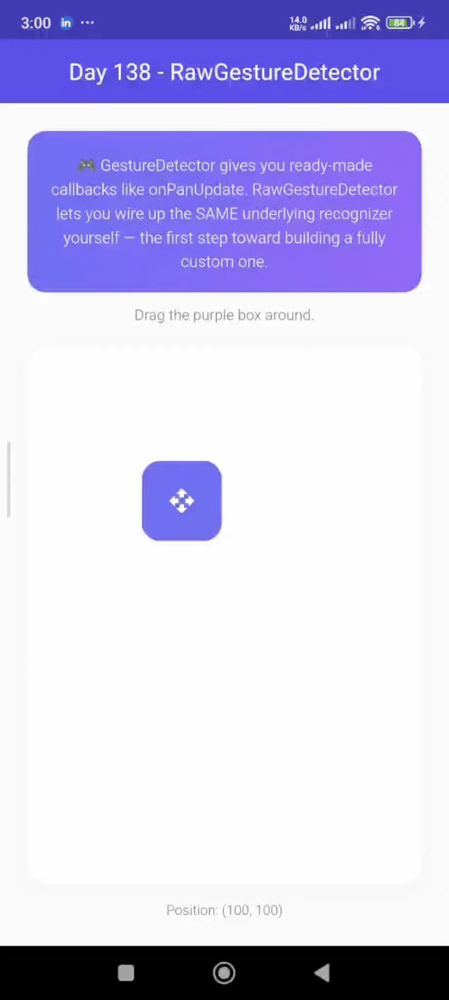</a><br/>
      <a href="lib/features/widgets_of_the_day/day_138_raw_gesture_detector/day138_raw_gesture_detector_widget.dart"><b style="font-size:13px; display:inline-block; max-width:120px; word-break:break-word;">RawGesture</b></a><br/>
      <sub style="font-size:11px; color:#57606a;">Day 138 &middot; Custom gestures</sub>
    </td>
    <td align="center" valign="top" style="width:20%; padding:6px; text-align:center; vertical-align:top; word-break:break-word; overflow-wrap:break-word;">
      <a href="screenshots/day139_feedback.webp">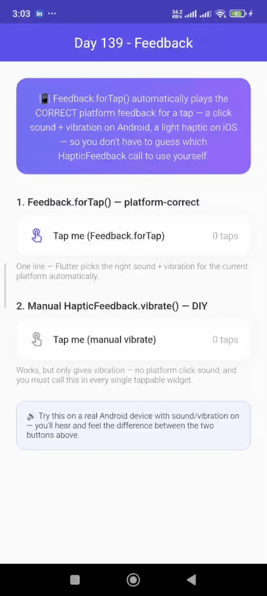</a><br/>
      <a href="lib/features/widgets_of_the_day/day_139_feedback/day139_feedback_widget.dart"><b style="font-size:13px; display:inline-block; max-width:120px; word-break:break-word;">Feedback</b></a><br/>
      <sub style="font-size:11px; color:#57606a;">Day 139 &middot; Haptic feedback</sub>
    </td>
  </tr></tbody>
</table>

<table width="100%" style="table-layout:fixed; border-collapse:separate; border-spacing:8px;">
  <thead><tr>
    <th align="center" style="width:20%; font-size:11px; color:#0969da; border-bottom:2px solid #0969da; padding:4px; text-align:center; white-space:nowrap;">Day 140</th>
    <th align="center" style="width:20%; font-size:11px; color:#0969da; border-bottom:2px solid #0969da; padding:4px; text-align:center; white-space:nowrap;">Day 141</th>
    <th align="center" style="width:20%; font-size:11px; color:#0969da; border-bottom:2px solid #0969da; padding:4px; text-align:center; white-space:nowrap;">Day 142</th>
    <th align="center" style="width:20%; font-size:11px; color:#0969da; border-bottom:2px solid #0969da; padding:4px; text-align:center; white-space:nowrap;">Day 143</th>
    <th align="center" style="width:20%; font-size:11px; color:#0969da; border-bottom:2px solid #0969da; padding:4px; text-align:center; white-space:nowrap;">Day 144</th>
  </tr></thead>
  <tbody><tr>
    <td align="center" valign="top" style="width:20%; padding:6px; text-align:center; vertical-align:top; word-break:break-word; overflow-wrap:break-word;">
      <a href="screenshots/day140_cupertino_alert_dialog.webp">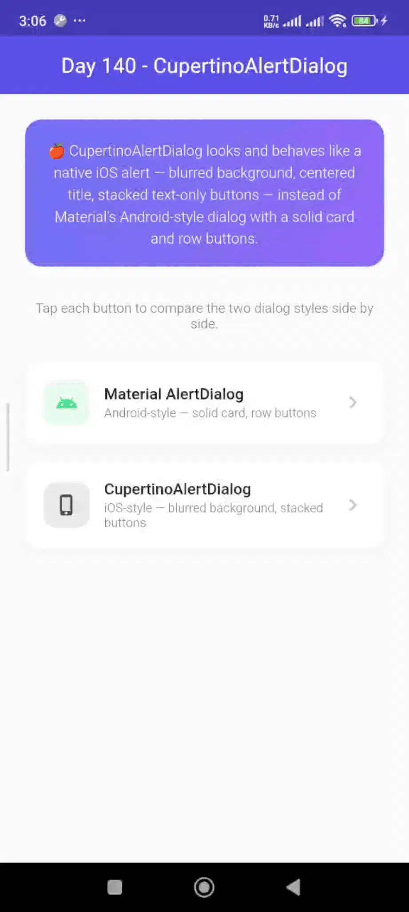</a><br/>
      <a href="lib/features/widgets_of_the_day/day_140_cupertino_alert_dialog/day140_cupertino_alert_dialog_widget.dart"><b style="font-size:13px; display:inline-block; max-width:120px; word-break:break-word;">CupertinoAlert</b></a><br/>
      <sub style="font-size:11px; color:#57606a;">Day 140 &middot; iOS alert</sub>
    </td>
    <td align="center" valign="top" style="width:20%; padding:6px; text-align:center; vertical-align:top; word-break:break-word; overflow-wrap:break-word;">
      <a href="screenshots/day141_cupertino_action_sheet.webp">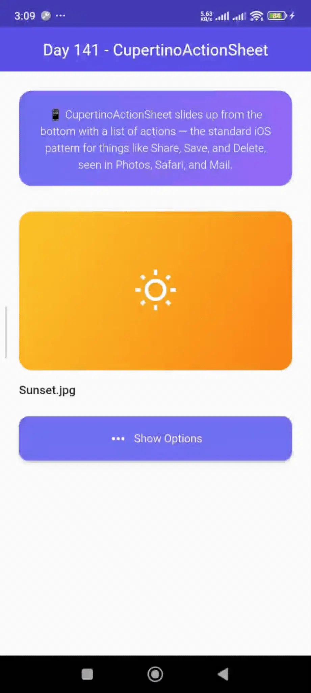</a><br/>
      <a href="lib/features/widgets_of_the_day/day_141_cupertino_action_sheet/day141_cupertino_action_sheet_widget.dart"><b style="font-size:13px; display:inline-block; max-width:120px; word-break:break-word;">CupertinoSheet</b></a><br/>
      <sub style="font-size:11px; color:#57606a;">Day 141 &middot; iOS action sheet</sub>
    </td>
    <td align="center" valign="top" style="width:20%; padding:6px; text-align:center; vertical-align:top; word-break:break-word; overflow-wrap:break-word;">
      <a href="screenshots/day142_cupertino_sliding_segmented_control.webp">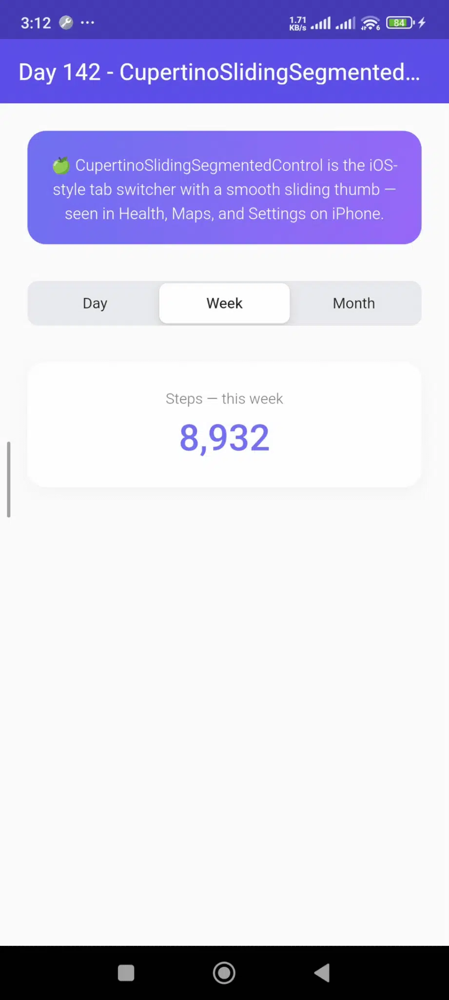</a><br/>
      <a href="lib/features/widgets_of_the_day/day_142_cupertino_sliding_segmented_control/day142_cupertino_sliding_segmented_control_widget.dart"><b style="font-size:13px; display:inline-block; max-width:120px; word-break:break-word;">CupertinoSliding</b></a><br/>
      <sub style="font-size:11px; color:#57606a;">Day 142 &middot; iOS segments</sub>
    </td>
    <td align="center" valign="top" style="width:20%; padding:6px; text-align:center; vertical-align:top; word-break:break-word; overflow-wrap:break-word;">
      <a href="screenshots/day143_cupertino_timer_picker.webp">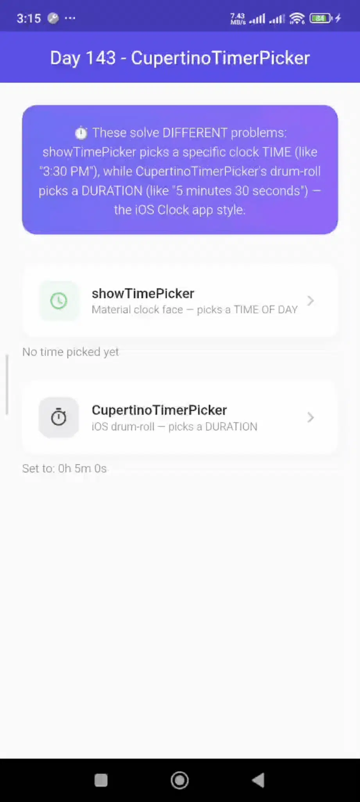</a><br/>
      <a href="lib/features/widgets_of_the_day/day_143_cupertino_timer_picker/day143_cupertino_timer_picker_widget.dart"><b style="font-size:13px; display:inline-block; max-width:120px; word-break:break-word;">CupertinoTimer</b></a><br/>
      <sub style="font-size:11px; color:#57606a;">Day 143 &middot; iOS timer picker</sub>
    </td>
    <td align="center" valign="top" style="width:20%; padding:6px; text-align:center; vertical-align:top; word-break:break-word; overflow-wrap:break-word;">
      <a href="screenshots/day144_cupertino_context_menu.webp"></a><br/>
      <a href="lib/features/widgets_of_the_day/day_144_cupertino_context_menu/day144_cupertino_context_menu_widget.dart"><b style="font-size:13px; display:inline-block; max-width:120px; word-break:break-word;">CupertinoMenu</b></a><br/>
      <sub style="font-size:11px; color:#57606a;">Day 144 &middot; iOS context menu</sub>
    </td>
  </tr></tbody>
</table>

<table width="100%" style="table-layout:fixed; border-collapse:separate; border-spacing:8px;">
  <thead><tr>
    <th align="center" style="width:20%; font-size:11px; color:#0969da; border-bottom:2px solid #0969da; padding:4px; text-align:center; white-space:nowrap;">Day 145</th>
    <th align="center" style="width:20%; font-size:11px; color:#0969da; border-bottom:2px solid #0969da; padding:4px; text-align:center; white-space:nowrap;">Day 146</th>
    <th align="center" style="width:20%; font-size:11px; color:#0969da; border-bottom:2px solid #0969da; padding:4px; text-align:center; white-space:nowrap;">Day 147</th>
    <th align="center" style="width:20%; font-size:11px; color:#0969da; border-bottom:2px solid #0969da; padding:4px; text-align:center; white-space:nowrap;">Day 148</th>
    <th align="center" style="width:20%; font-size:11px; color:#0969da; border-bottom:2px solid #0969da; padding:4px; text-align:center; white-space:nowrap;">Day 149</th>
  </tr></thead>
  <tbody><tr>
    <td align="center" valign="top" style="width:20%; padding:6px; text-align:center; vertical-align:top; word-break:break-word; overflow-wrap:break-word;">
      <a href="screenshots/day145_tween_animation_builder.webp">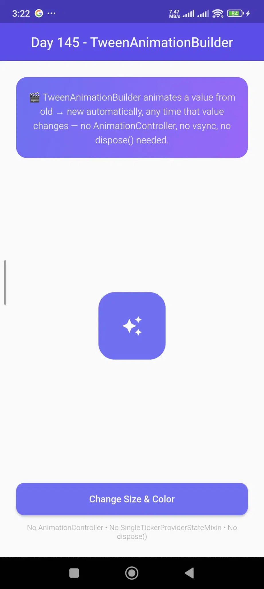</a><br/>
      <a href="lib/features/widgets_of_the_day/day_145_tween_animation_builder/day145_tween_animation_builder_widget.dart"><b style="font-size:13px; display:inline-block; max-width:120px; word-break:break-word;">TweenBuilder</b></a><br/>
      <sub style="font-size:11px; color:#57606a;">Day 145 &middot; Implicit tween</sub>
    </td>
    <td align="center" valign="top" style="width:20%; padding:6px; text-align:center; vertical-align:top; word-break:break-word; overflow-wrap:break-word;">
      <a href="screenshots/day146_animated_switcher.webp">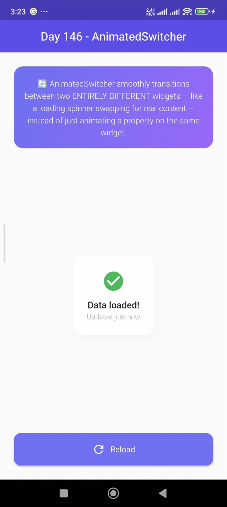</a><br/>
      <a href="lib/features/widgets_of_the_day/day_146_animated_switcher/day146_animated_switcher_widget.dart"><b style="font-size:13px; display:inline-block; max-width:120px; word-break:break-word;">AnimSwitcher</b></a><br/>
      <sub style="font-size:11px; color:#57606a;">Day 146 &middot; Cross-fade switch</sub>
    </td>
    <td align="center" valign="top" style="width:20%; padding:6px; text-align:center; vertical-align:top; word-break:break-word; overflow-wrap:break-word;">
      <a href="screenshots/day147_animated_positioned.webp">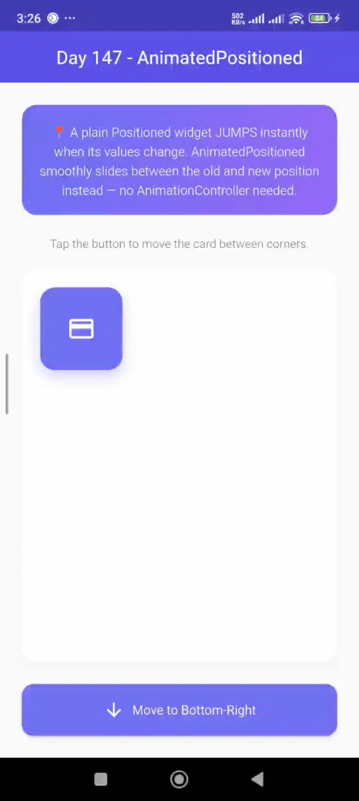</a><br/>
      <a href="lib/features/widgets_of_the_day/day_147_animated_positioned/day147_animated_positioned_widget.dart"><b style="font-size:13px; display:inline-block; max-width:120px; word-break:break-word;">AnimPositioned</b></a><br/>
      <sub style="font-size:11px; color:#57606a;">Day 147 &middot; Animated position</sub>
    </td>
    <td align="center" valign="top" style="width:20%; padding:6px; text-align:center; vertical-align:top; word-break:break-word; overflow-wrap:break-word;">
      <a href="screenshots/day148_size_transition.webp">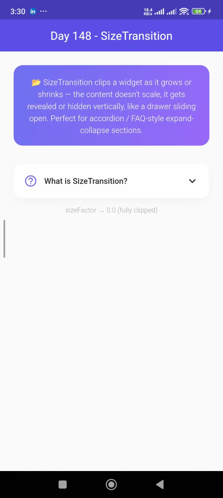</a><br/>
      <a href="lib/features/widgets_of_the_day/day_148_size_transition/day148_size_transition_widget.dart"><b style="font-size:13px; display:inline-block; max-width:120px; word-break:break-word;">SizeTransition</b></a><br/>
      <sub style="font-size:11px; color:#57606a;">Day 148 &middot; Animated size</sub>
    </td>
    <td align="center" valign="top" style="width:20%; padding:6px; text-align:center; vertical-align:top; word-break:break-word; overflow-wrap:break-word;">
      <a href="screenshots/day149_slide_transition.webp">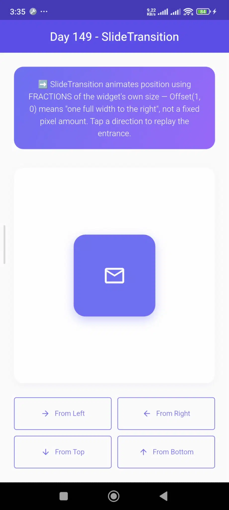</a><br/>
      <a href="lib/features/widgets_of_the_day/day_149_slide_transition/day149_slide_transition_widget.dart"><b style="font-size:13px; display:inline-block; max-width:120px; word-break:break-word;">SlideTransition</b></a><br/>
      <sub style="font-size:11px; color:#57606a;">Day 149 &middot; Animated slide</sub>
    </td>
  </tr></tbody>
</table>

<table width="100%" style="table-layout:fixed; border-collapse:separate; border-spacing:8px;">
  <thead><tr>
    <th align="center" style="width:20%; font-size:11px; color:#0969da; border-bottom:2px solid #0969da; padding:4px; text-align:center; white-space:nowrap;">Day 150</th>
    <th align="center" style="width:20%; font-size:11px; color:#0969da; border-bottom:2px solid #0969da; padding:4px; text-align:center; white-space:nowrap;">Day 151</th>
    <th align="center" style="width:20%; font-size:11px; color:#0969da; border-bottom:2px solid #0969da; padding:4px; text-align:center; white-space:nowrap;">Day 152</th>
    <th style="width:20%"></th>
    <th style="width:20%"></th>
  </tr></thead>
  <tbody><tr>
    <td align="center" valign="top" style="width:20%; padding:6px; text-align:center; vertical-align:top; word-break:break-word; overflow-wrap:break-word;">
      <a href="screenshots/day150_scale_transition.webp">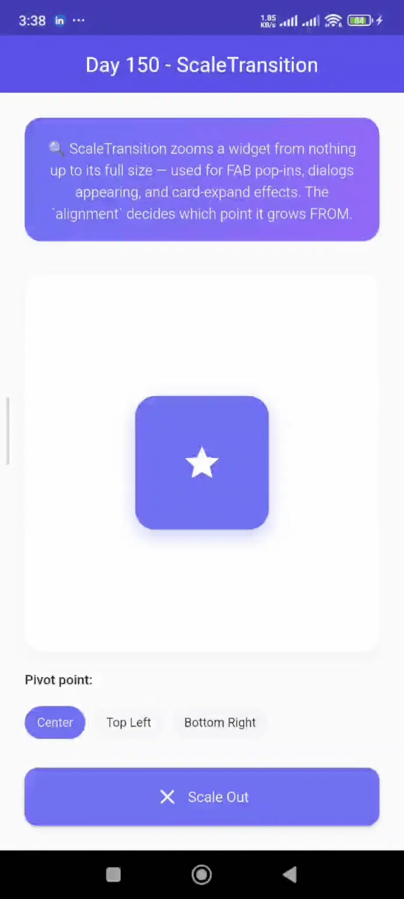</a><br/>
      <a href="lib/features/widgets_of_the_day/day_150_scale_transition/day150_scale_transition_widget.dart"><b style="font-size:13px; display:inline-block; max-width:120px; word-break:break-word;">ScaleTransition</b></a><br/>
      <sub style="font-size:11px; color:#57606a;">Day 150 &middot; Animated scale</sub>
    </td>
    <td align="center" valign="top" style="width:20%; padding:6px; text-align:center; vertical-align:top; word-break:break-word; overflow-wrap:break-word;">
      <a href="screenshots/day151_search_anchor.webp"></a><br/>
      <a href="lib/features/widgets_of_the_day/day_151_search_anchor/day151_search_anchor_widget.dart"><b style="font-size:13px; display:inline-block; max-width:120px; word-break:break-word;">SearchAnchor</b></a><br/>
      <sub style="font-size:11px; color:#57606a;">Day 151 &middot; Modern M3 Search</sub>
    </td>
    <td align="center" valign="top" style="width:20%; padding:6px; text-align:center; vertical-align:top; word-break:break-word; overflow-wrap:break-word;">
      <a href="screenshots/day152_search_bar.webp">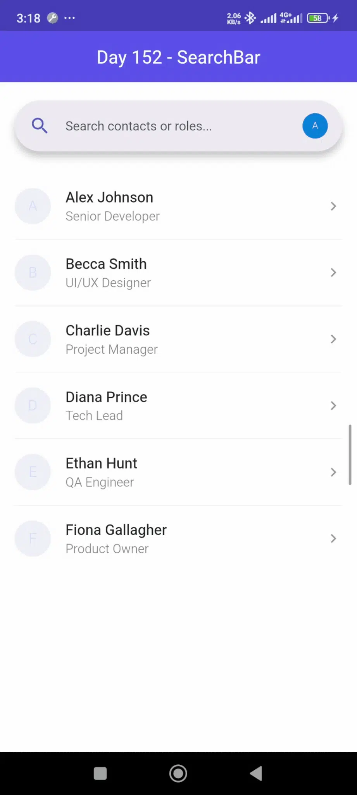</a><br/>
      <a href="lib/features/widgets_of_the_day/day_152_search_bar/day152_search_bar_widget.dart"><b style="font-size:13px; display:inline-block; max-width:120px; word-break:break-word;">SearchBar</b></a><br/>
      <sub style="font-size:11px; color:#57606a;">Day 152 &middot; M3 Search Bar</sub>
    </td>
    <td align="center" valign="top" style="width:20%; padding:6px; text-align:center; vertical-align:top; word-break:break-word; overflow-wrap:break-word;">
      <a href="screenshots/day153_menu_anchor.webp">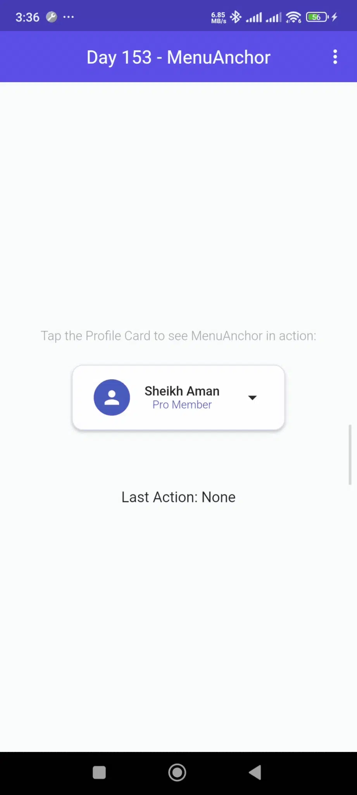</a><br/>
      <a href="lib/features/widgets_of_the_day/day_153_menu_anchor/day153_menu_anchor_widget.dart"><b style="font-size:13px; display:inline-block; max-width:120px; word-break:break-word;">MenuAnchor</b></a><br/>
      <sub style="font-size:11px; color:#57606a;">Day 153 &middot; M3 Action Menu</sub>
    </td>
    <td style="width:20%"></td>
  </tr></tbody>
</table>

---

## 📚 Widget Reference — What Each Day Covers

A detailed, day-by-day breakdown of what was practiced and learned for every widget. Grouped in sets of 10 — click a section to expand it.

<details>
<summary><b>Days 001–010</b></summary>

**1. Container**
- Basic layout building block
- Neumorphic UI design practice
- Styling, padding, margin usage

**2. Expanded**
- Flexible layout handling inside `Row` and `Column`
- Understanding space distribution in UI

**3. Column & Row**
- `mainAxisAlignment`
- `crossAxisAlignment`
- Core alignment concepts for Flutter layouts

**4. ListView.builder**
- Dynamic list rendering
- Efficient scrolling lists
- Instagram-style UI layout practice

**5. ClipRRect**
- Rounded corner implementation
- Smooth UI card styling
- Wrapping widgets for modern design feel

**6. Image.asset**
- Loading local assets
- `BoxFit.cover` for clean image scaling
- Card-based image UI design

**7. GridView.builder**
- Grid-based UI layout
- `crossAxisCount` for controlling columns
- Responsive multi-column layouts
- Useful for gallery, products, and dashboard UIs

**8. GestureDetector**
- Handling user interactions like taps, clicks, and gestures
- `onTap: () => { action }` usage
- Making UI elements interactive
- Keeping functional logic separated from UI for better code structure and maintainability

**9. Bottom Navigation Bar**
- Implemented using `StatefulWidget` for managing active tab state
- Used `BottomNavigationBarType.fixed` for consistent tab layout
- Managed multiple pages with indexed navigation
- Demonstrated clean multi-page app structure

**10. AppBar**
- Implemented `leading` widget for left-aligned actions (e.g. menu/back button)
- Used `actions` for right-aligned interactive icons/buttons
- Practiced proper AppBar structure for real-world app UI design

</details>

<details>
<summary><b>Days 011–020</b></summary>

**11. Drawer (Navigation Panel)**
- Implemented `Drawer` for side navigation menu
- Wrapped Drawer content inside `ListView` for smooth scrolling support
- Used `DrawerHeader` for profile/branding section at the top
- Built menu items using `ListTile` for clean and structured navigation options

**12. SliverAppBar (Advanced Scroll UI)**
- Implemented `SliverAppBar` inside `CustomScrollView` for advanced scrolling behavior
- Used `expandedHeight` to create dynamic collapsing header effect
- Practiced `flexibleSpace` for building expandable and animated AppBar content

**13. TabBar (Tabbed Navigation)**
- Implemented tab-based navigation using `TabBar` and `TabBarView`
- Wrapped `Scaffold` with `DefaultTabController` to manage tab state
- Configured `length` to define the number of tabs

**14. AnimatedContainer (Smooth UI Animations)**
- Implemented `AnimatedContainer` for smooth property-based animations
- Used `GestureDetector` to trigger animations on user interaction (`onTap`)
- Controlled animation timing using `duration` (in seconds) for smooth transitions
- Animated UI changes such as size, color, alignment, and decoration

**15. MediaQuery (Responsive UI Design)**
- Used `MediaQuery` to build responsive Flutter layouts
- Accessed screen `height` and `width` for dynamic UI scaling
- Applied `aspect ratio` understanding for maintaining consistent UI proportions across devices
- Handled device `orientation` (portrait / landscape) for adaptive layouts

**16. AlertDialog (User Interaction & Feedback)**
- Implemented `AlertDialog` for showing important user messages and confirmations
- Structured dialog using `title`, `content`, and `actions`

**17. Text & Styling**
- Implemented `Text` widget with advanced styling options
- Used `TextStyle` to customize typography with `fontStyle`, `fontWeight`, etc.

**18. RichText (Advanced Text Styling)**
- Implemented `RichText` widget for displaying multiple text styles in a single line
- Used `TextSpan` to break text into styled segments

**19. Timer (Countdown Logic)**
- Implemented `Timer` functionality using `StatefulWidget`
- Managed recurring time updates using `Timer.periodic`

**20. PageView (Vertical Scrolling UI)**
- Implemented `PageView` for swipe-based screen navigation
- Set `scrollDirection: Axis.vertical` for vertical scrolling interaction

</details>

<details>
<summary><b>Days 021–030</b></summary>

**21. Stack (Layered UI Layout)**
- Implemented `Stack` to place multiple widgets on top of each other
- Built layered UI components by controlling widget positioning and visual hierarchy

**22. TextField (User Input Handling)**
- Implemented `TextField` inside a `StatefulWidget` for dynamic user input
- Styled input field using `decoration` and added `suffixIcon`

**23. AnimatedIcon (Animated UI Transitions)**
- Implemented `AnimatedIcon` inside a `StatefulWidget` for interactive icon animations
- Used `SingleTickerProviderStateMixin` to provide vsync for smooth animations

**24. Slider (Interactive Value Selection)**
- Implemented `Slider` inside a `StatefulWidget` to manage dynamic values
- Updated UI instantly as the slider value changed

**25. DatePicker (Date Selection)**
- Implemented date selection using Flutter's `showDatePicker`
- Displayed selected date dynamically in the UI

**26. TimePicker (Time Selection)**
- Implemented time selection using Flutter's `showTimePicker`
- Used `TimeOfDay` to store and manage the selected time state

**27. ListWheelScrollView (3D Wheel Scrolling)**
- Implemented `ListWheelScrollView` with 3D wheel-like scrolling effect
- Applied `FixedExtentScrollPhysics` for snap-to-item scrolling behavior

**28. LinearGradient (Gradient Background Design)**
- Implemented `LinearGradient` inside a `Container` using `BoxDecoration`
- Applied `LinearGradient` to create smooth multi-color transitions

**29. ElevatedButton & OutlinedButton (Button Styling)**
- Implemented `ElevatedButton` and `OutlinedButton` for primary and secondary actions
- Customized using `styleFrom()` to control elevation, color, padding, and shape

**30. FloatingActionButton (Primary Action Button)**
- Implemented `FloatingActionButton` to represent the primary action in a screen
- Practiced using FAB as a quick-access action button

</details>

<details>
<summary><b>Days 031–040</b></summary>

**31. Navigator (Screen Navigation & Routing)**
- Implemented named route navigation using Flutter's `Navigator` widget
- Used `Navigator.pushNamed()` and `Navigator.pop()` for multi-screen flow

**32. Card (Material Design Card Layout)**
- Implemented Flutter's `Card` widget with `RoundedRectangleBorder`
- Configured `elevation` for depth and shadow effects

**33. Custom Clipper (Wave Shape & Custom UI Design)**
- Implemented `ClipPath` with `CustomClipper<Path>` for custom-shaped UI
- Used `quadraticBezierTo` for smooth wave effects

**34. RawMaterialButton (Low-Level Custom Button Design)**
- Explored `RawMaterialButton` for highly customizable button design
- Applied color and highlight effects for interaction feedback

**35. RotatedBox (90° Rotation)**
- Explored `RotatedBox` to rotate widgets in fixed 90-degree increments
- Displayed images using `Image.network`

**36. Transform (Widget Transformation)**
- Implemented `Transform` widget for rotation, scaling, and translation
- Enhanced UI with dynamic visual effects

**37. Positioned (Precise Widget Placement in Stack)**
- Implemented `Positioned` inside a `Stack` for precise widget placement
- Used `top`, `bottom`, `left`, and `right` properties

**38. IconButton (Interactive Icon-Based Actions)**
- Implemented `IconButton` for tappable icon-based actions
- Customized using `color`, `size`, and `icon` properties

**39. CustomPaint (Custom Drawing & Canvas Rendering)**
- Explored `CustomPaint` with `CustomPainter` for custom UI graphics
- Used `Canvas` and `Paint` to control stroke, color, and drawing styles

**40. ClipOval (Circular Image Clipping)**
- Implemented `ClipOval` to display widgets in circular shape
- Applied `BoxFit.cover` for distortion-free image filling

</details>

<details>
<summary><b>Days 041–050</b></summary>

**41. ClipRRect (Rounded Corner Image Clipping)**
- Used `borderRadius` to control and customize roundness of each corner
- Combined `BoxFit.cover` for proper image filling

**42. ClipRect (Rectangular Clipping)**
- Implemented `ClipRect` to clip child widgets within a rectangular boundary
- Compared with `ClipRRect` and `ClipOval`

**43. ClipPath (Custom Shape Clipping)**
- Implemented `ClipPath` with custom `CustomClipPath()` class
- Overrode `getClip(Size size)` to generate custom clipping paths

**44. Radial & Sweep Gradient (Advanced Gradient Effects)**
- Implemented `RadialGradient` and `SweepGradient` inside a `Container`
- Compared radial vs sweep gradients for visual differences

**45. StatefulWidget (State Lifecycle Management)**
- Implemented `StatefulWidget` with full lifecycle: `initState`, `didChangeDependencies`, `didUpdateWidget`, `deactivate`, `dispose`
- Utilized `setState(() {})` to update UI dynamically

**46. Table (Structured Data Layout)**
- Implemented `Table` widget with `TableRow` for structured data
- Applied `border` for cell separation and styling

**47. DataTable (Interactive Tabular Data UI)**
- Implemented `DataTable` with `columns` and `rows` for interactive data
- Built suitable for admin panels and dashboards

**48. Placeholder (UI Skeleton & Layout Debugging)**
- Implemented `Placeholder` for visualizing empty UI spaces during development
- Customized `fallbackHeight`, `color`, and `strokeWidth`

**49. GestureDetector & InkWell (User Interaction Handling)**
- Implemented `GestureDetector` for raw touch interactions
- Used `InkWell` to add Material Design ripple effects

**50. Material (Surface, Elevation & Visual Styling)**
- Implemented `Material` widget to define a material design surface
- Used to control `elevation`, shadow, and background color

</details>

<details>
<summary><b>Days 051–060</b></summary>

**51. Switches (Switch, Checkbox & Radio)**
- Implemented `Switch`, `Checkbox`, and `Radio` widgets
- Used `ListTile` with toggle-based controls for settings-style UI

**52. Dropdown & PopupMenu (Selection Menus)**
- Implemented `DropdownButton` and `PopupMenuButton` for selectable menus
- Managed selected values dynamically using state updates

**53. Hero Animation (Shared Element Page Transition)**
- Implemented `Hero` widget for smooth shared-element transitions between screens
- Combined with `Image.network` for zoom and transition effects

**54. AboutDialog (Application Information Dialog)**
- Implemented `AboutDialog` with `showAboutDialog()`
- Displayed app name, version, and legal information

**55. Stepper (Multi-Step Workflow UI)**
- Implemented `Stepper` with `onStepContinue`, `onStepCancel`, and `onStepTapped`
- Managed step state using `int _currentStep = 0`

**56. FittedBox (Responsive Scaling)**
- Implemented `FittedBox` to scale and fit child widgets within available space
- Explored different fit modes for various layouts

**57. showSearch (In-App Search Interface)**
- Implemented `showSearch()` with a custom `SearchDelegate`
- Integrated with `AppBar` using an `IconButton`

**58. Adaptive Widgets (Platform-Aware UI Components)**
- Used `Slider.adaptive`, `SwitchListTile.adaptive`, and `Switch.adaptive`
- Render native-style components for both Android and iOS

**59. Scrollbar (Scroll Feedback)**
- Implemented `Scrollbar` for visual feedback on scrollable content
- Customized `thickness` for visual width control

**60. ChoiceChip (Selectable Filter Chips UI)**
- Implemented `ChoiceChip` with `label`, `avatar`, `selected`, and `onSelected`
- Managed selection state for dynamic UI updates

</details>

<details>
<summary><b>Days 061–070</b></summary>

**61. Wrap (Responsive Flow Layout)**
- Implemented `Wrap` to create responsive layouts that automatically flow to next line
- Controlled `spacing` and `alignment` between items

**62. ExpansionTile (Expandable List UI)**
- Implemented `ExpansionTile` with `title` and `children`
- Used `ListTile` inside children for structured sub-items

**63. RangeSlider (Dual Value Selection)**
- Implemented `RangeSlider` with `divisions`, `labels`, and `onChanged`
- Built for filtering and range-based input scenarios

**64. showModalBottomSheet (Bottom Sheet UI)**
- Implemented `showModalBottomSheet` with `builder` callback
- Used `SizedBox` to control height and structure of content

**65. AnimatedCrossFade (Smooth Widget Transition)**
- Implemented `AnimatedCrossFade` with `firstChild`, `secondChild`, and `duration`
- Used Flutter's built-in implicit animation capabilities

**66. Flexible (Responsive Space Distribution)**
- Implemented `Flexible` with `flex` property for space distribution
- Built adaptive layouts preventing overflow

**67. Spacer (Dynamic Empty Space Management)**
- Implemented `Spacer` for flexible empty space between widgets
- Replaces fixed-size `SizedBox` with adaptive spacing

**68. GridPaper (Grid Overlay & Layout Visualization)**
- Implemented `GridPaper` for customizable grid overlay
- Used for layout guidance and grid-based design

**69. InteractiveViewer (Zoom & Pan Interaction)**
- Implemented `InteractiveViewer` with `maxScale` for zoom control
- Used `Image.network()` as child for image inspection

**70. CheckboxListTile (Selectable List Item)**
- Implemented `CheckboxListTile` with `title`, `subtitle`, and `value`
- Built settings-style interfaces for multi-select lists

</details>

<details>
<summary><b>Days 071–080</b></summary>

**71. SelectableText (Text Selection & Copy Support)**
- Implemented `SelectableText` to allow users to select and copy text
- Enhanced accessibility with built-in text selection

**72. AnimatedPadding (Smooth Layout Spacing Animation)**
- Implemented `AnimatedPadding` with dynamic `EdgeInsets.all(padValue)`
- Configured `duration` for smooth padding transitions

**73. RefreshIndicator (Pull-to-Refresh)**
- Implemented `RefreshIndicator` with async `onRefresh` callback
- Customized `color` and `backgroundColor` for theme consistency

**74. ImageFiltered (Blur Effects)**
- Implemented `ImageFiltered` with `ImageFilter.blur`
- Configured `sigmaX` and `sigmaY` for blur intensity control

**75. AspectRatio (Proportional Layout Control)**
- Implemented `AspectRatio` with `aspectRatio: 3 / 2`
- Prevented distortion by preserving original proportions

**76. ToggleButtons (Multi & Single Selection)**
- Implemented `ToggleButtons` for single and multi selection modes
- Managed selection state using boolean lists

**77. PhysicalModel (Elevation & Material Depth Effects)**
- Implemented `PhysicalModel` with `elevation`, `shadowColor`, and `borderRadius`
- Simulates physical surfaces and elevation changes

**78. Align (Precise Widget Positioning)**
- Implemented `Align` to position child widgets within parent container
- Practiced positioning at center, top-left, bottom-right, etc.

**79. SafeArea (System UI Protection)**
- Implemented `SafeArea` to keep content within visible display region
- Prevented overlap with status bar and navigation areas

**80. PageRouteBuilder (Custom Route Transitions)**
- Implemented `PageRouteBuilder` with `ScaleTransition` and `CurvedAnimation`
- Built custom zoom-in/out page animations

</details>

<details>
<summary><b>Days 081–090</b></summary>

**81. Draggable (Drag & Drop Interaction)**
- Implemented `Draggable` with `DragTarget` for drag-and-drop functionality
- Customized `feedback` widget for drag appearance

**82. BackdropFilter (Glassmorphism & Blur Effects)**
- Implemented `BackdropFilter` with `ImageFilter.blur` for background blurring
- Built glassmorphism UI with semi-transparent overlays

**83. ReorderableListView (Drag-to-Reorder List)**
- Implemented `ReorderableListView` with `itemBuilder` and `onReorder`
- Handled item rearrangement with underlying list state update

**84. FadeTransition (Opacity-Based Animation)**
- Implemented `FadeTransition` with `Animation<double>` for opacity control
- Integrated with animation controllers for lifecycle management

**85. CircleAvatar (Profile Image & Circular UI)**
- Implemented `CircleAvatar` with `radius` and `backgroundColor`
- Combined with `Stack` and `Positioned` for advanced profile layouts

**86. Tooltip (Contextual Help & User Guidance)**
- Implemented `Tooltip` with `waitDuration` and `verticalOffset` customization
- Added hints to icon-based UI elements

**87. Visibility (Show & Hide UI Elements)**
- Implemented `Visibility` with boolean state to toggle widget rendering
- Built toggle button for showing/hiding images with `ClipRRect`

**88. IndexedStack (Maintain Multiple UI States)**
- Implemented `IndexedStack` to manage multiple screens in a single layout
- Preserved state of all stacked widgets while showing one at a time

**89. Navigator 2.0 (Declarative Navigation)**
- Implemented Navigator 2.0 API using declarative page-based navigation
- Built custom navigation flow without push/pop methods

**90. Null Aware Operators (Dart Null Safety)**
- Learned `?.`, `??`, `??=`, and `...?` operators
- Built UI demo to visually understand each null-aware operator

</details>

<details>
<summary><b>Days 091–100</b></summary>

**91. Cascade Operator (..) in Dart**
- Implemented Dart's Cascade Operator for chaining multiple operations
- Compared cascade vs traditional object initialization

**92. Inherited Widget (State Sharing Between Screens)**
- Used `InheritedWidget` to share state across multiple screens
- Accessed shared state using `StateInheritedWidget.of(context)`

**93. FractionallySizedBox (Responsive UI Using Percentages)**
- Used `widthFactor` and `heightFactor` to size widgets as percentages
- Demonstrated automatic scaling according to parent container size

**94. ConstrainedBox (Controlling Widget Size)**
- Used `BoxConstraints` to define min/max width and height limits
- Showed how Flutter adjusts widget size based on constraints

**95. CupertinoSearchTextField (iOS Style Search Bar)**
- Implemented `CupertinoSearchTextField` with `TextEditingController`
- Displayed real-time search input using `onChanged` callback

**96. StatefulBuilder (Local State Management)**
- Used `StatefulBuilder` to update only part of the UI without full rebuild
- Demonstrated difference between full and partial widget rebuild

**97. LayoutBuilder (Responsive UI)**
- Used `BoxConstraints` inside `LayoutBuilder` to detect available screen width
- Switched between mobile and desktop/tablet layouts at 600px breakpoint

**98. OrientationBuilder (Responsive UI Based on Device Rotation)**
- Built separate layouts for portrait (`ListView`) and landscape (`Row`) modes
- Demonstrated automatic UI adaptation on orientation change

**99. Platform Detection (dart:io)**
- Used `Platform.isAndroid`, `Platform.isIOS`, `Platform.isWindows`, etc.
- Displayed current platform dynamically in the Flutter UI

**100. FutureBuilder (Handling Asynchronous Data)**
- Implemented `FutureBuilder` for loading, success, and error UI states
- Used `CircularProgressIndicator` and `snapshot.hasError` handling

</details>

<details>
<summary><b>Days 101–110</b></summary>

**101. StreamBuilder (Handling Real-Time Data)**
- Implemented `StreamBuilder` to listen to stream events and rebuild UI
- Used `initialData` for default value before first stream event

**102. ChangeNotifier (Basic State Management)**
- Created custom controller extending `ChangeNotifier` with `notifyListeners()`
- Implemented proper lifecycle management with `dispose()`

**103. ValueNotifier & ValueListenableBuilder (Lightweight State)**
- Used `ValueNotifier` with `ValueListenableBuilder` for reactive UI
- Updated only listening widgets without calling `setState`

**104. InheritedNotifier (Reactive State + Animation)**
- Used `InheritedNotifier` to share `AnimationController` across widget tree
- Built `SpinModel` for reusable animation state sharing

**105. Listener Widget (Low-Level Pointer Event Handling)**
- Used `Listener` for `PointerDownEvent`, `PointerMoveEvent`, `PointerUpEvent`
- Built real-time touch coordinate tracker with `Offset`

**106. Builder Widget (Context Management)**
- Used `Builder` to obtain new `BuildContext` deeper in the widget tree
- Solved common `ScaffoldMessenger.of(context)` context issues

**107. PageView.builder (Swipeable Page Navigation)**
- Built lazily-constructed pages with `PageController` and `onPageChanged`
- Implemented vertical scrolling with animated dot indicator

**108. AnimatedBuilder (Efficient Animation Composition)**
- Used `AnimatedBuilder` to rebuild only animated parts on each tick
- Leveraged `child` parameter optimization to avoid unnecessary rebuilds

**109. SnackBar (Brief In-App Notifications)**
- Used `ScaffoldMessenger.of(context).showSnackBar()` with `SnackBarBehavior.floating`
- Built reusable `_showSnackBar` helper with message, icon, color, and action

**110. SizedBox (Every Use Case)**
- Used `SizedBox` to create fixed width, height, and spacing between widgets.
- Demonstrated `SizedBox.expand()`, `SizedBox.shrink()`, and `SizedBox.fromSize()` with practical UI examples.
- Showed how different `SizedBox` constructors help build cleaner and more responsive Flutter layouts.

</details>

<details>
<summary><b>Days 111–120</b></summary>

**111. IntrinsicHeight & IntrinsicWidth**
- Compared layouts with and without `IntrinsicHeight` to make `Row` children the same height.
- Demonstrated `IntrinsicWidth` to automatically match widget widths based on the largest child.
- Showed how these widgets solve common Flutter layout alignment issues.

**112. OverflowBox (Overflow Beyond Parent Constraints)**
- Compared layouts with and without `OverflowBox` using an interactive toggle.
- Demonstrated how `OverflowBox` allows a child to exceed its parent's size constraints while keeping the parent size unchanged.
- Visualized the relationship between parent and child constraints using a simple, beginner-friendly example.

**113. UnconstrainedBox (Remove Parent Constraints)**
- Compared layouts with and without `UnconstrainedBox` using an interactive toggle.
- Demonstrated how `UnconstrainedBox` lets a child use its natural size instead of following its parent's constraints.
- Explained Flutter's parent-to-child constraint system with a practical button layout example.

**114. LimitedBox (Limit Size in Unconstrained Layouts)**
- Compared layouts with and without `LimitedBox` using an interactive toggle.
- Demonstrated how `LimitedBox` applies maximum width and height only when its parent provides unconstrained space.
- Showed a practical use case by combining `LimitedBox` with `UnconstrainedBox` to better understand Flutter's layout constraints.

**115. Baseline (Text Alignment)**
- Compared layouts with and without `Baseline` alignment using an interactive toggle.
- Demonstrated how `CrossAxisAlignment.baseline` aligns widgets by their text baseline instead of centering them as a block.
- Showed a practical pricing-label example (mixed font sizes) to highlight why baseline alignment matters for polished UI.

**116. Opacity (Widget Transparency)**
- Added a switch to compare `Opacity` vs `AnimatedOpacity` side by side.
- Demonstrated that `Opacity` changes transparency instantly, while `AnimatedOpacity` animates the change smoothly over a duration.
- Explained why `AnimatedOpacity` is often the better choice for transparency transitions, without needing a manual AnimationController.

**117. ColorFiltered (Color Matrix & Blend Filters)**
- Compared unfiltered and filtered widgets using an interactive toggle.
- Used `ColorFilter.matrix()` to apply a grayscale effect across three real-world scenarios — a disabled form button, a loading image placeholder, and locked premium content — switchable via a scenario picker.
- Paired each scenario with a short "why" explanation showing the actual problem `ColorFiltered` solves (e.g., visual disabled states, loading indicators, freemium locks) without needing duplicate gray assets.
- Highlighted how `ColorFiltered` lets you recolor any widget on the fly, at runtime, without modifying the original asset.

**118. ShaderMask (Gradient Masks & Shader Effects)**
- Compared unmasked and masked widgets using an interactive toggle.
- Used `ShaderMask` with `LinearGradient` across two real-world scenarios — an animated shimmer sweep over premium/loading text, and a soft fade at the top/bottom edges of a scrollable list.
- Demonstrated two blend modes: `BlendMode.srcIn` to recolor text with a moving gradient, and `BlendMode.dstIn` to fade a widget's edges using gradient transparency.
- Paired each scenario with a short "why" explanation showing the real problem `ShaderMask` solves (loading/premium indicators, polished scroll edges) — all without external shimmer packages or extra image assets.

**119. DecoratedBox (vs Container)**
- Compared `DecoratedBox` and `Container` producing the exact same visual result, switchable via a toggle button.
- Rendered a live "under the hood" diagram showing that `Container` isn't one widget — it composes `Padding`, `Align`, `ConstrainedBox`, and `DecoratedBox` together, while `DecoratedBox` alone only paints the decoration.
- Explained why this matters: when you only need color/border/gradient/shadow (no padding, margin, or alignment), `DecoratedBox` skips the extra layers `Container` builds for you — useful for performance when rendering many items in a list.

**120. FractionalTranslation (Fraction-Based Position Shift)**
- Compared instant vs animated translation using a mode switch between `FractionalTranslation` and `AnimatedSlide`.
- Demonstrated how translating by a fraction (e.g. Offset(0.6, 0.0)) shifts a widget relative to its own size — making slide effects resolution-independent.
- Highlighted a key gotcha: `FractionalTranslation` moves the paint position only, not the layout space, so the child can overlap siblings.

</details>

<details>
<summary><b>Days 121–130</b></summary>

**121. CustomMultiChildLayout (Precise Named-Child Positioning)**
- Compared a plain `Row` against `CustomMultiChildLayout` using an interactive toggle.
- Demonstrated how to name children with an ID (`LayoutId`) and place each one at an exact position using a `MultiChildLayoutDelegate`.
- Showed 3 boxes pinned to specific spots (top-left, top-right, bottom-center) — positions a `Row` or `Column` alone cannot achieve.

**122. TextInputFormatter (Live Input Masking)**
- Built a custom `PhoneNumberFormatter` that reformats raw digits into `(555) 123-4567` as the user types.
- Chained three formatters together — `digitsOnly` filter, a 10-digit length limit, and the custom formatter — showing how `inputFormatters` apply in order.
- Demonstrated `formatEditUpdate(oldValue, newValue)` and manual cursor placement — the diffing logic a plain `TextField` alone cannot do.

**123. AutofillGroup (Password Manager & Keyboard Autofill)**
- Built a realistic login form using `AutofillGroup` to link the email and password fields as one autofill unit.
- Used `autofillHints` (`AutofillHints.email`, `AutofillHints.password`) to enable OS-level keyboard suggestions and password manager prompts.
- Called `TextInput.finishAutofillContext()` on submit — the often-missed step that tells the OS to offer saving the entered credentials.
- Wrapped the form in `SingleChildScrollView` to prevent bottom overflow when the keyboard opens.

**124. EditableText (The Raw Text-Input Primitive)**
- Built a raw `EditableText` (manual FocusNode, cursor color, selection color) side by side with a regular `TextField`.
- Demonstrated that `TextField` is just `EditableText` wrapped with Material decoration (border, label, fill) and automatic focus handling.
- Reinforced a core "know your framework" interview point: understanding the primitive behind a high-level widget shows real depth in Flutter's text-input stack.

**125. DefaultTextStyle (Inherited Text Styling)**
- Compared plain `Text` widgets against ones wrapped in `DefaultTextStyle` using an interactive toggle.
- Demonstrated how child `Text` widgets automatically inherit a style set higher in the tree — and how any child can still override it individually.
- Connected the concept to Flutter's real internals, where widgets like `Card` and `AppBar` rely on the same inherited-style system.

**126. SliverList & SliverGrid (Mixed Scroll Effects)**
- Built a single `CustomScrollView` combining a `SliverAppBar`, a `SliverGrid` (categories), and a `SliverList` (items).
- Used `SliverToBoxAdapter` to drop in regular widgets (headers, info cards) between slivers.
- Demonstrated why this approach beats nesting a `GridView` inside a `ListView` — one shared scroll instead of two competing scrollables.

**127. SliverPersistentHeader (Sticky, Shrinking Headers)**
- Built a custom `SliverPersistentHeaderDelegate` for a profile header that shrinks and sticks to the top while scrolling.
- Used `shrinkOffset` to interpolate avatar size and name font size between expanded and collapsed states.
- Demonstrated `pinned: true`, the setting that keeps the header stuck at the top instead of scrolling away — the same pattern used on Instagram/Twitter profile pages.

**128. SliverFillRemaining (Fill Leftover Viewport Space)**
- Built a short 3-item `SliverList` that doesn't fill the screen, showing the common empty-space gap problem.
- Used `SliverFillRemaining(hasScrollBody: false)` to fill the leftover space with a styled empty-state card.
- Compared both states with a toggle — no `SliverFillRemaining` leaves a gap; with it, the layout looks intentional and complete.

**129. NestedScrollView (Coordinated Outer & Inner Scrolling)**
- Built a tabbed profile page: a scrollable header (profile info) + a pinned `TabBar`, with independent scrollable lists inside each tab.
- Used `NestedScrollView.headerSliverBuilder` for the outer scroll and `TabBarView` for the inner scroll — Flutter coordinates the handoff between them automatically.
- Used `SliverPersistentHeaderDelegate` to pin the `TabBar`, this time with equal min/max extent since a TabBar doesn't shrink.

**130. ScrollController (Advanced)**
- Displayed live scroll position as a percentage progress bar using `ScrollController.addListener()`.
- Added "Top" and "Bottom" buttons that jump to a position smoothly with `animateTo()`.
- Implemented reach-end detection (`pixels >= maxScrollExtent - threshold`) to simulate infinite-scroll pagination — loading more items automatically as the user nears the bottom, with no external packages.

</details>

<details>
<summary><b>Days 131–140</b></summary>

**131. NotificationListener (Scroll Events)**
- Built a FAB that hides on scroll-down and reappears on scroll-up, driven entirely by `NotificationListener<ScrollNotification>` — no `ScrollController` attached.
- Used `UserScrollNotification.direction` to detect scroll direction, and displayed live notification types in a status panel.
- Explained why `onNotification` returns `false` — letting the event keep bubbling to any parent listener, instead of swallowing it.

**132. Semantics (Screen Reader Support)**
- Compared a custom `GestureDetector`-based favorite button with and without a `Semantics` wrapper.
- Added `label`, `hint`, `button: true`, and `toggled` state so screen readers can announce the widget correctly.
- Used `ExcludeSemantics` to prevent the underlying icon from producing redundant announcements — a subtlety that matters for real accessibility compliance.

**133. ExcludeSemantics & MergeSemantics (Accessibility Tree Grouping)**
- Demonstrated `ExcludeSemantics` hiding a purely decorative icon from screen readers, avoiding a wasted announcement.
- Demonstrated `MergeSemantics` combining an icon + label + trailing arrow into a single screen reader announcement instead of three separate stops.
- Compared both states with a toggle, showing exactly what a screen reader would announce differently.

**134. FocusNode (Programmatic Keyboard Focus)**
- Built a 3-field form where pressing "Next" on the keyboard jumps to the following field, and "Done" dismisses the keyboard.
- Added tap-outside-to-dismiss using `FocusScope.of(context).unfocus()`.
- Displayed a live "Focused field" indicator using `FocusNode` listeners, and added buttons to programmatically focus any field on demand.

**135. Dismissible (Swipe-to-Delete / Archive)**
- Built a Gmail-style inbox: swipe right to archive, swipe left to delete, each revealing a differently colored background.
- Used `confirmDismiss` to show a confirmation dialog before deleting (but not archiving), and `onDismissed` + a Snackbar "Undo" action to reverse the change.
- Highlighted why `Dismissible` requires a unique `key` per item — without it, Flutter can't correctly track which item was swiped as the list changes.

**136. PopScope (Intercepting the Back Button/Gesture)**
- Built a two-screen demo: an edit form guarded against accidental back navigation when it has unsaved changes.
- Used `canPop` to conditionally block automatic back navigation, and `onPopInvokedWithResult` to show a "Discard changes?" confirmation dialog when blocked.
- Noted `PopScope` is a mobile-only concern (Android back button/gesture, iOS swipe-back).

**137. DraggableScrollableSheet (Snapping Bottom Sheet)**
- Built an Uber-style ride-selection sheet over a map placeholder, snapping between Min (15%), Mid (45%), and Max (90%) heights.
- Used `snap: true` + `snapSizes` so the sheet locks to the nearest stop instead of resting anywhere.
- Linked the sheet's drag gesture to its inner list scroll via the `builder`-provided `scrollController`, and added buttons using `DraggableScrollableController` to jump to a height programmatically.

**138. RawGestureDetector (Wiring Recognizers Manually)**
- Built a draggable box using `RawGestureDetector` with a manually registered `PanGestureRecognizer`, instead of `GestureDetector`'s built-in `onPanUpdate`.
- Used `GestureRecognizerFactoryWithHandlers` — the same low-level mechanism `GestureDetector` uses internally — to wire up `onUpdate` directly.
- Showed the foundational pattern for building fully custom gesture recognizers beyond what `GestureDetector`'s fixed callbacks support.

**139. Feedback (Platform-Correct Tap Feedback)**
- Compared `Feedback.forTap()` against a manual `HapticFeedback.vibrate()` call on two tappable cards.
- Showed that `Feedback.forTap()` automatically gives the correct platform feedback (click sound + vibration on Android, haptic on iOS) in one line, instead of guessing which `HapticFeedback` call to use.
- Noted that manual haptics only vibrate — no platform click sound — and must be added to every tappable widget individually.

**140. CupertinoAlertDialog (iOS-Style Dialog)**
- Built two trigger cards comparing Material `AlertDialog` and `CupertinoAlertDialog` with identical content.
- Highlighted the platform-idiomatic differences: row vs stacked buttons, solid card vs blurred background.
- Used `isDestructiveAction: true` for the iOS delete button — the Cupertino-native way to mark a destructive action, versus manually coloring a `TextButton` in Material.

</details>

<details>
<summary><b>Days 141–150</b></summary>

**141. CupertinoActionSheet (iOS Bottom Action Sheet)**
- Built a photo options sheet using `CupertinoActionSheet` — the standard iOS pattern for Share/Save/Delete actions (as seen in Photos, Mail, Safari).
- Used `isDestructiveAction: true` to mark "Delete Photo" in red, and separated the `cancelButton` from other actions per Apple's Human Interface Guidelines.
- Triggered the sheet correctly via `showCupertinoModalPopup`, the Cupertino equivalent of Material's `showModalBottomSheet`.

**142. CupertinoSlidingSegmentedControl (iOS Segmented Tabs)**
- Built a Health-app-style Day/Week/Month switcher using `CupertinoSlidingSegmentedControl<_TimeRange>` with a proper enum for type safety.
- Used the standard `groupValue` + `onValueChanged` controlled-widget pattern, with a null-safety guard on the callback.
- Displayed live content below the control that updates instantly as the selected segment changes.

**143. CupertinoTimerPicker (iOS Drum-Roll Duration Picker)**
- Compared Material's `showTimePicker` (picks a specific time of day) against `CupertinoTimerPicker` (picks a duration) side by side.
- Used `CupertinoTimerPickerMode.hms` for hours/minutes/seconds columns, wrapped in a bottom sheet with a manual "Done" button since it has no built-in confirm action.
- Highlighted the real distinction: `TimeOfDay` vs `Duration` — these solve different problems, not just different visual styles.

**144. CupertinoContextMenu (iOS Peek & Pop Context Menu)**
- Demonstrated iOS-style long-press interactions using `CupertinoContextMenu`, where content expands into a zoomed preview with a blurred background.
- Added multiple `CupertinoContextMenuAction` items, including a destructive action using `isDestructiveAction: true` for the native red delete styling.
- Showcased the classic iOS "peek-and-pop" experience by wrapping a widget that serves as both the normal view and the animated preview during long press.

**145. TweenAnimationBuilder (Implicit Value Animation)**
- Built a box that animates both size and color on every tap, driven entirely by `TweenAnimationBuilder<double>`.
- Explained why setting a fixed `begin` value still animates smoothly from the *current* displayed value, not from `begin`, whenever `end` changes.
- Used the `child` parameter to avoid rebuilding the icon every animation frame — a free performance win over rebuilding everything in `builder`.

**146. AnimatedSwitcher (Transition Between Different Widgets)**
- Built a loading-spinner-to-content swap using `AnimatedSwitcher`, triggered by a "Reload" button.
- Used unique `ValueKey`s on each child — the detail that actually makes `AnimatedSwitcher` recognize a widget swap and animate it.
- Customized `transitionBuilder` to combine fade + scale instead of the default plain fade.

**147. AnimatedPositioned (Smooth Movement Inside a Stack)**
- Built a card that slides diagonally between two corners of a `Stack` on each tap, using `AnimatedPositioned`.
- Compared conceptually to plain `Positioned`, which jumps instantly instead of animating position changes.
- Used `Curves.easeInOutCubic` for smoother motion — the same implicit-animation approach as `TweenAnimationBuilder`, but purpose-built for Stack positioning.

**148. SizeTransition (Accordion Expand/Collapse)**
- Built a tappable FAQ accordion using `SizeTransition` driven by an explicit `AnimationController`.
- Used `axisAlignment: -1.0` to make content grow downward from the top, like a drawer opening.
- Reused the same controller to also rotate a chevron icon via `RotationTransition`, showing one controller driving multiple coordinated animations.

**149. SlideTransition (Directional Entry Animations)**
- Built a card that slides in from any of 4 directions (left, right, top, bottom) on button tap.
- Explained that `SlideTransition` offsets are fractions of the widget's own size (`Offset(1, 0)` = one full width), not fixed pixels.
- Rebuilt the `Tween<Offset>` per direction and replayed it with `.reset()` + `.forward()`, showing how one controller can drive different animation content on demand.

**150. ScaleTransition (Zoom In/Out Animation)**
- Built a card that scales in and out using `ScaleTransition` with a springy `Curves.easeOutBack`.
- Added a pivot-point selector (Center, Top Left, Bottom Right) via `alignment`, showing how the scale origin changes the whole feel — dialog-style vs FAB-menu-style expansion.
- Used explicit `AnimationController` pattern, driving `.forward()`/`.reverse()` from a toggle button.

</details>

<details>
<summary><b>Days 151–154</b></summary>

**151. SearchAnchor (Modern Material 3 Search)**
* Implemented a modern Material 3 search experience using `SearchAnchor` and `SearchBar` for a clean, expandable search interface.
* Built a real-world **Grocery Store** search example with dynamically filtered suggestions using `suggestionsBuilder`.
* Managed the transition between the compact search bar and expanded search view using `SearchController`.
* Demonstrated search interactions such as `closeView()` and selection callbacks for smooth user feedback.
* Highlighted how Flutter’s built-in M3 search components simplify search UX compared to manually managing overlays, focus, and animations.

**152. SearchBar (Material 3 Standard Search Input)**
* Implemented the standalone `SearchBar` widget to create a professional, Material 3 compliant search field.
* Built a **Contact List** filtering system that updates in real-time as the user types, demonstrating reactive UI patterns.
* Customized the search bar with leading search icons, trailing clear actions, and user profile avatars using `leading` and `trailing` properties.
* Used `onChanged` callbacks to drive complex list filtering logic with a `TextEditingController`.
* Integrated Material 3 styling including elevation, shape, and state-aware properties to ensure a high-end Android look and feel.

**153. MenuAnchor (Modern Material 3 Action Menu)**
* Implemented the `MenuAnchor` widget to create highly customizable, Material 3 style contextual menus.
* Built a professional **Profile Action Menu** where a custom Card acts as the anchor, replacing the traditional and more restrictive `PopupMenuButton`.
* Demonstrated the use of `MenuItemButton` and `SubmenuButton` for organized, multi-level menu navigation (e.g., Theme Selection).
* Managed the menu lifecycle (open/close) programmatically using the `MenuController`, providing a smoother and more controlled user experience.
* Integrated standard M3 elements like dividers, icons, and destructive action styling (red text) to follow best practices in Android UI design.


</details>

---

## 🛠️ Tech Stack

- **Framework:** Flutter
- **Language:** Dart
- **Structure:** One self-contained feature folder per widget (`lib/features/widgets_of_the_day/day_XXX_widget_name/`)

---

## ▶️ Getting Started

```bash
# Clone the repository
git clone https://github.com/SheikhAman/widget-of-the-day.git
cd widget-of-the-day

# Install dependencies
flutter pub get

# Run the app
flutter run
```

Each day's example is self-contained — open the linked `.dart` file for any widget above and run it directly, or navigate to it from the app's home screen.

---

## 📂 Project Structure

```
lib/
└── features/
    └── widgets_of_the_day/
        ├── day_01_container/
        │   └── day01_container_widget.dart
        ├── day_02_expanded/
        │   └── day02_expanded_widget.dart
        └── ...
screenshots/
└── dayXXX_widget_name.webp
```

---

## ⭐ Future Improvements

- [ ] Add animations for each widget example
- [ ] Convert widgets into reusable, shareable components
- [ ] Build mini real-world screens combining learned widgets
- [ ] Add dark mode UI versions
- [ ] Improve UI consistency across all examples

---

## 🤝 Contributing

This is primarily a personal learning project, but suggestions, corrections, and widget ideas are always welcome — feel free to open an issue or a pull request.

---

## 📌 Note

This project is built purely for learning and practice purposes. Each widget is implemented separately to keep every example clear, focused, and easy to follow — ideal for beginners and for quick revision alike.

<div align="center">

⭐ If this project helped you learn Flutter, consider giving it a star!

</div>