# Widget of the Day 📱

A Flutter practice project focused on mastering essential and advanced widgets through hands-on UI building.

This project is built to strengthen core Flutter UI skills by implementing one widget at a time with simple, real-world UI patterns.

---

## 📖 About the Project

**Widget of the Day** is a learning-focused Flutter project where each widget is explored through practical UI examples.  
Instead of theory-heavy learning, this project focuses on *learning by building*.

The goal is to deeply understand Flutter’s layout system, widget behavior, and UI composition by working with small, focused implementations.

🎯 Perfect for:
- Flutter beginners
- Developers revising core UI widgets
- Hands-on UI practice
- Interview preparation (Flutter fundamentals)

---

## 🧩 Widgets Covered

### 1. Container
- Basic layout building block
- Neumorphic UI design practice
- Styling, padding, margin usage

### 2. Expanded
- Flexible layout handling inside `Row` and `Column`
- Understanding space distribution in UI

### 3. Column & Row
- `mainAxisAlignment`
- `crossAxisAlignment`
- Core alignment concepts for Flutter layouts

### 4. ListView.builder
- Dynamic list rendering
- Efficient scrolling lists
- Instagram-style UI layout practice

### 5. ClipRRect
- Rounded corner implementation
- Smooth UI card styling
- Wrapping widgets for modern design feel

### 6. Image.asset
- Loading local assets
- `BoxFit.cover` for clean image scaling
- Card-based image UI design

### 7. GridView.builder
- Grid-based UI layout
- `crossAxisCount` for controlling columns
- Responsive multi-column layouts
- Useful for gallery, products, and dashboard UIs

### 8. GestureDetector
- Handling user interactions like taps, clicks, and gestures
- `onTap: () => { action }` usage
- Making UI elements interactive
- Keeping functional logic separated from UI for better code structure and maintainability

### 9. Bottom Navigation Bar

- Implemented using `StatefulWidget` for managing active tab state
- Used `BottomNavigationBarType.fixed` for consistent tab layout
- Managed multiple pages with indexed navigation
- Demonstrated clean multi-page app structure

### 10. AppBar

- Implemented `leading` widget for left-aligned actions (e.g. menu/back button)
- Used `actions` for right-aligned interactive icons/buttons
- Practiced proper AppBar structure for real-world app UI design

### 11. Drawer (Navigation Panel)

- Implemented `Drawer` for side navigation menu
- Wrapped Drawer content inside `ListView` for smooth scrolling support
- Used `DrawerHeader` for profile/branding section at the top
- Built menu items using `ListTile` for clean and structured navigation options

### 12. SliverAppBar (Advanced Scroll UI)

- Implemented `SliverAppBar` inside `CustomScrollView` for advanced scrolling behavior
- Used `expandedHeight` to create dynamic collapsing header effect
- Practiced `flexibleSpace` for building expandable and animated AppBar content

### 13. TabBar (Tabbed Navigation)

- Implemented tab-based navigation using `TabBar` and `TabBarView`
- Wrapped `Scaffold` with `DefaultTabController` to manage tab state
- Configured `length` to define the number of tabs

### 14. AnimatedContainer (Smooth UI Animations)

- Implemented `AnimatedContainer` for smooth property-based animations
- Used `GestureDetector` to trigger animations on user interaction (`onTap`)
- Controlled animation timing using `duration` (in seconds) for smooth transitions
- Animated UI changes such as size, color, alignment, and decoration

### 15. MediaQuery (Responsive UI Design)

- Used `MediaQuery` to build responsive Flutter layouts
- Accessed screen `height` and `width` for dynamic UI scaling
- Applied `aspect ratio` understanding for maintaining consistent UI proportions across devices
- Handled device `orientation` (portrait / landscape) for adaptive layouts

### 16. AlertDialog (User Interaction & Feedback)

- Implemented `AlertDialog` for showing important user messages and confirmations
- Structured dialog using:
    - `title` for main heading
    - `content` for descriptive message
    - `actions` for user response buttons (e.g. OK / Cancel)

### 17. Text & Styling

- Implemented `Text` widget with advanced styling options
- Used `TextStyle` to customize typography
    - `fontStyle: FontStyle.italic` for italic text effect
    - `fontWeight` for controlling text thickness (light → bold)

### 18. RichText (Advanced Text Styling)

- Implemented `RichText` widget for displaying multiple text styles in a single line
- Used `TextSpan` to break text into styled segments
- Applied a default style at the root level for consistent formatting
- Used multiple child `TextSpan` widgets to style different parts of the text independently

### 19. Timer (Countdown Logic)

- Implemented `Timer` functionality using `StatefulWidget`
- Built a simple countdown UI using `Text` widget
- Managed recurring time updates using `Timer.periodic`

### 20. PageView (Vertical Scrolling UI)

- Implemented `PageView` for swipe-based screen navigation
- Set `scrollDirection: Axis.vertical` for vertical scrolling interaction
- Designed multiple pages representing different “Post” screens
- Enabled smooth full-screen page transitions similar to social media apps

### 21. Stack (Layered UI Layout)

- Implemented `Stack` to place multiple widgets on top of each other
- Built layered UI components by controlling widget positioning and visual hierarchy

### 22. TextField (User Input Handling)

- Implemented `TextField` inside a `StatefulWidget` for dynamic user input
- Styled input field using `decoration` for better UI experience
- Added `suffixIcon` for quick action (e.g. clear input)
- Displayed user input dynamically using `Expanded` widget (`userPost`)

### 23. AnimatedIcon (Animated UI Transitions)

- Implemented `AnimatedIcon` inside a `StatefulWidget` for interactive icon animations
- Used `SingleTickerProviderStateMixin` to provide vsync for smooth animations
- Explored Flutter documentation to understand animation lifecycle and best practices

### 24. Slider (Interactive Value Selection)

- Implemented `Slider` inside a `StatefulWidget` to manage dynamic values
- Used `Slider(value: value, onChanged: onChanged)` for real-time user interaction
- Updated UI instantly as the slider value changed
- Explored customization options available in the Slider widget

### 25. DatePicker (Date Selection)

- Implemented date selection using Flutter's `showDatePicker`
- Displayed a native date picker dialog for user-friendly date input
- Retrieved and displayed the selected date dynamically in the UI

### 26. TimePicker (Time Selection)

- Implemented time selection using Flutter's showTimePicker
- Displayed a native time picker dialog for user-friendly time input
- Used TimeOfDay to store and manage the selected time state
- Retrieved and displayed the selected time dynamically in the UI

### 27. ListWheelScrollView (3D Wheel Scrolling)

- Implemented ListWheelScrollView inside a StatefulWidget to create a 3D wheel-like scrolling effect
- Used itemExtent to define the height of each scroll item
- Applied FixedExtentScrollPhysics for snap-to-item scrolling behavior
- Used onSelectedItemChanged to track and update the currently selected item dynamically

### 28. LinearGradient (Gradient Background Design)

- Implemented LinearGradient inside a Container using BoxDecoration
- Used decoration property to style the container background
- Applied LinearGradient to create smooth multi-color transitions

### 29. ElevatedButton & OutlinedButton (Button Styling & Interaction Design)

- Implemented ElevatedButton and OutlinedButton to understand primary and secondary action patterns in Flutter UI
- Used onPressed callback to handle user interactions and trigger actions
- Customized ElevatedButton using styleFrom() to control elevation, background color, padding, and shape
- Styled OutlinedButton to modify border color, border width, and rounded corners for a clean UI look

### 30. FloatingActionButton (Primary Action Button)

- Implemented FloatingActionButton to represent the primary action in a Flutter screen
- Used onPressed callback to handle user interaction and trigger core actions
- Practiced using FAB as a quick-access action button to improve user experience and app usability

### 31. Navigator (Screen Navigation & Routing)

- Implemented named route navigation using Flutter's Navigator widget
- Configured initialRoute to define the app's default screen on launch
- Used Navigator.pushNamed() to navigate between screens using route names
- Implemented Navigator.pop() to return to the previous screen in the navigation stack
- Practiced managing multi-screen application flow using Flutter's built-in routing system

### 32. Card (Material Design Card Layout)

- Implemented Flutter's Card widget to create a clean and organized content container
- Customized card shape using RoundedRectangleBorder for a modern appearance
- Applied BorderRadius.circular(16) to create smooth rounded corners
- Used a Column widget inside the card to arrange multiple child widgets vertically
- Configured elevation to create depth and realistic shadow effects

### 33. Custom Clipper (Wave Shape & Custom UI Design)

- Implemented ClipPath with CustomClipper<Path> to create custom-shaped UI components
- Designed a wave-like background using path drawing techniques
- Used quadraticBezierTo to create smooth curved transitions for wave effects
- Customized clipping behavior to control how widgets are visually cut into custom shapes
- Built reusable custom clipper logic for advanced UI styling
- Practiced Flutter’s custom painting and path-based UI manipulation for modern interfaces

### 34. RawMaterialButton (Low-Level Custom Button Design)

- Explored Flutter’s RawMaterialButton, a low-level and highly customizable button widget
- Understood how it provides more control compared to standard Material buttons like ElevatedButton
- Applied color and highlight effects to enhance user interaction feedback
- Built flexible button designs suitable for advanced and custom UI components
- Practiced creating reusable button styles with full visual and behavioral control

### 35. RotatedBox (90° Rotation & Layout Transformation)

- Explored Flutter’s RotatedBox, used to rotate widgets in fixed 90-degree increments
- Practiced rotating text and UI elements to create unique layout designs
- Displayed images using Image.network to load and render content from the internet
- Experimented with rotated widgets to enhance creativity in UI composition

### 36. Transform (Widget Transformation & Visual Effects)

- Implemented Flutter’s Transform widget to modify the appearance of UI elements without affecting layout constraints
- Used the transform property to apply custom transformations such as rotation, scaling, and translation
- Practiced creating dynamic visual effects and interactive UI components
- Enhanced user interface design through advanced widget positioning and animation-ready transformations

### 37. Positioned (Precise Widget Placement in Stack)

- Implemented Flutter’s Positioned widget inside a Stack to place widgets at specific locations on the screen
- Used the alignment property of Stack to control the default positioning behavior of child widgets
- Explored how Positioned enables precise control over widget placement using properties such as top, bottom, left, and right
- Learned that Positioned typically uses two positioning properties at a time to define a widget’s location within the stack

### 38. IconButton (Interactive Icon-Based Actions)

- Implemented Flutter’s IconButton widget to create tappable icon-based actions in the UI
- Used onPressed callback to handle user interactions and trigger functionality
- Customized icon appearance using properties like color, size, and icon
- Built interactive UI components using icons instead of full text buttons

### 39. CustomPaint (Custom Drawing & Canvas Rendering)

- Explored Flutter’s CustomPaint widget to create fully custom UI graphics using a canvas
- Used CustomPainter to draw shapes, lines, and custom visual elements manually
- Understood how the paint method works to render graphics directly on the screen
- Practiced using Canvas and Paint objects to control stroke, color, and drawing styles

### 40. ClipOval (Circular Image Clipping)

- Implemented Flutter’s ClipOval widget to display widgets in an oval or circular shape
- Used Image.network inside ClipOval to create a circular profile-style image
- Applied BoxFit.cover to ensure the image fills the available space without distortion
- Practiced clipping rectangular images into clean circular layouts
- Enhanced UI design by creating visually appealing avatar and profile image components

### 41. ClipRRect (Rounded Corner Image Clipping)

- Implemented Flutter’s ClipRRect widget to apply rounded corners to UI elements
- Used borderRadius to control and customize the roundness of each corner
- Practiced converting sharp-corner images into modern, card-style visuals
- Learned how clipping improves UI consistency and design aesthetics
- Combined BoxFit.cover to ensure images fill the container properly without distortion

### 42. ClipRect (Rectangular Clipping & Content Control)

- Implemented Flutter’s ClipRect widget to clip child widgets within a rectangular boundary
- Learned how clipping affects rendering by restricting content outside defined bounds
- Compared ClipRect with other clipping widgets like ClipRRect and ClipOval
- Enhanced UI control by ensuring clean and structured image display

### 43. ClipPath (Custom Shape Clipping)

- Implemented Flutter’s ClipPath widget to create custom-shaped UI components
- Used the clipper property with a custom CustomClipPath() class to define clipping behavior
- Overrode getClip(Size size) to generate custom clipping paths based on widget dimensions
- Utilized the Path class to draw and control complex clipping shapes
- Implemented shouldReclip(CustomClipper<Path> oldClipper) to determine when the clip path should be recalculated
- Enhanced UI creativity by creating reusable custom clipper components for advanced interfaces

### 44. Radial & Sweep Gradient (Advanced Gradient Effects)

- Implemented Flutter’s RadialGradient and SweepGradient inside a Container using BoxDecoration
- Used RadialGradient to create circular gradient effects that radiate from a central point
- Compared radial vs sweep gradients to understand their visual differences and use cases
- Enhanced screen aesthetics with modern and dynamic background visuals

### 45. StatefulWidget (State Lifecycle Management)

- Implemented StatefulWidget to manage dynamic and interactive UI states in Flutter
- Used createState() to create and associate the mutable state with the widget
- Practiced initState() for initializing data and setting up one-time configurations
- Explored didChangeDependencies() to handle changes in inherited widgets and dependencies
- Learned didUpdateWidget() to respond when the parent widget configuration changes
- Used deactivate() to understand widget removal from the widget tree
- Managed resource cleanup using dispose() to prevent memory leaks
- Utilized setState(() {}) to update UI dynamically and trigger widget rebuilds
- Strengthened understanding of the complete Flutter widget lifecycle for state management and performance control

### 46. Table (Structured Data Layout)

- Implemented Flutter’s Table widget to display structured data in a grid-like format
- Used TableRow to define each row and organize content in a tabular structure
- Applied children property to manage and arrange multiple table cells
- Customized table appearance using border for clear cell separation and styling
- Practiced building structured UI layouts suitable for data representation

### 47. DataTable (Interactive Tabular Data UI)

- Implemented Flutter’s DataTable widget to display structured and interactive tabular data
- Used columns to define table headers and organize data structure clearly
- Managed rows to populate and display dynamic data in each row
- Practiced building interactive data-driven UI components suitable for real-world admin panels and dashboards
- Strengthened understanding of Flutter’s advanced table management and user interaction handling

### 48. Placeholder (UI Skeleton & Layout Debugging)

- Implemented Flutter’s Placeholder widget to visualize empty UI spaces during development
- Used fallbackHeight to control the default height when no constraints are provided
- Customized color to distinguish placeholder areas from actual UI components
- Adjusted strokeWidth to control the thickness of the placeholder border lines
- Practiced using Placeholder for debugging and layout structure planning
- Helped identify widget boundaries and layout spacing during UI design phase

### 49. GestureDetector & InkWell (User Interaction Handling)

- Implemented GestureDetector to detect and handle raw touch interactions such as onTap
- Used InkWell to add Material Design ripple effects on user taps
- Compared GestureDetector vs InkWell to understand low-level vs Material-based interaction handling
- Applied onTap callbacks to trigger actions and respond to user input
- Practiced wrapping widgets with gesture handlers to make UI elements interactive
- Learned how InkWell requires a Material ancestor to show splash effects properly

### 50. Material (Surface, Elevation & Visual Styling)

- Implemented Flutter’s Material widget to define a material design surface for UI components
- Used Material to control visual properties like elevation, shadow, and background color of child widgets
- Learned how Material acts as a visual container that enhances the appearance of its child widgets
- Practiced wrapping widgets with Material to enable proper rendering of effects like ripple and shadow
- Combined Material with interactive widgets to improve visual feedback and consistency

### 51. Switches (Switch, Checkbox & Radio)

- Implemented Flutter’s Switch, Checkbox, and Radio widgets to handle user input and selection states
- Used ListTile to create clean and structured UI layouts for toggle-based controls
- Managed state using value and onChanged to update UI dynamically based on user interaction
- Learned groupValue usage in Radio widgets to handle single selection from multiple options
- Practiced building settings-style UI screens using toggle and selection controls
- Improved ability to design intuitive and user-friendly preference and configuration screens

### 52. Dropdown & PopupMenu (Selection Menus & User Actions)

- Implemented Flutter’s DropdownButton and PopupMenuButton widgets to provide selectable menu options
- Used dropdown menus to allow users to choose a single value from a predefined list of items
- Managed selected values dynamically using state updates and user interactions
- Practiced handling menu item selection through callback methods and state management
- Improved UI usability by reducing screen clutter with menu-based interactions

### 53. Hero Animation (Shared Element Page Transition)

- Implemented Flutter’s Hero widget to create smooth shared-element transitions between screens
- Navigated between screens using Navigator and MaterialPageRoute
- Displayed images using Image.network to load and animate remote assets dynamically
- Combined Hero with image widgets to create visually appealing zoom and transition effects
- Strengthened understanding of Flutter’s route transitions and shared element animation system

### 54. AboutDialog (Application Information Dialog)

- Implemented Flutter’s AboutDialog widget to display application information in a standard Material Design dialog
- Triggered the dialog using an ElevatedButton and the onPressed callback
- Used showAboutDialog() to present app details such as name, version, and legal information
- Practiced displaying informational content without navigating to a separate screen
- Explored Flutter’s built-in support for application metadata and branding
- Learned how to integrate About dialogs into settings and help sections of an app

### 55. Stepper (Multi-Step Workflow UI)

- Implemented Flutter’s Stepper widget to create a step-by-step user flow interface
- Managed step state using int _currentStep = 0 to track the active step dynamically
- Used Step widgets with title and content to structure each stage of the process
- Controlled navigation between steps using onStepContinue and onStepCancel callbacks
- Implemented onStepTapped to allow direct navigation to a specific step
- Bound currentStep to _currentStep for real-time UI updates and state control

### 56. FittedBox (Responsive Scaling & Content Fitting)

- Implemented Flutter’s FittedBox widget to scale and fit child widgets within available space
- Used FittedBox to automatically adjust text and UI elements inside a container
- Practiced controlling overflow issues by ensuring content scales instead of being clipped
- Explored different fit modes to understand how scaling behaves in various layouts
- Improved responsive UI design by adapting content to different screen sizes
- Built cleaner and more flexible UI components that handle dynamic content gracefully

### 57. showSearch (In-App Search Interface)

- Implemented Flutter’s showSearch() function to create a full-screen search experience
- Triggered search functionality from the AppBar using an IconButton inside actions
- Used onPressed callback to open the search delegate when the user taps the search icon
- Integrated showSearch() with a custom SearchDelegate to handle query input and results
- Practiced building interactive and responsive search UI within an application
- Enhanced user experience by providing quick and accessible in-app search functionality
- Strengthened understanding of Flutter’s search system and delegate-based architecture
- Learned how to structure searchable data and return dynamic results efficiently

### 58. Adaptive Widgets (Platform-Aware UI Components)

- Implemented Flutter’s .adaptive widgets to create platform-specific UI components automatically
- Used Slider.adaptive to render native-style sliders for both Android and iOS
- Applied SwitchListTile.adaptive to display platform-consistent toggle switches inside list items
- Used Switch.adaptive to automatically adjust switch design based on the operating system
- Practiced building UI that adapts seamlessly between Material (Android) and Cupertino (iOS) styles
- Strengthened understanding of Flutter’s cross-platform adaptability and responsive UI behavior
- Learned how adaptive widgets simplify maintaining consistent UX across multiple platforms

### 59. Scrollbar (Scroll Feedback & List Navigation)

- Implemented Flutter’s Scrollbar widget to provide visual feedback for scrollable content
- Customized scrollbar appearance using thickness to control its visual width
- Improved user experience by making long content easier to navigate
- Strengthened understanding of scroll physics and user interaction feedback in Flutter

### 60. ChoiceChip (Selectable Filter Chips UI)

- Implemented Flutter’s ChoiceChip widget to create selectable filter and option-based UI components
- Used label to display the chip’s text content clearly to the user
- Added avatar to include icons or small visuals inside the chip for better UI representation
- Managed selection state using selected property to highlight the active choice
- Handled user interaction with onSelected callback to update UI dynamically
- Improved understanding of state-driven UI updates in chip-based selection systems

### 61. Wrap (Responsive Flow Layout)

- Implemented Flutter’s Wrap widget to create responsive layouts that automatically flow to the next line
- Used the children property to add multiple widgets inside the Wrap layout
- Practiced replacing Row and Column limitations with a more flexible layout system
- Controlled spacing and alignment between items for better UI structure and readability
- Learned how Wrap adapts to screen size changes by wrapping overflow widgets
- Improved responsive design skills for handling variable content sizes
- Strengthened understanding of adaptive layout behavior in Flutter UI development

### 62. ExpansionTile (Expandable List UI)

- Implemented Flutter’s ExpansionTile widget to create expandable and collapsible list sections
- Used the title property to define the main header of each expandable item
- Added children to display nested content when the tile is expanded
- Used ListTile inside children to structure detailed sub-items cleanly
- Improved UI usability by hiding and revealing information on user interaction
- Strengthened understanding of hierarchical layouts and dynamic visibility in Flutter

### 63. RangeSlider (Dual Value Selection Control)

- Implemented Flutter’s RangeSlider widget to allow selection of a range between two values
- Managed range selection using the values property to control start and end points
- Used divisions to create discrete steps for more controlled value selection
- Displayed user-friendly feedback using labels to show current selected range values
- Handled user interaction with onChanged to update the range dynamically in real time
- Practiced building UI components for filtering and range-based input scenarios (e.g., price or age)

### 64. showModalBottomSheet (Bottom Sheet UI Interaction)

- Implemented Flutter’s showModalBottomSheet to display a temporary bottom sheet from the bottom of the screen
- Used context to trigger the bottom sheet within the current widget tree
- Defined the UI using the builder: (BuildContext context) callback for dynamic content rendering
- Returned a SizedBox to control the height and structure of the bottom sheet content
- Practiced building modal UI components for actions, menus, and quick options
- Strengthened understanding of Flutter’s modal presentation system and overlay widgets
- Built reusable bottom sheet patterns commonly used in modern mobile applications

### 65. AnimatedCrossFade (Smooth Widget Transition Animation)

- Implemented Flutter’s AnimatedCrossFade widget to animate transitions between two widgets
- Used firstChild and secondChild to define the widgets participating in the cross-fade animation
- Configured duration to define the animation speed and transition timing
- Practiced creating smooth UI state changes without manually managing animation controllers
- Explored Flutter’s built-in implicit animation capabilities for cleaner code and easier maintenance
- Strengthened understanding of state-driven animations and dynamic widget rendering in Flutter

### 66. Flexible (Responsive Space Distribution)

- Implemented Flutter’s Flexible widget to create responsive layouts within Row, Column, and Flex widgets
- Used the flex property to control how available space is distributed among child widgets
- Practiced building adaptive layouts that adjust gracefully to different screen sizes
- Improved UI responsiveness by preventing overflow and optimizing space usage
- Strengthened understanding of Flutter’s flex-based layout system and widget sizing behavior
- Built cleaner and more maintainable layouts using proportional space allocation techniques

### 67. Spacer (Dynamic Empty Space Management)

- Implemented Flutter’s Spacer widget to create flexible empty space between widgets in a layout
- Practiced controlling widget positioning without relying on fixed-size SizedBox values
- Learned how Spacer automatically expands to occupy available space
- Built more balanced and visually organized user interfaces using adaptive spacing techniques

### 68. GridPaper (Grid Overlay & Layout Visualization)

- Implemented Flutter’s GridPaper widget to display a customizable grid overlay on the screen
- Used color: Colors.indigo to customize the appearance of grid lines
- Strengthened knowledge of Flutter’s layout system through visual grid-based guidance
- Built cleaner and more organized interfaces by leveraging grid-based design principles

### 69. InteractiveViewer (Zoom & Pan Interaction)

- Implemented Flutter’s InteractiveViewer widget to enable zooming and panning interactions on UI elements
- Used Image.network() as the child widget to display and interact with images from the internet
- Configured maxScale to control the maximum zoom level allowed for the user
- Improved user experience by allowing detailed inspection of images without navigation
- Explored built-in gesture handling for interactive content manipulation
- Strengthened understanding of Flutter’s transformation and gesture system
- Built more interactive and user-friendly image viewing components

### 70. CheckboxListTile (Selectable List Item UI)

- Implemented Flutter’s CheckboxListTile widget to create clean, selectable list items
- Used title to display the main label for each option
- Added subtitle to provide additional context or description for the item
- Managed selection state using the value property to track checked/unchecked status
- Practiced handling user interaction with built-in checkbox tap behavior
- Improved UI clarity by combining checkbox and text into a single structured component
- Built settings-style interfaces such as preferences, tasks, and multi-select lists
- Strengthened understanding of state-driven selection and list-based UI design in Flutter

### 71. SelectableText (Text Selection & Copy Support)

- Implemented Flutter’s SelectableText widget to allow users to select and copy text content
- Replaced static Text widgets with SelectableText for improved usability
- Practiced displaying user-readable content that can be easily copied to clipboard
- Improved accessibility by supporting interaction with text content
- Used it in scenarios like notes, descriptions, and information displays
- Strengthened understanding of interactive text widgets in Flutter
- Enhanced user experience by adding built-in text selection capabilities without extra logic

### 72. AnimatedPadding (Smooth Layout Spacing Animation)

- Implemented Flutter’s AnimatedPadding widget to animate changes in padding values smoothly
- Used padding: EdgeInsets.all(padValue) to dynamically control spacing around a widget
- Configured duration to define the speed of the padding transition animation
- Practiced updating UI layout spacing in response to state changes
- Improved user experience with smooth and visually appealing layout adjustments
- Learned how implicit animations simplify UI transitions without manual animation controllers
- Strengthened understanding of responsive spacing and animated layout behavior in Flutter
- Built more dynamic and polished UI interactions using animated design principles

### 73. RefreshIndicator (Pull-to-Refresh Interaction)

- Implemented Flutter’s RefreshIndicator widget to add pull-to-refresh functionality in scrollable views
- Used the onRefresh callback to handle async data refresh operations
- Customized indicator appearance using color to match the app’s theme
- Applied backgroundColor to style the refresh indicator background for better UI consistency
- Practiced integrating RefreshIndicator with scrollable widgets like ListView
- Strengthened understanding of asynchronous UI updates and state refresh mechanisms in Flutter
- Built responsive and user-friendly data reload interactions for real-world app scenarios

### 74. ImageFiltered (Blur Effects & Visual Styling)

- Implemented Flutter’s ImageFiltered widget to apply real-time visual effects to UI elements
- Used ImageFilter.blur to create a smooth blur effect on images and background content
- Configured sigmaX and sigmaY to control horizontal and vertical blur intensity
- Practiced applying blur effects for background styling and visual depth enhancement
- Improved UI design by creating focus-based layouts using blurred backgrounds
- Strengthened understanding of rendering effects and widget transformation layers

### 75. AspectRatio (Proportional Layout Control)

- Implemented Flutter’s AspectRatio widget to maintain a consistent width-to-height proportion for UI elements
- Used aspectRatio: 3 / 2 to enforce a fixed layout ratio across different screen sizes
- Wrapped a child widget inside AspectRatio to control its rendering dimensions
- Practiced preventing image and container distortion by preserving original proportions
- Improved responsive UI design by ensuring consistent visual structure on all devices
- Learned how AspectRatio works with Flutter’s constraint-based layout system

### 76. ToggleButtons (Multi & Single Selection Controls)

- Implemented Flutter’s ToggleButtons widget to create interactive selection groups
- Practiced single selection mode to allow only one active option at a time
- Implemented multi selection mode to enable multiple options to be selected simultaneously
- Explored required selection behavior to ensure at least one option remains active
- Used ToggleButtons as a filter UI component for category and preference selection
- Managed selection state using boolean lists for dynamic UI updates

### 77. PhysicalModel (Elevation & Material Depth Effects)

- Implemented Flutter’s PhysicalModel widget to create realistic Material Design depth effects
- Used elevation to generate shadow and simulate 3D surface appearance
- Applied shadowColor to customize the shadow styling for better visual hierarchy
- Used borderRadius to create smooth rounded edges for modern UI design
- Practiced building product-style cards with depth and layered visual effects
- Enhanced UI realism by simulating physical surfaces and elevation changes
- Learned how PhysicalModel differs from Material in rendering shadows and shapes
- Strengthened understanding of visual hierarchy and depth perception in Flutter UI design

### 78. Align (Precise Widget Positioning)

- Implemented Flutter’s Align widget to position child widgets within their parent container
- Practiced positioning widgets at different locations such as center, top-left, bottom-right, etc.
- Learned how Align helps create responsive positioning across different screen sizes
- Built flexible layouts that adapt dynamically to available space
- Strengthened understanding of Flutter’s coordinate-based alignment system

### 79. SafeArea (System UI Protection & Responsive Layouts)

- Implemented Flutter’s SafeArea widget to ensure content stays within the visible and safe display region
- Prevented UI elements from overlapping with system interfaces such as the status bar and navigation areas
- Added support for devices with notches, punch-hole cameras, and rounded screen corners
- Protected content from being hidden behind the status bar and other operating system overlays
- Practiced building responsive layouts that adapt to different device form factors automatically
- Improved user experience by ensuring consistent content visibility across Android and iOS devices

### 80. PageRouteBuilder (Custom Route Transitions & Navigation Animation)

- Implemented Flutter’s PageRouteBuilder to create custom page transition animations
- Built custom navigation flow using animated route transitions instead of default Material navigation
- Used ScaleTransition to create smooth zoom-in and zoom-out page animations
- Applied CurvedAnimation to control animation behavior and make transitions more natural and fluid
- Strengthened understanding of Flutter’s Navigator system and animation-driven routing
- Built more engaging and visually appealing screen transitions for modern mobile applications

### 81. Draggable (Drag & Drop Interaction System)

- Implemented Flutter’s Draggable widget to enable drag-and-drop functionality in the UI
- Used DragTarget to receive and handle dropped items for interactive user flows
- Practiced building drag & drop interfaces for task movement and completion interactions
- Customized the feedback widget to control the appearance of the item while dragging
- Managed drag state to update UI dynamically based on user actions
- Built interactive task-based UI where items can be moved between different zones
- Improved user experience with intuitive gesture-based interaction design
- Strengthened understanding of gesture handling and event-driven UI behavior in Flutter

### 82. BackdropFilter (Glassmorphism & Blur Effects)

- Implemented Flutter’s BackdropFilter widget to apply blur effects on background content
- Used ImageFilter.blur to create smooth background blurring for modern UI styling
- Built a glassmorphism UI effect by combining blur with semi-transparent overlays
- Loaded background visuals using network images (Unsplash) for realistic UI design
- Used Stack layering to place blur effects, images, and foreground content properly
- Practiced controlling visual depth and focus using layered widget structures
- Enhanced UI aesthetics with frosted-glass style design patterns

### 83. ReorderableListView (Drag-to-Reorder List UI)

- Implemented Flutter’s ReorderableListView widget to enable drag-and-drop reordering of list items
- Used itemBuilder to dynamically generate list items from a data source
- Managed list length using itemCount to control the number of rendered items
- Handled item rearrangement with the onReorder callback to update the underlying list order
- Practiced building interactive lists where users can customize item positions
- Improved understanding of state updates when modifying list-based data structures

---

## 🗓️ Flutter Widget of the Day — 42 Widgets

A hands-on challenge covering essential Flutter widgets, from layout fundamentals to advanced animations.

---

<!-- ROW 1 -->
<table width="100%" cellpadding="0" style="border-collapse:separate; border-spacing:8px; table-layout:fixed;">
  <thead><tr>
    <th align="center" width="20%" style="font-size:12px; color:#0066cc; border-bottom:2px solid #0066cc;">Day 01</th>
    <th align="center" width="20%" style="font-size:12px; color:#0066cc; border-bottom:2px solid #0066cc;">Day 02</th>
    <th align="center" width="20%" style="font-size:12px; color:#0066cc; border-bottom:2px solid #0066cc;">Day 03</th>
    <th align="center" width="20%" style="font-size:12px; color:#0066cc; border-bottom:2px solid #0066cc;">Day 03</th>
    <th align="center" width="20%" style="font-size:12px; color:#0066cc; border-bottom:2px solid #0066cc;">Day 04</th>
  </tr></thead>
  <tbody><tr>
    <td align="center" valign="top">
      <a href="screenshots/day01_container.png">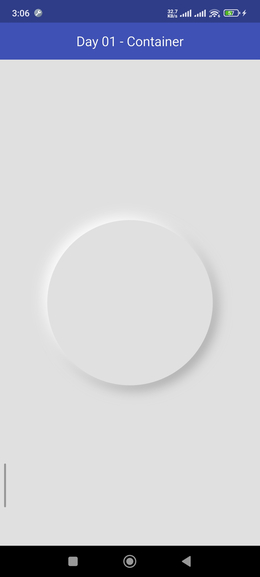</a> 
      <a href="lib/features/widgets_of_the_day/day_01_container/day01_container_widget.dart"><b>Container</b></a> Basic box
    </td>
    <td align="center" valign="top">
      <a href="screenshots/day02_expanded.png">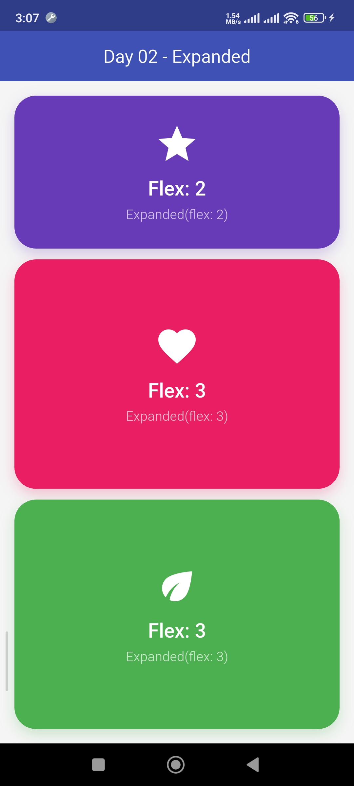</a> 
      <a href="lib/features/widgets_of_the_day/day_02_expanded/day02_expanded_widget.dart"><b>Expanded</b></a> Fill space
    </td>
    <td align="center" valign="top">
      <a href="screenshots/day03_column.png">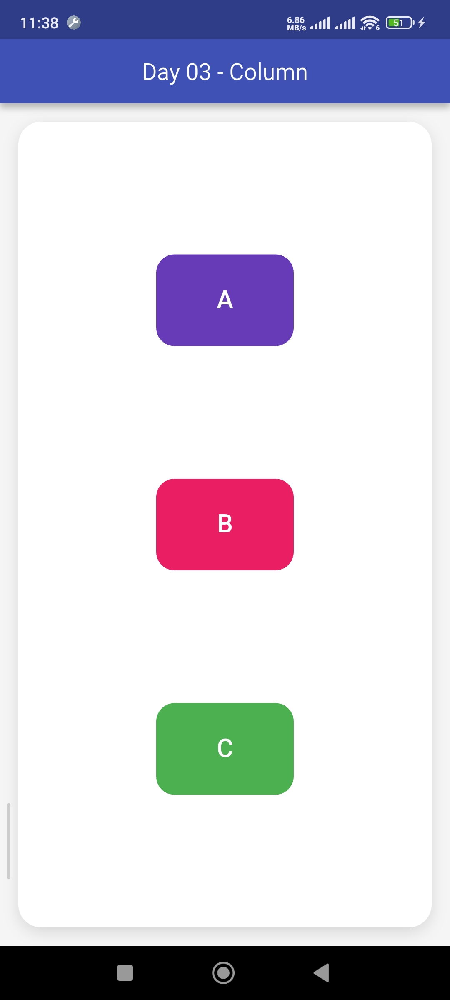</a> 
      <a href="lib/features/widgets_of_the_day/day_03_column%26row/day03_column_widget.dart"><b>Column</b></a> Vertical
    </td>
    <td align="center" valign="top">
      <a href="screenshots/day03_row.png">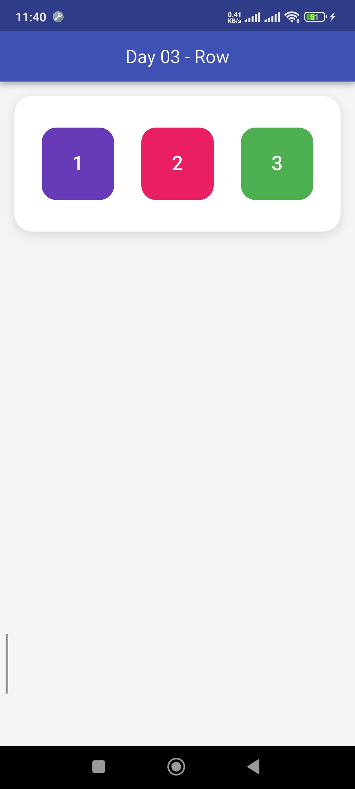</a> 
      <a href="lib/features/widgets_of_the_day/day_03_column%26row/day03_row_widget.dart"><b>Row</b></a> Horizontal
    </td>
    <td align="center" valign="top">
      <a href="screenshots/day04_listview.png">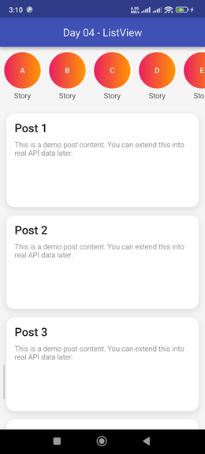</a> 
      <a href="lib/features/widgets_of_the_day/day_04_listview/day04_listview_widget.dart"><b>ListView</b></a> Scroll list
    </td>
  </tr></tbody>
</table>

<!-- ROW 2 -->
<table width="100%" cellpadding="0" style="border-collapse:separate; border-spacing:8px; table-layout:fixed;">
  <thead><tr>
    <th align="center" width="20%" style="font-size:12px; color:#0066cc; border-bottom:2px solid #0066cc;">Day 05</th>
    <th align="center" width="20%" style="font-size:12px; color:#0066cc; border-bottom:2px solid #0066cc;">Day 06</th>
    <th align="center" width="20%" style="font-size:12px; color:#0066cc; border-bottom:2px solid #0066cc;">Day 07</th>
    <th align="center" width="20%" style="font-size:12px; color:#0066cc; border-bottom:2px solid #0066cc;">Day 08</th>
    <th align="center" width="20%" style="font-size:12px; color:#0066cc; border-bottom:2px solid #0066cc;">Day 09</th>
  </tr></thead>
  <tbody><tr>
    <td align="center" valign="top">
      <a href="screenshots/day05_cliprrect.png">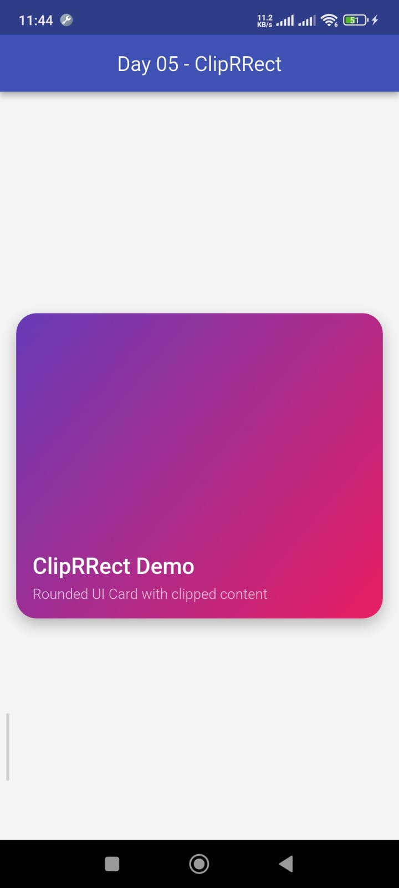</a> 
      <a href="lib/features/widgets_of_the_day/day_05_cliprrect/day05_cliprrect_widget.dart"><b>ClipRRect</b></a> Round clip
    </td>
    <td align="center" valign="top">
      <a href="screenshots/day06_image.asset.png">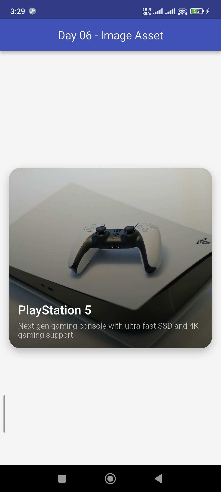</a> 
      <a href="lib/features/widgets_of_the_day/day_06_image.asset/day06_image.asset_widget.dart"><b>Image.asset</b></a> Assets
    </td>
    <td align="center" valign="top">
      <a href="screenshots/day07_gridview.png">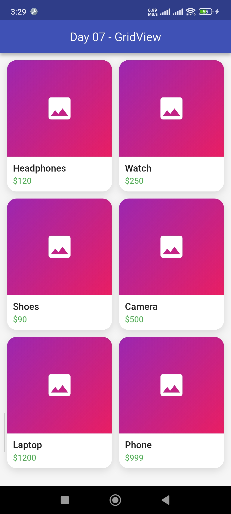</a> 
      <a href="lib/features/widgets_of_the_day/day_07_gridview/day07_gridview_widget.dart"><b>GridView</b></a> Grid scroll
    </td>
    <td align="center" valign="top">
      <a href="screenshots/day08_gesturedetector.png">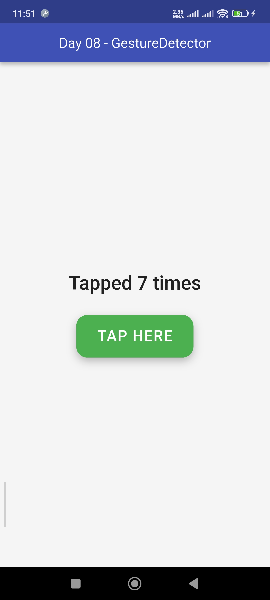</a> 
      <a href="lib/features/widgets_of_the_day/day_08_gesturedetector/day08_gesturedetector_widget.dart"><b>Gesture</b></a> Tap detection
    </td>
    <td align="center" valign="top">
      <a href="screenshots/day09_bottom_navbar.png">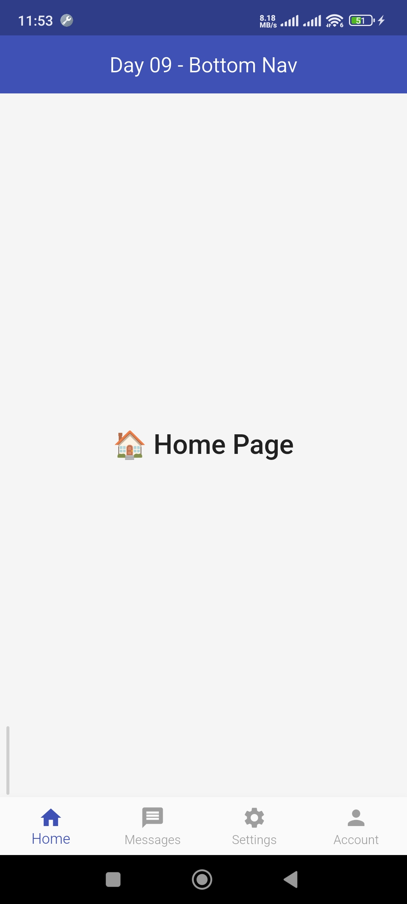</a> 
      <a href="lib/features/widgets_of_the_day/day_09_bottom_navbar/day09_bottom_navbar_widget.dart"><b>BottomNav</b></a> Nav bar
    </td>
  </tr></tbody>
</table>

<!-- ROW 3 -->
<table width="100%" cellpadding="0" style="border-collapse:separate; border-spacing:8px; table-layout:fixed;">
  <thead><tr>
    <th align="center" width="20%" style="font-size:12px; color:#0066cc; border-bottom:2px solid #0066cc;">Day 10</th>
    <th align="center" width="20%" style="font-size:12px; color:#0066cc; border-bottom:2px solid #0066cc;">Day 11</th>
    <th align="center" width="20%" style="font-size:12px; color:#0066cc; border-bottom:2px solid #0066cc;">Day 12</th>
    <th align="center" width="20%" style="font-size:12px; color:#0066cc; border-bottom:2px solid #0066cc;">Day 13</th>
    <th align="center" width="20%" style="font-size:12px; color:#0066cc; border-bottom:2px solid #0066cc;">Day 14</th>
  </tr></thead>
  <tbody><tr>
    <td align="center" valign="top">
      <a href="screenshots/day10_appbar.png">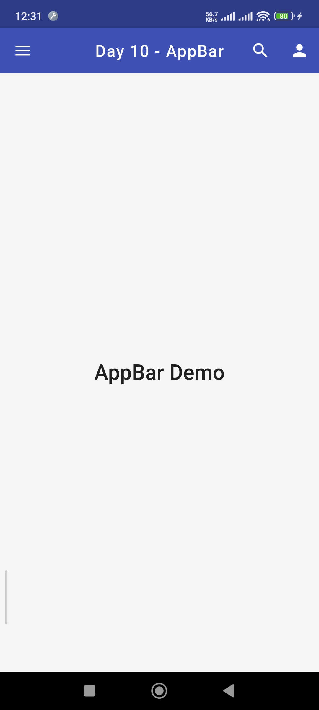</a> 
      <a href="lib/features/widgets_of_the_day/day_10_appbar/day10_appbar_widget.dart"><b>AppBar</b></a> Top bar
    </td>
    <td align="center" valign="top">
      <a href="screenshots/day11_drawer.png">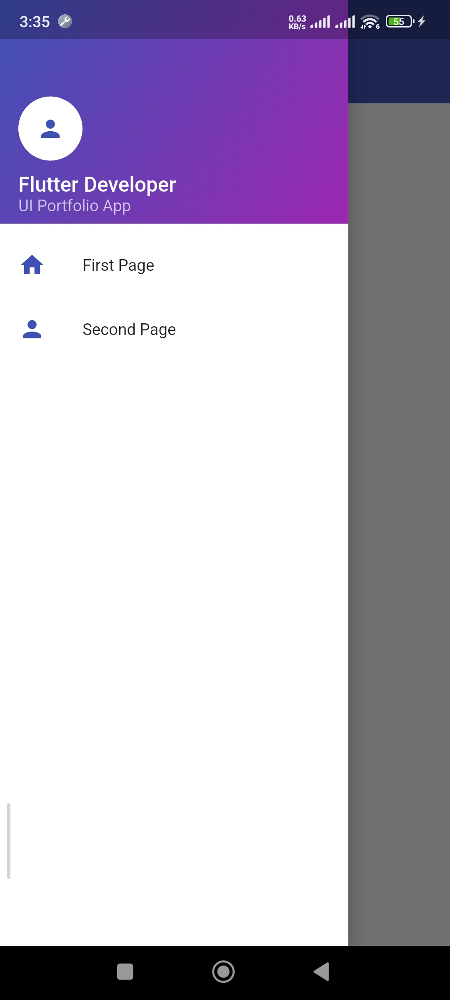</a> 
      <a href="lib/features/widgets_of_the_day/day_11_drawer/day11_drawer_widget.dart"><b>Drawer</b></a> Side menu
    </td>
    <td align="center" valign="top">
      <a href="screenshots/day12_sliver_appbar.png">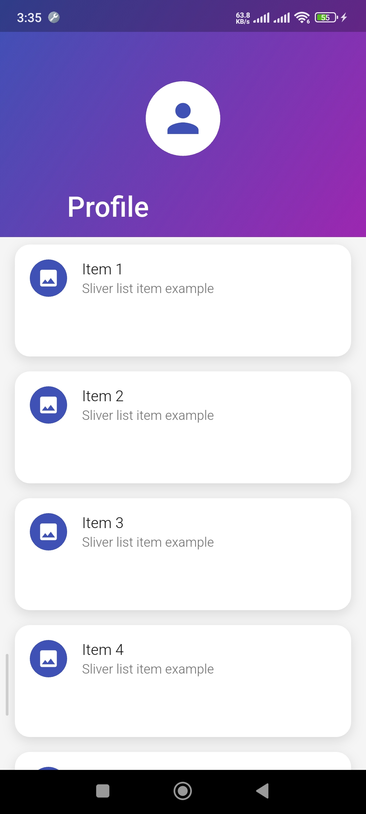</a> 
      <a href="lib/features/widgets_of_the_day/day_12_sliver_appbar/day12_sliver_appbar_widget.dart"><b>SliverAppBar</b></a> Collapsible
    </td>
    <td align="center" valign="top">
       
      <a href="lib/features/widgets_of_the_day/day_13_tabbar/day13_tabbar_widget.dart"><b>TabBar</b></a> Tabs
    </td>
    <td align="center" valign="top">
      <a href="screenshots/day14_animated_container.png">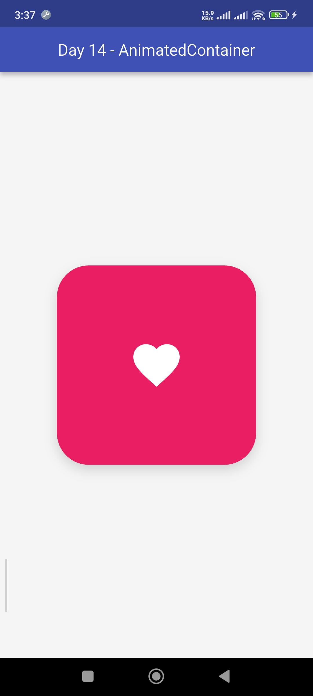</a> 
      <a href="lib/features/widgets_of_the_day/day_14_animated_container/day14_animated_container_widget.dart"><b>AnimCont</b></a> Implicit anim
    </td>
  </tr></tbody>
</table>

<!-- ROW 4 -->
<table width="100%" cellpadding="0" style="border-collapse:separate; border-spacing:8px; table-layout:fixed;">
  <thead><tr>
    <th align="center" width="20%" style="font-size:12px; color:#0066cc; border-bottom:2px solid #0066cc;">Day 15</th>
    <th align="center" width="20%" style="font-size:12px; color:#0066cc; border-bottom:2px solid #0066cc;">Day 16</th>
    <th align="center" width="20%" style="font-size:12px; color:#0066cc; border-bottom:2px solid #0066cc;">Day 17</th>
    <th align="center" width="20%" style="font-size:12px; color:#0066cc; border-bottom:2px solid #0066cc;">Day 18</th>
    <th align="center" width="20%" style="font-size:12px; color:#0066cc; border-bottom:2px solid #0066cc;">Day 19</th>
  </tr></thead>
  <tbody><tr>
    <td align="center" valign="top">
      <a href="screenshots/day15_media_query.png">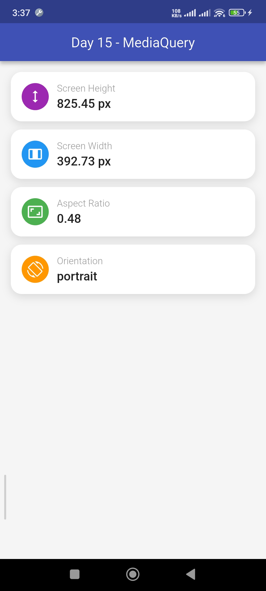</a> 
      <a href="lib/features/widgets_of_the_day/day_15_media_query/day15_media_query_widget.dart"><b>MediaQuery</b></a> Responsive
    </td>
    <td align="center" valign="top">
      <a href="screenshots/day16_alert_dialog.png">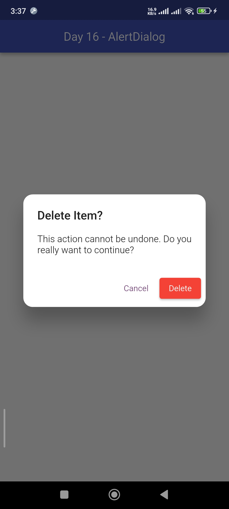</a> 
      <a href="lib/features/widgets_of_the_day/day_16_alert_dialog/day16_alert_dialog_widget.dart"><b>AlertDialog</b></a> Popup
    </td>
    <td align="center" valign="top">
      <a href="screenshots/day17_text_and_textstyle.png">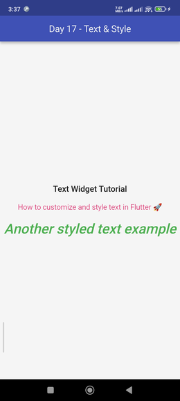</a> 
      <a href="lib/features/widgets_of_the_day/day_17_text_and_textstyle/day17_text_style_widget.dart"><b>Text</b></a> Styling
    </td>
    <td align="center" valign="top">
      <a href="screenshots/day18_rich_text.png">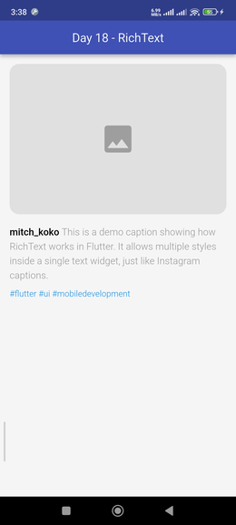</a> 
      <a href="lib/features/widgets_of_the_day/day_18_rich_text/day18_rich_text_widget.dart"><b>RichText</b></a> Mixed styles
    </td>
    <td align="center" valign="top">
      <a href="screenshots/day19_timer.png">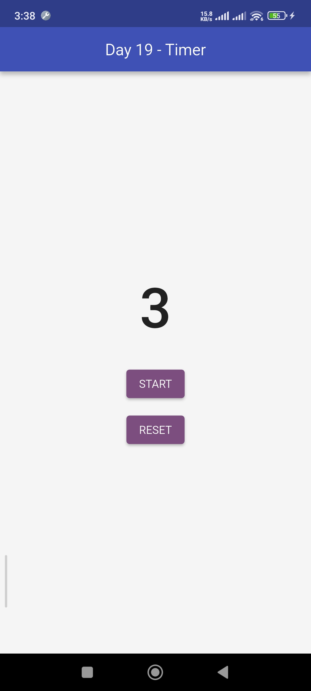</a> 
      <a href="lib/features/widgets_of_the_day/day_19_timer/day19_timer_widget.dart"><b>Timer</b></a> Async events
    </td>
  </tr></tbody>
</table>

<!-- ROW 5 -->
<table width="100%" cellpadding="0" style="border-collapse:separate; border-spacing:8px; table-layout:fixed;">
  <thead><tr>
    <th align="center" width="20%" style="font-size:12px; color:#0066cc; border-bottom:2px solid #0066cc;">Day 20</th>
    <th align="center" width="20%" style="font-size:12px; color:#0066cc; border-bottom:2px solid #0066cc;">Day 21</th>
    <th align="center" width="20%" style="font-size:12px; color:#0066cc; border-bottom:2px solid #0066cc;">Day 22</th>
    <th align="center" width="20%" style="font-size:12px; color:#0066cc; border-bottom:2px solid #0066cc;">Day 23</th>
    <th align="center" width="20%" style="font-size:12px; color:#0066cc; border-bottom:2px solid #0066cc;">Day 24</th>
  </tr></thead>
  <tbody><tr>
    <td align="center" valign="top">
      <a href="screenshots/day20_pageview.png">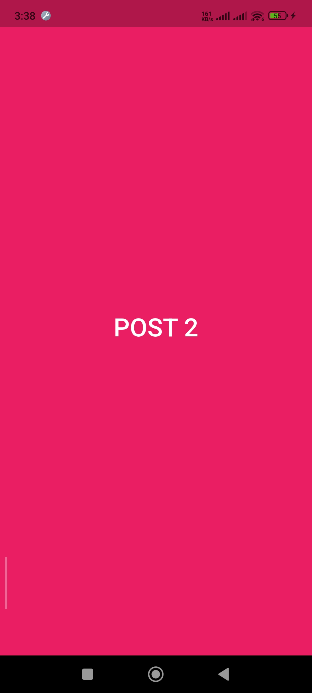</a> 
      <a href="lib/features/widgets_of_the_day/day_20_pageview/day20_pageview_widget.dart"><b>PageView</b></a> Swipe pages
    </td>
    <td align="center" valign="top">
      <a href="screenshots/day21_stack.png">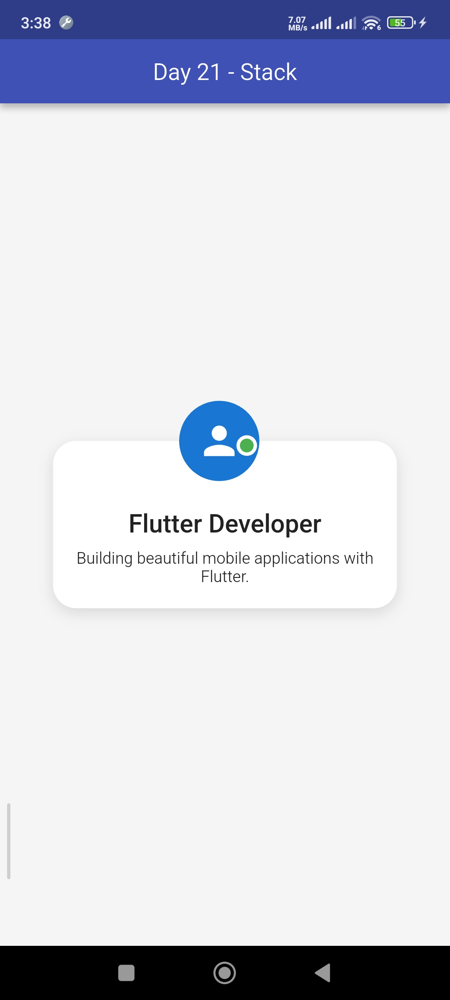</a> 
      <a href="lib/features/widgets_of_the_day/day_21_stack/day21_stack_widget.dart"><b>Stack</b></a> Layers
    </td>
    <td align="center" valign="top">
      <a href="screenshots/day22_textfield.png">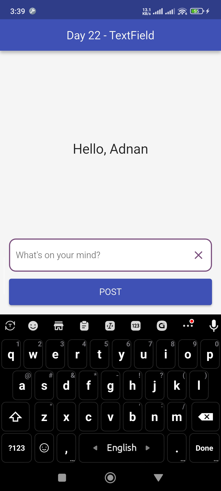</a> 
      <a href="lib/features/widgets_of_the_day/day_22_textfield/day22_textfield_widget.dart"><b>TextField</b></a> Input
    </td>
    <td align="center" valign="top">
      <a href="screenshots/day23_animated_icon.png">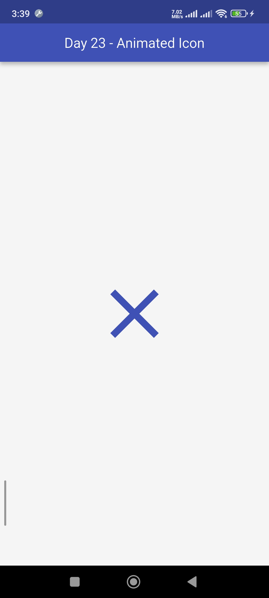</a> 
      <a href="lib/features/widgets_of_the_day/day_23_animated_icon/day23_animated_icon_widget.dart"><b>AnimIcon</b></a> Transition
    </td>
    <td align="center" valign="top">
      <a href="screenshots/day24_slider.png">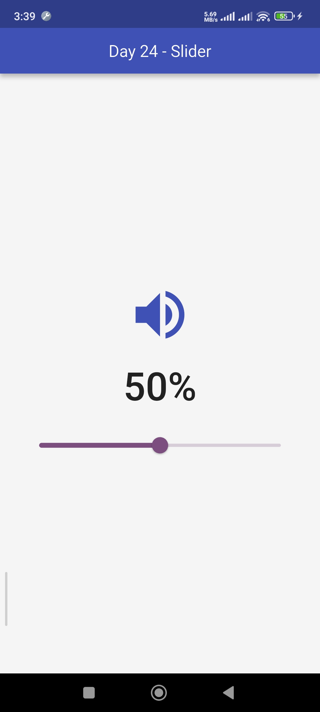</a> 
      <a href="lib/features/widgets_of_the_day/day_24_slider/day24_slider_widget.dart"><b>Slider</b></a> Selection
    </td>
  </tr></tbody>
</table>

<!-- ROW 6 -->
<table width="100%" cellpadding="0" style="border-collapse:separate; border-spacing:8px; table-layout:fixed;">
  <thead><tr>
    <th align="center" width="20%" style="font-size:12px; color:#0066cc; border-bottom:2px solid #0066cc;">Day 25</th>
    <th align="center" width="20%" style="font-size:12px; color:#0066cc; border-bottom:2px solid #0066cc;">Day 26</th>
    <th align="center" width="20%" style="font-size:12px; color:#0066cc; border-bottom:2px solid #0066cc;">Day 27</th>
    <th align="center" width="20%" style="font-size:12px; color:#0066cc; border-bottom:2px solid #0066cc;">Day 28</th>
    <th align="center" width="20%" style="font-size:12px; color:#0066cc; border-bottom:2px solid #0066cc;">Day 29</th>
  </tr></thead>
  <tbody><tr>
    <td align="center" valign="top">
      <a href="screenshots/day25_date_picker.png">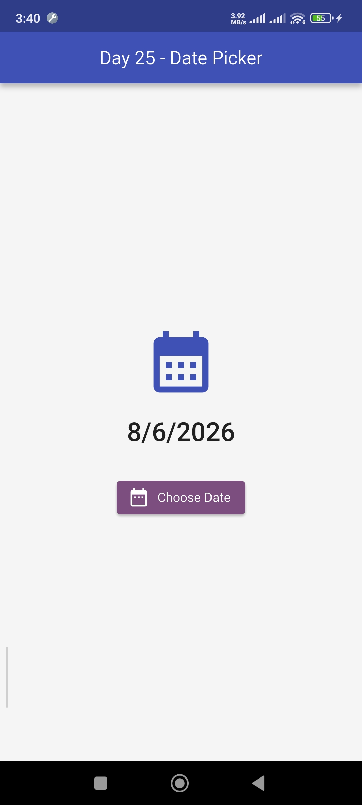</a> 
      <a href="lib/features/widgets_of_the_day/day_25_date_picker/day25_date_picker_widget.dart"><b>DatePicker</b></a> Calendar
    </td>
    <td align="center" valign="top">
      <a href="screenshots/day26_time_picker.png">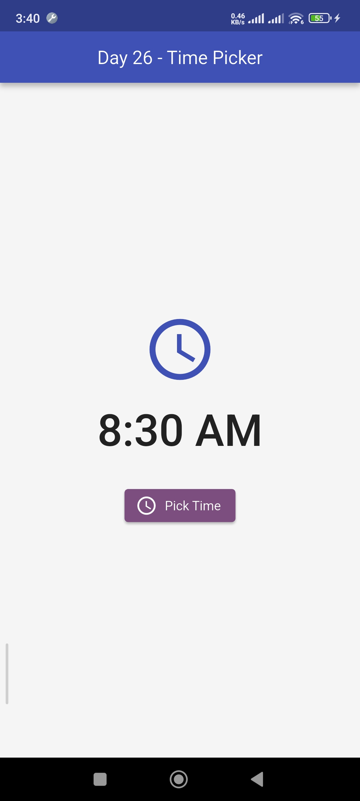</a> 
      <a href="lib/features/widgets_of_the_day/day_26_time_picker/day26_time_picker_widget.dart"><b>TimePicker</b></a> Clock
    </td>
    <td align="center" valign="top">
      <a href="screenshots/day27_listwheelscrollview.png">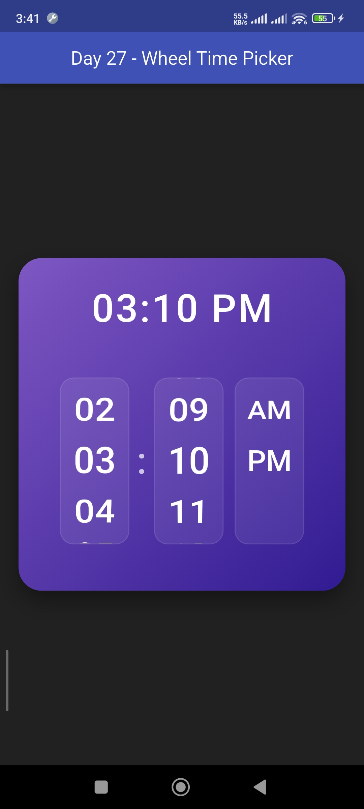</a> 
      <a href="lib/features/widgets_of_the_day/day_27_listwheelscrollview/day27_listwheelscrollview_widget.dart"><b>ListWheel</b></a> 3D Scroll
    </td>
    <td align="center" valign="top">
       
      <a href="lib/features/widgets_of_the_day/day_28_lineargradient/day28_lineargradient_widget.dart"><b>Gradient</b></a> Colors
    </td>
    <td align="center" valign="top">
      <a href="screenshots/day29_elevatedbutton_and_outlinedbutton.png">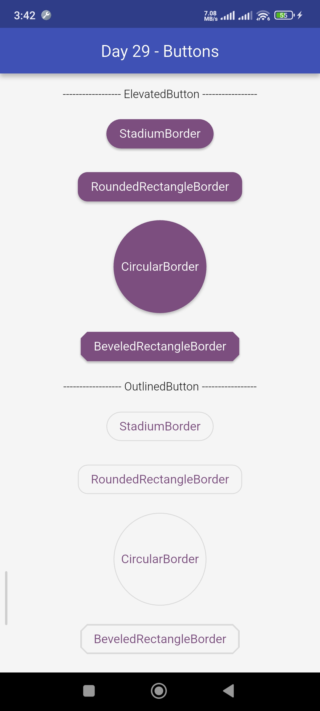</a> 
      <a href="lib/features/widgets_of_the_day/day_29_elevatedbutton_and_outlinedbutton/day29_elevatedbutton_and_outlinedbutton_widget.dart"><b>Buttons</b></a> Action
    </td>
  </tr></tbody>
</table>

<!-- ROW 7 -->
<table width="100%" cellpadding="0" style="border-collapse:separate; border-spacing:8px; table-layout:fixed;">
  <thead><tr>
    <th align="center" width="20%" style="font-size:12px; color:#0066cc; border-bottom:2px solid #0066cc;">Day 30</th>
    <th align="center" width="20%" style="font-size:12px; color:#0066cc; border-bottom:2px solid #0066cc;">Day 31</th>
    <th align="center" width="20%" style="font-size:12px; color:#0066cc; border-bottom:2px solid #0066cc;">Day 32</th>
    <th align="center" width="20%" style="font-size:12px; color:#0066cc; border-bottom:2px solid #0066cc;">Day 33</th>
    <th align="center" width="20%" style="font-size:12px; color:#0066cc; border-bottom:2px solid #0066cc;">Day 34</th>
  </tr></thead>
  <tbody><tr>
    <td align="center" valign="top">
       
      <a href="lib/features/widgets_of_the_day/day_30_floatingactionbutton/day30_floatingactionbutton_widget.dart"><b>FAB</b></a> Primary btn
    </td>
    <td align="center" valign="top">
      <a href="screenshots/day31_navigator.png">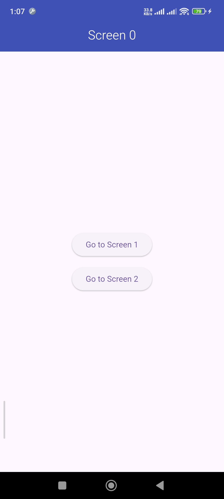</a> 
      <a href="lib/features/widgets_of_the_day/day_31_navigator/day31_navigator_widget.dart"><b>Navigator</b></a> Routes
    </td>
    <td align="center" valign="top">
      <a href="screenshots/day32_card.png">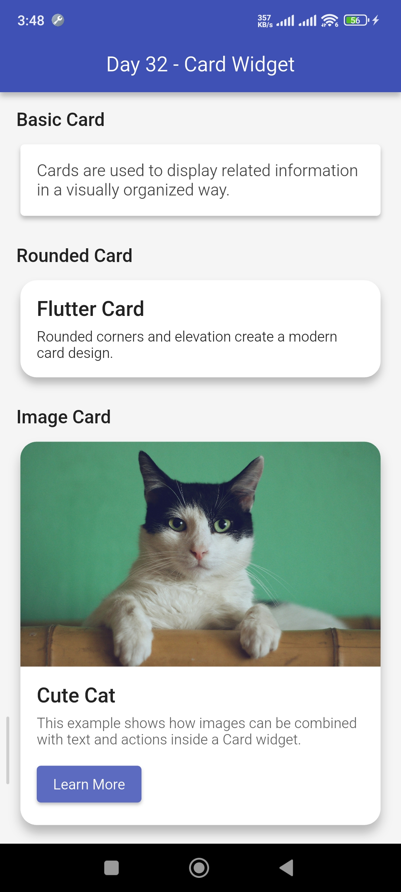</a> 
      <a href="lib/features/widgets_of_the_day/day_32_card/day32_card_widget.dart"><b>Card</b></a> Container
    </td>
    <td align="center" valign="top">
       
      <a href="lib/features/widgets_of_the_day/day_33_clipper/day33_clipper_widget.dart"><b>Clipper</b></a> Shapes
    </td>
    <td align="center" valign="top">
      <a href="screenshots/day34_rawmaterialbutton.png">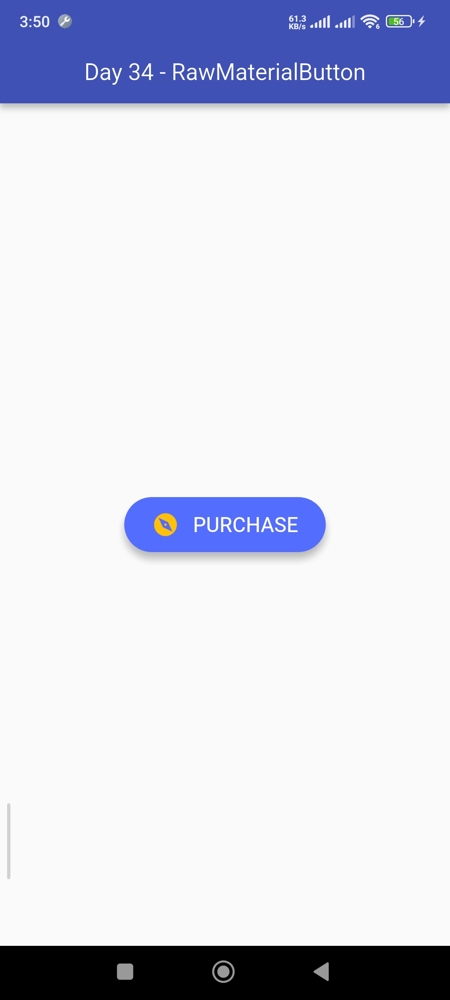</a> 
      <a href="lib/features/widgets_of_the_day/day_34_rawmaterialbutton/day34_rawmaterialbutton_widget.dart"><b>RawBtn</b></a> Custom
    </td>
  </tr></tbody>
</table>

<!-- ROW 8 -->
<table width="100%" cellpadding="0" style="border-collapse:separate; border-spacing:8px; table-layout:fixed;">
  <thead><tr>
    <th align="center" width="20%" style="font-size:12px; color:#0066cc; border-bottom:2px solid #0066cc;">Day 35</th>
    <th align="center" width="20%" style="font-size:12px; color:#0066cc; border-bottom:2px solid #0066cc;">Day 36</th>
    <th align="center" width="20%" style="font-size:12px; color:#0066cc; border-bottom:2px solid #0066cc;">Day 37</th>
    <th align="center" width="20%" style="font-size:12px; color:#0066cc; border-bottom:2px solid #0066cc;">Day 38</th>
    <th align="center" width="20%" style="font-size:12px; color:#0066cc; border-bottom:2px solid #0066cc;">Day 39</th>
  </tr></thead>
  <tbody><tr>
    <td align="center" valign="top">
      <a href="screenshots/day35_rotatedbox.png">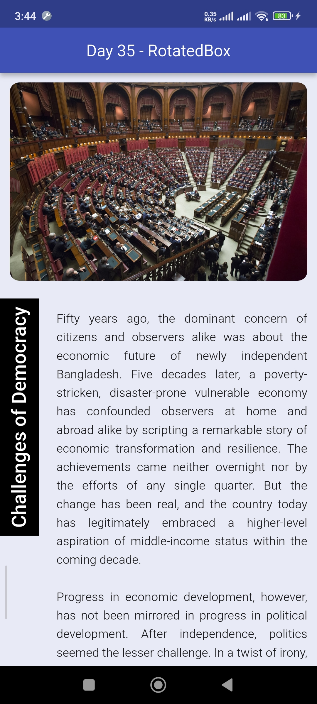</a> 
      <a href="lib/features/widgets_of_the_day/day_35_rotatedbox/day35_rotatedbox_widget.dart"><b>RotatedBox</b></a> Rotation
    </td>
    <td align="center" valign="top">
      <a href="screenshots/day36_transform.png">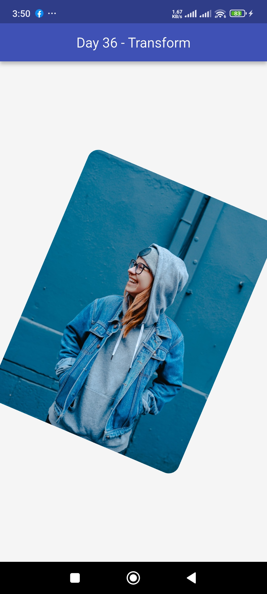</a> 
      <a href="lib/features/widgets_of_the_day/day_36_transform/day36_transform_widget.dart"><b>Transform</b></a> Scale/Skew
    </td>
    <td align="center" valign="top">
      <a href="screenshots/day37_positioned.png">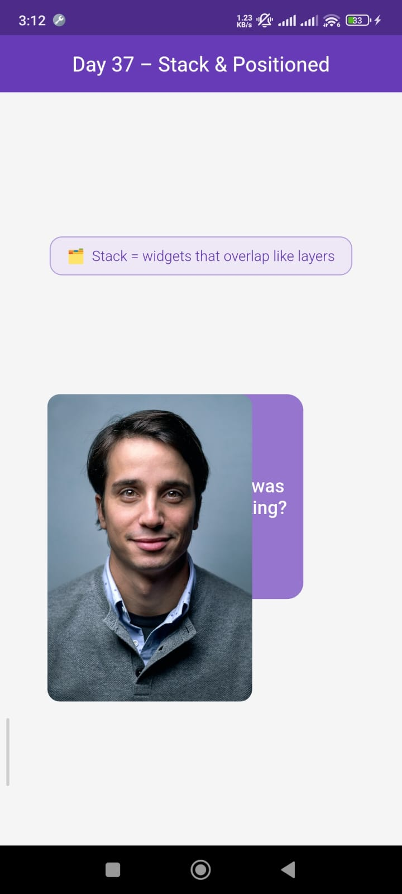</a> 
      <a href="lib/features/widgets_of_the_day/day_37_positioned/day37_positioned_widget.dart"><b>Positioned</b></a> Absolute
    </td>
    <td align="center" valign="top">
       
      <a href="lib/features/widgets_of_the_day/day_38_iconbutton/day38_iconbutton_widget.dart"><b>IconButton</b></a> Icon action
    </td>
    <td align="center" valign="top">
      <a href="screenshots/day39_custom_paint.png">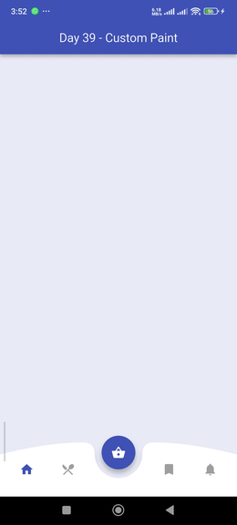</a> 
      <a href="lib/features/widgets_of_the_day/day_39_custom_paint/day39_custom_paint_widget.dart"><b>CustomPaint</b></a> Canvas draw
    </td>
  </tr></tbody>
</table>

<!-- ROW 9 -->
<table width="100%" cellpadding="0" style="border-collapse:separate; border-spacing:8px; table-layout:fixed;">
  <thead><tr>
    <th align="center" width="20%" style="font-size:12px; color:#0066cc; border-bottom:2px solid #0066cc;">Day 40</th>
    <th align="center" width="20%" style="font-size:12px; color:#0066cc; border-bottom:2px solid #0066cc;">Day 41</th>
    <th align="center" width="20%" style="font-size:12px; color:#0066cc; border-bottom:2px solid #0066cc;">Day 42</th>
    <th align="center" width="20%" style="font-size:12px; color:#0066cc; border-bottom:2px solid #0066cc;">Day 43</th>
    <th align="center" width="20%" style="font-size:12px; color:#0066cc; border-bottom:2px solid #0066cc;">Day 44</th>
    <th width="20%"></th>
    <th width="20%"></th>
  </tr></thead>
  <tbody><tr>
    <td align="center" valign="top">
      <a href="screenshots/day40_clipoval.png">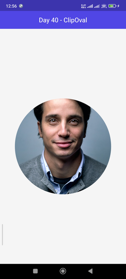</a> 
      <a href="lib/features/widgets_of_the_day/day_40_clipoval/day40_clipoval_widget.dart"><b>ClipOval</b></a> Circular clip
    </td>
    <td align="center" valign="top">
      <a href="screenshots/day41_cliprrect.png">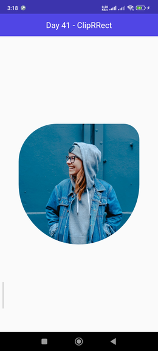</a> 
      <a href="lib/features/widgets_of_the_day/day_41_cliprrect/day41_cliprrect_widget.dart"><b>ClipRRect</b></a> Rounded clip
    </td>
    <td align="center" valign="top">
      <a href="screenshots/day42_cliprect.png">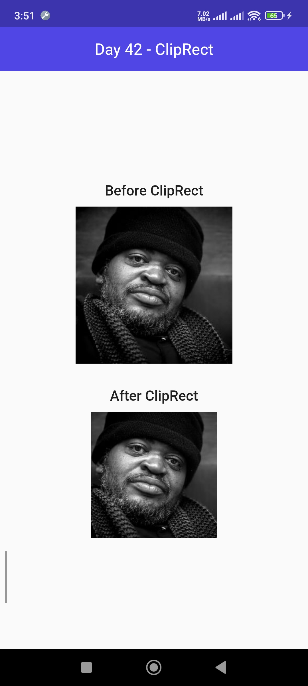</a> 
      <a href="lib/features/widgets_of_the_day/day_42_cliprect/day42_cliprect_widget.dart"><b>ClipRect</b></a> Rectangle clip
    </td>
    <td align="center" valign="top">
      <a href="screenshots/day43_clippath.png">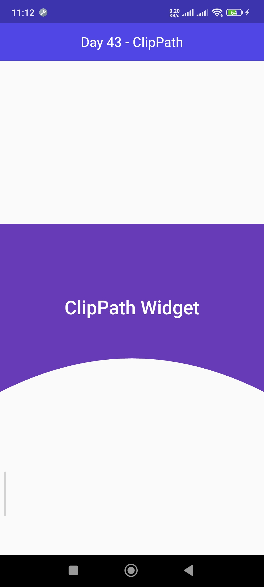</a> 
      <a href="lib/features/widgets_of_the_day/day_43_clippath/day43_clippath_widget.dart"><b>ClipPath</b></a> Custom shape clipping
    </td>
    <td align="center" valign="top">
      <a href="screenshots/day44_radial_and_sweep_gradient.png">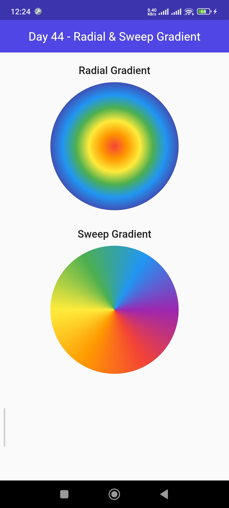</a> 
      <a href="lib/features/widgets_of_the_day/day_44_radial_and_sweep_gradient/day44_radial_and_sweep_gradient_widget.dart"><b>Radial & Sweep Gradient</b></a> Advanced gradient effects
    </td>
    <td></td><td></td>
  </tr></tbody>
</table>

---

  📁 Each widget links directly to its source file &nbsp;·&nbsp; Built with ❤️ using Flutter

## 🚀 Goal

To build strong and practical Flutter UI fundamentals by practicing one widget at a time and understanding how real UI layouts are structured in production apps.

---

## 🛠️ Tech Stack

- Flutter
- Dart

---

## 📌 Note

This project is purely for learning and practice purposes.  
Each widget is implemented separately to ensure clarity, focus, and better understanding.

---

## ⭐ Future Improvements

- Add animations for each widget
- Convert widgets into reusable components
- Build mini real-world screens using learned widgets
- Add dark mode UI versions
- Improve UI consistency across all examples